# DD-01 Microkernel Core 詳細設計書
## Command Bus / Event Bus / Capability Registry

---

## 文档元数据

| 項目 | 内容 |
|------|------|
| 文档 ID | DD-01-2026-0914 |
| 版本 | 1.0 |
| 日期 | 2026-09-14 |
| 作成者 | MinimaxM3 (Agent) |
| ステータス | 初期版 - レビュー待ち |
| 上位文档 | REQ-001 (要件定義書), NFR-001 (非機能要件定義書), AD-001 (基本設計書), IFD-001 (接口设计书), SD-001 (安全性設計書) |
| 関連 DD | DD-02 Session/Transaction/Buffer, DD-03 Plugin/Extension, DD-04 内部 API + 横断关切 |
| 適用範囲 | kernel-core crate — command / event / capability サブモジュール |

---

## 1. ドキュメント情報・目的・用語

### 1.1 目的

本文書は、Microkernel Core の 3 つのコア機構 **Command Bus / Event Bus / Capability Registry** の実装詳細を定める。
基本設計書 AD-001 §2.2～2.4 が規定する責務・抽象構造を、開発者がそのまま実装でき、テスターがテスト観点を導出でき、Reviewer が設計妥当性を判定できる粒度で記述する。

### 1.2 設計対象範囲

**含む**:
- MOD-CB-001 Command Bus — 入力検証／認証／Capability 解決／Provider 実行／結果返却／Event 発行
- MOD-EB-001 Event Bus — Event Envelope 構築／Durability 判定／Subscriber 配信／順序保証／Replay
- MOD-CR-001 Capability Registry — Capability 登録／発見／Priority ベースルーティング／Plugin ↔ Capability バインディング

**含まない (他 DD に分割)**:
- Session ライフサイクル／Quot a: DD-02 (MOD-SM-001)
- Transaction ライフサイクル／Patch 適用: DD-02 (MOD-TM-001)
- Buffer 操作: DD-02 (MOD-BE-001)
- Plugin Manager 本体（load/activate/lifecycle）: DD-03 (MOD-PM-001)
- Internal API Server 層 (REST/JSON-RPC/MCP Adapter): DD-04
- Security Manager 本体 (Secret Store 等): DD-04 (SD-001 と共有)

### 1.3 用語・縮略語

| 用語 | 定義 |
|------|------|
| Command | Plugin 機能を呼び出すための統一実行単位 (FR-003)。 |
| Provider | Capability を実装する Plugin 側の実行器。`Box<dyn CommandProvider>`。 |
| Capability | Plugin が公開する論理的な機能単位 (例: `text.search`, `language.definition`)。 |
| Event | Kernel 内で発生する事実の通知単位 (FR-008)。 |
| Durable Event | 永続化対象 Event (例: TransactionCommitted, FileSaved)。 |
| Transient Event | 一時配信のみ Event (例: CursorMoved)。 |
| Envelope | Event に付与する共通ヘッダ (event_id, sequence 等)。 |
| Trace ID | リクエスト横断の相関 ID。Log/Metric/Trace の link key。 |
| Correlation ID | 業務フロー (例: 1 つの Agent Task) 単位の相関 ID。 |
| Capability Manifest | Plugin が公開する Capability の宣言メタ情報。 |
| Routing Policy | Provider 選択規則 (priority, availability, policy)。 |
| Hot Swap | Agent セッションを中断せずに Provider 実装を切り替えること。 |
| Backpressure | Subscriber の処理遅延が Producer に伝播する圧力制御。 |
| Idempotency Key | 重複実行抑止のための一意キー。 |

### 1.4 参考资料

| 文档 | 版 | 該当章 | 用途 |
|------|----|--------|------|
| REQ-001 要件定義書 | 1.0 | FR-001, FR-003, FR-004, FR-008, FR-017 | 上位要件トレース |
| NFR-001 非機能要件定義書 | 1.0 | NFR-001～046 | 性能・信頼性目標 |
| AD-001 基本設計書 | 1.0 | §2.2 / §2.3 / §2.4 | 責務・抽象構造の出典 |
| IFD-001 接口设计书 | 1.0 | IF-CMD-001/002/003, IF-EVT-001/002, IF-CAP-001/002 | 外部 Contract |
| SD-001 安全性設計書 | 1.0 | §2.2, §2.3, §7, §8 | Permission / Audit / Validation |

---

## 2. 全体アーキテクチャと内部境界

### 2.1 Kernel 起動時の依存関係

```mermaid
flowchart LR
    A[Plugin Manager<br/>DD-03] -- register_capability --> CR[Capability Registry<br/>MOD-CR-001]
    A -- emit capability events --> EB[Event Bus<br/>MOD-EB-001]
    SM[Session Manager<br/>DD-02] -- session lookup --> CB[Command Bus<br/>MOD-CB-001]
    CR -- provider reference --> CB
    EB -- event seq/append --> CB
    CB -- emit CommandStarted/Completed --> EB
    CR -. .-> EB
    CB -. .-> SM
```

各 BUS/Registry は独立した非同期タスクではなく、`Arc` 共有 + 内部 `RwLock`/`Mutex` による **In-Process コンポーネント** として実装する（AD-001 §2.2 準拠）。単一 Kernel プロセス内で完結する設計とし、プロセス間通信は DD-04 の Adapter 層に委譲する。

### 2.2 所有権と可視性

| オブジェクト | 所有 | 共有方式 | 排他 |
|--------------|------|----------|------|
| `CapabilityRegistry.capabilities` | `Registry` | `tokio::sync::RwLock<HashMap<String, Vec<ProviderEntry>>>` | 書き込み時独占 |
| `EventBus.subscribers` | `Bus` | `tokio::sync::RwLock<HashMap<SubscriptionId, Subscriber>>` | 配信中短時間のみ lock |
| `EventBus.event_seq` | `Bus` | `AtomicU64` | lock-free |
| `EventBus.durable_log` | `Bus` | `Arc<dyn DurableLog>` | 内部実装依存 |
| `CommandBus.command_id_seq` | `Bus` | `AtomicU64` | lock-free |
| `CommandBus.inflight` | `Bus` | `dashmap::DashMap<CommandId, CancellationToken>` | sharded |

---

## 3. MOD-CB-001 Command Bus 設計

### 3.1 モジュール属性

| 項目 | 内容 |
|------|------|
| Module ID | MOD-CB-001 |
| モジュール名 | Command Bus |
| 対応 BD | AD-001 §2.2 |
| 対応 REQ | FR-001-01, FR-003, FR-022 |
| 対応 IF | IF-CMD-001, IF-CMD-002, IF-CMD-003 |
| 責務 | (a) Command 受付 (b) Schema 検証 (c) Session 解決と Permission 検証 (d) Capability 解決 (e) Provider 実行 (f) Event 発行 (g) Cancellation 調停 (h) 結果マッピング |
| 入力 | `Command` (CommandName, SessionId, Actor, Arguments, Timeout, CancellationToken, Metadata) |
| 出力 | `CommandResult` (Status, Data, Diagnostics, SideEffects, Error) |
| 依存 | `SessionManager` (DD-02), `CapabilityRegistry` (MOD-CR-001), `EventBus` (MOD-EB-001), `PermissionChecker` (DD-04) |
| 対外接口 | `execute(cmd)`, `cancel(cmd_id)`, `discover(filter)` |
| 使用データ | Session, Capability, Provider, Event |
| 状態 | `AtomicU64 command_id_seq`, `DashMap<CommandId, InflightEntry>` |
| Transaction | 持たない（Provider 側の Transaction に委譲、詳細は DD-02） |
| Error | ERR-CB-001 〜 ERR-CB-099 |

### 3.2 Class/Component 設計

#### CLS-CB-001 CommandBus

| 項目 | 内容 |
|------|------|
| ID | CLS-CB-001 |
| 名前 | CommandBus |
| 責務 | Command パイプラインのオーケストレーション |
| ライフサイクル | Kernel 起動時に Singleton として 1 個生成 → Kernel 終了まで生存 |
| 依存 | Arc<CapabilityRegistry>, Arc<EventBus>, Arc<SessionManager>, Arc<PermissionChecker>, Arc<MetricsSink>, Arc<TraceContext> |
| Interface | `execute(&self, cmd: Command) -> Result<CommandResult>` / `cancel(&self, cmd_id) -> Result<()>` / `inflight_count(&self) -> usize` |
| Field/State | `command_id_seq: AtomicU64`, `inflight: DashMap<CommandId, InflightEntry>`, `schema_index: Arc<SchemaIndex>` |
| Public Method | §3.3 参照 |
| Exception | ERR-CB-002/003/004/005/011/012 |

#### CLS-CB-002 InflightEntry

| 項目 | 内容 |
|------|------|
| ID | CLS-CB-002 |
| 名前 | InflightEntry |
| 責務 | 実行中 Command のライフサイクル管理 |
| ライフサイクル | execute() 開始時に挿入、完了時 (success/error/cancel) に削除 |
| Field | `cmd_id: CommandId`, `session_id: SessionId`, `cancel_tx: CancellationToken`, `abort_handle: JoinHandle<()>`, `started_at: Instant`, `priority: Priority` |

#### CLS-CB-003 CommandResultMapper

| 項目 | 内容 |
|------|------|
| ID | CLS-CB-003 |
| 名前 | CommandResultMapper |
| 責務 | Provider 戻り値 → CommandResult への変換 |
| Interface | `map(provider_result: ProviderOutput, context: &ExecContext) -> CommandResult` |
| Field | `event_bus: Arc<EventBus>` (副作用 Event 発行のため) |

### 3.3 Core Method 設計

#### M-CB-001 execute(Command)

| 項目 | 内容 |
|------|------|
| Method ID | M-CB-001 |
| Name | CommandBus::execute |
| Purpose | 1 つの Command を Command Bus パイプラインで実行する |
| Caller | REST Adapter / JSON-RPC Adapter / MCP Adapter / TUI Internal API / Plugin Direct Call |
| Input | `Command { command_id?: uuid, name: string, version: string, session_id: Uuid, actor: Actor, arguments: Value, permissions_override?: PermissionSet, timeout_ms?: u64, metadata: Value, cancellation_token?: string, idempotency_key?: string }` |
| Output | `Result<CommandResult>` (Status: ok / error / cancelled, Data, Diagnostics, SideEffects, Error) |
| Preconditions | (1) Kernel が起動済み (2) SessionManager / Registry / EventBus が health (3) cmd.timeout_ms ≤ 600_000 |
| Processing | §3.4 処理フロー (P-CB-001 ～ P-CB-014) 参照 |
| Postconditions | (1) EventBus に CommandStarted / CommandCompleted (or Failed / Cancelled) が publish (2) Audit Log に確定結果記録 (3) inflight map から本 cmd_id が除去 |
| Error | ERR-CB-002/003/004/005/006/007/011/012 |
| Side Effect | Event 2 件 publish, Audit Log 1 件, Metrics カウンタ更新, inflight 1 件 |
| Transaction | 持たない (Provider 委譲) |

#### M-CB-002 cancel(CommandId)

| 項目 | 内容 |
|------|------|
| Method ID | M-CB-002 |
| Name | CommandBus::cancel |
| Purpose | 進行中 Command の協調的キャンセル |
| Caller | TUI (Ctrl-C), Agent 終了, Timeout Watchdog |
| Input | `cmd_id: CommandId, session_id: SessionId, reason: CancelReason` |
| Output | `Result<CancelAck { status, remaining_work }>` |
| Preconditions | 該当 cmd_id が inflight に存在 |
| Processing | (1) inflight lookup (2) cancel_tx.cancel() (3) 5 秒後に abort_handle.abort() を実行する watchdog を起動 (4) ack 即時返却 |
| Postconditions | Provider は Cleanup を実行、最終結果は `cancelled` で確定 |
| Error | ERR-CB-013 (not found), ERR-CB-014 (wrong session) |
| Side Effect | inflight 除去, Event `CommandCancelled` 発行 |
| Transaction | なし |

#### M-CB-003 discover(CommandFilter)

| 項目 | 内容 |
|------|------|
| Method ID | M-CB-003 |
| Name | CommandBus::discover |
| Purpose | Session 権限の範囲内で実行可能な Command メタ情報を列挙 (IF-CMD-002 対応) |
| Caller | Agent 起動時, CLI list, TUI 補完 |
| Input | `filter: CommandFilter { capability?: string, name_prefix?: string, allowed_for_session: bool }` |
| Output | `Vec<CommandDescriptor>` (name, version, input_schema, output_schema, required_permissions, capabilities, side_effect, streaming) |
| Preconditions | Session が解決可能 |
| Processing | (1) Session 解決 (2) Registry.list_capabilities(filter) (3) 各 Capability に対し Session.permissions ⊇ required_permissions 判定 (4) 合格したものを返却 |
| Postconditions | 副作用なし |
| Error | ERR-CB-002 (session not found) |
| Side Effect | なし (Cache hit 時も副作用なし) |
| Transaction | なし |

### 3.4 処理フロー (P-CB-001 〜)

| ID | ステップ | 失敗時挙動 |
|----|----------|-----------|
| P-CB-001 | **受信・逆シリアライズ**: Transport 層 (DD-04) から JSON-RPC / REST / In-Process のいずれかで Command を受信し、`Command` 構造体にデシリアライズする。デシリアライズ失敗時は即時 ERR-CB-006 を返却。 | ERR-CB-006 (malformed) |
| P-CB-002 | **Trace Context 構築**: 受信時に Trace ID を付与 (無い場合は生成)。`tracing::Span` で `command.name`, `session.id`, `cmd.id` を attribute として設定。 | — |
| P-CB-003 | **Schema 検証**: `CommandSchema.input_schema` に対し JSON Schema 検証 (format, required, type, range)。NFR-031 準拠。 | ERR-CB-007 (validation failed) |
| P-CB-004 | **Idempotency Key 検査**: `idempotency_key` があれば IdempotencyStore で検索。HIT なら保存済み結果を返却 (M-CB-004 参照)。 | — |
| P-CB-005 | **Session 解決**: `SessionManager.get(session_id)` を実行。存在しなければ ERR-CB-002。 | ERR-CB-002 |
| P-CB-006 | **Permission 検証 (Authz)**: SD-001 §2.3 の `check_permission` を呼び、Session.permissions ⊇ Command 必要 permissions を判定。Network アクセスを含む Command は追加で SD-001 §5 の `check_network_access`。 | ERR-CB-003 (permission denied) |
| P-CB-007 | **Resource Budget 検査**: Session.resource_budget (cpu_percent, memory_mb, context_tokens) の現在消費量に対し、本 Command が予算超過しないか判定。 | ERR-CB-008 (resource exhausted) |
| P-CB-008 | **Capability 解決**: `CapabilityRegistry.route(name, &session)` を呼び、Provider を選択。 | ERR-CB-004 (capability not found) / ERR-CB-009 (no provider available) |
| P-CB-009 | **Timeout / Cancellation セットアップ**: `tokio::time::timeout(timeout_ms)` と `cancellation_token` を `select!` で組み合わせ。 | — |
| P-CB-010 | **Inflight 登録**: `cmd_id`, `cancel_tx`, `started_at` を inflight に挿入。 | — |
| P-CB-011 | **Event 発行 (CommandStarted)**: EventBus.emit(CommandStarted { cmd_id, name, session_id, actor, started_at }) (Transient)。 | ERR-CB-011 (event emit failed) → WARN ログのみ、業務は継続 (理由 §3.6 故障回復 参照) |
| P-CB-012 | **Provider 実行**: `provider.execute(command).await` を呼び Provider 固有処理を実行。 | ERR-CB-005 (provider error) をラップして返却 |
| P-CB-013 | **Result マッピング**: `CommandResultMapper.map()` で Provider 出力を `CommandResult` に変換。SideEffect があれば Event として列挙。 | — |
| P-CB-014 | **Event 発行 (CommandCompleted)**: EventBus.emit(CommandCompleted / CommandFailed / CommandCancelled { cmd_id, status, duration_ms, error_code? }) (Durable)。 | ERR-CB-011 同様 WARN |
| P-CB-015 | **Cleanup**: inflight 削除, Audit Log 確定 (FR-022, SD-001 §7), Metrics 更新, Idempotency Store に (key → result) を保存 (TTL: 24h)。 | — |
| P-CB-016 | **返却**: `CommandResult` を Caller へ返却。 | — |

### 3.5 分岐条件 (Branch Table)

```
IF cmd.idempotency_key IS SET AND store.contains(key):
    IF store.result.status == "ok":
        RETURN cached result   # 完全同一 result 返却
    ELSE:
        RETURN ERR-CB-010 (duplicate in-flight)
ELSE IF session.status == "EXPIRED":
    RETURN ERR-CB-002
ELSE IF permissions_check == DENY:
    RETURN ERR-CB-003
ELSE IF budget_check == EXHAUSTED:
    RETURN ERR-CB-008
ELSE IF route() returns Err(NotFound):
    RETURN ERR-CB-004
ELSE IF route() returns Err(NoProvider):
    RETURN ERR-CB-009
ELSE:
    EXECUTE P-CB-009 ~ P-CB-015
```

### 3.6 取消・タイムアウト・故障回復

#### 3.6.1 Cancellation

`tokio_util::sync::CancellationToken` を採用。Provider 実装側は `select! { _ = ct.cancelled() => cleanup(), result = provider.run() => ... }` パターンを必須とする (Plugin SDK ガイドで明示)。

- **Hard Cancel** (5 秒タイムアウト後): `JoinHandle::abort()` を実行。
- **Cleanup 失敗時**: Provider に対し ERR-CB-012 記録、Kernel は継続 (Plugin Crash 隔離、NFR-020 準拠)。

#### 3.6.2 Timeout

| 対象 | 既定値 | 上書き | 超過時挙動 |
|------|--------|--------|-----------|
| Command 全体 | 30 秒 (IF-CMD-001 既定) | Command.timeout_ms | ERR-CB-005 (TIMEOUT) 返却、Provider には Cancellation 通知 |
| Schema 検証 | 50 ms | — | ERR-CB-007 |
| Permission 検証 | 20 ms | — | ERR-CB-003 |
| Provider 実行 | Command.timeout_ms | 同上 | 同上 |

【TBD】Provider 実行の timeout 値は `Command.timeout_ms` を単一情報源とし、Provider 個別タイムアウトは Provider Manifest の `max_execution_ms` で下限のみ課す。最終数値は Plugin SDK レビュー後に確定する。

#### 3.6.3 Retry

| シナリオ | Retry | 条件 |
|----------|-------|------|
| Idempotent (READ_ONLY) Command | 自動 3 回 / Exponential Backoff 100ms→200ms→400ms + Jitter ±20% | Transient エラー (timeout, unavailable) のみ |
| Non-idempotent Command | 再試行しない | — |
| Explicit `retry` パラメータ指定 | Caller 指定値 | Caller 責任 |

【TBD】Backoff のジッタ計算式と最大リトライ回数の最終値は Performance Test (DD-04 §パフォーマンス設計) で確定する。

#### 3.6.4 故障回復

- **Provider Panic**: `catch_unwind` で捕捉 → ERR-CB-005 (PROVIDER_PANIC)、Audit 記録、Kernel 継続。
- **EventBus emit 失敗**: WARN ログ + メトリクス `event_emit_failure_total` 増加。業務結果は返却する。理由: Event Bus 障害で Command 自体を失敗させない (Kernel 可用性優先、NFR-023)。
- **Capability Registry 不整合**: Provider が `is_available() == false` を返したら次候補へ。すべて不可なら ERR-CB-009。

### 3.7 内部 API 詳細 (REST/JSON-RPC/Internal)

```
POST /v1/commands/{name}/execute       (IF-REST-002)
       ↓ Transport 層 (DD-04)
parse_http() → Command
       ↓
CommandBus.execute(command)            [M-CB-001, フロー P-CB-001～P-CB-016]
       ↓
CommandResult → JSON → HTTP 200 / 400 / 403 / 404 / 409 / 429 / 504
```

JSON-RPC (stdio) 経由でも同一 `CommandBus.execute` を呼ぶ。Method 名 `command.execute` → IF-CMD-001 仕様へのマッピングは DD-04 Adapter 層で行う。

### 3.8 入力設計 (Command)

| フィールド | 型 | 必須 | 範囲/Format | Default | Validation | Error |
|------------|----|----|-------------|---------|-----------|-------|
| command_id | UUID string | N | RFC4122 v4 | 自動生成 | UUID parse | ERR-CB-006 |
| name | string | Y | ^[a-z][a-z0-9_.]{0,63}$ | — | Registry に存在 | ERR-CB-004 |
| version | string | Y | semver | "1.0" | semver parse | ERR-CB-007 |
| session_id | UUID string | Y | RFC4122 | — | Manager.get | ERR-CB-002 |
| actor | enum | Y | human/langgraph/agent/ci/plugin/automation | — | enum | ERR-CB-006 |
| arguments | object | Y | Provider 依存 | — | input_schema | ERR-CB-007 |
| permissions_override | PermissionSet | N | — | none | Session ⊇ override | ERR-CB-003 |
| timeout_ms | u32 | N | 100 ~ 600_000 | 30000 | range | ERR-CB-007 |
| metadata | object | N | size ≤ 4 KB | {} | size | ERR-CB-007 |
| cancellation_token | string | N | UUID | none | UUID parse | ERR-CB-006 |
| idempotency_key | string | N | ≤ 128 chars | none | charset | ERR-CB-006 |

### 3.9 出力設計 (CommandResult)

| フィールド | 型 | Null | 説明 |
|------------|----|----|------|
| command_id | UUID | N | 受信時の ID (生成した場合を含む) |
| status | enum | N | `ok` / `error` / `cancelled` |
| data | object | Y | Provider 戻り値 (status=ok のみ有意) |
| diagnostics | array | Y | 実行時警告 (例: 互換性注意) |
| metadata | object | N | Trace ID, Duration, Server Timestamp |
| side_effects | array | Y | 副作用 Event の列挙 (document_id 等) |
| next_cursor | string | Y | Streaming 継続用カーソル (該当時のみ) |
| error | object | Y | status=error/cancelled の時のみ (code, message, retryable, details) |

#### Error Response (CommandResult.error)

```json
{
  "code": "ERR-CB-003",
  "message": "Permission denied: workspace.write is required for command 'file.patch'",
  "retryable": false,
  "details": {
    "missing_permission": "workspace.write",
    "actor": "langgraph",
    "session_id": "session-789"
  }
}
```

外部公開時、message から内部実装情報 (path, version, hash) は除外する (SD-001 §7 Audit 整合)。

### 3.10 Validation 順序

```
P-CB-001: 受信・逆シリアライズ        (形式)
P-CB-003: Schema 検証                 (型 / required / format)
P-CB-005: Session 解決               (存在 / 有効期限)
P-CB-006: Permission 検証             (Authorization)
P-CB-007: Resource Budget 検査        (Quota)
P-CB-008: Capability 解決             (存在 / 選択可能性)
P-CB-009: Timeout / Cancellation     (実行可能性)
P-CB-012: Provider 実行              (業務ロジック)
```

各段階で失敗時は **即時 short-circuit** し、後続段階を実行しない。例外は P-CB-011/P-CB-014 の Event 発行失敗 (WARN 継続)。

### 3.11 Transaction / 排他 / Idempotency

- **Transaction**: CommandBus 自体は Transaction を持たない。Provider が `transaction.begin/patch/commit` を発行する場合のみ DD-02 (MOD-TM-001) の Transaction Manager を使用。**Provider 実行中に外部 API 呼び出しが含まれる場合の Transaction 境界は Provider 責任** (基本設計 §2.6 整合)。
- **排他制御**:
  - inflight 登録は `DashMap` の sharded lock で並行実行を許容。
  - 同一 Session 内では、Provider が内部で Workspace Mutex を取るかは Provider 責務。Kernel 側は Session 単位の直列化を強制しない (NFR-012 の 10 Session 同時実行を満たすため)。
  - Capability 登録 / 解除の競合は Registry 内部 RwLock で吸収。
- **Idempotency**:
  - `idempotency_key` 指定時、`IdempotencyStore` (in-memory LRU + Disk WAL) に保存。HIT 時は保存済み結果返却 (24h TTL)。
  - 同一 key で in-flight 中は ERR-CB-010。
  - READ_ONLY Command は **暗黙の冪等性** を仮定し、key 不要でも Retry 可能 (M-CB-001 §3.3 Retry 参照)。

### 3.12 Logging / 可観測性

#### Logging

| イベント | Level | 必須フィールド |
|---------|-------|----------------|
| Command 受信 | INFO | trace_id, cmd_id, command.name, session_id, actor |
| Permission 拒否 | WARN | trace_id, session_id, missing_permission |
| Provider 起動 | DEBUG | trace_id, cmd_id, provider_id |
| Provider 完了 | INFO | trace_id, cmd_id, duration_ms, status |
| Provider 失敗 | ERROR | trace_id, cmd_id, error_code, retryable |
| Cancellation 実行 | INFO | trace_id, cmd_id, reason |
| Event 発行失敗 | WARN | trace_id, event_type, error |

- Trace ID: `UUIDv4`、受信時に付与、無ければ生成。
- Correlation ID: Command.metadata.correlation_id (Agent Task 単位) を Log Span に継承。

#### Metrics

| 名前 | 種別 | ラベル |
|------|------|--------|
| `command_bus_executions_total` | counter | name, status (ok/error/cancelled) |
| `command_bus_duration_seconds` | histogram | name, status |
| `command_bus_inflight` | gauge | — |
| `command_bus_validation_failures_total` | counter | stage (schema/session/permission/budget) |
| `command_bus_provider_errors_total` | counter | provider_id, error_code |
| `command_bus_event_emit_failures_total` | counter | event_type |

#### Traces

`tracing` + `tracing-opentelemetry` Span:

```
Span: command_bus.execute
  Attributes: command.name, command.id, session.id, actor, idempotency.key
  Events: started, permission_checked, capability_resolved, provider_invoked, completed
  Status: OK | ERROR(code)
```

### 3.13 性能設計

| 指標 | 目標 | 出典 |
|------|------|------|
| 単一 Command 起動〜結果返却オーバーヘッド (Provider 実行時間除く) | P95 < 5 ms | NFR-003 / NFR-004 |
| Capability 解決時間 | P95 < 1 ms | (本設計目標) |
| 同時 inflight 数 | ≥ 10 / Session | NFR-012 |

【性能検証必要】:
- inflight map の DashMap シャード数決定 (推奨: `available_parallelism * 4`、検証で確定)
- Schema 検証のスキーマキャッシュサイズ
- IdempotencyStore の LRU 容量

---

## 4. MOD-EB-001 Event Bus 設計

### 4.1 モジュール属性

| 項目 | 内容 |
|------|------|
| Module ID | MOD-EB-001 |
| モジュール名 | Event Bus |
| 対応 BD | AD-001 §2.3 |
| 対応 REQ | FR-001-02, FR-008, FR-022 |
| 対応 IF | IF-EVT-001, IF-EVT-002 |
| 責務 | (a) Event Envelope 生成 (b) Durable/Transient 分岐 (c) Durable 永続化 (d) Subscriber 配信 (e) 順序保証 (f) Replay 対応 (g) Backpressure |
| 入力 | `Event { event_type, payload, durability, workspace_id, session_id?, execution_id?, actor? }` |
| 出力 | `Result<EventReceipt { event_id, sequence }>` |
| 依存 | `Arc<dyn DurableLog>` (DD-04 Storage), `Arc<MetricsSink>` |
| 対外接口 | `emit(event)`, `subscribe(filter)`, `replay(since_seq, limit)`, `unsubscribe(sub_id)` |
| 使用データ | Event, Subscriber, Subscription |
| 状態 | `event_seq: AtomicU64`, `subscribers: RwLock<HashMap<SubscriptionId, Subscriber>>` |
| Transaction | なし (Durable Log は append-only で永続化) |
| Error | ERR-EB-001 〜 ERR-EB-099 |

### 4.2 Class/Component 設計

#### CLS-EB-001 EventBus

| 項目 | 内容 |
|------|------|
| ID | CLS-EB-001 |
| 名前 | EventBus |
| 責務 | Event 発行・配信・Replay の中央制御 |
| ライフサイクル | Kernel 起動時に Singleton として生成 |
| 依存 | Arc<dyn DurableLog>, Arc<MetricsSink>, Arc<TraceContext> |
| Interface | §4.3 参照 |
| Field | `event_seq: AtomicU64`, `subscribers: RwLock<...>`, `filter_index: DashMap<EventType, Vec<SubId>>`, `slow_subscriber_threshold_ms: u64` |

#### CLS-EB-002 EventEnvelope

| 項目 | 内容 |
|------|------|
| ID | CLS-EB-002 |
| 名前 | EventEnvelope |
| 責務 | 共通ヘッダの保持 (FR-008-01) |
| Field | `event_id: Uuid`, `sequence: u64`, `event_type: EventType`, `timestamp: Timestamp (RFC3339 UTC)`, `workspace_id: Uuid`, `session_id?: Uuid`, `execution_id?: Uuid`, `actor?: Actor`, `correlation_id?: Uuid`, `trace_id: Uuid`, `payload: Value`, `durability: Durability` |

#### CLS-EB-003 Subscriber

| 項目 | 内容 |
|------|------|
| ID | CLS-EB-003 |
| 名前 | Subscriber |
| 責務 | Event 配信先 (in-process チャネル / SSE / WebSocket) |
| Field | `sub_id: SubId`, `filter: EventFilter`, `sender: Box<dyn EventSink>`, `buffer_size: usize`, `dropped_count: AtomicU64`, `slow_warn_emitted: AtomicBool` |
| Public Method | `send(envelope)`, `alive() -> bool`, `close()` |

#### CLS-EB-004 EventType Registry

| 項目 | 内容 |
|------|------|
| ID | CLS-EB-004 |
| 名前 | EventTypeRegistry |
| 責務 | 標準 Event 集合のスキーマ管理 (FR-008-03) |
| Field | `types: HashMap<EventType, EventSchema>` |

### 4.3 Core Method 設計

#### M-EB-001 emit(Event)

| 項目 | 内容 |
|------|------|
| Method ID | M-EB-001 |
| Name | EventBus::emit |
| Purpose | Event を発行し、Durable Log へ永続化、Subscriber へ配信する |
| Caller | CommandBus, Plugin Manager, Session Manager, Buffer Engine, 内部コンポーネント全般 |
| Input | `event: Event (envelope 構築前)` または `EventEnvelope (事前構築済み)` |
| Output | `Result<EventReceipt>` |
| Preconditions | event_type が EventTypeRegistry に登録済み |
| Processing | §4.4 フロー P-EB-001 〜 P-EB-008 |
| Postconditions | Durable Event は Durable Log に永続化、Transient Event は Subscriber のみ |
| Error | ERR-EB-002 (unknown type), ERR-EB-003 (durable log failed) |
| Side Effect | Durable Log append, Subscriber 配信, Metrics カウンタ更新 |
| Transaction | Durable Event のみ「Durable Log append + Subscriber enqueue」を sequential に実行。Subscriber 配信失敗は WARN (Reason: §4.6) |

#### M-EB-002 subscribe(EventFilter)

| 項目 | 内容 |
|------|------|
| Method ID | M-EB-002 |
| Name | EventBus::subscribe |
| Purpose | 指定フィルタに合致する Event の購読を開始 (IF-EVT-001 対応) |
| Caller | TUI (SSE), Agent (stdio json-lines), Monitoring System |
| Input | `filter: EventFilter { event_types?: Vec<EventType>, session_id?: Uuid, workspace_id?: Uuid, since_seq?: u64 }`, `sink: Box<dyn EventSink>` |
| Output | `Result<SubscriptionId>` |
| Preconditions | filter が構文的に妥当 (session/workspace 整合) |
| Processing | (1) SubscriptionId 採番 (2) Subscriber 生成 (3) subscribers に挿入 (4) filter_index 更新 (5) `since_seq` 指定時は Durable Log から該当 seq 以降を replay |
| Postconditions | 新しい Event は filter に合致すれば配信される |
| Error | ERR-EB-004 (invalid filter), ERR-EB-005 (resource exhausted: too many subscribers) |
| Side Effect | Durable Log replay (該当時) |

#### M-EB-003 replay(SequenceRange)

| 項目 | 内容 |
|------|------|
| Method ID | M-EB-003 |
| Name | EventBus::replay |
| Purpose | 過去 Event を Durable Log から取得 (IF-EVT-002 / Audit 対応) |
| Caller | Audit, Monitoring, Crash Recovery |
| Input | `range: SequenceRange { since: u64, until?: u64, limit: u32, filter?: EventFilter }` |
| Output | `Result<Vec<EventEnvelope>>` (next_cursor 付き) |
| Preconditions | since ≤ 現在 seq |
| Processing | (1) Durable Log から seq 範囲で取得 (2) filter 適用 (3) limit まで返却、残存があれば next_cursor |
| Postconditions | 副作用なし |
| Error | ERR-EB-006 (range invalid) |

### 4.4 処理フロー (P-EB-001 〜)

| ID | ステップ | 失敗時挙動 |
|----|----------|-----------|
| P-EB-001 | **Type 解決**: event_type を EventTypeRegistry で検索。未登録は ERR-EB-002。 | ERR-EB-002 |
| P-EB-002 | **Envelope 構築**: event_id (UUIDv7 推奨)、sequence (`event_seq.fetch_add(1)`)、timestamp (UTC RFC3339)、trace_id 継承。 | — |
| P-EB-003 | **Durability 判定**: event.durability ∈ {Transient, Durable}。 | — |
| P-EB-004 | **Durable Log Append** (Durable のみ): `durable_log.append(envelope).await`。Append 失敗は ERR-EB-003 を返却 (Event 全体失敗、業務側へ伝播)。 | ERR-EB-003 |
| P-EB-005 | **Subscriber 検索**: filter_index を参照し、合致する Subscriber 群を列挙。 | — |
| P-EB-006 | **配信**: 各 Subscriber.sink.send(envelope)。Subscriber 側 channel buffer が満杯なら drop カウンタ増 + WARN (Backpressure 方針 §4.6.2)。 | WARN (業務は継続) |
| P-EB-007 | **Metrics 更新**: `events_emitted_total{type, durability}`、`event_emit_duration_seconds`。 | — |
| P-EB-008 | **返却**: EventReceipt { event_id, sequence }。 | — |

### 4.5 分岐条件

```
IF event_type NOT IN registry:
    RETURN ERR-EB-002

IF envelope.durability == Durable:
    result = durable_log.append(envelope)
    IF result.is_err():
        RETURN ERR-EB-003

FOR subscriber IN matching_subscribers(envelope):
    TRY:
        subscriber.send(envelope)
    CATCH SinkFull:
        subscriber.dropped_count += 1
        metric{event_lost_total}.inc()
        IF subscriber.dropped_count % 100 == 0:
            LOG.warn("subscriber slow", sub_id, dropped)
    CATCH SinkClosed:
        unsubscribe(subscriber.sub_id)   # auto cleanup

RETURN Ok(EventReceipt)
```

### 4.6 故障回復・Backpressure・タイムアウト

#### 4.6.1 タイムアウト

| 対象 | 既定値 | 超過時 |
|------|--------|--------|
| Durable Log Append | 5 秒 | ERR-EB-003 (event emit failed) |
| Subscriber.send | 100 ms (non-blocking channel) | SinkFull → drop カウンタ |
| replay 取得 | 10 秒 | ERR-EB-006 |

#### 4.6.2 Backpressure 方針

- Subscriber は内部チャネル容量 `buffer_size` を持つ (既定 1024、IF-EVT-001 準拠)。
- 満杯時 `try_send` を使い失敗を即時判定 → drop + WARN。
- **Block しない** (Producer を巻き込まない)。
- `slow_warn_emitted` フラグで 100 件毎に 1 回 WARN ログ (DoS 防止)。

#### 4.6.3 Durable Log 障害

- Append 失敗時は ERR-EB-003 を return し、Caller (主に CommandBus) は §3.6.4 の通り WARN 扱いで継続。
- Durable Log 復旧後は `event_seq` の連番を保証するため、Append 失敗 seq を記録し次回 Append 時に retry queue からリトライする設計は **【TBD】**。MVP では失敗 Event を Audit に記録するのみ。

### 4.7 入力設計 (Event)

| フィールド | 型 | 必須 | 範囲 | Validation | Error |
|------------|----|----|------|-----------|-------|
| event_type | string | Y | EventTypeRegistry 内 | registry 検索 | ERR-EB-002 |
| payload | object | Y | size ≤ 64 KB | size check | ERR-EB-007 |
| workspace_id | UUID | Y | RFC4122 | parse | ERR-EB-007 |
| session_id | UUID | N | RFC4122 | parse | ERR-EB-007 |
| execution_id | UUID | N | RFC4122 | parse | ERR-EB-007 |
| actor | enum | N | human/... | enum | ERR-EB-007 |
| correlation_id | UUID | N | RFC4122 | parse | ERR-EB-007 |
| durability | enum | Y | Transient/Durable | enum | ERR-EB-007 |

### 4.8 出力設計 (EventEnvelope)

IF-EVT-001 仕様 (§IFD-001 2.2.1) と同一:

```json
{
  "event_id": "uuid",
  "sequence": 12345,
  "type": "CommandStarted|CommandCompleted|BufferChanged|FileSaved|...",
  "timestamp": "2026-09-14T10:00:00Z",
  "workspace_id": "ws-123",
  "session_id": "session-456",
  "execution_id": "exec-789",
  "actor": "langgraph",
  "correlation_id": "...",
  "trace_id": "...",
  "payload": { ... }
}
```

#### 標準 Event 集合 (FR-008-03)

| Event Type | Durability | Payload 主要項目 |
|-----------|-----------|------------------|
| WorkspaceOpened | Durable | workspace_id, root_path |
| FileOpened | Durable | document_id, path, encoding |
| FileSaved | Durable | document_id, path, version |
| BufferChanged | Durable | document_id, version, change_kind |
| TransactionStarted | Durable | transaction_id, session_id |
| TransactionCommitted | Durable | transaction_id, changes[] |
| TransactionRolledBack | Durable | transaction_id, reason |
| CommandStarted | Transient | command_id, name, session_id |
| CommandCompleted | Transient | command_id, status, duration_ms |
| CommandFailed | Transient | command_id, error_code |
| CommandCancelled | Transient | command_id, reason |
| PluginLoaded | Durable | plugin_id, runtime |
| PluginActivated | Durable | plugin_id |
| PluginUnloaded | Durable | plugin_id |
| DiagnosticEmitted | Transient | path, severity, message |
| CursorMoved | Transient | document_id, line, column |

### 4.9 Validation 順序

```
1. event_type 存在         → ERR-EB-002
2. payload size ≤ 64 KB    → ERR-EB-007
3. workspace_id format     → ERR-EB-007
4. (Durable の場合のみ) Durable Log append → ERR-EB-003
```

Validation 失敗は **Event 単位で完結** し、後続 Event には影響しない。

### 4.10 順序保証

- `event_seq` は **Kernel プロセス全体で単調増加** を保証 (Atomic)。
- 同一 Subscriber への配信は **envelope.sequence 昇順** を維持する (in-process チャネルの性質上)。
- 複数 Subscriber 間での厳密な同時配信順序は **ベストエフォート** (Durable Log の seq で replay 時に再構築可能)。
- Durable Log は append-only + seq index により replay 順序を保証。

### 4.11 Logging / 可観測性

| イベント | Level | 必須フィールド |
|---------|-------|----------------|
| Event 発行 | TRACE | event_id, sequence, event_type, durability |
| Durable Append 失敗 | ERROR | event_id, error |
| Subscriber drop | WARN | sub_id, event_type, dropped_total |
| Subscribe 開始 | INFO | sub_id, filter |
| Replay 実行 | INFO | since, until, count |

#### Metrics

| 名前 | 種別 | ラベル |
|------|------|--------|
| `event_bus_emitted_total` | counter | event_type, durability |
| `event_bus_emit_duration_seconds` | histogram | durability |
| `event_bus_durable_log_failures_total` | counter | — |
| `event_bus_subscribers_active` | gauge | — |
| `event_bus_subscriber_drops_total` | counter | sub_id, event_type |

### 4.12 性能設計

| 指標 | 目標 | 出典 |
|------|------|------|
| Event emit オーバーヘッド (Transient) | P95 < 1 ms | NFR-003 |
| Event emit オーバーヘッド (Durable) | P95 < 10 ms | (本設計目標) |
| 同時 Subscriber 数 | ≥ 100 | (本設計目標) |
| Durable Log Append スループット | ≥ 10,000 events/s | NFR-005 文脈 |

【性能検証必要】:
- Durable Log の fsync 戦略 (毎イベント vs batch)
- in-process channel の容量と subscriber 数の最適バランス

---

## 5. MOD-CR-001 Capability Registry 設計

### 5.1 モジュール属性

| 項目 | 内容 |
|------|------|
| Module ID | MOD-CR-001 |
| モジュール名 | Capability Registry |
| 対応 BD | AD-001 §2.4 |
| 対応 REQ | FR-001-03, FR-004, FR-017 |
| 対応 IF | IF-CAP-001, IF-CAP-002 |
| 責務 | (a) Capability 登録 (b) Capability 発見 (c) Provider ルーティング (d) Priority ベース選択 (e) Availability 監視 (f) Plugin ↔ Capability バインド |
| 入力 | `Capability { id, version, provider, permissions, priority, availability }` |
| 出力 | `Arc<dyn CommandProvider>` (route 時) / `Vec<CapabilityDescriptor>` (list 時) |
| 依存 | `Arc<dyn CommandProvider>` (Plugin 提供), `Arc<MetricsSink>` |
| 対外接口 | `register`, `unregister`, `route`, `list`, `set_availability` |
| 使用データ | Capability, ProviderEntry, RoutingPolicy |
| 状態 | `capabilities: RwLock<HashMap<String, Vec<ProviderEntry>>>` |
| Transaction | なし |
| Error | ERR-CR-001 〜 ERR-CR-099 |

### 5.2 Class/Component 設計

#### CLS-CR-001 CapabilityRegistry

| 項目 | 内容 |
|------|------|
| ID | CLS-CR-001 |
| 名前 | CapabilityRegistry |
| 責務 | Capability の登録管理と Provider 選択 |
| ライフサイクル | Kernel 起動時に Singleton 生成 |
| 依存 | Arc<dyn CommandProvider> (登録時注入) |
| Interface | §5.3 参照 |
| Field | `capabilities: RwLock<HashMap<CapabilityName, Vec<ProviderEntry>>>`, `provider_index: DashMap<ProviderId, CapabilityName>` |

#### CLS-CR-002 ProviderEntry

| 項目 | 内容 |
|------|------|
| ID | CLS-CR-002 |
| 名前 | ProviderEntry |
| 責務 | Capability に紐づく Provider 実装のメタ情報 |
| Field | `provider_id: ProviderId`, `capability_id: CapabilityName`, `version: semver`, `provider: Arc<dyn CommandProvider>`, `required_permissions: PermissionSet`, `priority: i32`, `availability: Availability`, `policy_tag: PolicyTag`, `registered_at: Instant`, `last_health_check: Instant` |

#### CLS-CR-003 RoutingPolicy

| 項目 | 内容 |
|------|------|
| ID | CLS-CR-003 |
| 名前 | RoutingPolicy |
| 責務 | Provider 選択規則 (Priority / Availability / Permission / Tag) |
| Field | `priority: i32`, `availability_required: bool`, `policy_tags: Vec<String>`, `fallback_strategy: FallbackStrategy (NextPriority | FailFast | LoadBalance)` |

### 5.3 Core Method 設計

#### M-CR-001 register(Capability)

| 項目 | 内容 |
|------|------|
| Method ID | M-CR-001 |
| Name | CapabilityRegistry::register |
| Purpose | Plugin 起動時に Capability と Provider を紐付けて登録 (IF-CAP-001) |
| Caller | Plugin Manager (DD-03), Kernel 起動時の built-in provider 登録 |
| Input | `Capability { id, version, provider: Arc<dyn CommandProvider>, permissions: PermissionSet, priority: i32, availability: Availability, policy_tag?: String }` |
| Output | `Result<ProviderId>` |
| Preconditions | (1) capability_id が ^[a-z][a-z0-9_.]{0,63}$ (2) provider != None (3) Plugin Manifest に capability_id 宣言済み (DD-03 で検証) |
| Processing | (1) 重複チェック (2) ProviderEntry 生成 (3) capabilities map に挿入 (4) Priority 降順ソート (5) provider_index 更新 (6) Event `CapabilityRegistered` を EventBus に発行 (Durable) |
| Postconditions | 同 capability_id に複数 Provider が Priority 順で並ぶ |
| Error | ERR-CR-002 (invalid id), ERR-CR-003 (provider null), ERR-CR-004 (manifest mismatch) |
| Side Effect | EventBus emit, Metrics 更新 |

#### M-CR-002 route(CapabilityName, Session)

| 項目 | 内容 |
|------|------|
| Method ID | M-CR-002 |
| Name | CapabilityRegistry::route |
| Purpose | 最適な Provider を選定して返す (IF-CAP-002) |
| Caller | CommandBus (P-CB-008) |
| Input | `capability_id: CapabilityName, session: &Session, hint?: RoutingHint` |
| Output | `Result<Arc<dyn CommandProvider>>` |
| Preconditions | (1) Session が有効 (2) capability_id が登録されている可能性あり |
| Processing | (1) capabilities map から provider list 取得 (2) Priority 降順イテレート (3) 各 provider に対し: `is_available()` && `session.permissions ⊇ provider.required_permissions` && `policy_tag` 整合 を判定 (4) 最初に合格した provider を返す (5) 全滅なら FallbackStrategy に従う (NextPriority → 空配列, FailFast → 即時返却, LoadBalance → Round-Robin) |
| Postconditions | 返却 Provider はそのまま execute 可能 |
| Error | ERR-CR-005 (capability not found), ERR-CR-006 (no provider available) |
| Side Effect | なし |

#### M-CR-003 set_availability(ProviderId, Availability)

| 項目 | 内容 |
|------|------|
| Method ID | M-CR-003 |
| Name | CapabilityRegistry::set_availability |
| Purpose | Provider の可用性を動的に変更 (Plugin 状態遷移時) |
| Caller | Plugin Manager (DD-03), Health Watchdog |
| Input | `provider_id: ProviderId, availability: Availability` |
| Output | `Result<()>` |
| Preconditions | provider_id が登録済み |
| Processing | (1) provider_index から capability_id 解決 (2) capabilities 該当エントリを更新 (3) 必要なら再ソート (4) Event 発行 |
| Postconditions | 以降の route() は新 availability を反映 |
| Error | ERR-CR-007 (provider not found) |
| Side Effect | EventBus emit |

#### M-CR-004 list(Filter)

| 項目 | 内容 |
|------|------|
| Method ID | M-CR-004 |
| Name | CapabilityRegistry::list |
| Purpose | Session に対し利用可能な Capability 一覧を返す (IF-CMD-002 補助) |
| Caller | CommandBus.discover, Agent 起動時 discovery |
| Input | `filter: CapabilityFilter { id_prefix?: String, capability_tag?: String, available_only: bool, limit: u32 }` |
| Output | `Vec<CapabilityDescriptor>` |
| Preconditions | Session 解決済み (Caller が渡す) |
| Processing | (1) 全 capability をスキャン (2) filter 適用 (3) Session 権限でフィルタ (4) limit まで返却 |
| Postconditions | 副作用なし |
| Error | ERR-CR-008 (filter invalid) |

### 5.4 処理フロー (P-CR-001 〜)

#### register フロー

| ID | ステップ | 失敗時挙動 |
|----|----------|-----------|
| P-CR-001 | **入力検証**: capability_id format, provider 非 null。 | ERR-CR-002 / 003 |
| P-CR-002 | **Manifest 整合確認** (Plugin 起源の場合): DD-03 Plugin Manifest に同 ID 宣言があるか確認。 | ERR-CR-004 |
| P-CR-003 | **ProviderEntry 生成**: priority, permissions, availability 設定。 | — |
| P-CR-004 | **挿入・再ソート**: capabilities[capability_id].push(provider_entry); sort_by(priority desc)。 | — |
| P-CR-005 | **Index 更新**: provider_index[provider_id] = capability_id。 | — |
| P-CR-006 | **Event 発行**: `CapabilityRegistered { provider_id, capability_id, version, priority }` (Durable)。 | WARN (継続) |
| P-CR-007 | **返却**: provider_id。 | — |

#### route フロー

| ID | ステップ | 失敗時挙動 |
|----|----------|-----------|
| P-CR-101 | **Lookup**: capabilities.get(capability_id) → Option<Vec<ProviderEntry>>。 | None → ERR-CR-005 |
| P-CR-102 | **Priority 順 Selection**: Vec を Priority 降順でイテレート。 | — |
| P-CR-103 | **Provider 評価**: 各 provider に対し (a) `is_available()` (b) permission 包含 (c) policy_tag 一致 を判定。 | 失敗 → 次候補 |
| P-CR-104 | **Fallback 戦略適用**: 候補なしのとき routing_policy.fallback_strategy に従う (NextPriority=失敗終了, LoadBalance=候補間で RR)。 | LoadBalance の候補なし → ERR-CR-006 |
| P-CR-105 | **返却**: `Arc<dyn CommandProvider>`。 | — |

### 5.5 分岐条件

```
FOR provider IN providers_sorted_by_priority_desc:
    IF provider.availability != Available:
        CONTINUE
    IF NOT session.permissions.contains_all(provider.required_permissions):
        CONTINUE
    IF policy_tag_required AND provider.policy_tag != policy_tag:
        CONTINUE
    IF provider.is_available() == false:    # 動的 check (Worker health 等)
        CONTINUE
    RETURN provider

IF routing_policy.fallback_strategy == LoadBalance:
    IF providers_non_empty:
        RETURN round_robin_pick(filtered_providers)
    ELSE:
        RETURN Err(NoProviderAvailable)   # ERR-CR-006
ELSE:
    RETURN Err(NoProviderAvailable)       # ERR-CR-006
```

### 5.6 Hot Swap・可用性管理

- **Hot Swap** (FR-004-03): 新 provider を `register()` すると同 capability の Priority 順で並ぶ。古い provider は `unregister()` で除去。Agent 視点では透過。
- **可用性遷移**: `Plugin Manager` (DD-03) が Plugin 状態 (LOADED → ACTIVE / SUSPENDED / FAILED) に応じ `set_availability()` を呼ぶ。
- **Worker Health**: DD-03 の Health Watchdog が `last_heartbeat` 経過を検知 → `set_availability(Unavailable)` → `CapabilityUnavailable` Event 発行。
- **Graceful Degradation**: route() が失敗しても CommandBus は §3.6.4 通り ERR-CB-009 を返却、Kernel は継続。

### 5.7 入力設計 (Capability)

| フィールド | 型 | 必須 | 範囲 | Validation | Error |
|------------|----|----|------|-----------|-------|
| id | string | Y | ^[a-z][a-z0-9_.]{0,63}$ | regex | ERR-CR-002 |
| version | semver | Y | MAJOR.MINOR.PATCH | parse | ERR-CR-002 |
| provider | Arc<dyn CommandProvider> | Y | non-null | null check | ERR-CR-003 |
| permissions | PermissionSet | Y | — | structure | ERR-CR-002 |
| priority | i32 | Y | -1000 ~ 1000 | range | ERR-CR-002 |
| availability | enum | Y | Available/Unavailable/Degraded | enum | ERR-CR-002 |
| policy_tag | string | N | ≤ 64 chars | length | ERR-CR-002 |

### 5.8 出力設計 (CapabilityDescriptor)

```json
{
  "capability_id": "language.definition",
  "providers": [
    {
      "provider_id": "uuid",
      "version": "1.0",
      "priority": 100,
      "availability": "Available",
      "required_permissions": ["workspace.read"],
      "policy_tag": null,
      "registered_at": "2026-09-14T10:00:00Z"
    }
  ]
}
```

### 5.9 Validation 順序

```
1. capability_id 形式                    → ERR-CR-002
2. provider != null                      → ERR-CR-003
3. priority 範囲                         → ERR-CR-002
4. permissions 構造                      → ERR-CR-002
5. (Plugin 起源) Manifest 整合           → ERR-CR-004
6. (重複時) 上書きポリシーに従う          → 後述
```

**重複時のポリシー** (基本設計 §2.4 と整合):
- 同 `(capability_id, provider_id)` 重複 → 既存エントリ更新 (Hot Reload 用途)
- 同 `capability_id` で別 `provider_id` → 既存リストに追加 (Multi-Provider)
- 同 `capability_id` で別 Manifest 由来の `provider_id` → Priority 比較し必要なら上書き (要 Plugin 承認)

### 5.10 排他制御

- `capabilities` map は `tokio::sync::RwLock` で保護。
- 登録・解除は write lock、route は read lock。
- **Lock 取得順の統一**: 必ず `capabilities → provider_index` の順。Plugin 登録と route は並行可能 (write/read lock)。
- **Lock 保持時間の最小化**: 重い処理 (例: provider.is_available() の非同期呼び出し) は **lock を取得した状態で await しない**。一旦候補リストを clone してから lock 解放、is_available を後で評価。

### 5.11 Logging / 可観測性

| イベント | Level | 必須フィールド |
|---------|-------|----------------|
| Capability 登録 | INFO | capability_id, provider_id, priority |
| Capability 上書き | WARN | capability_id, old_provider_id, new_provider_id |
| Capability 解除 | INFO | capability_id, provider_id |
| route 失敗 | WARN | capability_id, session_id, reason |
| availability 変更 | INFO | provider_id, from, to |
| route 成功 | TRACE | capability_id, provider_id, duration_us |

#### Metrics

| 名前 | 種別 | ラベル |
|------|------|--------|
| `capability_registry_registered_total` | counter | capability_id |
| `capability_registry_route_total` | counter | capability_id, status (hit/miss) |
| `capability_registry_route_duration_seconds` | histogram | capability_id |
| `capability_registry_active_providers` | gauge | capability_id |
| `capability_registry_unavailable_providers` | gauge | capability_id |

### 5.12 性能設計

| 指標 | 目標 | 出典 |
|------|------|------|
| route() レイテンシ | P95 < 1 ms | CommandBus §3.13 と整合 |
| 登録 Capability 数 | ≥ 200 (Plugin 50 個 × 平均 4 cap) | NFR-013 |
| list() レイテンシ (filter 適用後) | P95 < 5 ms | Agent discovery |

【性能検証必要】:
- HashMap キー設計 (CapabilityName の文字列 interning 効果)
- 候補多数時の Priority ソート維持コスト

---

## 6. 統合 Sequence Diagram

### 6.1 正常系 — TUI → Command Bus → Capability → Plugin → Event Bus

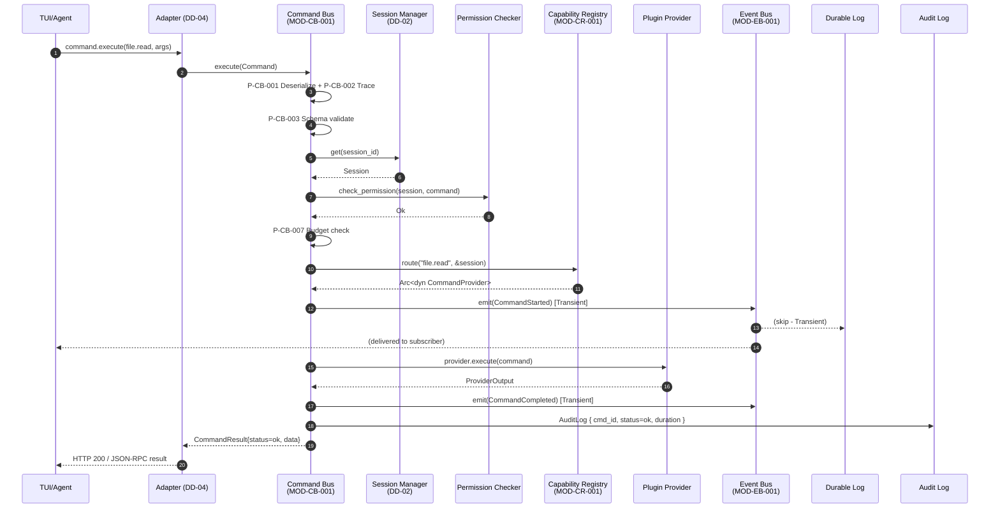

### 6.2 Validation 失敗 (Schema)

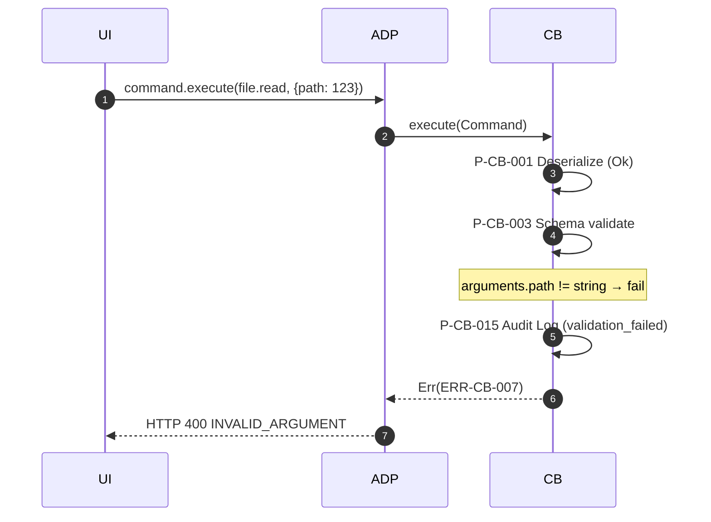

### 6.3 Authorization 失敗

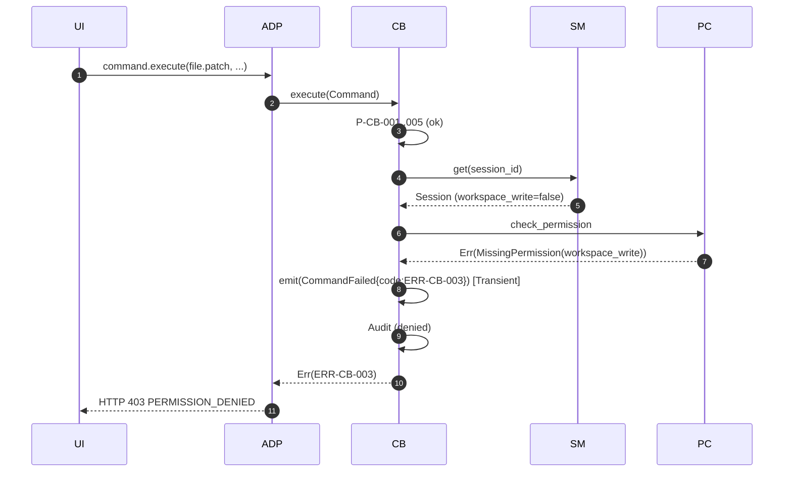

### 6.4 Capability Not Found

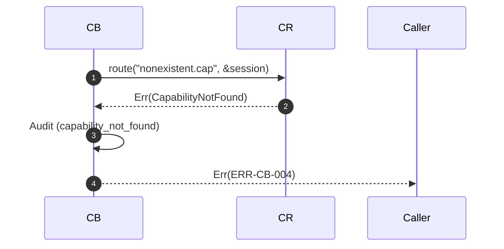

### 6.5 全 Provider Unavailable (Hot Swap 中)

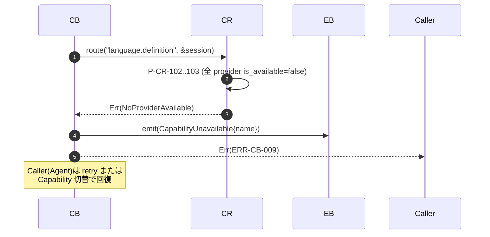

### 6.6 Cancellation

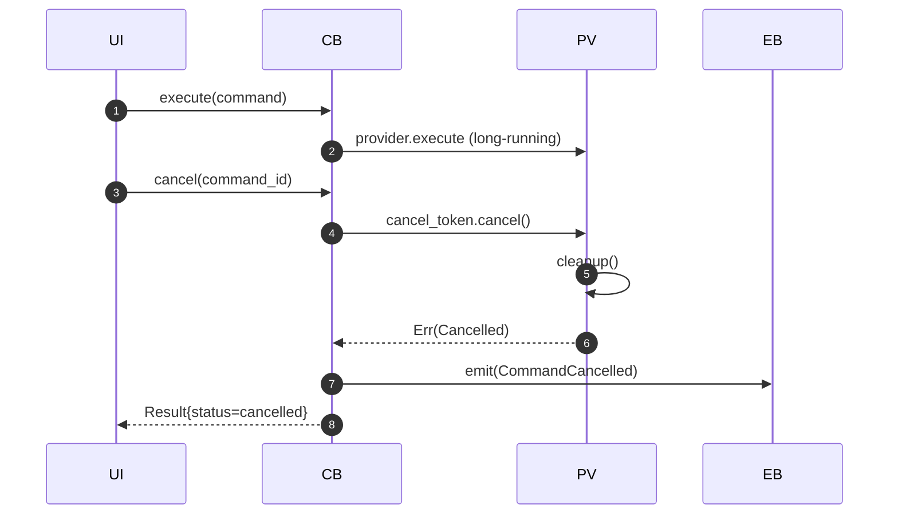

### 6.7 Provider Panic → 隔離

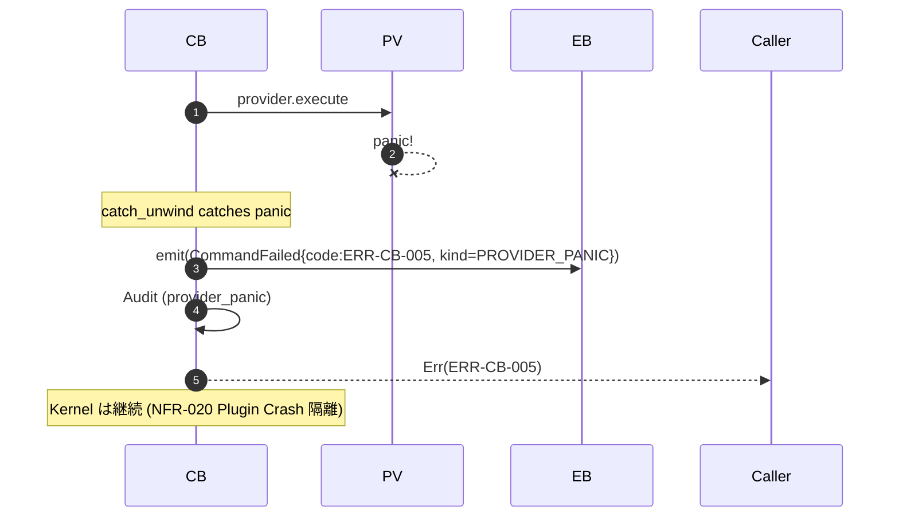

### 6.8 Transaction Commit 時の Event 連鎖 (Buffer/Transaction は DD-02、本 DD では Event 連鎖のみ記述)

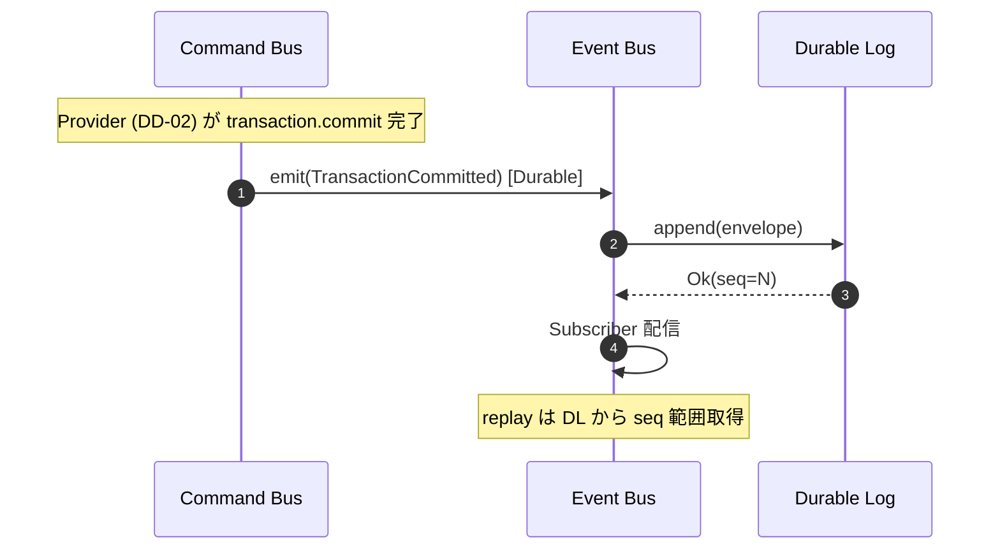

---

## 7. 状態遷移設計

### 7.1 Command の実行状態

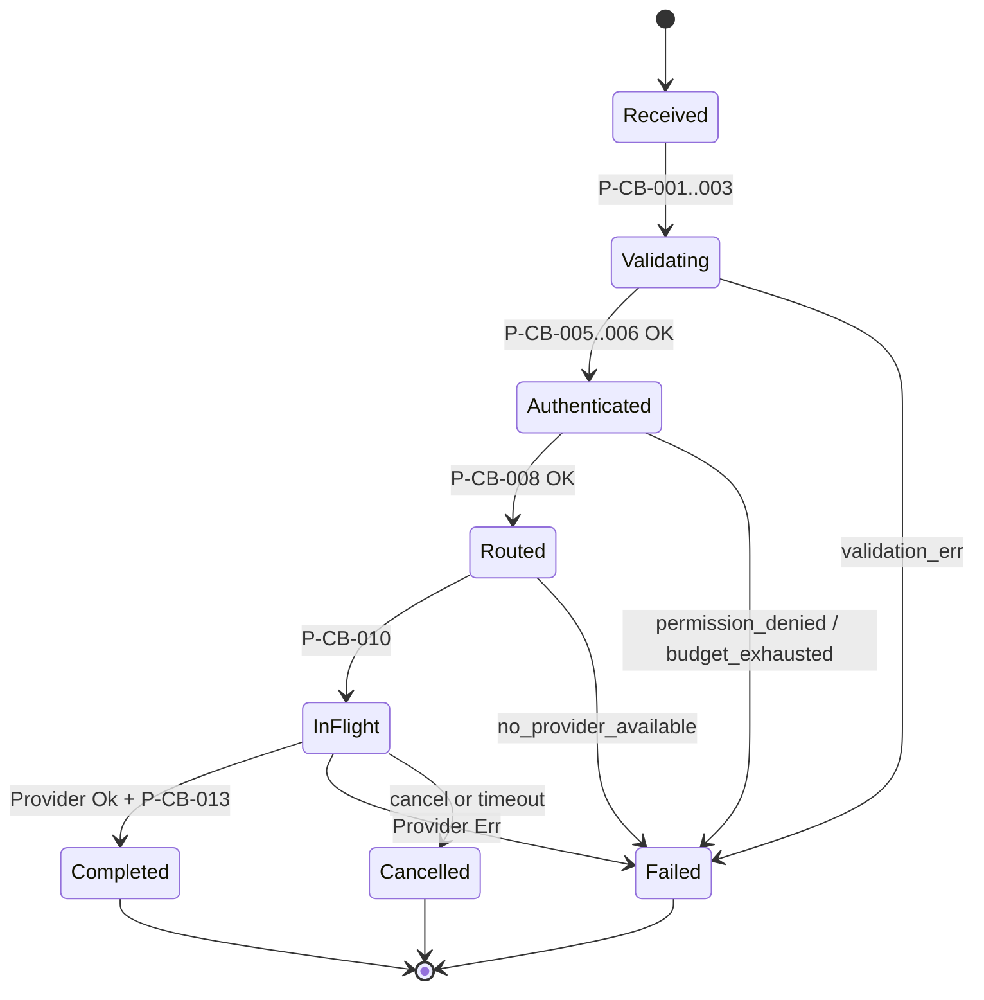

### 7.2 Capability Provider の可用性

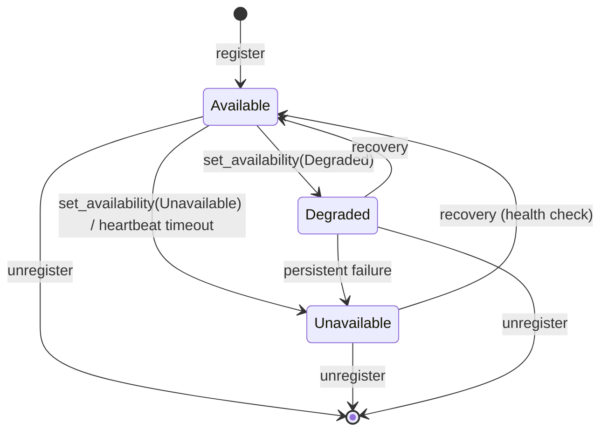

### 7.3 Event の状態

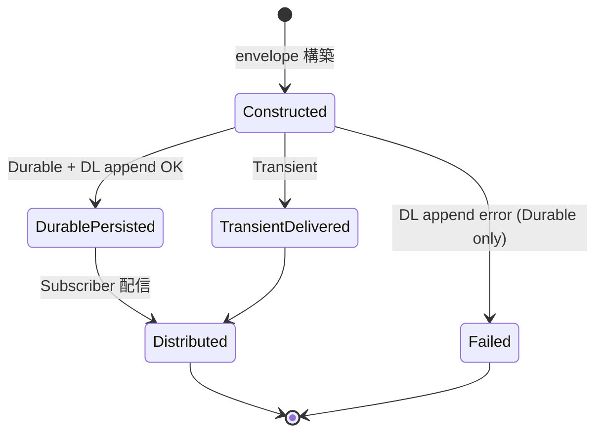

---

## 8. Error 設計

### 8.1 共通ポリシー

- Error Code は **領域プレフィクス + 連番**: `ERR-CB-XXX`, `ERR-EB-XXX`, `ERR-CR-XXX`
- `retryable` フラグで Client の retry 可能性を明示
- `details` には **内部情報 (path, version, hash) を含めない** (SD-001 §7)
- 内部 Log には詳細構造化、User 向け message は抽象化

### 8.2 Command Bus エラー体系

| Code | Condition | Message 例 | HTTP | Retry | Log Level | Recovery |
|------|-----------|-----------|------|-------|-----------|----------|
| ERR-CB-001 | Kernel not initialized | "Command Bus unavailable" | 503 | No | ERROR | 起動待ち |
| ERR-CB-002 | Session not found / expired | "Session not found or expired" | 401 | No | WARN | 再認証 |
| ERR-CB-003 | Permission denied | "Permission denied: {perm} required" | 403 | No | WARN | 権限付与 |
| ERR-CB-004 | Capability not registered | "Capability '{name}' not found" | 404 | No | INFO | Capability 名確認 |
| ERR-CB-005 | Provider execution failed | "Command execution failed" | 500 | Maybe | ERROR | Provider log 確認 |
| ERR-CB-006 | Malformed command | "Invalid command format" | 400 | No | WARN | Caller 修正 |
| ERR-CB-007 | Schema validation failed | "Argument validation failed: {field}" | 400 | No | WARN | Caller 修正 |
| ERR-CB-008 | Resource budget exhausted | "Resource budget exceeded" | 429 | Yes (after budget reset) | WARN | 予算増 / 待機 |
| ERR-CB-009 | No provider available | "No available provider for '{capability}'" | 503 | Yes (Hot Swap 後) | WARN | Provider 復活待ち |
| ERR-CB-010 | Duplicate idempotency key in-flight | "Duplicate request with idempotency key" | 409 | No | INFO | 既存 request 完了待ち |
| ERR-CB-011 | Event emit failed (non-fatal) | "Event emit failed for {event_type}" | — | — | WARN | Event Bus 復旧 |
| ERR-CB-012 | Provider cleanup failed | "Provider cleanup error" | — | — | ERROR | 手動調査 |
| ERR-CB-013 | Cancel target not found | "No inflight command {cmd_id}" | 404 | No | INFO | — |
| ERR-CB-014 | Cancel wrong session | "Session mismatch" | 403 | No | WARN | — |
| ERR-CB-015 | Timeout | "Command execution timed out after {ms}ms" | 504 | Yes | WARN | Retry or extend timeout |
| ERR-CB-016 | Internal error | "Internal error" | 500 | Yes | ERROR | Bug report |

### 8.3 Event Bus エラー体系

| Code | Condition | Message 例 | Retry | Log Level | Recovery |
|------|-----------|-----------|-------|-----------|----------|
| ERR-EB-001 | EventBus not initialized | "Event Bus unavailable" | No | ERROR | 再起動 |
| ERR-EB-002 | Unknown event type | "Unknown event type: {name}" | No | WARN | Type 確認 |
| ERR-EB-003 | Durable Log append failed | "Failed to persist event" | Yes (Caller 依存) | ERROR | DL 復旧 |
| ERR-EB-004 | Invalid subscription filter | "Invalid filter" | No | WARN | Filter 修正 |
| ERR-EB-005 | Too many subscribers | "Subscriber limit exceeded" | No | WARN | 既存 sub 解除 |
| ERR-EB-006 | Invalid replay range | "Invalid sequence range" | No | INFO | Range 修正 |
| ERR-EB-007 | Event validation failed | "Event validation failed: {field}" | No | WARN | Caller 修正 |
| ERR-EB-008 | Subscriber send failed (致命) | "Subscriber channel closed unexpectedly" | No | ERROR | 自動 unsubscribe |

### 8.4 Capability Registry エラー体系

| Code | Condition | Message 例 | Retry | Log Level | Recovery |
|------|-----------|-----------|-------|-----------|----------|
| ERR-CR-001 | Registry not initialized | "Capability Registry unavailable" | No | ERROR | 再起動 |
| ERR-CR-002 | Invalid capability descriptor | "Invalid capability: {field}" | No | WARN | 修正 |
| ERR-CR-003 | Provider is null | "Provider implementation missing" | No | ERROR | Plugin Bug |
| ERR-CR-004 | Manifest mismatch | "Plugin manifest does not declare capability" | No | ERROR | Manifest 修正 |
| ERR-CR-005 | Capability not registered | "Capability '{name}' not registered" | No | INFO | Plugin load |
| ERR-CR-006 | No provider available | "No available provider for '{name}'" | Yes | WARN | Hot Swap / restart |
| ERR-CR-007 | Provider not found (by id) | "Provider {id} not registered" | No | INFO | 再登録 |
| ERR-CR-008 | Invalid list filter | "Invalid filter: {detail}" | No | WARN | Filter 修正 |
| ERR-CR-009 | Policy tag conflict | "Policy tag conflict for capability" | No | WARN | Policy 見直し |
| ERR-CR-010 | Registration limit exceeded | "Too many providers for capability '{name}'" | No | WARN | 上限見直し |

---

## 9. 設定・Secrets・構成管理

### 9.1 Kernel Config (TOML)

```toml
[command_bus]
default_timeout_ms = 30000
max_timeout_ms = 600000
schema_cache_size = 1024
inflight_shards = 32      # 【TBD】 性能検証で確定

[event_bus]
subscriber_buffer_size = 1024
slow_subscriber_threshold_ms = 100
durable_log_path = "~/.kernel/events/"
durable_log_fsync = "batch"   # "batch" | "always" 【TBD】

[capability_registry]
max_providers_per_capability = 16
default_priority = 50
```

### 9.2 Secrets

- 本 DD-01 が直接扱う Secret はない (Secret API は SD-001 §6 の Secret Manager、DD-04)。
- ただし Capability Provider が Secret を使う場合、Provider は **Secret API を経由** し、`std::env::var` を直接呼ばない (SD-001 §6 整合)。

### 9.3 環境差分

| 環境 | 差分 |
|------|------|
| DEV | debug log 有効, schema validation 緩め可 |
| TEST | mock provider 注入可 |
| STG | 性能メトリクス有効, DL fsync=batch |
| PROD | 全機能有効, DL fsync=batch, RateLimit 有効 |

---

## 10. 故障回復設計

| 障害 | 検出 | 影響範囲 | 復旧戦略 |
|------|------|----------|---------|
| Provider panic | catch_unwind | 当該 Command のみ | ERR-CB-005 返却 + Audit、Kernel 継続 (NFR-020) |
| Provider hang (no response) | timeout | 当該 Command | Cancellation 通知 → 5s 後 abort |
| EventBus DL 障害 | append error | 新規 Durable Event 喪失可能性 | ERR-EB-003 で Caller 通知、WARN 継続。DL 復旧後 seq 連番保証は【TBD】 |
| Subscriber channel 満杯 | try_send 失敗 | 当該 Subscriber のみ | drop カウンタ + WARN、Producer 継続 |
| Subscriber 切断 | sink closed | 当該 Subscription | 自動 unsubscribe + Event 発行 (将来) |
| Registry 不整合 | is_available=false 連続 | 該当 Capability のみ | Fallback Strategy で次候補、なければ ERR-CR-006 |
| Schema cache miss | Schema not found | 当該 Command | Cold ロード (50ms 以内)、失敗時 ERR-CB-007 |
| Inflight map メモリ増加 | gauge 監視 | Kernel 全体 | NFR-013 に基づく上限設定、超過時 ERR-CB-008 |
| Kernel 全体 Crash | OS 監視 | 全 State 消失 | Durable Log + Audit Log + Journal から次回起動時 replay (DD-02/04 と統合) |

---

## 11. セキュリティ統合

Command Bus / Event Bus / Capability Registry はそれぞれ SD-001 の以下セクションと直接連携する:

| DD-01 要素 | SD-001 参照 | 統制内容 |
|-----------|-------------|---------|
| Command Bus (P-CB-006) | §2.3 | 全 Command 入口で Permission チェック |
| Command Bus (P-CB-006, file.*) | §3 | Path canonical 化 + workspace sandbox |
| Command Bus (process.*) | §4 | process.spawn policy |
| Event Bus (audit Event) | §7 | Audit Log への記録、Hash chain |
| Event Bus (network Event) | §5 | Network policy 適用 Event の追跡 |
| Capability Registry (P-CR-002) | §2.3, §9.2 | Provider required_permissions と Session permissions の包含判定 |
| Capability Registry (P-CR-001) | §1.1 [THREAT-001] | Manifest 整合確認 |
| 全コンポーネント | §8 | 入力 Validation (Schema) |

**Audit Log 出力** (SD-001 §7):
- Permission 拒否 (allow/deny)
- Command 実行結果
- Capability 登録/解除
- Provider availability 変更

---

## 12. テスト観点導出表

各主要設計項目に対するテスト観点を導出する。テスト仕様書本体は別 DD (`DD-04` または `DD-05` Cross-Review) で確定する。

### 12.1 MOD-CB-001 Test Viewpoints

| ID | 観点 | 期待結果 |
|----|------|---------|
| T-CB-001 | 正常: READ_ONLY Command 実行 | status=ok, inflight 除去, CommandStarted/Completed Event 発行 |
| T-CB-002 | Validation 失敗: type mismatch | ERR-CB-007, Audit 記録 |
| T-CB-003 | Validation 失敗: missing required field | ERR-CB-007 |
| T-CB-004 | Authz 失敗: 権限不足 | ERR-CB-003, CommandFailed Event, Audit |
| T-CB-005 | Resource budget 枯渇 | ERR-CB-008 |
| T-CB-006 | Capability 未登録 | ERR-CB-004 |
| T-CB-007 | 全 Provider unavailable | ERR-CB-009 + CapabilityUnavailable Event |
| T-CB-008 | Idempotency key HIT | 同一 result 再現 |
| T-CB-009 | Idempotency key 重複 in-flight | ERR-CB-010 |
| T-CB-010 | Timeout 発生 | ERR-CB-015, Cancellation 伝播, cleanup 完了 |
| T-CB-011 | Cancellation (即時) | status=cancelled, cleanup 完了 |
| T-CB-012 | Provider panic | ERR-CB-005 (PROVIDER_PANIC), Kernel 継続 |
| T-CB-013 | EventBus emit 失敗 | WARN 継続, 業務結果返却 |
| T-CB-014 | 100 同時 inflight | 全完了 or 全 error、メモリリークなし (NFR-012) |
| T-CB-015 | 巨大 arguments (1MB) | ERR-CB-007 または schema 拒否 |
| T-CB-016 | discovery (filter 適用) | Session.permissions ⊇ required のみ返却 |
| T-CB-017 | Path traversal 引数 | ERR-CB-007 (SD-001 §3) |
| T-CB-018 | Retry 自動 3 回 (READ_ONLY) | 成功時 1 回で終了 / Transient エラー時 3 回試行 |
| T-CB-019 | 監査ログ完全性 | Hash chain 検証 OK (SD-001 §7) |

### 12.2 MOD-EB-001 Test Viewpoints

| ID | 観点 | 期待結果 |
|----|------|---------|
| T-EB-001 | Transient Event 発行 | DL には残らない、Subscriber には届く |
| T-EB-002 | Durable Event 発行 | DL に永続化、seq 昇順 |
| T-EB-003 | 未登録 event_type | ERR-EB-002 |
| T-EB-004 | payload size > 64KB | ERR-EB-007 |
| T-EB-005 | Subscriber 0 件 | ERR なし、正常終了 |
| T-EB-006 | Subscriber channel 満杯 | drop + WARN、Producer 継続 |
| T-EB-007 | Subscriber 切断 | 自動 unsubscribe |
| T-EB-008 | Subscribe (filter) | 該当 type のみ配信 |
| T-EB-009 | Subscribe (since_seq) | replay 結果 + 新規 Event の連続 |
| T-EB-010 | Replay (range) | 該当 seq 範囲取得、next_cursor 整合 |
| T-EB-011 | Replay 大量 (limit 1000) | next_cursor 返却 |
| T-EB-012 | Durable Log 障害 | ERR-EB-003 |
| T-EB-013 | 100 同時 Subscriber | 全 Subscriber に遅延なく配信 (P95 < 10ms) |
| T-EB-014 | sequence 連番保証 | 100 万件発効後も gap なし |
| T-EB-015 | Replay 順序性 | seq 昇順返却 |

### 12.3 MOD-CR-001 Test Viewpoints

| ID | 観点 | 期待結果 |
|----|------|---------|
| T-CR-001 | 単一 Provider 登録 → route | 該当 Provider 返却 |
| T-CR-002 | 複数 Provider (priority 順) | priority 高い順で返却 |
| T-CR-003 | 全 Provider unavailable | ERR-CR-006 |
| T-CR-004 | 権限不足 provider スキップ | スキップして次候補 |
| T-CR-005 | policy_tag 不一致スキップ | 次候補 |
| T-CR-006 | LoadBalance fallback | 候補間で round-robin |
| T-CR-007 | Hot Swap (新 provider 登録) | route 結果が透過的に切替 |
| T-CR-008 | availability 変更 (Available → Unavailable) | route から除外 |
| T-CR-009 | availability 復旧 | route 再開 |
| T-CR-010 | Manifest 整合失敗 | ERR-CR-004 |
| T-CR-011 | 重複 provider_id 上書き | 既存エントリ更新 |
| T-CR-012 | list (filter) | filter 該当のみ返却 |
| T-CR-013 | list (permission フィルタ) | Session.permissions 不足のものは除外 |
| T-CR-014 | 登録上限超過 (16 超) | ERR-CR-010 |
| T-CR-015 | 並行 register/unregister | data race なし (loom 検査可能) |
| T-CR-016 | route P95 < 1ms (1000 provider) | 性能目標達成 |

### 12.4 統合 Test Viewpoints

| ID | 観点 | 期待結果 |
|----|------|---------|
| T-INT-001 | TUI → CB → Provider → EB 一気通貫 | §6.1 sequence 通り |
| T-INT-002 | TUI → Provider panic → CB 継続 | §6.7 sequence 通り、Kernel 健全 |
| T-INT-003 | 10 Session 並行各 100 Command | 全完了、リソースリークなし |
| T-INT-004 | Event Replay で Audit 復元 | 全 Command の Audit Event が順序通り取得可能 |
| T-INT-005 | 長時間 (1h) 連続運用 | メモリリークなし、EventBus seq 連番維持 |

---

## 13. Traceability マトリクス

### 13.1 DD → BD → REQ

| DD ID | 名称 | BD ID | REQ ID | 実装オブジェクト | Test 観点 |
|-------|------|-------|--------|------------------|----------|
| MOD-CB-001 | Command Bus | AD-001 §2.2 | FR-001-01, FR-003, FR-022 | kernel_core::command::CommandBus | T-CB-* |
| M-CB-001 execute | execute | AD-001 §2.2 | FR-003, NFR-031 | CommandBus::execute | T-CB-001/002/003/004/005 |
| M-CB-002 cancel | cancel | AD-001 §2.2 | FR-003-05 | CommandBus::cancel | T-CB-011 |
| M-CB-003 discover | discover | IF-CMD-002 | FR-003-02 | CommandBus::discover | T-CB-016 |
| ERR-CB-001 〜 016 | Error system | AD-001 §2.2 (責務) | NFR-031, NFR-020 | thiserror enum | T-CB-019 |
| MOD-EB-001 | Event Bus | AD-001 §2.3 | FR-001-02, FR-008, FR-022 | kernel_core::event::EventBus | T-EB-* |
| M-EB-001 emit | emit | AD-001 §2.3 | FR-008-01..03 | EventBus::emit | T-EB-001/002/003/004 |
| M-EB-002 subscribe | subscribe | IF-EVT-001 | FR-008, NFR-040 | EventBus::subscribe | T-EB-008/009 |
| M-EB-003 replay | replay | IF-EVT-002 | FR-022 | EventBus::replay | T-EB-010/011 |
| ERR-EB-001 〜 008 | Error system | AD-001 §2.3 | NFR-023 | thiserror enum | T-INT-004 |
| MOD-CR-001 | Capability Registry | AD-001 §2.4 | FR-001-03, FR-004, FR-017 | kernel_core::capability::CapabilityRegistry | T-CR-* |
| M-CR-001 register | register | AD-001 §2.4, IF-CAP-001 | FR-004-01 | CapabilityRegistry::register | T-CR-001/002/011 |
| M-CR-002 route | route | AD-001 §2.4, IF-CAP-002 | FR-004-02 | CapabilityRegistry::route | T-CR-001..006 |
| M-CR-003 set_availability | set_availability | AD-001 §2.4 | FR-004-03, FR-007 | CapabilityRegistry::set_availability | T-CR-008/009 |
| M-CR-004 list | list | IF-CAP-001 (補助) | FR-004-01 | CapabilityRegistry::list | T-CR-012/013 |
| ERR-CR-001 〜 010 | Error system | AD-001 §2.4 | FR-017 | thiserror enum | T-CR-010/014 |
| §6 Sequence | 統合 | AD-001 §2.2-2.4 | FR-001 全体 | 全モジュール協調 | T-INT-* |
| §10 故障回復 | fault recovery | AD-001 §7 | NFR-020, NFR-022, NFR-023 | 全体 | T-INT-002/005 |

### 13.2 REQ → DD (Reverse Trace)

| REQ ID | 説明 | DD 該当 |
|--------|------|---------|
| FR-001-01 | Command Bus | MOD-CB-001, M-CB-001 |
| FR-001-02 | Event Bus | MOD-EB-001, M-EB-001 |
| FR-001-03 | Capability Registry | MOD-CR-001, M-CR-001/002 |
| FR-003 | Command 実行モデル | M-CB-001, §3.4 フロー, §6.1 |
| FR-004-01 | Capability 登録・発見 | M-CR-001, M-CR-004 |
| FR-004-02 | Capability ルーティング | M-CR-002, P-CR-101..105 |
| FR-004-03 | Provider ホットスワップ | §5.6, T-CR-007 |
| FR-008-01..03 | Event 統一 envelope, 分類, 標準集合 | CLS-EB-002, §4.8 |
| FR-017 | Zero Trust Plugin Security | P-CR-002, §5.9, §11 |
| FR-022 | Audit ログ | §3.12, §4.11, §11 |
| NFR-003 | 入力応答 P99 < 16ms | §3.13, §4.12 |
| NFR-012 | 10 Session 同時 | §3.13, T-INT-003 |
| NFR-013 | Plugin 50 同時 | §5.12 |
| NFR-020 | Plugin Crash 隔離 | §6.7, §10 |
| NFR-022 | Crash Recovery | §4.10, §10 |
| NFR-031 | Input Validation | §3.10, §4.9, §5.9 |
| NFR-040 | 構造化ログ | §3.12, §4.11, §5.11 |
| NFR-046 | テストカバレッジ | §12 (各 DD 観点網羅) |

---

## 14. 未決事項一覧 (TBD)

| TBD ID | 内容 | 影響範囲 | 担当 | 期限 | 状態 |
|--------|------|---------|------|------|------|
| TBD-DD01-001 | 性能検証: inflight map シャード数の最終決定 (DashMap shards) | MOD-CB-001 §3.13 | Perf Team | MVP-3 まで | 未着手 |
| TBD-DD01-002 | Performance Test Suite での Backoff jitter / Max Retry 数値確定 | MOD-CB-001 §3.6.3 | Perf Team | MVP-3 まで | 未着手 |
| TBD-DD01-003 | Durable Log 障害復旧時の seq 連番保証戦略 | MOD-EB-001 §4.6.3 | Kernel Team | MVP-3 まで | 未着手 |
| TBD-DD01-004 | Durable Log の fsync 戦略 (batch vs always) | MOD-EB-001 §9.1 | Kernel Team + Perf Team | MVP-3 まで | 未着手 |
| TBD-DD01-005 | Capability Provider の `max_execution_ms` Manifest フィールド定義 | MOD-CB-001 §3.6.2 | Plugin SDK Team | MVP-2 まで | 未着手 |
| TBD-DD01-006 | Schema cache 容量上限と eviction 戦略 | MOD-CB-001 §3.13 | Kernel Team | MVP-2 まで | 未着手 |
| TBD-DD01-007 | Subscriber 切断時の自動 EventBus 通知 Event 仕様 | MOD-EB-001 §10 | TUI Team | MVP-2 まで | 未着手 |
| TBD-DD01-008 | Provider 検索結果のロードバランシング戦略詳細 (現状 RR のみ) | MOD-CR-001 §5.5 | Kernel Team | MVP-2 まで | 未着手 |
| TBD-DD01-009 | セキュリティ: Audit Log への hash chain 実装詳細 | §11 参照 | SD-001 §7 と整合 | MVP-2 まで | 未着手 |
| TBD-DD01-010 | 上位設計との整合: 「Plugin が Plugin 状態に応じて set_availability を呼ぶ」インターフェース詳細 | §5.6, DD-03 連携 | DD-03 担当 + 当 DD | DD-03 着手時 | 待機 |

---

## 15. 上位設計への確認事項

本 DD 作成過程で確認された上位設計 (AD-001 / REQ-001 / SD-001) に対する確認事項を記録する。

| ID | 項目 | 確認内容 | 影響 |
|----|------|---------|------|
| QA-DD01-001 | AD-001 §2.2 では `CapabilityRegistry.route(&command.name, &command.session_id)` と抽象化されているが、本 DD は `&Session` 全体を受け取り permission 判定を内部で行う。本 DD の解釈は Permission 判定の責任分界を Registry 側に持つものだが、SD-001 §2.3 では Command Bus 入口で Permission チェックを行う方針。整合確認要。 | Permission チェックを (a) Command Bus 入口のみ、(b) Registry route 内の両方 のいずれに統一するか |
| QA-DD01-002 | AD-001 §2.3 Event Bus の責務に "Event Stream (SSE/WebSocket)" を含むが、本 DD は in-process 配信 + Durable Log までとし、Transport は DD-04 Adapter 層に委譲。整合しているか確認要。 | DD-04 での Transport 実装方針と整合 |
| QA-DD01-003 | IFD-001 IF-EVT-002 の "Audit 用途" replay に対し、本 DD は M-EB-003 で replay を提供。容量制限 (limit) は設けたが、長期間 (e.g. 90日) 全量 replay は想定外。 | Audit 期間中の DL 容量見積もり + ローテーション方針 |
| QA-DD01-004 | REQ-001 FR-005-04 "Session リソース隔離" に対し、Command Bus の inflight は Session 単位の分離を行わず (NFR-012 の 10 Session 同時実行のため)。上限値の最終決定は Performance Test で確定。 | NFR-012 と整合 |

---

## 16. 設計 Review (自己審査)

skill-multica-2 §47 の Review 順序に従い自己審査した結果:

### 16.1 Traceability
- ☑ DD → BD → REQ の追跡表完備 (§13.1)
- ☑ 主要設計に ID 付与 (MOD/M/CLS/P/ERR/TBD/QA)
- ☑ Reverse Trace 可能 (§13.2)

### 16.2 Processing
- ☑ 入力 (§3.8 / §4.7 / §5.7)、出力 (§3.9 / §4.8 / §5.8) 明示
- ☑ 正常フロー (§3.4 / §4.4 / §5.4)、分岐条件 (§3.5 / §4.5 / §5.5)、異常フロー (§6.2～6.7) 明示
- ☑ 状態遷移 (§7.1～7.3) 明示

### 16.3 Data
- ☑ In-Process のため DB アクセスは DD-04 (Durable Log 抽象)
- ☑ 排他戦略 (§3.11 / §5.10) 明示
- ☑ Idempotency (§3.11) 明示

### 16.4 Reliability
- ☑ Timeout (§3.6.2 / §4.6.1 / §5.7) 明示
- ☑ Retry (§3.6.3) 明示
- ☑ 故障回復 (§10) 明示

### 16.5 Security
- ☑ SD-001 §2.3 Permission チェック統合 (§3.4 P-CB-006, §11)
- ☑ SD-001 §8 Input Validation (§3.10 / §4.9 / §5.9)
- ☑ Audit 連携 (§11)

### 16.6 Operations
- ☑ Logging (§3.12 / §4.11 / §5.11) 明示
- ☑ Metrics / Traces 明示
- ☑ Config (§9) 明示

### 16.7 Quality
- ☑ TBD 完備管理 (§14)
- ☑ 確認事項 (§15) 明示
- ☑ テスト観点 (§12) 導出済 (各 T-* ID)

### 16.8 残課題
- Performance Test 結果待ち項目が複数 (TBD-DD01-001, 002, 004, 006)。
- DD-03 (Plugin Manager) との接続点 (§5.6 set_availability の Caller 詳細) は DD-03 着手後に再確認。
- 上位設計への確認事項 (§15) が 4 件あり、親 Issue (DD-05) Cross-Review または ユーザー回答待ち。

---

## 17. 変更履歴

| 版 | 日付 | 変更内容 | 作成者 |
|----|------|---------|--------|
| 1.0 | 2026-09-14 | 初期版作成 (ULYS-38 / DD-01) | MinimaxM3 |

---

**ドキュメント終了**
