# 纯 Rust AI Native CLI Development Kernel
## DD-02 Session / Transaction / Buffer Engine 詳細設計書

---

## 文档元数据

| 項目 | 内容 |
|------|------|
| 文档 ID | DD-02-2026-0914 |
| バージョン | 1.0 |
| ステータス | 初期版 — レビュー待ち |
| 対象子系统 | Session Manager / Transaction Manager / Buffer Engine |
| 上位文档 | REQ-001（要件定義書）, NFR-001（非機能要件定義書）, AD-001（基本設計書）, IFD-001（接口设计书）, SD-001（安全性設計書） |
| 関連详细设计 | DD-01（Microkernel Core）, DD-03（Plugin / Extension）, DD-04（Internal API + Cross-Cutting） |
| 下位产出 | Implementation, Test Design（DD-05 統合自己審査の対象） |

---

## 1. 文档目的

本文書は AD-001（基本設計書）第 2.5 〜 2.7 章で確定した以下の 3 サブシステムを実装可能な粒度で詳細化する：

| サブシステム | Module ID | 概要 |
|-------------|-----------|------|
| Session Manager | MOD-SM-001 | マルチ Actor / マルチ Workspace / 権限分離に基づく並行実行コンテキスト管理 |
| Transaction Manager | MOD-TM-001 | Workspace 修正の ACID セマンティクス、Patch ベース変更の楽観的排他、Crash 復帰 |
| Buffer Engine | MOD-BE-001 | ファイル内容のメモリ効率的管理、Undo/Redo、Patch 適用、エンコーディング抽象化 |

### 1.1 設計範囲

含むもの：

- 上記 3 Module の Component / Class 構造、データ構造、核心メソッド、内部処理流れ
- Session State Machine / Transaction State Machine / Buffer State の遷移設計
- Buffer 並行制御方式の候補比較と推奨
- Journal / Snapshot / 増分ログによる永続化と Crash 復帰方式
- Error 体系、Logging / Audit、可観測性、Security 詳細
- Traceability（REQ → BD → DD → Test 观点）

含まないもの：

- Command Bus / Event Bus / Capability Registry の内部設計 → DD-01 参照
- Plugin Loader / Sandbox / Hot Swap → DD-03 参照
- Error / Logging / Concurrency / Configuration / Security の横断詳細 → DD-04 参照
- 内部 API 仕様（HTTP / JSON-RPC / SSE / MCP）→ IFD-001 参照（DD-04 で実装層に分解）

### 1.2 下流使用者

- Rust 実装担当：実装コード（kernel-core/src/{session,transaction,buffer}/）を本設計に沿って作成
- Test 設計担当：本設計から Unit / Integration / Property-based Test 观点を抽出
- DD-05 Cross-Review：本設計の整合性を DD-01/03/04 と一括審査

---

## 2. 用語と縮略語

| 用語 | 定義 |
|------|------|
| Session | 1 つの Actor（Human / LangGraph / Agent / CI / Plugin / Automation）が Workspace に対して持つ論理実行コンテキスト |
| Transaction | Workspace に対する 1 単位の ACID 保証付き変更集合（1 Session = 最大 1 Active Transaction） |
| Patch | ファイルに対する局所変更指示（document, range, before_hash, expected_version, change） |
| Optimistic Concurrency | Commit 時に expected_version / before_hash を照合する方式（FR-006-03） |
| WAL | Write-Ahead Log。永続化対象の更新前に Journal へ先行書き出しする方式 |
| Piece Table | Buffer を「Original Piece 列 + Added Piece 列」として保持するデータ構造。挿入・削除を O(log n) で扱う |
| Rope | 平衡二分木で文字列を保持するデータ構造。任意位置への挿入・削除・スプリットを O(log n) で扱う |
| CRDT | Conflict-free Replicated Data Type。マルチ Site 編集の収束保証付きデータ型 |
| OT | Operational Transform。マルチ Site 編集時に操作変換で収束させる方式 |
| Journal | 永続化された追記専用ログ（Transaction 開始・Patch・Commit・Rollback の記録） |
| Snapshot | Buffer / Transaction 状態のポイントインタイム保存 |
| Savepoint | Transaction 内の途中状態に対する名前付きマーカー |
| Recovery | Kernel Crash 後 Journal / Snapshot から状態を復元する処理 |
| Trace ID | 1 リクエストを End-to-End で追跡する一意識別子（DD-04 で定義） |
| Correlation ID | Session 配下の複数 Command を横断する紐付け識別子 |
| PII | Personally Identifiable Information。Buffer に保持してはならない |

---

## 3. 参考资料

| 文档 ID | 名称 | 該当章 | 役割 |
|---------|------|--------|------|
| REQ-001 | 要件定義書 | §3 FR-001, FR-002, FR-005, FR-006, FR-008, FR-022 | 上位要件の根拠 |
| NFR-001 | 非機能要件定義書 | §2.5, §2.6, §2.7, §3.1, §3.3, §4.3, §4.5, §5.6 | 性能 / 容量 / 信頼性 / 監査要件 |
| AD-001 | 基本設計書 | §2.5 Session Manager, §2.6 Transaction Manager, §2.7 Buffer Engine | 構造の出典 |
| IFD-001 | 接口设计书 | §2.4 Session API（IF-SES-001/002）, §2.5 Transaction API（IF-TXN-001/002/003）, §5.2 IF-INTERNAL-BUFFER-001 | 外部 API 契約 |
| SD-001 | 安全性設計書 | §3 Workspace Security, §7 Audit & Logging, §3.2 Sandbox Escape | 権限 / 監査要件 |
| DD-01 | Microkernel Core 詳細設計書 | （並行作成） | Command / Event / Capability 内部 |
| DD-03 | Plugin / Extension 詳細設計書 | （並行作成） | Plugin 経由 Session / Buffer アクセス |
| DD-04 | Internal API + 横断关切詳細設計書 | （並行作成） | Error / Logging / Concurrency / Secret の横規則 |

---

## 4. 設計原則

本詳細設計は以下に拘束される：

1. **上位設計優先**：AD-001 で確定した責務・データ構造・メソッド名・インターフェースを逸脱しない。逸脱が必要と判断した場合は【上位設計確認事項】として記録し、勝手に改変しない。
2. **Session Scoped**：すべての Buffer / Transaction / Cursor / Context / Permission は Session 配下に閉じる（REQ-001 §10「禁止全局当前状態」）。Global 状態を持たない。
3. **Patch First**：Workspace 修正は Patch（before_hash / expected_version 付き）で行う。ファイル全体書き換え禁止（REQ-001 §18, AD-001 §2.6）。
4. **Fail Loud**：異常時は早期に構造化 Error を返却し、Silent Fallback / 黙示的 Default を禁止。
5. **Trace Everything**：すべての状態遷移と Write 系操作は Trace ID / Session ID / Transaction ID を含む構造化ログで記録。
6. **Recovery First**：永続化対象は WAL 先行 + Crash 後に Journal Replay で必ず復帰可能な構造とする。
7. **TBD Honesty**：未確定値は【TBD】+ 影響を明示。経験的数字の捏造禁止。

---

## 5. サブシステム全体構成

### 5.1 内部 Crate 構成

AD-001 §2.1 で示されたディレクトリ構成を、本詳細設計では以下の Crate 単位で実装する：

```
crates/
├── kernel-session/
│   ├── src/
│   │   ├── lib.rs
│   │   ├── manager.rs         # SessionManager 本体（CLS-SM-001）
│   │   ├── session.rs         # Session / SessionId / Actor（CLS-SM-002）
│   │   ├── permissions.rs     # PermissionSet / PathPolicy（CLS-SM-003, MOD-SM-002）
│   │   ├── resource_budget.rs # CPU/Memory/Context Token 予算（MOD-SM-003）
│   │   ├── worktree.rs        # Workspace Worktree Binding（MOD-SM-004）
│   │   ├── lifecycle.rs       # Session 状態遷移
│   │   ├── recovery.rs        # Session 永続化 / 起動時復元
│   │   └── quota.rs           # Session 数 / 容量制限（MOD-SM-005）
│   └── tests/
│
├── kernel-transaction/
│   ├── src/
│   │   ├── lib.rs
│   │   ├── manager.rs         # TransactionManager 本体（CLS-TM-001）
│   │   ├── transaction.rs     # Transaction / TransactionId / Status（CLS-TM-002）
│   │   ├── patch.rs           # FilePatch / FileChange（CLS-TM-003, MOD-TM-002）
│   │   ├── journal.rs         # WAL / Journal 実装（CLS-TM-004, MOD-TM-003）
│   │   ├── savepoint.rs       # Savepoint 管理（CLS-TM-005, MOD-TM-004）
│   │   ├── conflict.rs        # Optimistic Concurrency 検出（MOD-TM-005）
│   │   ├── saga.rs            # 跨 Session / 跨 Plugin 補償（MOD-TM-006）
│   │   ├── outbox.rs          # Outbox パターン（MOD-TM-007）
│   │   ├── recovery.rs        # Journal Replay / Crash 復帰
│   │   └── lifecycle.rs       # Transaction 状態遷移
│   └── tests/
│
└── kernel-buffer/
    ├── src/
    │   ├── lib.rs
    │   ├── engine.rs          # BufferEngine 本体（CLS-BE-001）
    │   ├── buffer.rs          # Buffer / DocumentId（CLS-BE-002）
    │   ├── piece_table.rs     # Piece Table 実装（CLS-BE-003, MOD-BE-002）
    │   ├── chunked.rs         # 大容量 Chunk ストア（CLS-BE-004, MOD-BE-003）
    │   ├── mmap.rs            # Memory Mapping 抽象（MOD-BE-004）
    │   ├── codec.rs           # エンコーディング（UTF-8/16/Shift-JIS/EUC-JP/GBK/BOM）（MOD-BE-005）
    │   ├── line_ending.rs     # LF/CRLF/CR 検出・保持（MOD-BE-006）
    │   ├── undo_stack.rs      # Undo/Redo + 線形履歴（CLS-BE-005, MOD-BE-007）
    │   ├── savepoint.rs       # Buffer レベル Savepoint（MOD-BE-008）
    │   ├── persistence.rs     # Save / Reload / Snapshot（MOD-BE-009）
    │   ├── patch_apply.rs     # Patch 適用と Conflict 検出（MOD-BE-010）
    │   └── memory_budget.rs   # Buffer 毎メモリ上限（MOD-BE-011）
    └── tests/
```

### 5.2 サブシステム間関係

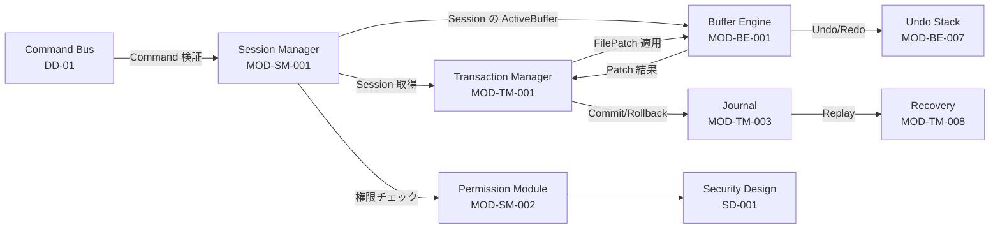

### 5.3 上位 IF との対応

| サブシステム | 上位 IF | 内部 Component |
|--------------|---------|-----------------|
| Session Manager | IF-SES-001, IF-SES-002 | SessionManager / Session / PermissionSet / ResourceBudget |
| Transaction Manager | IF-TXN-001, IF-TXN-002, IF-TXN-003 | TransactionManager / Transaction / FilePatch / Journal |
| Buffer Engine | IF-INTERNAL-BUFFER-001（IFD-001 §5.2） | BufferEngine / Buffer / PieceTable / Codec |


---

## 6. Session Manager 詳細設計

### 6.1 モジュール一覧

| Module ID | 名称 | 責務 |
|-----------|------|------|
| MOD-SM-001 | SessionManager | Session の作成 / 取得 / 削除 / 列挙 / ライフサイクル管理 |
| MOD-SM-002 | PermissionSet / PathPolicy | Session 配下の権限制御（RBAC + Path ベース） |
| MOD-SM-003 | ResourceBudget | Session 毎の CPU / Memory / Token / Disk IO 予算管理 |
| MOD-SM-004 | WorktreeBinding | Session と Workspace Worktree の紐付け |
| MOD-SM-005 | SessionQuota / Capacity | Kernel 全体の Session 数 / 寿命 / Idle Timeout 制御 |
| MOD-SM-006 | SessionRecovery | Crash 後の Session 永続化状態復元 |
| MOD-SM-007 | SessionAudit | Session 操作（create / suspend / terminate）の監査出力 |

### 6.2 Module 詳細表（MOD-SM-001）

| 項目 | 内容 |
|------|------|
| Module ID | MOD-SM-001 |
| 名称 | SessionManager |
| 対応 BD | AD-001 §2.5 Session Manager 設計 |
| 対応 REQ | FR-001-04, FR-005-01/02/03/04, FR-022 |
| 対応 NFR | NFR-C-020, NFR-C-021, NFR-S-001, NFR-S-003, NFR-R-032, NFR-M-031 |
| 対応 IF | IF-SES-001, IF-SES-002 |
| 入力 | CreateSessionRequest（actor, workspace_id, worktree_id, permissions, resource_budget, context_budget） |
| 出力 | SessionId（UUID v7【TBD 生成器選定】） |
| 依存 | Event Bus（IF-EVT-001）, PermissionSet, ResourceBudget, WorktreeBinding, SessionQuota |
| 状態 | NEW → ACTIVE → SUSPENDED → TERMINATED、異常: FAILED |
| Transaction | Session 作成 / 削除は単一 Write Operation。永続化は WAL 経由で Crash 復帰を保証 |
| Error | ERR-SES-001 〜 ERR-SES-099 |
| 並行性 | Read は DashMap / Arc<RwLock>、Write は Mutex 保護下の単一更新 |
| Logging | SessionCreated, SessionActivated, SessionSuspended, SessionTerminated, SessionQuotaExceeded |

### 6.3 Class 設計

#### 6.3.1 CLS-SM-001: SessionManager

```rust
// kernel-session/src/manager.rs
pub struct SessionManager {
    /// Active および Suspended Session の in-memory index
    sessions: Arc<DashMap<SessionId, Session>>,
    /// actor + workspace_id に対する冪等作成用 index
    idempotency_index: Arc<DashMap<(ActorId, WorkspaceId), SessionId>>,
    /// 容量 / 寿命 / Idle Timeout 制御
    quota: Arc<SessionQuota>,
    /// Worktree Binding 管理
    worktree: Arc<WorktreeBinding>,
    /// Event Bus（CommandStarted 等の Session 関連イベントを発行）
    event_bus: Arc<EventBus>,
    /// Session 状態永続化（WAL + Snapshot）
    persistence: Arc<SessionPersistence>,
    /// Permission 評価器
    perm_eval: Arc<PermissionEvaluator>,
    /// Audit Logger
    audit: Arc<AuditLog>,
    /// 単調増加 Session 番号
    seq: AtomicU64,
}
```

**主要 Public Method**

| Method ID | シグネチャ | 概要 |
|-----------|-----------|------|
| SM-M-001 | `async fn create(&self, req: CreateSessionRequest) -> Result<SessionId>` | Session 新規作成（IF-SES-001 実装） |
| SM-M-002 | `async fn get(&self, id: &SessionId) -> Result<Arc<Session>>` | Session 取得 |
| SM-M-003 | `async fn list(&self, filter: SessionFilter) -> Result<Vec<SessionInfo>>` | 列挙（管理者専用） |
| SM-M-004 | `async fn suspend(&self, id: &SessionId, reason: SuspendReason) -> Result<()>` | 中断 |
| SM-M-005 | `async fn resume(&self, id: &SessionId) -> Result<()>` | 再開 |
| SM-M-006 | `async fn terminate(&self, id: &SessionId, reason: TerminateReason) -> Result<()>` | 終了 |
| SM-M-007 | `async fn refresh_activity(&self, id: &SessionId) -> Result<()>` | 最終アクセス時刻更新（Idle Timeout 用） |
| SM-M-008 | `async fn check_permission(&self, sid: &SessionId, cmd: &CommandName) -> Result<()>` | Permission 評価 |
| SM-M-009 | `async fn check_path(&self, sid: &SessionId, path: &Path, op: FileOperation) -> Result<()>` | Path Policy 評価 |
| SM-M-010 | `async fn attach_buffer(&self, sid: &SessionId, doc: DocumentId) -> Result<()>` | Active Buffer 紐付け |
| SM-M-011 | `async fn detach_buffer(&self, sid: &SessionId, doc: DocumentId) -> Result<()>` | 解除 |
| SM-M-012 | `async fn set_active_transaction(&self, sid: &SessionId, txn: Option<TransactionId>) -> Result<()>` | 単一 Transaction 制約管理 |
| SM-M-013 | `async fn recovery_load(&self) -> Result<RecoveryReport>` | 起動時 Session 復元 |


#### 6.3.2 CLS-SM-002: Session

```rust
// kernel-session/src/session.rs
pub struct Session {
    pub session_id: SessionId,
    pub workspace_id: WorkspaceId,
    pub worktree_id: Option<WorktreeId>,
    pub actor: Actor,
    pub permissions: PermissionSet,
    pub path_policy: PathPolicy,
    pub resource_budget: ResourceBudget,
    pub context_budget: ContextBudget,
    pub active_buffers: BTreeSet<DocumentId>,
    pub active_transaction: Option<TransactionId>,
    pub created_at: Instant,
    pub last_activity_at: Instant,
    pub state: SessionState,
    pub metadata: SessionMetadata,
}

pub enum SessionState {
    New,         // 生成直後、Activate 前
    Active,      // Command 受付可能
    Suspended,   // Idle Timeout / 明示中断
    Terminated,  // 終了（削除保留）
    Failed,      // 内部エラーで継続不可
}
```

**SessionState 遷移規則**

| From | Event | To | ガード | アクション |
|------|-------|----|-------|-----------|
| （なし） | create() | New | Quota 未超過 / Workspace 存在 | Persistence: SessionCreated WAL |
| New | activate() | Active | permission 評価 OK | SessionActivated Event 発行 |
| Active | suspend() | Suspended | なし | ActiveBuffer 保持 / ActiveTxn はそのまま |
| Suspended | resume() | Active | expires_at 未超過 | SessionResumed Event 発行 |
| Active | idle_timeout | Suspended | now - last_activity > idle_threshold | Audit: SessionIdleTimeout |
| Active | terminate() | Terminated | なし（force=true で ActiveTxn 強制 ROLLBACK） | Cleanup / WAL: SessionTerminated |
| Suspended | ttl_expired | Terminated | now > expires_at | Audit: SessionExpired |
| Active | internal_error | Failed | なし | ActiveTxn ROLLBACK / SessionFailed Event |
| Terminated | gc() | （削除） | grace_period 経過 | WAL エントリ compact |

**ActiveTxn 制約**：Session 配下には最大 1 個の Active Transaction（REQ-001 §9、AD-001 §2.5）。`set_active_transaction` は既に Some(_) のとき `ERR-SES-005 ActiveTransactionExists` を返却。

#### 6.3.3 CLS-SM-003: PermissionSet / PathPolicy

SD-001 §2.2 で定義された RBAC Permission を Session に格納する。詳細構造は DD-04（横断 Security 詳細）で再述するが、本設計書では Session 側の評価ロジックに焦点を絞る：

```rust
// kernel-session/src/permissions.rs
pub struct PermissionSet {
    pub workspace_read: bool,
    pub workspace_write: bool,
    pub filesystem_read: bool,
    pub filesystem_write: bool,
    pub process_spawn: ProcessSpawnPolicy,
    pub network: NetworkPermission,
    pub git: bool,
    pub ai_local: bool,
    pub ai_remote: bool,
    pub secrets: bool,
}

pub struct PathPolicy {
    pub workspace_id: WorkspaceId,
    pub allowed_paths: Vec<PathPattern>,
    pub read_only_paths: Vec<PathPattern>,
    pub write_paths: Vec<PathPattern>,
    pub blocked_paths: Vec<PathPattern>,
}

pub struct ProcessSpawnPolicy {
    pub enabled: bool,
    pub executable_allowlist: Vec<String>,
    pub working_directory: Option<PathBuf>,
    pub timeout_secs: u64,
    pub environment_filter: EnvironmentFilter,
}
```

**評価順序（SM-M-008 / SM-M-009）**：

1. Session 有効性チェック（state == Active、expires_at 未超過）
2. Permission Set 評価（コマンド種別 → 必要 Permission フラグ）
3. Path Policy 評価（canonicalize 後の絶対パスで pattern match）
4. Resource Budget 評価（残予算 > 要求量）
5. Active Transaction 整合性（必要に応じて）

いずれかの段階で失敗した場合 `ERR-SES-002 PermissionDenied` または `ERR-SES-003 PathNotAllowed` を返却し、`audit_log: SessionPermissionDenied` を書き出す。

### 6.4 核心メソッド詳細

#### 6.4.1 SM-M-001 CreateSession

| 項目 | 内容 |
|------|------|
| Method ID | SM-M-001 |
| 対応 IF | IF-SES-001 |
| Caller | Agent / CLI / TUI（JSON-RPC / REST / Embedded API） |
| Input | `CreateSessionRequest { actor, workspace_id, worktree_id?, permissions, resource_budget, context_budget, idempotency_key? }` |
| Output | `CreateSessionResponse { session_id, created_at, expires_at }` |
| Precondition | (a) Kernel 初期化済み, (b) Workspace 存在, (c) Quota 未超過 |
| Postcondition | (a) Session が in-memory + WAL に永続化, (b) `SessionCreated` Event 発行, (c) Idempotency Index 更新 |

**処理流れ（IF-SES-001 準拠）**：

```
P-001: Workspace 存在チェック（存在しない → ERR-SES-101 WorkspaceNotFound）
P-002: SessionQuota 評価（超過 → ERR-SES-102 QuotaExceeded）
P-003: Idempotency Key 検索（既存あり → 既存 SessionId を返却）
P-004: PermissionSet バリデーション（必須 Permission 欠落 → ERR-SES-103 InvalidPermissionSet）
P-005: PathPolicy 構築（Worktree ルートを起点にデフォルト展開）
P-006: SessionId 生成（UUID v7【TBD】、衝突チェック）
P-007: Session 構造体生成（state=New, created_at=now, last_activity_at=now）
P-008: WAL 書込（SessionCreated エントリ）【fsync】
P-009: In-memory index 登録
P-010: Idempotency Index 登録
P-011: SessionActivated Event 発行（state を Active に遷移、last_activity_at 更新）
P-012: Audit 出力（actor, session_id, permissions_hash）
P-013: SessionId 返却
```

**例外パス**：

| 失敗 | Error Code | 後処理 |
|------|-----------|--------|
| Workspace 不在 | ERR-SES-101 | In-memory 登録前なのでロールバック不要 |
| Quota 超過 | ERR-SES-102 | 拒否、Audit: SessionCreateDenied |
| Idempotency 不一致 | ERR-SES-104 IdempotencyKeyConflict | 既存 Session を返却せず拒否 |
| WAL 書込失敗 | ERR-SES-105 PersistenceError | Index から除去、上位レイヤに伝達 |
| Permission Set 不正 | ERR-SES-103 | 拒否、Audit 出力 |

#### 6.4.2 SM-M-004 SuspendSession / SM-M-006 TerminateSession

Suspend は Active Buffer / Active Transaction を保持したまま session を pause し、Resume で再開可能。Terminate は明示終了で Active Transaction があれば強制 ROLLBACK（MOD-TM-001 の `force_rollback_on_terminate` 連携）し、Active Buffer は Buffer Engine に `release_session(doc)` を通知。


### 6.5 Session State Machine

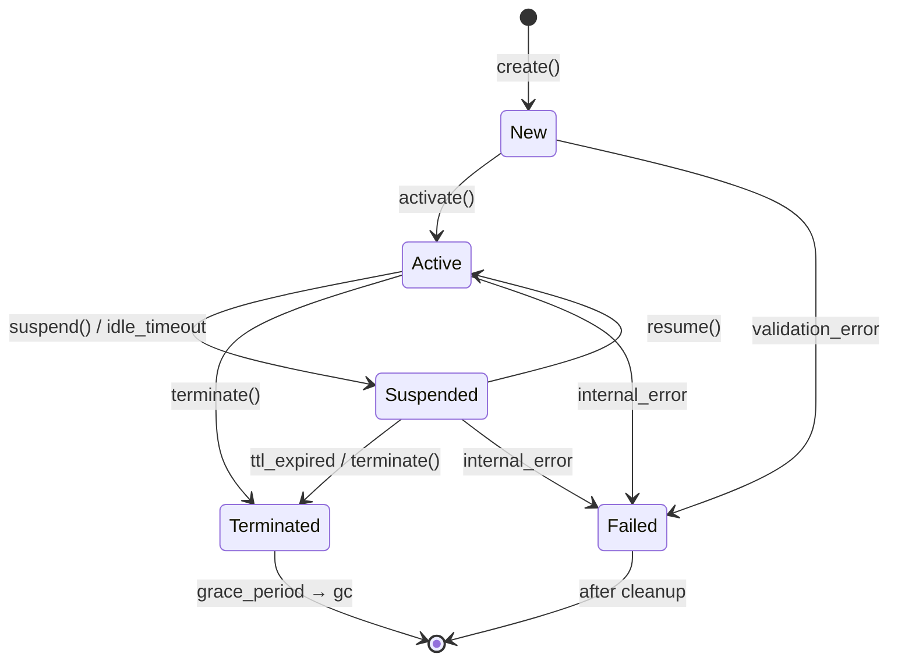

**重要な不変条件**：

- ActiveTxn は Active 状態のみで保持可能（Suspended では不可視、Terminated で強制 ROLLBACK）
- ActiveBuffer は Suspended でも保持（復元後に編集続行可能）
- Failed → Terminated 遷移後は同 session_id の再利用禁止（PostgreSQL 流の Monotonic ID）

### 6.6 Sequence Diagrams

#### 6.6.1 SQ-SM-001 CreateSession（正常系）

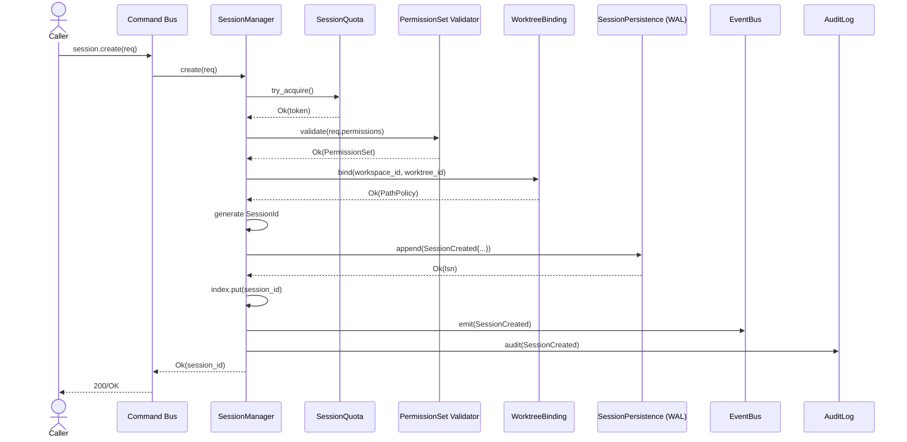

#### 6.6.2 SQ-SM-002 TerminateSession（Active Transaction 強制 Rollback 含む）

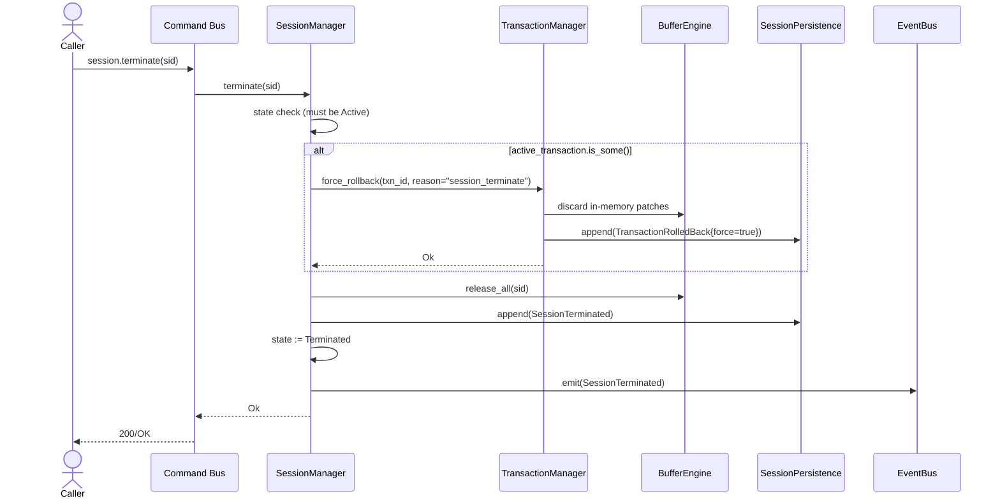

#### 6.6.3 SQ-SM-003 Permission Check（拒否系）

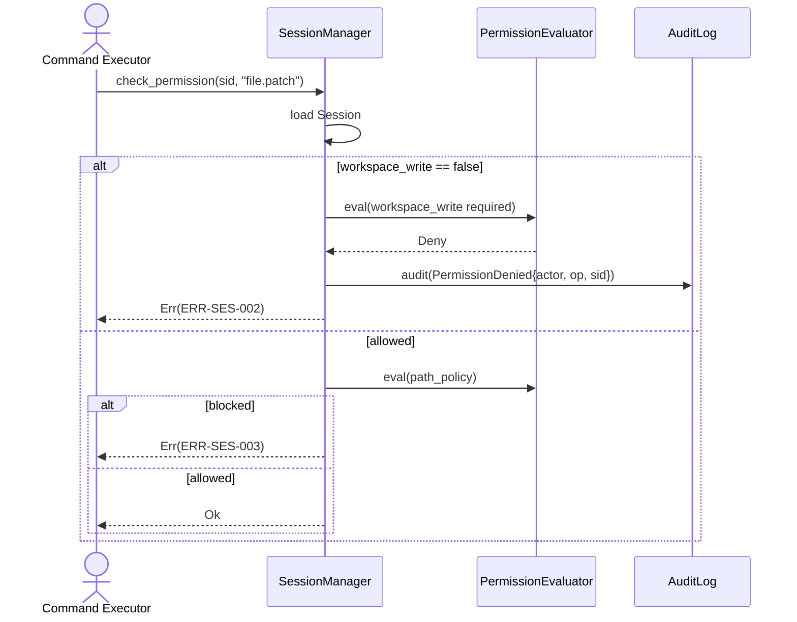

### 6.7 Session Quota / Capacity（MOD-SM-005）

| 項目 | 値 / 規則 |
|------|----------|
| 同時 Active Session 数上限 | 参考開発機 ≥ 10（NFR-C-020）、上限値【TBD：環境変数 KERNEL_SESSION_MAX】 |
| Session 既定 TTL | Human: 8h、Agent/LangGraph: 24h、Plugin: 接続期間中、CI: 1h（SD-001 §2.1） |
| Idle Timeout | 既定 30 分、Config で調整可（SD-001 §2.1） |
| Worktree Binding 数 | 1 Session = 1 Worktree（複数 Bind 禁止） |
| Active Buffer 数 / Session | 既定 64、Config で調整【TBD】 |
| Active Transaction 数 / Session | 厳格に 1（REQ-001 §9、AD-001 §2.5） |

超過時の挙動：Quarantine 待ち行列【TBD：採用するか否か】に切替、Timeout / Graceful Degrade のいずれかを環境設定で選択。

### 6.8 Session 永続化と Crash Recovery（MOD-SM-006）

**永続化対象**：

- Session 構造体（permissions / budgets / state / metadata / last_activity_at）
- Session ↔ ActiveBuffer の紐付け
- Session ↔ ActiveTransaction の紐付け

**書込方式**：

- WAL（Write-Ahead Log）に JSON Lines 形式で追記【TBD：フォーマット確定：JSON Lines vs bincode】
- Snapshot は 64 KiB 以上の WAL サイズ蓄積で非同期生成【TBD：閾値】
- 起動時は最新 Snapshot → 末尾までの WAL を Replay
- WAL ファイルモード：0600（SD-001 §1.1 THREAT-008）

**Recovery 手順**：

```
R-001: 最新 Snapshot 読込（存在しなければ空から開始）
R-002: WAL を Snapshot オフセットから末尾まで走査
R-003: SessionCreated エントリ → Session 再構築（state=Active）
R-004: SessionTerminated エントリ → Session を Terminated に遷移
R-005: ActiveTxn 紐付けを持つ Session が Terminated エントリなしで途切れている
       → Crash 中断トランザクションとして検出、TransactionManager に引継ぎ
R-006: 重複 SessionId → 一意性チェック、衝突時は新しい SessionId で再生成（InitPhase で出力）
R-007: RecoveryReport を Audit / Metrics に出力
```

### 6.9 監査・ログ（MOD-SM-007）

すべての Session 操作は `AuditLog` に構造化 JSON で書き出す（SD-001 §7.1）：

```json
{
  "timestamp": "2026-09-14T10:00:00Z",
  "audit_id": "uuid",
  "session_id": "sid-123",
  "actor": "langgraph",
  "operation": "session.create | session.terminate | session.suspend | session.permission_check | session.path_check",
  "target": "workspace_id or command_name or path",
  "result": "allowed|denied|ok|error",
  "details": { ... },
  "trace_id": "trace-uuid",
  "correlation_id": "corr-uuid"
}
```


### 6.10 Session 関連 Error 体系（ERR-SES-XXX）

| Error Code | 発生条件 | HTTP 相当 | Retry | ログ Level | Recovery |
|-----------|---------|----------|------|-----------|----------|
| ERR-SES-001 | Session 不在 | 404 | No | WARN | Session 再作成 |
| ERR-SES-002 | Permission 拒否 | 403 | No | WARN | 上位レイヤで再評価 |
| ERR-SES-003 | Path Not Allowed | 403 | No | WARN | PathPolicy 修正 |
| ERR-SES-004 | Path ReadOnly | 403 | No | WARN | Write 要求を諦める |
| ERR-SES-005 | ActiveTransactionExists | 409 | No | INFO | 既存 txn を Commit/Rollback |
| ERR-SES-006 | SessionExpired | 401 | No | INFO | 再作成 |
| ERR-SES-007 | SessionSuspended | 409 | No | INFO | resume() を呼ぶ |
| ERR-SES-008 | SessionTerminated | 410 | No | INFO | 新規 Session |
| ERR-SES-009 | SessionFailed | 500 | No | ERROR | 状態確認 / 再作成 |
| ERR-SES-010 | ResourceBudgetExceeded | 429 | Yes (with backoff) | WARN | 予算拡張 / 待機 |
| ERR-SES-011 | ContextBudgetExceeded | 429 | Yes (with backoff) | WARN | Context 圧縮 |
| ERR-SES-012 | IdleTimeout | 408 | Yes (resume) | INFO | resume() |
| ERR-SES-101 | WorkspaceNotFound | 404 | No | WARN | Workspace 確認 |
| ERR-SES-102 | QuotaExceeded | 429 | Yes | WARN | Session 終了を待つ |
| ERR-SES-103 | InvalidPermissionSet | 400 | No | WARN | リクエスト修正 |
| ERR-SES-104 | IdempotencyKeyConflict | 409 | No | WARN | 既存 Session を利用 |
| ERR-SES-105 | PersistenceError | 500 | Yes | ERROR | 再試行後に失敗なら縮退 |

---

## 7. Transaction Manager 詳細設計

### 7.1 モジュール一覧

| Module ID | 名称 | 責務 |
|-----------|------|------|
| MOD-TM-001 | TransactionManager | Transaction ライフサイクル管理 / Commit / Rollback |
| MOD-TM-002 | FilePatch / FileChange | Patch データ構造と Patch 操作抽象 |
| MOD-TM-003 | Journal（WAL） | Transaction イベントの追記専用ログ |
| MOD-TM-004 | Savepoint | Transaction 内の名前付きマーカー |
| MOD-TM-005 | ConflictDetector | Optimistic Concurrency（version / hash）検証 |
| MOD-TM-006 | Saga / Compensation | 跨 Session / 跨 Plugin の補償 |
| MOD-TM-007 | Outbox | Commit 後の後続処理（Event 発行 / 通知）の信頼送出 |
| MOD-TM-008 | Recovery（Replay） | Crash 後の Journal Replay |
| MOD-TM-009 | TransactionAudit | 監査ログと連動 |

### 7.2 Module 詳細表（MOD-TM-001）

| 項目 | 内容 |
|------|------|
| Module ID | MOD-TM-001 |
| 名称 | TransactionManager |
| 対応 BD | AD-001 §2.6 Transaction Manager 設計 |
| 対応 REQ | FR-001-05, FR-006-01/02/03/04, FR-022 |
| 対応 NFR | NFR-R-020, NFR-R-021, NFR-R-040, NFR-R-041, NFR-R-042, NFR-D-001, NFR-D-002, NFR-P-060, NFR-P-061 |
| 対応 IF | IF-TXN-001（Begin）, IF-TXN-002（Commit）, IF-TXN-003（Rollback） |
| 入力 | BeginTransactionRequest, ApplyPatchRequest, CommitRequest, RollbackRequest |
| 出力 | TransactionId / CommitResult / RollbackResult |
| 依存 | SessionManager（権限 / Active 制約）, BufferEngine（Patch 適用）, Journal, ConflictDetector, EventBus |
| 状態 | NEW → ACTIVE → VALIDATING → COMMITTED / ROLLING_BACK → ROLLED_BACK / FAILED |
| Transaction | Transaction 自体が Workspace への ACID 単位。内部で再入しない |
| Error | ERR-TXN-001 〜 ERR-TXN-099 |
| 並行性 | 1 Session = 1 ActiveTxn。複数 Session 間では Buffer 単位で version / hash 競合検出 |
| Logging | TransactionBegan, PatchApplied, TransactionCommitting, TransactionCommitted, TransactionRolledBack, TransactionFailed |


### 7.3 Class 設計

#### 7.3.1 CLS-TM-001: TransactionManager

```rust
// kernel-transaction/src/manager.rs
pub struct TransactionManager {
    transactions: Arc<DashMap<TransactionId, Transaction>>,
    /// Session 単位の Active Transaction（重複防止）
    active_by_session: Arc<DashMap<SessionId, TransactionId>>,
    journal: Arc<Journal>,
    conflict: Arc<ConflictDetector>,
    buffer_engine: Arc<BufferEngine>,
    session_manager: Arc<SessionManager>,
    outbox: Arc<Outbox>,
    event_bus: Arc<EventBus>,
    audit: Arc<AuditLog>,
    clock: Arc<dyn Clock>,
    seq: AtomicU64,
}
```

**主要 Public Method**

| Method ID | シグネチャ | 概要 |
|-----------|-----------|------|
| TM-M-001 | `async fn begin(&self, sid: &SessionId, desc: &str) -> Result<TransactionId>` | Transaction 開始（IF-TXN-001） |
| TM-M-002 | `async fn apply_patch(&self, tid: &TransactionId, patch: FilePatch) -> Result<PatchResult>` | Patch 適用 |
| TM-M-003 | `async fn savepoint(&self, tid: &TransactionId, name: &str) -> Result<SavepointId>` | Savepoint 作成 |
| TM-M-004 | `async fn rollback_to_savepoint(&self, tid: &TransactionId, sid: SavepointId) -> Result<()>` | Savepoint まで巻き戻し |
| TM-M-005 | `async fn validate(&self, tid: &TransactionId) -> Result<ValidationReport>` | Commit 前検証 |
| TM-M-006 | `async fn commit(&self, tid: &TransactionId) -> Result<CommitResult>` | Commit（IF-TXN-002） |
| TM-M-007 | `async fn rollback(&self, tid: &TransactionId, reason: &str) -> Result<RollbackResult>` | Rollback（IF-TXN-003） |
| TM-M-008 | `async fn force_rollback(&self, tid: &TransactionId, reason: &str) -> Result<()>` | Session 終了時の強制 ROLLBACK |
| TM-M-009 | `async fn get(&self, tid: &TransactionId) -> Result<TransactionInfo>` | 状態取得 |
| TM-M-010 | `async fn list_by_session(&self, sid: &SessionId) -> Result<Vec<TransactionInfo>>` | Session 配下列挙 |
| TM-M-011 | `async fn recover(&self) -> Result<RecoveryReport>` | Crash 後 Recovery |

#### 7.3.2 CLS-TM-002: Transaction

```rust
// kernel-transaction/src/transaction.rs
pub struct Transaction {
    pub transaction_id: TransactionId,
    pub session_id: SessionId,
    pub description: String,
    pub status: TransactionStatus,
    pub changes: Vec<FileChange>,
    pub savepoints: BTreeMap<SavepointId, Savepoint>,
    pub created_at: Instant,
    pub updated_at: Instant,
    pub begin_lsn: Lsn,
    pub commit_lsn: Option<Lsn>,
    pub rollback_lsn: Option<Lsn>,
    pub metadata: TransactionMetadata,
}

pub enum TransactionStatus {
    New,
    Active,
    Validating,
    Committing,
    Committed,
    RollingBack,
    RolledBack,
    Failed { reason: String, at: Instant },
}

pub struct FileChange {
    pub change_id: ChangeId,
    pub path: PathBuf,
    pub operation: FileOperation,
    pub before_hash: ContentHash,
    pub after_hash: Option<ContentHash>,
    pub before_version: DocumentVersion,
    pub after_version: Option<DocumentVersion>,
    pub applied_at: Instant,
}

pub enum FileOperation {
    Patch(FilePatch),
    Create { content_hash: ContentHash },
    Delete,
    Rename { from: PathBuf, to: PathBuf },
}
```


#### 7.3.3 CLS-TM-003: FilePatch

REQ-001 §18 で定義された Patch 構造を Transaction 側で扱う：

```rust
// kernel-transaction/src/patch.rs
pub struct FilePatch {
    pub document: DocumentId,
    pub path: PathBuf,
    pub range: Option<TextRange>,    // None = 全体書き換え禁止（REQ §18 Patch First 原則）
    pub before_hash: ContentHash,    // Buffer Engine から取得
    pub expected_version: DocumentVersion,
    pub change: PatchChange,
    pub after_hash: Option<ContentHash>, // 適用後に Buffer Engine から再計算
}

pub enum PatchChange {
    Insert { offset: ByteOffset, text: String },
    Delete { range: TextRange },
    Replace { range: TextRange, text: String },
    /// JSON Patch (RFC 6902) 互換の構造化 Patch【TBD：JSON Patch 採用可否】
    JsonPatch(Vec<JsonPatchOp>),
}
```

#### 7.3.4 CLS-TM-004: Journal（WAL）

```rust
// kernel-transaction/src/journal.rs
pub struct Journal {
    file: Arc<Mutex<File>>,         // 0600 で open
    current_lsn: AtomicU64,
    rotation: JournalRotation,
    fsync_policy: FsyncPolicy,
}

pub enum JournalEntry {
    TransactionBegin { txn_id: TransactionId, session_id: SessionId, lsn: Lsn, ts: Timestamp, desc: String },
    PatchApplied { txn_id: TransactionId, change: FileChangeRef, lsn: Lsn, ts: Timestamp },
    Savepoint { txn_id: TransactionId, savepoint_id: SavepointId, lsn: Lsn, ts: Timestamp },
    TransactionValidating { txn_id: TransactionId, lsn: Lsn, ts: Timestamp },
    TransactionCommitting { txn_id: TransactionId, lsn: Lsn, ts: Timestamp },
    TransactionCommitted { txn_id: TransactionId, lsn: Lsn, ts: Timestamp, change_count: u32 },
    TransactionRollingBack { txn_id: TransactionId, lsn: Lsn, ts: Timestamp, reason: String },
    TransactionRolledBack { txn_id: TransactionId, lsn: Lsn, ts: Timestamp },
    TransactionFailed { txn_id: TransactionId, lsn: Lsn, ts: Timestamp, reason: String },
    SnapshotPointer { snapshot_id: SnapshotId, lsn: Lsn, ts: Timestamp },
}

pub enum FsyncPolicy {
    Always,                    // 各エントリ書込で fsync（安全性最大、性能低）
    Batch { interval_ms: u64 }, // バッチ fsync（NFR-D-002 RPO=0 と矛盾しない範囲で性能改善）【TBD：間隔】
}

pub struct JournalRotation {
    pub max_file_bytes: u64,       // 既定 64 MiB【TBD】
    pub max_files: u32,            // 既定 8【TBD】
    pub compression: bool,
}
```

### 7.4 Transaction Status 状態遷移

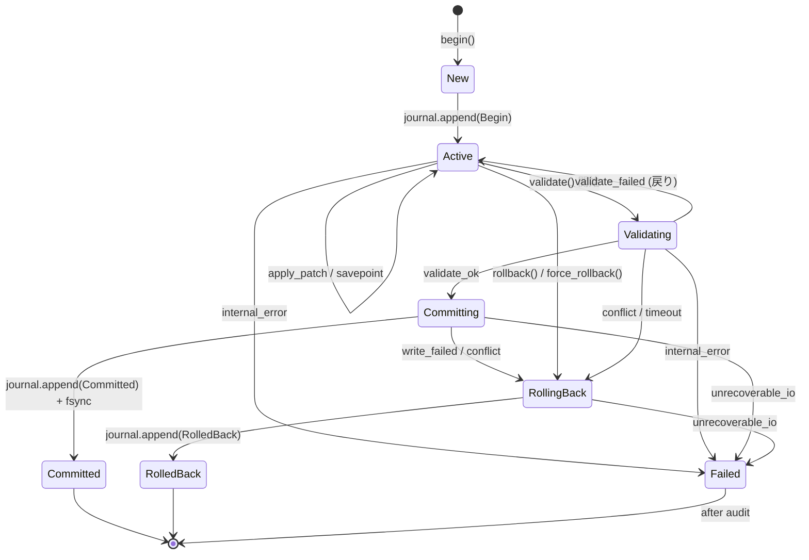

**重要な不変条件**：

- Committed 後は変更不可能（FileChange は Freeze）
- RollingBack 中の追加 Patch は拒否（ERR-TXN-008）
- Committing 中の Crash → 再起動時 Recovery で検出 → Commit / Rollback を決定論的に完了させる
- Failed は監査目的のみで保持、in-memory から即時削除

### 7.5 核心メソッド詳細

#### 7.5.1 TM-M-001 BeginTransaction

| 項目 | 内容 |
|------|------|
| 対応 IF | IF-TXN-001 |
| Precondition | Session.state == Active、ActiveTxn 未設定 |
| Postcondition | Transaction.status == Active、Journal に Begin エントリ書込 |
| Side Effect | Session.active_transaction = Some(txn_id)、Event: TransactionStarted |

```
P-001: Session 取得（state=Active 必須）
P-002: ActiveTxn チェック（Some → ERR-TXN-001）
P-003: 権限評価（workspace_write または filesystem_write 必須）
P-004: TransactionId 生成
P-005: Transaction 構造体生成（status=Active, begin_lsn 予約）
P-006: Journal に Begin エントリ書込（fsync_policy に従う）
P-007: In-memory index 登録
P-008: Session.active_transaction 設定
P-009: TransactionStarted Event 発行
P-010: Audit 出力
```


#### 7.5.2 TM-M-002 ApplyPatch

| 項目 | 内容 |
|------|------|
| Precondition | Transaction.status ∈ {Active}、PathPolicy 評価 OK |
| Postcondition | Buffer Engine へ Patch 適用、FileChange 記録、Journal 追記 |
| Side Effect | Buffer の version 増加、Undo Stack 更新 |

```
P-001: Transaction 取得（status != Active → ERR-TXN-008 InvalidState）
P-002: Session 権限チェック（filesystem_write / workspace.write）
P-003: Path Policy 評価（ERR-SES-003 / ERR-SES-004）
P-004: Buffer 取得（BufferEngine.get(path) → なければ open）
P-005: 事前検証（before_hash / expected_version 照合、MOD-TM-005 ConflictDetector）
       - 不一致 → ERR-TXN-002 VersionConflict / ERR-TXN-003 HashMismatch
P-006: Savepoint 自動マーカー（patch_apply_undo_point として記録）【TBD：常時 vs 明示】
P-007: BufferEngine.apply_patch(buffer, &patch)
       - 失敗（encoding error 等）→ ERR-TXN-006 PatchApplyError
P-008: after_hash 取得、DocumentVersion インクリメント
P-009: FileChange を Transaction.changes に追加
P-010: Journal に PatchApplied エントリ書込
P-011: Audit 出力（actor, sid, tid, path, change_size, version_diff）
P-012: PatchApplied Event 発行
```

**Conflict 時の選択肢**：

| 戦略 | 動作 | 採用条件 |
|------|------|---------|
| Strict | ERR-TXN-002 / 003 で即時拒否 | 既定（要件定義 REQ §19 厳格一致） |
| AutoMerge | 3-way merge（git apply --3way 相当）を試行 | 【TBD：採用可否、Plugin 提供】 |
| PatchAndReport | Patch 適用後、衝突箇所を diagnostics で報告 | 並行編集時の選択肢 |

#### 7.5.3 TM-M-006 Commit

| 項目 | 内容 |
|------|------|
| 対応 IF | IF-TXN-002 |
| Precondition | Transaction.status ∈ {Active, Validating} |
| Postcondition | Workspace が Begin 時点から After 状態へ不可逆遷移、Journal に Committed 書込 |

```
P-001: 状態チェック（status ∉ {Active, Validating} → ERR-TXN-008）
P-002: status := Validating（WAL 書込必須）
P-003: すべての FileChange について再検証（race condition 対策）
       - Buffer の version / hash が current FileChange の expected と一致するか
       - 不一致 → RollingBack へ遷移
P-004: Savepoint / 退避の妥当性確認
P-005: status := Committing（WAL 書込必須）
P-006: 物理書込フェーズ
       a. Workspace に Commit 前の Snapshot を退避（Journal 経由）【TBD：別ファイル退避方式】
       b. すべての Patch を Buffer → ディスク へ Flush（atomic write: write-temp + fsync + rename）
       c. 物理書込の順序は変更順を保つ（依存 Patch の前後関係維持）
P-007: 物理書込中に IO エラー → RollingBack 遷移（既に書き込まれた変更を Snapshot から復元）
P-008: status := Committed（WAL 書込 + fsync）
P-009: Session.active_transaction = None
P-010: TransactionCommitted Event 発行（payload に change 概要含む）
P-011: Outbox（MOD-TM-007）に Durable Event を登録
P-012: Audit 出力
P-013: in-memory index から transaction 削除（Committed は監査ログに残る）
```

**Crash Recovery との接続**：

- Committing フェーズで Crash → 再起動時 Recovery が Committing 状態を発見
  - 全 Patch が物理書込済みかつ fsync 済み → Committed で完了
  - 一部未書込 → 退避 Snapshot から復元 → RolledBack で完了
- 上記判定は Journal と Workspace ファイル存在の Intersection で決定論的に行う

#### 7.5.4 TM-M-007 Rollback

| 項目 | 内容 |
|------|------|
| 対応 IF | IF-TXN-003 |
| Precondition | Transaction.status ∈ {Active, Validating, Committing, Failed} |
| Postcondition | Workspace が Begin 直前状態へ復帰、Journal に RolledBack 書込 |

```
P-001: 状態チェック
P-002: status := RollingBack（WAL 書込）
P-003: BufferEngine に対して in-memory Patch を Undo（Undo Stack 逆順）
P-004: 物理書込済みの変更（Committing フェーズ中の Crash 復帰）を Snapshot 復元
P-005: status := RolledBack（WAL 書込 + fsync）
P-006: Session.active_transaction = None
P-007: TransactionRolledBack Event 発行
P-008: Audit 出力（reason 必須）
P-009: in-memory 削除
```

#### 7.5.5 TM-M-003 Savepoint / TM-M-004 RollbackToSavepoint

Savepoint は Transaction 内の「途中マーカー」。Savepoint 以前の Patch を Undo Stack から Pop して復元する：

```
Savepoint作成:
  P-001: status == Active
  P-002: 現在の Undo Stack のスナップショットを Savepoint に保存
  P-003: SavepointId 採番
  P-004: Journal に Savepoint エントリ

RollbackToSavepoint:
  P-001: status == Active
  P-002: 指定 Savepoint 以降の Patch を Undo（逆順）
  P-003: 以降の FileChange を changes から除去
  P-004: Savepoint 自体は残す
  P-005: Journal に SavepointRollback エントリ【TBD：Journal エントリ追加要否】
```


### 7.6 Optimistic Concurrency（MOD-TM-005）

REQ-001 §19 / AD-001 §2.6 で定義された Optimistic Concurrency を ConflictDetector に集約：

```rust
// kernel-transaction/src/conflict.rs
pub struct ConflictDetector {
    buffer_engine: Arc<BufferEngine>,
}

pub enum Conflict {
    VersionConflict { expected: DocumentVersion, current: DocumentVersion, path: PathBuf },
    HashMismatch { expected: ContentHash, current: ContentHash, path: PathBuf },
    FileMissing { path: PathBuf },
    ReadOnlyPath { path: PathBuf },
    PathBlocked { path: PathBuf },
}

impl ConflictDetector {
    pub async fn check_pre_apply(&self, sid: &SessionId, txn_id: &TransactionId, patch: &FilePatch) -> Result<()> {
        let buffer = self.buffer_engine.get_or_open(sid, &patch.path).await?;
        let current_hash = buffer.content_hash();
        let current_version = buffer.version();
        if current_hash != patch.before_hash {
            return Err(ERR-TXN-003 HashMismatch);
        }
        if current_version != patch.expected_version {
            return Err(ERR-TXN-002 VersionConflict);
        }
        // Path Policy
        let session = self.session_manager.get(sid).await?;
        session.path_policy.check(&patch.path, FileOperation::Write)?;
        Ok(())
    }
}
```

**Version / Hash 同等性ポリシー**：

- 同一 Patch 内の `before_hash` と Buffer Engine の `content_hash` が完全一致 → OK
- `expected_version` と Buffer の `version` が一致 → OK
- 両方が一致しても Path Policy で拒否される可能性あり（順序：Path → Hash → Version）
- 二者択一ではなく両方必須（REQ-001 §19、AD-001 §2.6）

### 7.7 Saga / Compensation（MOD-TM-006）

跨 Session / 跨 Plugin の分散シナリオ（例：Coder Agent の Patch → Test → Git push → CI Trigger）は Local Transaction だけでは完結しない。Saga パターンで補償を定義：

**S-A 候補比較**

| 候補 | 特性 | 採用判断 |
|------|------|---------|
| Saga（Choreography） | 各 Step が Event で次を起動。中央 Orchestrator なし。失敗時は補償 Event | Phase 2（P1）Plugin 間で本格採用予定。本詳細設計では枠組みのみ |
| Saga（Orchestration） | 中央 Orchestrator が各 Step を Command 実行。失敗補償を命令 | P0 では TransactionManager 自体の Saga Manager として最小限実装 |
| Outbox + Eventual Consistency | Commit 後に Outbox 経由で非同期実行 | **P0 推奨**：Command 完了 → Outbox に Durable Event → Event Bus 経由 Plugin 通知 |

**P0 採用方針**：

1. **Outbox パターン（MOD-TM-007）を第一選択**。Commit 直後に Outbox Table に Event を登録し、別 Worker が Outbox を Read → Event Bus に発行。At-Least-Once 配信 + Consumer 側 Idempotency で Exactly-Once Effect。
2. **Saga（Orchestration）最小実装**：1 Transaction 内で複数 Plugin にまたがる Command は呼び出さず、Plugin 側 Event を Trigger として Plugin 内で完結させる。
3. **補償は Plugin 側責務**（Kernel は補償 Command 実行 API を提供するのみ：`txn.compensate { reason, target_change_id }`）。

```rust
// kernel-transaction/src/outbox.rs
pub struct Outbox {
    storage: Arc<dyn OutboxStorage>,    // 既定は Journal 末尾と同じ FS の Outbox File
    pending: Arc<DashMap<OutboxId, OutboxEntry>>,
    delivery_state: Arc<DashMap<OutboxId, DeliveryState>>,
}

pub struct OutboxEntry {
    pub id: OutboxId,
    pub txn_id: TransactionId,
    pub event: DurableEvent,            // 構造化
    pub created_at: Instant,
    pub attempts: u32,
    pub next_retry_at: Option<Instant>,
    pub last_error: Option<String>,
}

pub enum DeliveryState {
    Pending,
    InFlight { sent_at: Instant },
    Delivered { acked_at: Instant },
    FailedPermanent { reason: String },
}
```

### 7.8 Recovery（MOD-TM-008）

```
R-001: 起動時 TransactionManager.init() 内で recovery() を呼び出し
R-002: Journal 末尾まで Read、Transaction 単位でグループ化
R-003: 各 Transaction の最終状態判定：
       - TransactionCommitted あり → 完全 Commit 完了（追加処理なし）
       - TransactionRolledBack あり → Rollback 完了
       - TransactionCommitting あり、Committed/RolledBack なし → 未確定
         → Workspace Snapshot と Patch 適用状態から Commit 継続 / Rollback を決定
       - TransactionBegan のみ → ActiveTxn 孤立
         → Session 状態を Active と仮定し、Rollback 実施（Session 復元時に再 Begin 可能）
       - 上記以外 Failed → Failed として確定、Audit
R-004: 全 Transaction を RolledBack / Committed に収束させた時点で Kernel 起動完了
R-005: RecoveryReport（件数、所要時間、検出された異常）を Audit / Metrics に出力
R-006: NFR-D-001（RTO ≤ 10 秒）のため Recovery 並列化【TBD：並列度】
```

**決定論的判定ルール**：

- Workspace に Patch の After 状態が反映されているか（ファイル存在 + 内容 hash 一致）を Snapshot 経由で判定
- 全 Patch が反映済 → Committing 完了扱い → Committed 確定
- 一部反映 / 反映なし → RolledBack 確定（Snapshot から復元）
- 判定不能（IO 不可） → Kernel 起動を停止し Manual Recovery を要求（ERR-TXN-101 Unrecoverable）


### 7.9 Transaction Sequence Diagrams

#### 7.9.1 SQ-TXN-001 Commit 正常系

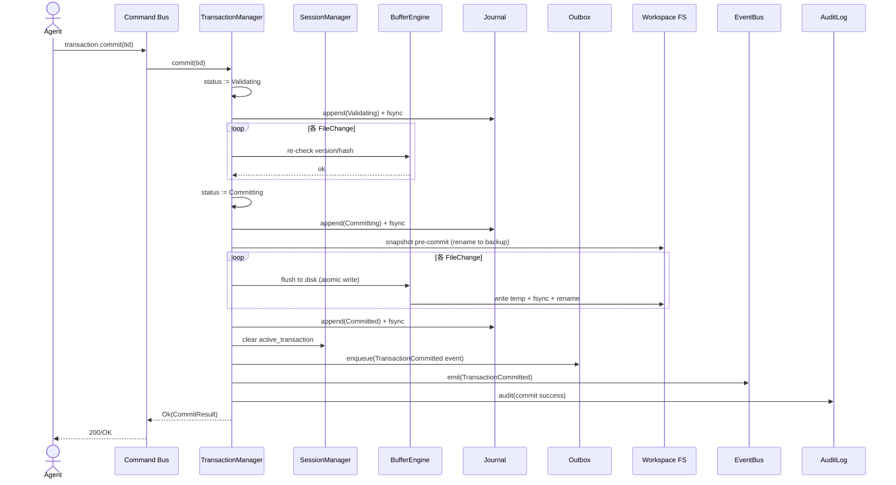

#### 7.9.2 SQ-TXN-002 中途失敗 Rollback（Test 失敗後）

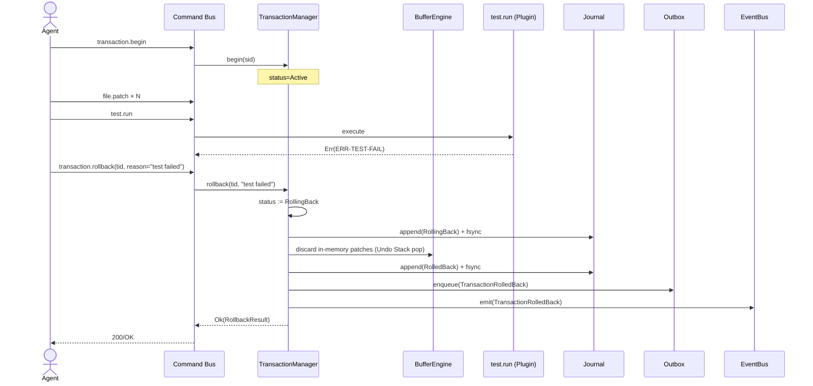

#### 7.9.3 SQ-TXN-003 Crash Recovery（Committing 中断）

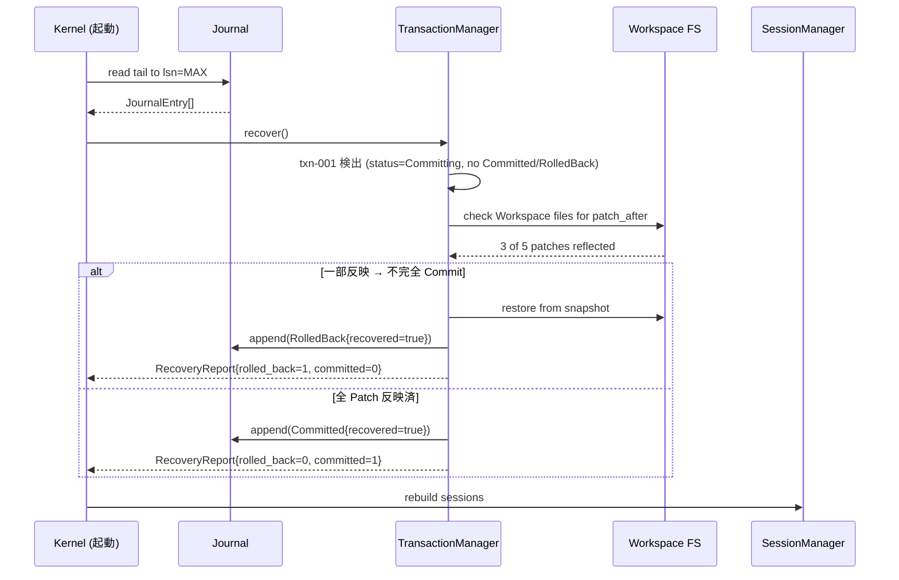

### 7.10 Transaction Error 体系（ERR-TXN-XXX）

| Error Code | 発生条件 | HTTP 相当 | Retry | ログ Level | Recovery |
|-----------|---------|----------|------|-----------|----------|
| ERR-TXN-001 | ActiveTransactionExists | 409 | No | INFO | 既存 Commit/Rollback |
| ERR-TXN-002 | VersionConflict | 409 | Yes (after re-read) | WARN | Patch 再生成 |
| ERR-TXN-003 | HashMismatch | 409 | Yes (after re-read) | WARN | Patch 再生成 |
| ERR-TXN-004 | PathBlocked / ReadOnly | 403 | No | WARN | 別 Path 利用 |
| ERR-TXN-005 | SessionInactive | 409 | No | INFO | resume / 再作成 |
| ERR-TXN-006 | PatchApplyError | 422 | No | ERROR | Patch 修正 |
| ERR-TXN-007 | SavepointNotFound | 404 | No | WARN | 別 Savepoint 利用 |
| ERR-TXN-008 | InvalidTransactionState | 409 | No | WARN | 状態遷移待ち |
| ERR-TXN-009 | ValidationFailed | 422 | No | WARN | 検証エラー解消 |
| ERR-TXN-010 | CommitIOError | 500 | Yes | ERROR | Retry 後 Manual |
| ERR-TXN-011 | JournalAppendError | 500 | No | FATAL | 縮退モード |
| ERR-TXN-012 | RollbackError | 500 | No | ERROR | Manual Recovery |
| ERR-TXN-101 | UnrecoverableOnStartup | 500 | No | FATAL | Manual Recovery |


---

## 8. Buffer Engine 詳細設計

### 8.1 モジュール一覧

| Module ID | 名称 | 責務 |
|-----------|------|------|
| MOD-BE-001 | BufferEngine | Buffer の open/read/patch/save/close の統一入口 |
| MOD-BE-002 | PieceTable | Buffer 内部データ構造（Original + Add Piece 列） |
| MOD-BE-003 | ChunkedStore | 大容量ファイルの Chunk 分割保持 |
| MOD-BE-004 | MmapStorage | Memory Mapping 抽象化 |
| MOD-BE-005 | Codec | UTF-8/16-LE/16-BE/Shift-JIS/EUC-JP/GBK/BOM |
| MOD-BE-006 | LineEnding | LF/CRLF/CR 検出・保持 |
| MOD-BE-007 | UndoStack / RedoStack | Undo/Redo 履歴 |
| MOD-BE-008 | BufferSavepoint | Buffer レベル Savepoint（任意マーカー） |
| MOD-BE-009 | Persistence | Save（atomic write）/ Reload / Snapshot |
| MOD-BE-010 | PatchApply | Patch 適用と Conflict 検出 |
| MOD-BE-011 | MemoryBudget | Buffer 毎メモリ上限（large file 対応） |

### 8.2 データ構造候補比較（Buffer 内部）

REQ-001 §14 / AD-001 §2.7 を実装するにあたり、Buffer 内部データ構造に複数の候補がある。**AI 勝手に決め打ち禁止（指示書 §禁止事項）** ため、候補を列挙し推奨理由を明示する。

#### 8.2.1 候補比較表

| 候補 | 任意位置 Insert / Delete | メモリ効率（大量 Insert 時） | Undo / Redo 親和性 | 大容量ファイル | 実装複雑度 | 採用判断 |
|------|---------------------|--------------------------|------------------|--------------|-----------|---------|
| 単純 String（`String`） | O(n) shift | 悪い（毎回コピー） | 全体 Snapshot 必要 | 不可 | 低 | × 性能問題 |
| Rope（平衡二分木） | O(log n) | 良い | 各ノード Snapshot 可能 | Chunk 化と組合せで可 | 中（Arc 多く、Clone コスト） | △ |
| Gap Buffer | O(1) カーソル近傍 / O(n) 遠方 | 中（カーソル移動で gap 移動） | Cursor 単位 Snapshot | 不適（テキスト編集 UI 専用） | 低 | × Editor UI 専用、Server/Agent 用途に合わない |
| Piece Table | O(log n) | 非常に良い（Piece 参照のみ） | 各 Version で Piece 列 Snapshot 可能 | Chunked 拡張で 1GB+ 可能 | 中 | **○ 推奨** |
| CRDT（Yjs / Automerge 系） | O(log n) | 良い（Tree 構造） | そのまま履歴可能 | 同期前提、ファイル単独編集には過剰 | 高（外部依存） | × 単一 Buffer には過剰 |
| OT（Operational Transform） | O(n) 操作変換 | 良い | 操作列保持 | マルチ Client 協調前提 | 高 | × マルチ Client 専用 |
| io-vector / io-string ベース Chunked | O(chunk 数) | 良い（Chunk 化） | Chunk 単位 Snapshot | ◎ 1GB+ 対応 | 中 | ○ 大容量時は Chunked 拡張 |
| memmap2（mmap） | O(1) Read（offset + len） | OS 任せ | 直接編集不可、Patch 時に Copy-on-Write | ◎ 1GB+ 対応 | 低（read-only 直接編集は不可） | ○ 大容量時は mmap + Piece Table 組合せ |

#### 8.2.2 推奨方式

**Piece Table（基本） + ChunkedStorage / MmapStorage（容量階層）**

- 既定（≤ 100 MiB）：Piece Table を in-memory で保持
- 中規模（100 MiB 〜 1 GiB）：Chunked Piece Table（Piece を 64 KiB Chunk に分割保持、Lazy Load）
- 大容量（> 1 GiB）：MmapStorage で Read は直接 mmap、Edit 時に Copy-on-Write で Chunked Piece Table に格上げ

**採用理由**：

1. REQ-001 §14「Patch ベース修正」/ §18「Patch First」と親和性が高い（Piece Table は変更を「Add Piece 列追加」のみで表現）
2. Undo/Redo は Piece 列の Snapshot 差分で実装可能（Stack に Piece リスト参照を積むだけ）
3. 大量 Patch 適用でメモリ爆発しない（Insert テキストのみ追加、Original は不変）
4. 1GB+ 対応（NFR-C-001）は Chunked + mmap で実現可能
5. Rust エコシステムで pure-Rust 実装可能（外部ランタイム依存なし、SD-001 THREAT-007 Plugin 隔離方針と整合）

**未確定項目**：

- 100 MiB 閾値【TBD：実機 Benchmark で決定】
- Chunk サイズ【TBD：64 KiB / 256 KiB のいずれが I/O 効率良いか実測】
- mmap 利用 OS【TBD：Linux / macOS は確実、Windows は実機検証】

### 8.3 Module 詳細表（MOD-BE-001）

| 項目 | 内容 |
|------|------|
| Module ID | MOD-BE-001 |
| 名称 | BufferEngine |
| 対応 BD | AD-001 §2.7 Buffer Engine 設計 |
| 対応 REQ | FR-002-01〜06, FR-006-02, FR-018 |
| 対応 NFR | NFR-C-001, NFR-C-002, NFR-P-040, NFR-P-041, NFR-P-042, NFR-S-010, NFR-S-011, NFR-R-042 |
| 対応 IF | IF-INTERNAL-BUFFER-001 |
| 入力 | OpenRequest / ReadRequest / PatchRequest / UndoRequest / RedoRequest / SaveRequest |
| 出力 | DocumentId / BufferContent / PatchResult / SaveResult |
| 依存 | PieceTable, ChunkedStore, MmapStorage, Codec, LineEnding, UndoStack, Persistence |
| 状態 | per-Buffer: Loaded → Dirty → Saving → Saved、Closed（解放） |
| Transaction | Buffer 自体は Transaction 非依存。Transaction は Buffer の Patch を acquire して記録 |
| Error | ERR-BE-001 〜 ERR-BE-099 |
| 並行性 | per-DocumentId RwLock、Session 間では同時 Patch 時に ConflictDetector 経由の Version 競合 |
| Logging | BufferOpened, BufferRead, BufferPatched, BufferUndo, BufferRedo, BufferSaved, BufferClosed, BufferEncodingDetected, BufferSavepointCreated |


### 8.4 Class 設計

#### 8.4.1 CLS-BE-001: BufferEngine

```rust
// kernel-buffer/src/engine.rs
pub struct BufferEngine {
    buffers: Arc<DashMap<DocumentId, Arc<RwLock<Buffer>>>>,
    by_path: Arc<DashMap<PathBuf, DocumentId>>,   // path → doc_id
    by_session: Arc<DashMap<SessionId, BTreeSet<DocumentId>>>,
    codec: Arc<CodecRegistry>,
    line_ending: Arc<LineEndingDetector>,
    persistence: Arc<BufferPersistence>,
    memory_budget: Arc<MemoryBudget>,
    config: Arc<BufferConfig>,
}

pub struct BufferConfig {
    pub large_file_threshold_bytes: u64,   // 既定 100 MiB【TBD】
    pub chunk_size_bytes: usize,           // 既定 64 KiB【TBD】
    pub max_undo_depth: usize,             // 既定 1000【TBD】
    pub memory_budget_per_buffer_bytes: u64, // 既定 200 MiB【TBD】
    pub enable_mmap: bool,                 // 既定 true（Large 時のみ自動利用）
    pub save_atomic_rename: bool,          // 既定 true
}
```

**主要 Public Method**

| Method ID | シグネチャ | 概要 |
|-----------|-----------|------|
| BE-M-001 | `async fn open(&self, sid: &SessionId, path: &Path, opts: OpenOptions) -> Result<DocumentId>` | Buffer を Open（既存あれば再利用） |
| BE-M-002 | `async fn read(&self, sid: &SessionId, doc: DocumentId, range: Option<TextRange>) -> Result<String>` | 部分 Read |
| BE-M-003 | `async fn patch(&self, sid: &SessionId, doc: DocumentId, patch: FilePatch) -> Result<PatchResult>` | Patch 適用（IF-INTERNAL-BUFFER-001 buffer.patch） |
| BE-M-004 | `async fn undo(&self, sid: &SessionId, doc: DocumentId) -> Result<()>` | Undo（IF-INTERNAL-BUFFER-001 buffer.undo） |
| BE-M-005 | `async fn redo(&self, sid: &SessionId, doc: DocumentId) -> Result<()>` | Redo |
| BE-M-006 | `async fn save(&self, sid: &SessionId, doc: DocumentId) -> Result<SaveResult>` | Save（IF-INTERNAL-BUFFER-001 buffer.save） |
| BE-M-007 | `async fn reload(&self, sid: &SessionId, doc: DocumentId) -> Result<()>` | ディスクから再読込 |
| BE-M-008 | `async fn close(&self, sid: &SessionId, doc: DocumentId) -> Result<()>` | Close |
| BE-M-009 | `async fn savepoint(&self, sid: &SessionId, doc: DocumentId, name: &str) -> Result<SavepointId>` | Savepoint |
| BE-M-010 | `async fn rollback_to_savepoint(&self, sid: &SessionId, doc: DocumentId, sp: SavepointId) -> Result<()>` | Savepoint まで復元 |
| BE-M-011 | `async fn content_hash(&self, doc: DocumentId) -> Result<ContentHash>` | 現在の Content Hash |
| BE-M-012 | `async fn version(&self, doc: DocumentId) -> Result<DocumentVersion>` | Version |
| BE-M-013 | `async fn encoding_info(&self, doc: DocumentId) -> Result<EncodingInfo>` | 検出された Encoding / BOM / LineEnding |
| BE-M-014 | `async fn stats(&self, doc: DocumentId) -> Result<BufferStats>` | 統計（行数 / バイト数 / Piece 数） |

#### 8.4.2 CLS-BE-002: Buffer

```rust
// kernel-buffer/src/buffer.rs
pub struct Buffer {
    pub document_id: DocumentId,
    pub file_path: PathBuf,
    pub encoding: Encoding,
    pub line_ending: LineEnding,
    pub has_bom: bool,
    pub state: BufferState,
    pub piece_table: PieceTable,           // テキスト本体
    pub version: DocumentVersion,
    pub undo_stack: UndoStack,
    pub redo_stack: RedoStack,
    pub savepoints: BTreeMap<SavepointId, BufferSavepoint>,
    pub created_at: Instant,
    pub updated_at: Instant,
    pub last_saved_at: Option<Instant>,
    pub storage: BufferStorage,            // バックエンド種別
    pub memory_estimate: AtomicU64,        // 概算
}

pub enum BufferState {
    Loaded,    // 開いた
    Dirty,     // 未保存の変更あり
    Saving,    // 保存中
    Saved,     // Dirty=false 直後
    Closed,    // 解放
}

pub enum BufferStorage {
    InMemory,
    Chunked { chunk_count: u32, total_bytes: u64 },
    Mmap { mapped_bytes: u64 },
}
```

#### 8.4.3 CLS-BE-003: PieceTable

```rust
// kernel-buffer/src/piece_table.rs
pub struct PieceTable {
    /// Original バッファ（編集前の内容）
    original: Arc<OriginalBuffer>,
    /// Add バッファ（追加された Piece の蓄積）
    adds: Arc<AddBuffer>,
    /// Piece 列（先頭から順に並ぶ）
    pieces: Vec<Piece>,
    /// 累積 byte offset → 高速テキスト位置アクセス用 Index【TBD：fenwick tree / rope index 選択】
    line_index: LineIndex,
}

pub struct Piece {
    pub source: PieceSource,
    pub start: u32,
    pub length: u32,
}

pub enum PieceSource {
    Original,
    Add(AddId),
}

pub struct AddBuffer {
    chunks: Vec<Arc<Vec<u8>>>,    // 64 KiB chunk
    total_bytes: AtomicU64,
}
```

#### 8.4.4 CLS-BE-005: Codec

```rust
// kernel-buffer/src/codec.rs
pub struct CodecRegistry {
    codecs: HashMap<Encoding, Arc<dyn Codec>>,
}

pub enum Encoding {
    Utf8,
    Utf16LE,
    Utf16BE,
    ShiftJis,
    EucJp,
    Gbk,
    Binary,    // 検出不能 / バイナリ
}

pub trait Codec: Send + Sync {
    fn name(&self) -> &'static str;
    fn detect(&self, bytes: &[u8]) -> DetectionResult;
    fn decode(&self, bytes: &[u8]) -> Result<String>;
    fn encode(&self, s: &str) -> Result<Vec<u8>>;
}

pub struct DetectionResult {
    pub confidence: f32,            // 0.0-1.0
    pub encoding: Encoding,
    pub has_bom: bool,
    pub suggested: bool,            // 自動採用候補か
}
```

**Encoding 判定順序（BE-M-001 内部）**：

1. BOM 検出（UTF-8 BOM, UTF-16 LE/BE BOM）
2. 統計的判定（chardet / encoding_rs）【TBD：chardetng crate 採用】
3. 拡張子ヒント（.txt, .md → UTF-8 既定）
4. 判定不能 → ERR-BE-002 EncodingDetectionFailed（バイナリなら ERR-BE-003 BinaryFile）


### 8.5 核心メソッド詳細

#### 8.5.1 BE-M-001 OpenBuffer

| 項目 | 内容 |
|------|------|
| Precondition | Session.state == Active、PathPolicy OK |
| Postcondition | Buffer が in-memory index に登録、Session.active_buffers に追加 |
| Side Effect | BufferOpened Event、stats 更新 |

```
P-001: Session 取得
P-002: Path Policy 評価（read 権限）
P-003: 既存 Buffer 検索（by_path）
       - 存在 → Session 紐付け追加 → 既存 DocumentId 返却
P-004: ファイル読込
       a. fs::metadata() でサイズ確認
       b. サイズ > large_file_threshold → MmapStorage 利用
       c. サイズ > chunked_threshold → ChunkedStorage 利用
       d. その他 → InMemory
P-005: Encoding 検出（CodecRegistry.detect）
       - 失敗 → ERR-BE-002
P-006: Decode → PieceTable 構築
P-007: LineEnding 検出（LF / CRLF / CR の先頭サンプル検査）
P-008: BOM 保持フラグ設定
P-009: DocumentId 生成、Version=0、Undo/Redo Stack 初期化
P-010: in-memory index 登録
P-011: by_path / by_session 登録
P-012: BufferOpened Event 発行
P-013: Audit 出力
P-014: DocumentId 返却
```

#### 8.5.2 BE-M-003 ApplyPatch

| 項目 | 内容 |
|------|------|
| Precondition | Buffer.state ∈ {Loaded, Dirty, Saved}、Patch.before_hash / expected_version 検証 OK |
| Postcondition | Buffer.state = Dirty、Version インクリメント、Undo Stack 更新 |
| Side Effect | BufferPatched Event、Undo Stack に新エントリ追加 |

```
P-001: Buffer 取得
P-002: 権限評価（filesystem_write）
P-003: Hash / Version 検証（呼び出し元は Transaction Manager / 直接 Command）
P-004: Patch 種別ごとの処理：
       a. Insert {offset, text}  → PieceTable.insert(offset, text)
       b. Delete {range}         → PieceTable.delete(range)
       c. Replace {range, text}  → delete + insert
       d. JsonPatch(ops)         → op ごとに再帰処理
P-005: Version インクリメント
P-006: Content Hash 再計算
P-007: Undo Stack に Push（Inverse Patch + 旧 Version）
P-008: Redo Stack Clear
P-009: state := Dirty
P-010: Savepoint が Tx 配下の場合は Savepoint 自動生成（Session 単位）【TBD：Tx 開始時刻ベース】
P-011: BufferPatched Event 発行
P-012: Audit 出力
```

**Undo Stack Push 戦略**：

- 各 Patch について「Inverse Patch + 適用前 Version」をエントリとして積む
- メモリ爆発防止のため `max_undo_depth`（既定 1000）を超えたら古いエントリを Discard（強制 Undo 不可化）
  - 【TBD：1000 は経験値、実機検証必要】
- メモリ使用量監視により max 達したら Discard（Audit: UndoStackTruncated）

#### 8.5.3 BE-M-004 Undo / BE-M-005 Redo

| 項目 | 内容 |
|------|------|
| Precondition | Undo/Redo Stack 非空 |
| Postcondition | Buffer 状態が 1 ステップ戻る/進む、Stack 更新 |

```
Undo:
  P-001: Stack からエントリ Pop
  P-002: Inverse Patch を Buffer に適用（BE-M-003 経由）
  P-003: Redo Stack に Push（適用前 Snapshot の Inverse Inverse）
  P-004: state := Dirty
  P-005: Event 発行、Audit 出力

Redo:
  P-001: Redo Stack から Pop
  P-002: Patch を Buffer に適用
  P-003: Undo Stack に Push
  P-004: state := Dirty
  P-005: Event 発行、Audit 出力
```

#### 8.5.4 BE-M-006 SaveBuffer

| 項目 | 内容 |
|------|------|
| Precondition | Buffer.state == Dirty、PathPolicy write OK |
| Postcondition | ファイルが原子的に更新、state = Saved、Journal なし（Buffer 単独 save は Transaction 外） |

```
P-001: 権限評価（filesystem_write）
P-002: state := Saving
P-003: LineEnding 決定（buffer.line_ending を維持）
P-004: BOM 復元（has_bom なら prefix に付与）
P-005: Encode（CodecRegistry.encode(text)）
P-006: 原子書込
       a. tmp file を path.parent().join(".kernel-save.<doc_id>.tmp") に書く
       b. fsync
       c. rename(tmp, path)  ← OS レベルでアトミック
       d. fsync(parent_dir)   ← Linux の堅牢化
P-007: state := Saved, last_saved_at := now
P-008: BufferSaved Event 発行
P-009: Audit 出力
```

**Atomic Save の安全性**：

- OS クラッシュ / 電源断時は tmp ファイルが残る（次回起動時に GC）
- rename 中断時は path は旧版のまま残る（Save 失敗扱い）
- Re-Open 時に .kernel-save.* が残存していたら GC（削除）

#### 8.5.5 BE-M-009 / BE-M-010 Savepoint

Buffer レベルの Savepoint は Transaction と独立して利用可能（Cursor マーカー的利用）。

```
Savepoint作成:
  P-001: 現在の Piece Table / Version を Savepoint 構造体に保存（参照コピー）
  P-002: SavepointId 採番
  P-003: Buffer.savepoints 追加
  P-004: Event: BufferSavepointCreated

RollbackToSavepoint:
  P-001: Savepoint 復元（Piece Table を Savepoint の参照に戻す）
  P-002: Version 復元
  P-003: Undo Stack を Savepoint 時点まで Truncate
  P-004: state := Dirty
  P-005: Event: BufferSavepointRolledBack
```

### 8.6 Buffer 並行制御

#### 8.6.1 同一 Buffer / 同一 Session

- RwLock per Buffer：Read は共有、Patch / Undo / Redo / Save は排他
- Savepoint 作成は Read ロックで取得可能（Piece Table は共有参照）

#### 8.6.2 同一 Buffer / 複数 Session

Optimistic Concurrency + ConflictDetector で制御（MOD-TM-005 経由）：

1. Session A が Buffer を読込、version=V、hash=H
2. Session B が Patch 適用 → Buffer version=V+1、hash=H'
3. Session A が Patch 適用を試行（before_hash=H, expected_version=V）
4. ConflictDetector が H != H' を検出 → ERR-BE-007 VersionConflict
5. Session A は Re-Read → 最新 version/hash を取得 → 再生成 Patch で再試行

#### 8.6.3 排他粒度の候補

| 候補 | 細粒度 | 性能 | 実装複雑度 | 採用判断 |
|------|-------|------|-----------|---------|
| Buffer 全体 Lock | 低 | 並行 Patch が直列化 | 低 | × 性能問題 |
| Piece 単位 Lock | 高 | 良い | 高（Piece split/merge 連動） | △ |
| Range Lock | 中 | 良い | 中 | ○ 推奨（範囲 Patch 時のみ Lock） |
| Lock-free (atomic version) + 検出 | 高 | 良い | 中（再試行必須） | △ |

**P0 採用方針**：Buffer 全体 RwLock を基本とし、Patch 適用時のみ短時間 Writer Lock。1 Patch が 100ms を超える場合は【TBD】警告ログ。Range Lock は P1 で再評価。


### 8.7 メモリ管理（MOD-BE-011）

**目標**：1 GB ファイルで Resident Memory ≤ 100 MiB（NFR-C-001）

**戦略**：

| ファイルサイズ | Storage | Piece Table | 補足 |
|--------------|---------|-------------|------|
| ≤ 100 MiB | InMemory | 完全保持 | NFR-P-040 ≤ 1 秒 OK |
| 100 MiB 〜 1 GiB | Chunked | Chunk 単位 Lazy | Read 時に Chunk 化 / 必要時 Decode |
| > 1 GiB | Mmap | Read は mmap、Edit 時 Copy-on-Write | NFR-C-002 行数 ≥ 100M |

**メモリ推定**：

- Piece Table 自身：Piece 数 × 約 24 bytes（Piece struct 2 u32 + enum tag）
- AddBuffer：追加テキストの実体 + chunk overhead
- Index（LineIndex）：行数 × 8 bytes（Fenwick）【TBD：必要時のみ構築】

**メモリ上限超過時**：

- `MemoryBudgetExceeded`（ERR-BE-008）で Patch 拒否
- 推奨：Chunked 化 / 一部 Close / Savepoint で古い Version を Drop

### 8.8 Buffer Sequence Diagrams

#### 8.8.1 SQ-BE-001 OpenBuffer（Small File）

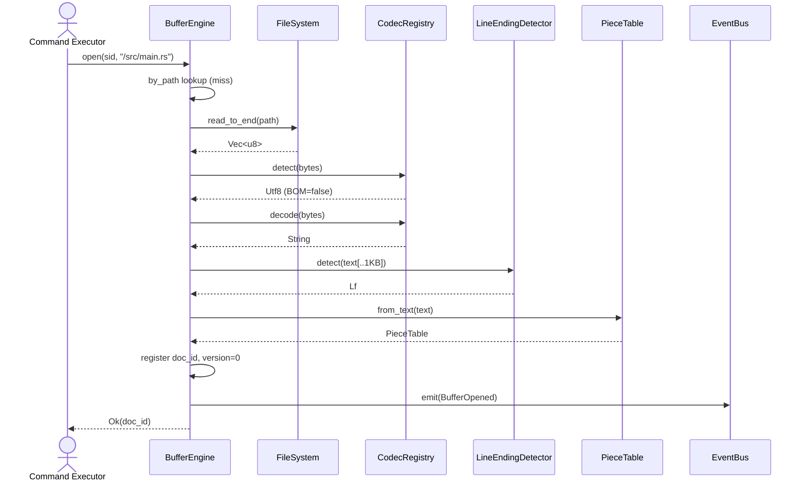

#### 8.8.2 SQ-BE-002 Patch 適用（Conflict 検出）

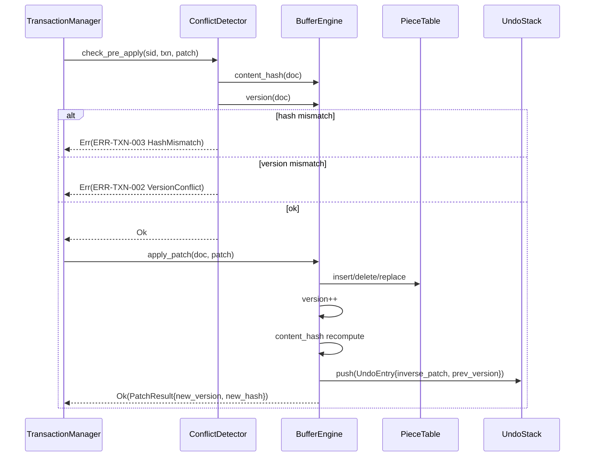

#### 8.8.3 SQ-BE-003 Undo 連鎖

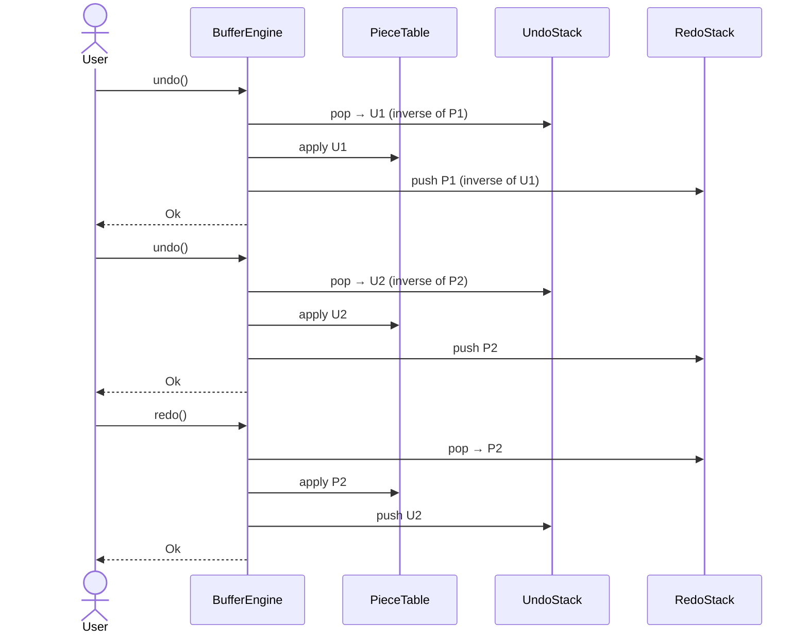

### 8.9 Buffer Error 体系（ERR-BE-XXX）

| Error Code | 発生条件 | HTTP 相当 | Retry | ログ Level | Recovery |
|-----------|---------|----------|------|-----------|----------|
| ERR-BE-001 | FileNotFound | 404 | No | WARN | パス確認 |
| ERR-BE-002 | EncodingDetectionFailed | 422 | No | WARN | Encoding 明示指定 |
| ERR-BE-003 | BinaryFile | 422 | No | WARN | Hex Editor 等別手段 |
| ERR-BE-004 | PathBlocked | 403 | No | WARN | Path 修正 |
| ERR-BE-005 | BufferNotOpen | 409 | No | INFO | Open |
| ERR-BE-006 | PatchOutOfRange | 422 | No | WARN | Patch 修正 |
| ERR-BE-007 | VersionConflict | 409 | Yes | WARN | Re-Read 後再生成 |
| ERR-BE-008 | MemoryBudgetExceeded | 507 | Yes | ERROR | Chunked 化 / Close |
| ERR-BE-009 | UndoStackEmpty | 409 | No | INFO | 無視 |
| ERR-BE-010 | RedoStackEmpty | 409 | No | INFO | 無視 |
| ERR-BE-011 | SavepointNotFound | 404 | No | WARN | 別 Savepoint 利用 |
| ERR-BE-012 | SaveIOError | 500 | Yes | ERROR | 再試行 / 縮退 |
| ERR-BE-013 | AtomicRenameFailed | 500 | Yes | ERROR | 再試行 |
| ERR-BE-014 | PermissionDenied | 403 | No | WARN | 権限修正 |
| ERR-BE-015 | BufferClosed | 410 | No | INFO | 再 Open |


---

## 9. 横断关切設計（3 サブシステム関連部分）

横断関心の全体設計は DD-04 で詳述するが、本サブシステムに固有の影響のみここで明示する。

### 9.1 Logging / Trace

- 共通フォーマット（DD-04 §2 準拠、構造化 JSON）
- Session ID / Transaction ID / Document ID / Buffer Version を必須フィールドに含める
- Session 単位の Trace を構成：`trace_id = session_id` を初期値とし、内部の Command 実行で `span_id` を発行、`correlation_id = transaction_id` で Transaction 内 Patch を 1 系列に束ねる

| Event | Trace | Session | Transaction | Buffer | Trace ID | Correlation ID |
|-------|-------|---------|-------------|--------|---------|----------------|
| SessionCreated | yes | yes | no | no | yes | no |
| BufferOpened | yes | yes | no | yes | yes | no |
| TransactionBegan | yes | yes | yes | no | yes | yes |
| PatchApplied | yes | yes | yes | yes | yes | yes |
| BufferPatched (Buffer 単体) | yes | yes | no | yes | yes | no |
| BufferUndo / Redo | yes | yes | no | yes | yes | no |
| TransactionCommitting | yes | yes | yes | no | yes | yes |
| BufferSaved | yes | yes | no | yes | yes | no |
| TransactionCommitted | yes | yes | yes | no | yes | yes |
| SessionTerminated | yes | yes | no | no | yes | no |

### 9.2 Audit 設計

SD-001 §7.1 に基づき、本サブシステムが担当する監査イベント：

| Audit Operation | 必須記録項目 | 用途 |
|----------------|------------|------|
| session.create | actor, sid, workspace_id, permissions_hash | アクセス制御の追跡 |
| session.terminate | actor, sid, reason | リソース解放の追跡 |
| session.permission_check | actor, sid, command, result | 権限逸脱の検出 |
| transaction.commit | actor, sid, tid, change_count, paths | Workspace 変更の完全追跡 |
| transaction.rollback | actor, sid, tid, reason | 巻き戻しの追跡 |
| buffer.save | actor, sid, doc_id, version, encoding | ファイル書込の追跡 |
| buffer.patch (Buffer 単体) | actor, sid, doc_id, change_summary | Buffer 単体 Patch の追跡 |

### 9.3 Error / Retry / Idempotency

| サブシステム | Retry 方針 | Idempotency Key |
|------------|-----------|-----------------|
| Session Manager | Session 作成のみ Idempotency Key サポート（同一 actor+workspace → 同一 sid） | `actor + workspace_id [+ worktree_id]` |
| Transaction Manager | Begin は冪等なし（呼び出し側が reuse を管理）。Apply Patch は version/hash 競合時に Retry で吸収 | version / hash 自体が Idempotency の役割 |
| Buffer Engine | Patch は version/hash 競合で Retry 吸収。Save は原子書込で Idempotent（同名 Save 連打は結果同一） | doc_id + version |

### 9.4 Timeout

| 操作 | 既定 Timeout | TBD |
|------|------------|-----|
| Session 作成 | 5 秒 | 【TBD：環境変数化】 |
| Session Terminate | 10 秒 | 【TBD】 |
| Transaction Begin | 5 秒 | 【TBD】 |
| Apply Patch (1 file) | 30 秒 | 【TBD：ファイルサイズ比例】 |
| Transaction Commit | 60 秒（変更数に比例）【TBD】 | 【TBD】 |
| Transaction Rollback | 30 秒 | 【TBD】 |
| Buffer Open (small) | 1 秒 | 【TBD】 |
| Buffer Open (large) | 5 秒 | 【TBD】 |
| Buffer Save (atomic) | 30 秒 | 【TBD】 |

### 9.5 可観測性（Metrics）

| Metric | 種別 | ラベル |
|--------|------|--------|
| `kernel_session_active` | Gauge | actor |
| `kernel_session_created_total` | Counter | actor |
| `kernel_session_terminated_total` | Counter | actor, reason |
| `kernel_transaction_active` | Gauge | - |
| `kernel_transaction_committed_total` | Counter | - |
| `kernel_transaction_rolled_back_total` | Counter | reason |
| `kernel_transaction_duration_seconds` | Histogram | - |
| `kernel_transaction_patch_count` | Histogram | - |
| `kernel_buffer_open_total` | Counter | encoding |
| `kernel_buffer_open_seconds` | Histogram | size_class |
| `kernel_buffer_save_seconds` | Histogram | size_class |
| `kernel_buffer_version` | Gauge | doc_id |
| `kernel_buffer_undo_stack_depth` | Gauge | doc_id |
| `kernel_buffer_memory_bytes` | Gauge | doc_id |

---

## 10. セキュリティ設計（本サブシステム関連部分）

SD-001 §3 / §4 で定義された Workspace セキュリティを Buffer / Transaction レベルで具体化する。

### 10.1 Session 隔離（MOD-SM-001 × MOD-BE-001）

- BufferEngine の `by_session` インデックスにより、Session A が Session B の Buffer に直接アクセス不可
- Buffer 取得は必ず `sid + doc_id` で検証（doc_id が sid の by_session に含まれるか）
- Cross-Session Buffer 共有は明示的に `share_buffer(from_sid, to_sid, doc_id, mode=ReadOnly|ReadWrite)` API 経由でのみ許可【TBD：P1 で実装】

### 10.2 データ脱敏（PII / Secret の Buffer 流入防止）

- Buffer 内に Secret が混入する可能性：
  - file.read で /etc/passwd を読む
  - Plugin が誤って Context に Token を埋める
  - LLM が生成したコードに API Key が含まれる

**対策**：

1. **Secret パターン検出**：Open / Save 直前に既知 Secret パターン（AWS_*, GITHUB_TOKEN, PRIVATE KEY 等）をスキャンし、ヒット時は `BufferSecretDetected` Event 発行 + Audit。デフォルト動作：警告のみ、保存は許容（ユーザー判断）【TBD：ブロックするか警告のみか】
2. **Secret 自動マスク**：Audit Log には Path / Size / Hash のみ記録、内容は記録しない
3. **Sandbox 境界**：Workspace 外ファイルの Buffer Open は Path Policy で拒否

### 10.3 権限評価の多層防御

```
Layer 1: Command Bus（DD-01）     -- Command 単位の Permission
Layer 2: Session Manager          -- Session 単位の RBAC + Path Policy
Layer 3: Transaction Manager      -- Workspace Mutation 必須権限
Layer 4: Buffer Engine            -- File Operation 単位の最終判定
```

すべての Layer が独立に判定し、いずれかが拒否すれば実行不可。Audit には「最初に拒否した Layer」を記録（重複記録回避）。

### 10.4 Workspace Sandbox Escape 対策

SD-001 §3.2 に基づき、Buffer Engine 内でも以下を実装：

- すべての Path 操作は `canonicalize()` 後の絶対パスで評価
- Symlink 解決後に Workspace Root 内であることを確認
- Hard link 検出（stat の inode で Session 開始時の inode と比較、不一致なら拒否）【TBD：コスト高、要否判断】
- TOCTOU 対策：File Open 時に取得した inode と Patch 適用時の inode を比較

### 10.5 Buffer Snapshot の機密性

- Savepoint / Snapshot には Buffer 内容がそのまま含まれる
- Snapshot ファイルは 0600、所有者は Kernel 起動ユーザー
- メモリ上の Buffer は MLock しないが、Core Dump 抑止（`RLIMIT_CORE=0` 設定）【TBD：全 OS で設定するか】
- Buffer 解放時に `Vec::clear()` + drop でメモリゼロ化（任意）【TBD：性能影響評価】


---

## 11. 性能設計

### 11.1 性能目標（NFR-001 引用）

| 指標 | 目標 | 該当 NFR |
|------|------|---------|
| Transaction Commit（average） | < 200 ms | NFR-P-060 |
| Transaction Rollback | < 500 ms | NFR-P-061 |
| Patch 適用（1000 行） | < 100 ms | NFR-P-041 |
| File Save（大容量） | < 500 ms | NFR-P-042 |
| 1 GB ファイル Open | < 1 秒 | NFR-P-040 |
| 1 GB ファイル Resident Memory | ≤ 100 MiB | NFR-C-001 |
| Buffer 100M 行対応 | Yes | NFR-C-002 |
| Session 起動 | < 5 秒 | 【TBD】 |
| Undo 1 step | < 50 ms | 【TBD】 |

### 11.2 【性能検証必要】項目

本詳細設計では以下を【性能検証必要】（skill-multica-2 §38）としてマークする：

| 項目 | 性能懸念 | 検証方法 |
|------|---------|---------|
| Piece Table の 100K Patch 累積時のメモリ | Piece 数 × 24B + Add Buffer 増加 | Benchmark: PieceTableStress |
| Buffer 100M 行の LineIndex サイズ | 行数 × 8B = 800 MiB | Benchmark: LargeLineIndex |
| 64 KiB Chunk の Chunked Read I/O 効率 | Chunk 境界跨ぎ Patch | Benchmark: ChunkedPatch |
| Journal 同期 fsync の Commit レイテンシ | NFR-D-002 RPO=0 と NFR-P-060 Commit<200ms の両立 | Benchmark: JournalFsyncImpact |
| Undo Stack 1000 depth のメモリ | 各エントリ Inverse Patch 保持 | Benchmark: UndoStackMemory |
| Optimistic Concurrency の競合時 Retry コスト | 100 Agent 並行 | Benchmark: ConcurrentPatch |
| Session 数 100 同時の Permission 評価 | PermissionSet Hash 計算 | Benchmark: PermissionEval |
| Encoding 検出（BOM なし UTF-8 vs Shift-JIS） | 統計的判定の計算コスト | Benchmark: CodecDetect |
| ChunkedStorage ↔ MmapStorage 自動切替の閾値 | 100 MiB 境界での性能ジャンプ | Benchmark: StorageTier |
| Session Recovery 時の 1000 Session 再構築 | WAL Replay 性能 | Benchmark: RecoveryScale |

各項目は Phase 1 後半に Benchmark Suite で実測し、目標未達時は設計を見直す。

---

## 12. テスト观点

各サブシステムの主要設計から抽出する Test 観点。テスト仕様の詳細化は別途 Test Design フェーズで実施。

### 12.1 Session Manager Test 観点

| Test ID | 観点 | 入力 | 期待結果 |
|---------|------|------|---------|
| SM-T-001 | CreateSession 正常 | 有効な CreateSessionRequest | sid 返却、Active 遷移、Event 発行 |
| SM-T-002 | CreateSession Idempotency | 同一 actor+workspace 2 回 | 同一 sid |
| SM-T-003 | CreateSession Quota 超過 | max を超える同時作成 | ERR-SES-102 |
| SM-T-004 | Terminate with ActiveTxn | ActiveTxn あり Terminate | force_rollback → Terminated |
| SM-T-005 | Permission Denied | workspace.write=false で file.patch | ERR-SES-002 |
| SM-T-006 | Path Blocked | allowed_paths 外 Read | ERR-SES-003 |
| SM-T-007 | Path ReadOnly への Write | read_only_paths への Patch | ERR-SES-004 |
| SM-T-008 | Idle Timeout | last_activity + threshold 超過 | Suspended 遷移 |
| SM-T-009 | Suspend + Resume | 明示 Suspend → Resume | Active 復帰 |
| SM-T-010 | Session Recovery | WAL Snapshot → Replay | 一致する Session 再構築 |
| SM-T-011 | TTL Expire | expires_at 超過 | Terminated 遷移 |
| SM-T-012 | ActiveTxn 重複 | ActiveTxn ある Session で Begin | ERR-TXN-001 |

### 12.2 Transaction Manager Test 観点

| Test ID | 観点 | 入力 | 期待結果 |
|---------|------|------|---------|
| TM-T-001 | Begin 正常 | 新規 Session | tid 返却、Active 遷移 |
| TM-T-002 | Patch 適用 正常 | version/hash 一致 | version++、Undo Stack Push |
| TM-T-003 | Patch 競合 version | expected_version 不一致 | ERR-TXN-002 VersionConflict |
| TM-T-004 | Patch 競合 hash | before_hash 不一致 | ERR-TXN-003 HashMismatch |
| TM-T-005 | Commit 正常 | 複数 Patch | Workspace 更新、Committed |
| TM-T-006 | Commit 失敗 → Rollback | Commit 中 IO エラー | RollingBack → Snapshot 復元 → RolledBack |
| TM-T-007 | Rollback 正常 | Active 中 Rollback | in-memory Patch 取消 |
| TM-T-008 | Savepoint 作成・復帰 | 中間マーカー | Savepoint 以降の Patch 取消 |
| TM-T-009 | Crash Recovery Committing | Committing 中 Crash → 再起動 | 完了判定 → Committed or RolledBack |
| TM-T-010 | Crash Recovery Active 孤立 | Begin のみ → Crash | RolledBack 確定 |
| TM-T-011 | Outbox Event 配信 | Commit 後 Outbox 確認 | TransactionCommitted Event が Durable に送信 |
| TM-T-012 | Force Rollback | Session Terminate 中 | 強制 Rollback |

### 12.3 Buffer Engine Test 観点

| Test ID | 観点 | 入力 | 期待結果 |
|---------|------|------|---------|
| BE-T-001 | Open small UTF-8 | < 100 MiB | doc_id 返却、UTF-8 検出 |
| BE-T-002 | Open UTF-8 BOM | BOM 付きファイル | has_bom=true、UTF-8 |
| BE-T-003 | Open UTF-16 LE BOM | UTF-16 LE BOM | UTF-16 LE 検出 |
| BE-T-004 | Open Shift-JIS | .txt 日本語 | Shift-JIS 検出 |
| BE-T-005 | Open Binary | バイナリファイル | ERR-BE-003 BinaryFile |
| BE-T-006 | Read range | 部分範囲指定 | 指定範囲のテキスト |
| BE-T-007 | Patch Insert 正常 | offset + text | Piece Table 更新、Undo Push |
| BE-T-008 | Patch Delete 正常 | range 指定 | Piece Table 更新 |
| BE-T-009 | Patch Replace 正常 | range + text | Delete + Insert |
| BE-T-010 | Undo 連鎖 | N 回 Patch → N 回 Undo | 初期状態に戻る |
| BE-T-011 | Redo 連鎖 | Undo → Redo | 状態再現 |
| BE-T-012 | Save atomic | Dirty Buffer → Save | tmp + rename、fsync |
| BE-T-013 | Save 失敗 → atomic | Save 中 IO エラー | path は旧版のまま |
| BE-T-014 | Large file 1GB | 1 GB ログファイル | Open < 1s、RSS ≤ 100 MiB |
| BE-T-015 | 100M lines | 100M 行ファイル | Buffer 動作 |
| BE-T-016 | Concurrent Patch 競合 | 2 Session 同時 Patch | 一方が ERR-BE-007 |
| BE-T-017 | LineEnding 保持 | CRLF ファイル編集 → Save | CRLF 維持 |
| BE-T-018 | Savepoint 作成・復帰 | 中間マーカー | 状態復元 |
| BE-T-019 | Close | Close → 再 Open | 内容保持 |
| BE-T-020 | Undo Stack overflow | max_undo_depth 超過 | 最古エントリ Discard、Audit 出力 |

### 12.4 統合 Test 観点

| Test ID | 観点 | シナリオ |
|---------|------|---------|
| INT-T-001 | MVP 検証 1: Open + Save | Buffer Open → Save |
| INT-T-002 | MVP 検証 5: Plugin Crash Isolation | Plugin Crash → Kernel alive |
| INT-T-003 | MVP 検証 6: Concurrent Agent | Session A / B 同時 Patch、Cursor / Txn / Context / Permission 隔離 |
| INT-T-004 | MVP 検証 7: Rollback | Txn Begin → Patch → test.fail → Rollback → Workspace 復元 |
| INT-T-005 | MVP 検証 8: Crash Recovery | Kernel Crash 中 Committing → 再起動で Recovery 完了 |
| INT-T-006 | End-to-End Transaction | transaction.begin → patch × N → test.run → git.diff → transaction.commit |
| INT-T-007 | Multi-Session Workspace | 10 Session 同時、Resource Budget 遵守 |
| INT-T-008 | Large Buffer Save | 1 GB 編集後 Save → 原子書込成功 |

