# DD-04 Internal API 詳細設計書

| 项目 | 内容 |
|---|---|
| 文档 ID | DD-04 |
| 文档名称 | Internal API 詳細設計書 |
| 系统名称 | Pure Rust AI Native CLI Development Kernel |
| 子系统 / 模块 | 内部 API（Core ↔ Plugin / Adapter ↔ Core / Core 内部模块间） + Error 体系主表 |
| 上位文档 | REQ-001 / NFR-001 / AD-001 / SD-001 / IF-XXX 接口设计书（IFD-001） |
| 并列文档 | DD-04b_Cross_Cutting_Concerns詳細設計書.md（Logging / Tracing / Concurrency / Configuration / Security Common / Observability / Performance） |
| 版本 | 0.1 (Draft) |
| 作成日 | 2026-09-14 |
| 作成者 | MiniMax-M3（Agent / ULYS-41） |
| Review 状态 | 未 Review |
| 修订履历 | v0.1 初版作成 |

---

## 1. 文档目的

本文为基本设计书 AD-001 与接口设计书 IFD-001 中所确定的 **15 个内部接口** 在 Core 内 / Core 与 Plugin 之间的实现层详细设计；同时统一所有接口共享的 **Error 体系主表**、Trace 表与可测试性导出表。

设计下沉层级：

```text
REQ-001 (要做什麼)
  ↓
AD-001 (怎麼做 - 黑盒 API)
  ↓
IFD-001 IF-XXX (對外契約 / Wire Schema)
  ↓
DD-04 本文档 (Core 內部處理順序 / 模組切分 / 內部類型 / 異常分支)
  ↓
DD-04b (橫切關切 / Logging / Concurrency / Config / Security)
  ↓
Source Code
```

不在本文范围（已由其他文档覆盖）：

- 横切关注点的 Logging / Tracing / Concurrency / Configuration / Security Common 内部模块详细设计 → **DD-04b**
- Microkernel Core 三大总线（Command Bus / Event Bus / Capability Registry）的模块设计 → **DD-01**
- Session / Transaction / Buffer Engine 子系统 → **DD-02**
- Plugin / Extension 子系统 → **DD-03**

## 2. 术语和缩略语

| 术语 | 定义 |
|---|---|
| Core | 本系统 Microkernel Core（不含 Plugin） |
| Plugin | 通过 Capability 注册中心暴露能力的外部组件（WASM Component 或 Native Worker） |
| Adapter | 将外部协议（HTTP/SSE/JSON-RPC/MCP/A2A）转译为 Command API 的薄层；属于 Core 进程边界 |
| Actor | Command 的发起者（Human / LangGraph / Agent / CI / Plugin / Automation） |
| Session | 一级状态容器，承载 Actor 与 Core 的交互上下文 |
| Execution | 一次 Command 从接收到完成的完整生命周期 |
| Transaction | 跨多个 Buffer/File 修改的事务边界 |
| Capability | 能力的逻辑抽象，由 Capability Provider（插件）实现 |
| Command | 唯一统一动作模型（参见 AD-001 §4.3） |
| Event | 由 Event Bus 异步分发的不可变事实记录 |
| Side Effect Level | READ_ONLY / LOCAL_STATE / WORKSPACE_MUTATION / PROCESS_EXECUTION / NETWORK / DESTRUCTIVE |
| Correlation ID | 横跨 Command / Event / Log / Trace / Metric 的串联标识集合（request_id, execution_id, session_id, trace_id） |
| Span | Tracing 中一个逻辑工作单元（参见 DD-04b §6） |
| CancellationToken | Tokio 提供的层级化取消传播令牌（参见 DD-04b §9） |
| Idempotency Key | 客户端为重复请求去重提供的标识 |

## 3. 参考资料

| 文档 | 版本 | 对应章节 |
|---|---|---|
| REQ-001 要件定义書 | Final Reviewed | §6 总体架构 / §8 ID 模型 / §24-26 Command / §33-35 Event / §47 Plugin 安全 / §59-68 API First / §117-129 安全・观测・配置 |
| NFR-001 非機能要件定義書 | Final Reviewed | §1 性能 / §2 可用性 / §3 安全 / §4 运维 / §5 可观测性 |
| AD-001 基本設計書 | Approved | §4 Core 架构 / §5 Command Bus / §6 Event Bus / §7 Capability Registry / §9-11 Session/Txn/Buffer / §15 Plugin |
| SD-001 安全性設計書 | Approved | §3 认证 / §4 授权（RBAC）/ §5 Input Validation / §6 Secret 管理 / §7 Audit / §8 Rate Limit |
| IFD-001 接口設計書 | Approved | IF-CMD-001 ~ IF-AUTH-001（15 接口） |
| DD-01 Microkernel Core | Draft | MOD-CB / MOD-EB / MOD-CR |
| DD-02 Session / Txn / Buffer | Draft | MOD-SM / MOD-TM / MOD-BE |
| DD-03 Plugin / Extension | Draft | MOD-PM / MOD-PL / MOD-PS / MOD-PHS / MOD-CPI |
| DD-04b Cross-Cutting | Draft | MOD-LOG / MOD-TRC / MOD-CFG / MOD-SEC / MOD-CONC / MOD-OBS / MOD-AUD |

## 4. 设计对象一览（15 个内部 API）

| IF ID | 名称 | 主要调用方 | 主要实现方 | 章节 |
|---|---|---|---|---|
| IF-CMD-001 | Command Dispatch | TUI / Adapter / Plugin | Core Command Bus | §5.1 |
| IF-EVT-001 | Event Subscribe/Publish | Core 内部 / Plugin | Core Event Bus | §5.2 |
| IF-CAP-001 | Capability Resolve/Invoke | Application Service | Core Capability Registry + Provider | §5.3 |
| IF-SES-001 | Session Lifecycle | Adapter / Application Service | Core Session Manager | §5.4 |
| IF-TXN-001 | Transaction Lifecycle | Application Service | Core Transaction Manager | §5.5 |
| IF-BUF-001 | Buffer Read/Patch | Application Service / Editor | Core Buffer Engine | §5.6 |
| IF-FS-001 | File System Internal API | Buffer Engine / Plugin | Core File System Adapter | §5.7 |
| IF-IDX-001 | Index Internal API | Search / Symbol / Completion | Core Index Service | §5.8 |
| IF-PLG-001 | Plugin Manager Internal API | Application Service / Adapter | Core Plugin Manager | §5.9 |
| IF-SCH-001 | Scheduler Internal API | Core 内部 | Core Task Scheduler | §5.10 |
| IF-REST-002 | REST Adapter → Core | HTTP Client | Adapter 层 | §5.11 |
| IF-JSONRPC-001 | stdio JSON-RPC Adapter | LangGraph / Local Agent | Adapter 层 | §5.12 |
| IF-SSE-001 | SSE Stream Internal API | HTTP Client / Adapter | Adapter + Core Event Bus | §5.13 |
| IF-MCP-001 | MCP Adapter Internal API | MCP Client | Adapter 层 | §5.14 |
| IF-AUTH-001 | Internal Auth Pipeline | 所有 Adapter / Core 入口 | Core Security Module | §5.15 |

---

## 5. 模块设计

### 5.1 MOD-API-001 Internal API Gateway

| 项目 | 内容 |
|---|---|
| Module ID | MOD-API-001 |
| 模块名称 | Internal API Gateway（统一内部 API 入口与出口） |
| 对应 BD | AD-001 §4.1 Core API Layer |
| 职责 | (1) 为所有外部 Adapter 提供 Core 内部 API 的统一外观；(2) 强制执行认证、授权、输入校验、可观测性上下文注入；(3) 将外部 IF 转换为 Core 内部 Command；(4) 集中管理跨 Adapter 的公共错误映射 |
| 输入 | Adapter 投递的已反序列化请求（DTO）+ CorrelationContext + Actor 凭证 |
| 输出 | CommandResult / Error / Stream<Item=Event> |
| 依赖 | MOD-SEC-001（Auth Pipeline）/ MOD-LOG-001 / MOD-TRC-001 / MOD-CONC-001 / MOD-CFG-001 / MOD-ERR-001 |
| 对外接口 | `pub fn dispatch(ctx: RequestContext, req: CommandRequest) -> impl Future<Output = Result<CommandResult, CoreError>>` |
| 使用数据 | 内存：无；持久化：无（仅 Session/Txn 间接访问） |
| 状态 | 无（无状态外观；所有状态在下游模块） |
| Transaction | 不开启事务；事务边界由 IF-TXN-001 显式管理 |
| Error | ERR-VAL-001 / ERR-AUTH-001 / ERR-AUTHZ-001 / ERR-SYS-001 / ERR-SYS-002 |

### 5.2 MOD-ERR-001 Error System

| 项目 | 内容 |
|---|---|
| Module ID | MOD-ERR-001 |
| 模块名称 | 统一错误体系（Error Taxonomy + Mapper + Serializer） |
| 对应 BD | AD-001 §4.4 Error Handling |
| 职责 | (1) 定义 `CoreError` enum 及其子类型；(2) 定义错误码命名空间（ERR-VAL/AUTH/AUTHZ/BIZ/DB/EXT/SYS）；(3) 实现 From 转换链实现跨模块传播；(4) 实现 Wire-level 序列化（REST / JSON-RPC / SSE / MCP）；(5) 实现 HTTP Status 映射 |
| 输入 | 各模块返回的 `CoreError` |
| 输出 | (a) Wire JSON（与 §6 主表对齐）；(b) `LogFields`（含 error_code / retryable / safe_message） |
| 依赖 | MOD-LOG-001（错误日志）/ MOD-CFG-001（错误消息本地化映射） |
| 对外接口 | `pub trait IntoWireError { fn to_wire(&self) -> WireError; }` / `pub trait IntoHttpStatus { fn http_status(&self) -> u16; }` |
| 使用数据 | 错误码常量表；本地化字符串表（i18n 入口预留） |
| 状态 | 无 |
| Transaction | 不参与 |
| Error | 自身错误不应发生；如发生则进入 ERR-SYS-001 兜底 |

---

## 6. Error 体系主表

> 本表为 **全 Core 错误码的总账**。每个 IF §5.x 内部还会引用本表对应的 `Error Code` 列。

### 6.1 命名空间

| 前缀 | 类别 | HTTP Status 默认 | retryable 默认 | Log Level 默认 |
|---|---|---|---|---|
| `ERR-VAL-` | 输入校验失败（格式 / 长度 / 范围 / 必填 / 枚举） | 400 | false | WARN |
| `ERR-AUTH-` | 认证失败（凭证缺失 / 过期 / 签名错误） | 401 | false | WARN |
| `ERR-AUTHZ-` | 授权失败（RBAC 决策 / 资源未授权 / 越权 Capability 调用） | 403 | false | WARN |
| `ERR-BIZ-` | 业务规则违反（状态机非法 / 资源不存在 / 资源冲突 / 幂等命中） | 409 | varies | INFO/WARN |
| `ERR-DB-` | 持久化层错误（连接 / 约束 / 死锁 / 序列化失败） | 503 | true（部分） | ERROR |
| `ERR-EXT-` | 外部依赖失败（HTTP / IPC / WASM / Worker / 模型推理） | 502 | varies | ERROR |
| `ERR-SYS-` | 系统内部错误（未捕获 / Panic / 资源耗尽 / 配置错误） | 500 | false | ERROR/FATAL |

### 6.2 Error Code 全表

> ⚠ 本表为设计期定义。生产期根据 `Error Code 全表统计` 增补。`safe_message` 为面向用户的固定文案；`internal_message` 仅用于日志与排障。
> ⚠ 文案与具体 HTTP Status 在每个 IF §5.x 章节中可能进一步细分（如 BIZ-009 资源冲突映射为 409 vs 412）。

| Error Code | 触发条件 | safe_message | internal_message | retryable | HTTP Status | 恢复指引 |
|---|---|---|---|---|---|---|
| **ERR-VAL-001** | JSON / Serde 反序列化失败 | "Invalid request payload" | "Serde error: {kind} at path {path}" | false | 400 | 检查请求体格式 |
| ERR-VAL-002 | 必填字段缺失 | "Missing required field: {field}" | 同上 | false | 400 | 检查必填项 |
| ERR-VAL-003 | 字符串长度超限 | "Field '{field}' exceeds length limit" | "max={max} actual={actual}" | false | 400 | 截断后重试 |
| ERR-VAL-004 | 数值范围越界 | "Field '{field}' out of range" | "min={min} max={max} actual={actual}" | false | 400 | 修正后重试 |
| ERR-VAL-005 | 枚举值非法 | "Invalid enum value for {field}" | "allowed={allowed} actual={actual}" | false | 400 | 查阅 Schema |
| ERR-VAL-006 | 编码非法（UTF-8 / BOM 缺失） | "Invalid text encoding" | "expected={expected} actual={actual}" | false | 400 | 重新编码 |
| ERR-VAL-007 | Schema 验证失败（JSON Schema / Rust Type） | "Schema validation failed" | "violation={violation}" | false | 400 | 查阅 Schema |
| ERR-VAL-008 | Path 越界（Workspace 根之外） | "Path is outside workspace" | "path={path} root={root}" | false | 400 | 使用相对路径 |
| **ERR-AUTH-001** | 凭证缺失 | "Authentication required" | "missing credential in request" | false | 401 | 携带凭证 |
| ERR-AUTH-002 | Token 过期 | "Authentication token expired" | "expired_at={ts}" | true | 401 | 刷新 Token |
| ERR-AUTH-003 | 签名验证失败 | "Invalid authentication signature" | "expected={alg} actual={alg}" | false | 401 | 检查 Key |
| ERR-AUTH-004 | 凭证被吊销 | "Credential revoked" | "credential_id={id} revoked_at={ts}" | false | 401 | 重新签发 |
| ERR-AUTH-005 | 会话绑定失效（Session ID 与 Token 不匹配） | "Session binding invalid" | "session={sid} token_sid={tsid}" | false | 401 | 重新登录 |
| **ERR-AUTHZ-001** | RBAC 决策拒绝 | "Permission denied" | "actor={actor} capability={cap} policy={policy_id}" | false | 403 | 申请权限 |
| ERR-AUTHZ-002 | Capability 未在注册中心 | "Capability not registered" | "capability={cap}" | false | 403 | 检查 capability.list |
| ERR-AUTHZ-003 | Workspace 路径不在 allowed_paths | "Access to path not allowed" | "actor={actor} path={path} policy={pid}" | false | 403 | 调整 session 权限 |
| ERR-AUTHZ-004 | Network 策略禁止 | "Network access denied" | "actor={actor} target={host} policy={pid}" | false | 403 | 调整 session network 策略 |
| ERR-AUTHZ-005 | Process 策略禁止（executable 不在 allowlist） | "Process spawn denied" | "actor={actor} exec={exec} allowlist={list}" | false | 403 | 调整 process 策略 |
| **ERR-BIZ-001** | 资源不存在 | "Resource not found" | "resource_type={t} id={id}" | false | 404 | 检查 ID |
| ERR-BIZ-002 | 资源已存在（Unique 冲突） | "Resource already exists" | "resource_type={t} id={id}" | false | 409 | 使用现有资源 |
| ERR-BIZ-003 | 状态机非法转换 | "Invalid state transition" | "from={from} event={event}" | false | 409 | 检查状态 |
| ERR-BIZ-004 | 幂等命中（重复请求，结果已存在） | "Duplicate request (idempotent)" | "idem_key={k} original_result={rid}" | true | 200（带原结果）| 客户端读取已有结果 |
| ERR-BIZ-005 | 乐观锁冲突（expected_version 不一致） | "Concurrent modification detected" | "expected={e} current={c} resource={r}" | true | 409 | 重新读取后重试 |
| ERR-BIZ-006 | 资源耗尽（Budget 超限） | "Resource budget exceeded" | "budget={b} used={u} type={t}" | false | 429 | 等待预算恢复 |
| ERR-BIZ-007 | 业务规则违反（具体见各 IF） | "Business rule violated" | "rule={rule} context={ctx}" | false | 422 | 修正后重试 |
| ERR-BIZ-008 | 取消（CancellationToken 触发） | "Operation cancelled" | "reason={reason} token={t}" | false | 499 | 按需重试 |
| ERR-BIZ-009 | Patch 冲突（before_hash 不一致） | "Patch base hash mismatch" | "expected={e} actual={a}" | true | 409 | 重新读取 |
| ERR-BIZ-010 | Plugin 未 Loaded 即被调用 | "Plugin not loaded" | "plugin_id={pid} state={state}" | true | 503 | 等待插件激活 |
| ERR-BIZ-011 | Plugin FAILED 状态 | "Plugin in failed state" | "plugin_id={pid} last_error={e}" | false | 503 | 卸载后重装 |
| **ERR-DB-001** | 连接失败 | "Storage unavailable" | "backend={backend} err={e}" | true | 503 | 重试 |
| ERR-DB-002 | 死锁 | "Storage deadlock detected" | "isolation={i} tables={t}" | true | 503 | 重试 |
| ERR-DB-003 | 序列化失败 | "Storage serialization conflict" | "isolation={i} tx={txid}" | true | 409 | 重试 |
| ERR-DB-004 | 约束违反 | "Constraint violation" | "constraint={c} value={v}" | false | 409 | 修正数据 |
| ERR-DB-005 | 磁盘空间不足 | "Storage capacity exhausted" | "backend={b} free={f}" | false | 503 | 运维介入 |
| **ERR-EXT-001** | HTTP 超时 | "Upstream timeout" | "url={url} timeout={t}" | true | 504 | 重试 |
| ERR-EXT-002 | HTTP 5xx | "Upstream error" | "url={url} status={s}" | true | 502 | 重试 |
| ERR-EXT-003 | HTTP 4xx（不可重试） | "Upstream rejected request" | "url={url} status={s} body={body}" | false | 502 | 检查请求 |
| ERR-EXT-004 | 连接拒绝 | "Upstream connection refused" | "url={url} reason={r}" | true | 502 | 重试 |
| ERR-EXT-005 | DNS 失败 | "Upstream DNS failure" | "host={host}" | true | 502 | 重试 |
| ERR-EXT-006 | TLS 错误 | "Upstream TLS error" | "host={host} reason={r}" | false | 502 | 检查证书 |
| ERR-EXT-007 | IPC 通道断（UnixSocket/NamedPipe） | "IPC channel closed" | "endpoint={e} peer={p}" | true | 502 | 重连 |
| ERR-EXT-008 | Worker 崩溃 | "Plugin worker crashed" | "worker={w} exit_code={c} signal={s}" | true | 502 | 重启 Worker |
| ERR-EXT-009 | Worker 超时 | "Plugin worker timeout" | "worker={w} timeout={t}" | true | 504 | 重试 |
| ERR-EXT-010 | WASM Trap | "Plugin WASM trap" | "plugin={p} trap={trap}" | true | 502 | 重启插件 |
| ERR-EXT-011 | 模型推理失败 | "AI inference failed" | "model={m} backend={b} err={e}" | true | 502 | 切换 Backend |
| ERR-EXT-012 | 远程 LLM 拒绝（429 / 401） | "Remote LLM rejected" | "provider={p} status={s}" | true | 429 | 降级或退避 |
| **ERR-SYS-001** | 未捕获异常 | "Internal server error" | "panic_caught={true} backtrace={truncated}" | false | 500 | 上报 Issue |
| ERR-SYS-002 | Panic（Tokio task） | "Internal server error" | "task={task} panic={msg}" | false | 500 | 上报 Issue |
| ERR-SYS-003 | 内存压力（OOM 风险） | "Service overloaded" | "rss={r} limit={l}" | true | 503 | 等待 |
| ERR-SYS-004 | 配置错误 | "Configuration error" | "key={k} reason={r}" | false | 500 | 修复配置 |
| ERR-SYS-005 | Schema 不匹配（版本不兼容） | "Schema version mismatch" | "expected={e} actual={a}" | false | 500 | 升级 |
| ERR-SYS-006 | 关键依赖缺失（Plugin Manifest 非法） | "Required dependency missing" | "capability={c} plugin={p}" | false | 500 | 安装依赖 |
| ERR-SYS-007 | 不支持的功能 | "Operation not supported" | "op={op} reason={r}" | false | 501 | 等待后续版本 |

### 6.3 CoreError Rust 类型骨架

```rust
// 仅作设计示意，不代表最终实现
#[derive(Debug, thiserror::Error)]
pub enum CoreError {
    #[error(transparent)] Val(ValError),
    #[error(transparent)] Auth(AuthError),
    #[error(transparent)] Authz(AuthzError),
    #[error(transparent)] Biz(BizError),
    #[error(transparent)] Db(DbError),
    #[error(transparent)] Ext(ExtError),
    #[error(transparent)] Sys(SysError),
}

pub trait IntoWireError {
    fn code(&self) -> &'static str;          // 例: "ERR-VAL-001"
    fn retryable(&self) -> bool;
    fn safe_message(&self) -> &'static str;
    fn internal_message(&self) -> String;
    fn details(&self) -> serde_json::Value;
    fn http_status(&self) -> u16;
}
```

### 6.4 Wire JSON 形态（与 REQ-001 §65 对齐）

```json
{
  "error": {
    "code": "ERR-VAL-001",
    "message": "Invalid request payload",
    "retryable": false,
    "details": { "path": "$.commands[0].args.id" },
    "trace_id": "01JABC...",
    "request_id": "01JDEF..."
  }
}
```

### 6.5 内部错误传播规则

1. **降噪**：第三方库（DB driver / HTTP client / WASM runtime）错误通过 `From` 转换进入对应命名空间，不向上泄漏栈追踪。
2. **栈追踪**：`internal_message` 允许包含简化后的错误位置（file:line），但 `safe_message` **绝对不包含**。
3. **Secret 过滤**：`IntoWireError::details()` 在序列化前必须经 `SecretScrubber` 过滤，禁止返回原始凭证。
4. **重试指引**：客户端根据 `retryable` 决定是否重试；服务端不可重试的错误不要返回 503。

---

## 7. 内部 API 详细设计

> 每个接口独立成节。统一字段：`IF ID / Name / 层级 / 调用方 / 实现方 / 上游文档 / 关联 REQ / Traceability ID`。
> Schema 仅列字段名 + 类型 + 是否可空 + 必填；详细 JSON Schema 派生自 Rust 类型（参见 REQ-001 §61）。

### 7.1 IF-CMD-001 Command Dispatch

| 项目 | 内容 |
|---|---|
| IF ID | IF-CMD-001 |
| 名称 | Command Dispatch（统一 Command 入口） |
| 上游 IF | IFD-001 §IF-CMD-001 |
| 对应 REQ | REQ-001 §24-28 |
| 对应 BD | AD-001 §5 Command Bus |
| 对应 DD | DD-01 §6 Command Bus / DD-04b §9 Cancellation |
| 关联 Traceability ID | DD-CMD-001 |
| 调用方 | TUI / Adapter（HTTP / JSON-RPC / SSE / MCP）/ Internal Service |
| 实现方 | Core Command Bus (MOD-CB-001) + Application Service Layer |
| 层级 | Adapter → MOD-API-001 → Application Service → Command Bus → Capability Provider |

**Request Schema（Rust Type）**

```rust
#[derive(Deserialize)]
pub struct CommandRequest {
    pub name: String,                // 必填，例 "file.read"
    pub version: u32,                // 必填，command version（参见 REQ-001 §25）
    pub arguments: serde_json::Value,// 必填
    pub session_id: SessionId,       // 必填（由 IF-SES-001 创建后获得）
    pub execution_id: Option<ExecutionId>, // 服务端生成（若缺）
    pub actor: ActorRef,             // 必填
    pub timeout_ms: Option<u32>,     // 可选，默认按 command metadata
    pub idempotency_key: Option<String>, // 可选，仅 mutation 命令有意义
    pub metadata: BTreeMap<String, String>, // 可选
    pub cancellation: CancellationToken,    // 由 Adapter 注入
}
```

**Response Schema**

```rust
pub struct CommandResponse {
    pub status: CommandStatus,           // Ok | PartialOk | Failed
    pub data: Option<serde_json::Value>,
    pub diagnostics: Vec<Diagnostic>,
    pub metadata: BTreeMap<String, String>,
    pub side_effects: Vec<SideEffectRecord>,
    pub next_cursor: Option<Cursor>,
    pub error: Option<WireError>,        // status=Failed 时填充
}
```

**处理顺序（P-001 ～ P-014）**

| 步骤 | 动作 | 错误 |
|---|---|---|
| P-001 | Adapter 注入 RequestContext（含 trace_id / actor / session_id） | — |
| P-002 | Deserialization（Serde JSON → CommandRequest） | ERR-VAL-001 |
| P-003 | Schema 验证（Rust Type → JSON Schema 反向校验 arguments） | ERR-VAL-007 |
| P-004 | Session 存在性检查（IF-SES-001 间接调用） | ERR-BIZ-001 |
| P-005 | Authentication（IF-AUTH-001 §7.15） | ERR-AUTH-001 / 002 / 003 |
| P-006 | Authorization / RBAC（基于 session.permissions + command 声明 required_capabilities） | ERR-AUTHZ-001 / 002 / 003 |
| P-007 | 幂等键查重（若提供） | ERR-BIZ-004（命中且状态为已完成） |
| P-008 | Application Service 路由到具体 handler（Command Registry lookup） | ERR-SYS-006（command 不存在） |
| P-009 | Domain 执行业务规则 | ERR-BIZ-001/003/005/007 |
| P-010 | Repository 访问（IF-FS-001 / IF-BUF-001 / IF-IDX-001） | ERR-DB-001/002/003/004 / ERR-FS-XXX |
| P-011 | Transaction 边界（IF-TXN-001 显式声明） | ERR-BIZ-003 / ERR-DB-002 |
| P-012 | Response Mapping（含 side_effects 收集） | — |
| P-013 | Audit Log 写入（MOD-AUD-001） | （降级为 WARN，不影响响应） |
| P-014 | 返回 Response | — |

**HTTP Status 映射（默认）**

| CommandResult.status | HTTP Status |
|---|---|
| Ok | 200 |
| PartialOk | 207 |
| Failed 且 retryable=true | 503 |
| Failed 且 retryable=false | 4xx / 5xx（依 `error.code` 前缀；见 §6.1） |
| Validation 阶段失败 | 400（具体码 ERR-VAL-*） |
| 取消 | 499 |

**Sequence Diagram（正常路径）**

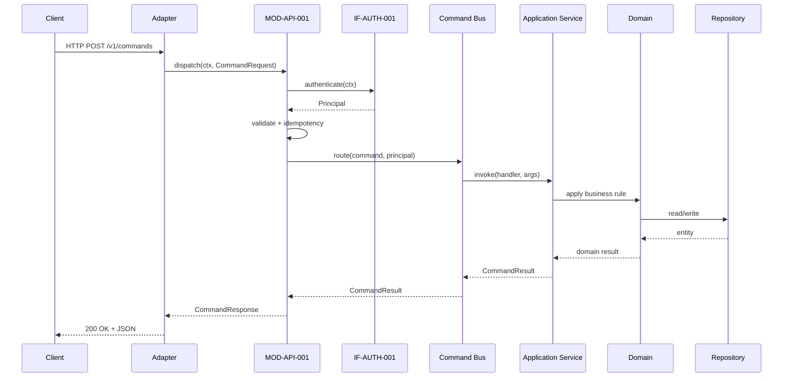
```mermaid
sequenceDiagram
    participant Cli as Client
    participant Adp as Adapter
    participant Gw as MOD-API-001
    participant Auth as IF-AUTH-001
    participant CB as Command Bus
    participant AS as Application Service
    participant Dom as Domain
    participant Repo as Repository
    Cli->>Adp: HTTP POST /v1/commands
    Adp->>Gw: dispatch(ctx, CommandRequest)
    Gw->>Auth: authenticate(ctx)
    Auth-->>Gw: Principal
    Gw->>Gw: validate + idempotency
    Gw->>CB: route(command, principal)
    CB->>AS: invoke(handler, args)
    AS->>Dom: apply business rule
    Dom->>Repo: read/write
    Repo-->>Dom: entity
    Dom-->>AS: domain result
    AS-->>CB: CommandResult
    CB-->>Gw: CommandResult
    Gw-->>Adp: CommandResponse
    Adp-->>Cli: 200 OK + JSON
```

**Sequence Diagram（Validation 失败）**

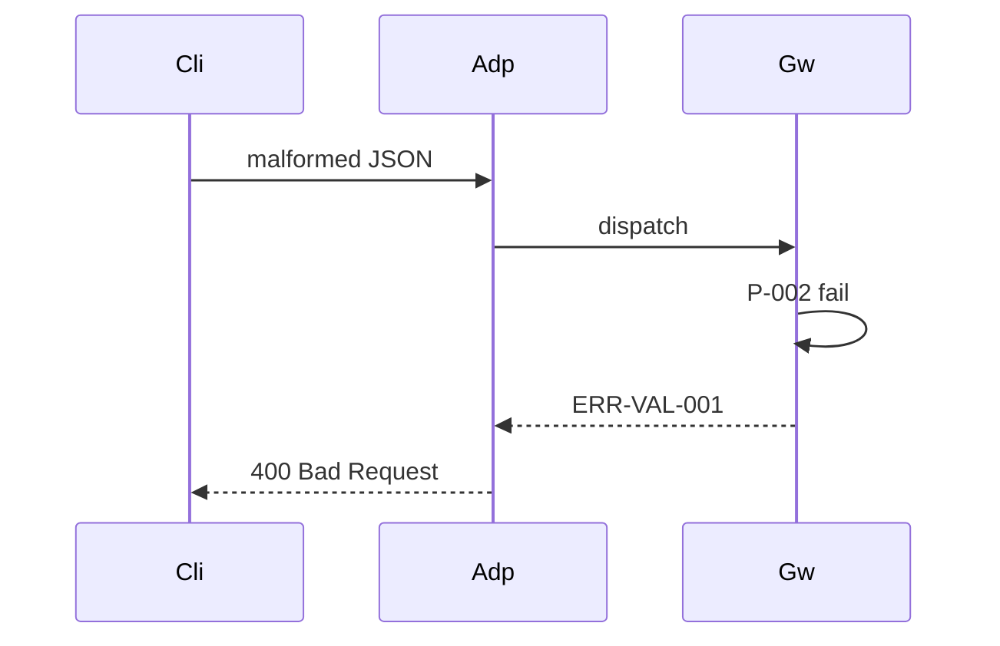
```mermaid
sequenceDiagram
    Cli->>Adp: malformed JSON
    Adp->>Gw: dispatch
    Gw->>Gw: P-002 fail
    Gw-->>Adp: ERR-VAL-001
    Adp-->>Cli: 400 Bad Request
```

**Sequence Diagram（Authorization 失败）**

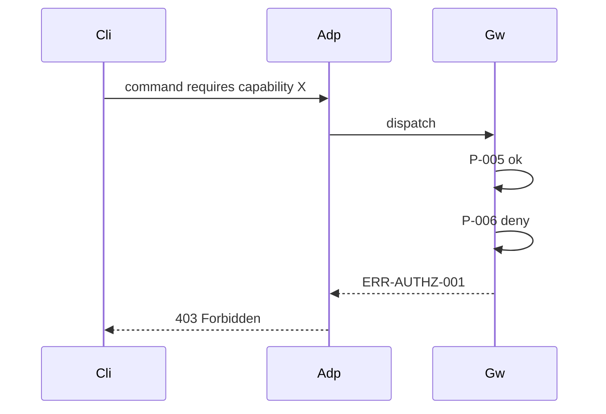
```mermaid
sequenceDiagram
    Cli->>Adp: command requires capability X
    Adp->>Gw: dispatch
    Gw->>Gw: P-005 ok
    Gw->>Gw: P-006 deny
    Gw-->>Adp: ERR-AUTHZ-001
    Adp-->>Cli: 403 Forbidden
```

**Sequence Diagram（Capability 不存在）**

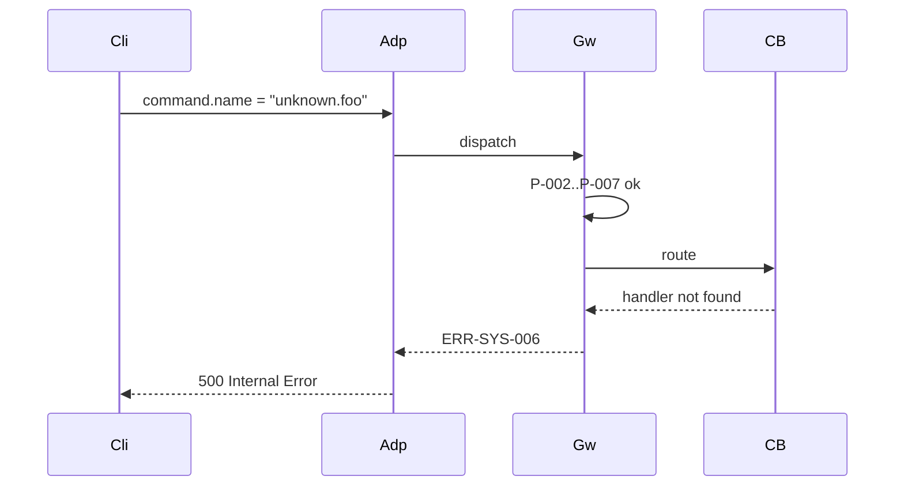
```mermaid
sequenceDiagram
    Cli->>Adp: command.name = "unknown.foo"
    Adp->>Gw: dispatch
    Gw->>Gw: P-002..P-007 ok
    Gw->>CB: route
    CB-->>Gw: handler not found
    Gw-->>Adp: ERR-SYS-006
    Adp-->>Cli: 500 Internal Error
```

**Sequence Diagram（取消路径）**

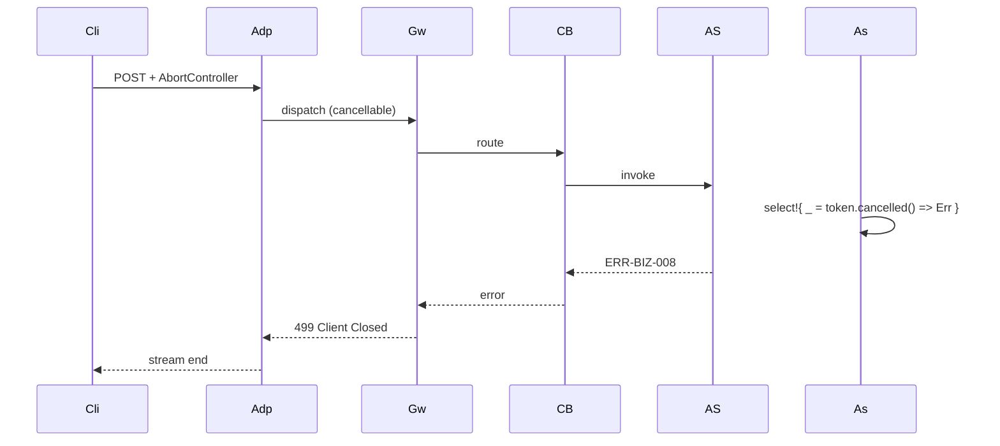
```mermaid
sequenceDiagram
    Cli->>Adp: POST + AbortController
    Adp->>Gw: dispatch (cancellable)
    Gw->>CB: route
    CB->>AS: invoke
    As->>As: select!{ _ = token.cancelled() => Err }
    AS-->>CB: ERR-BIZ-008
    CB-->>Gw: error
    Gw-->>Adp: 499 Client Closed
    Adp-->>Cli: stream end
```

**Idempotency**

- 范围：所有 `side_effect ∈ {WORKSPACE_MUTATION, PROCESS_EXECUTION, NETWORK, DESTRUCTIVE}` 的命令。
- 机制：客户端提供 `idempotency_key`；服务端写入 `idempotency_store`（KV，按 `actor + key` 索引，TTL **【TBD：建议 24h，待 NFR-001 §4 运维侧确认】**）。
- 命中策略：(a) 命中且原结果成功 → 直接返回原响应（`status=Ok`, `error.code=ERR-BIZ-004`, `data=原结果`）；(b) 命中且原结果失败 → 返回原错误；(c) 命中且原请求仍在执行 → 等待 + 复用结果（实现详见 DD-04b §9）。
- 并发：使用 `idempotency_key` 单一 writer，CAS 抢占；第二个请求返回 409 + `retry_after`。

**Retry / Timeout**

- ReadOnly 命令：客户端可安全重试（服务端需保证幂等）。
- Mutating 命令：依赖 `idempotency_key`；无 key 时拒绝重试。
- Timeout：客户端 `timeout_ms` 优先；服务端 `command.metadata.timeout_ms` 次之；硬上限 **【TBD：默认 30s，待 NFR-001 §1 性能侧确认】**。
- 服务端 timeout 触发后必须取消（cancellable future + CancellationToken 传播），并写入 ERR-BIZ-008。

**可测试性导出**

| 维度 | 测试方法 |
|---|---|
| Validation | 注入缺失/超长/越界字段 |
| Authn/Authz | 注入缺失/过期 Token / 错误 session / 越权 capability |
| 幂等 | 同一 idempotency_key 连发两次 |
| 超时 | `tokio::time::pause` + 推进时间 |
| 取消 | `CancellationToken::cancel()` 后断言 ERR-BIZ-008 |
| Capability miss | command.name="unknown.foo" |
| DB 失败 | mock Repository 返 IO 错误 |
| 侧效 | 断言 `side_effects` 数组 |
| 并发 | `tokio::join!` 同 key 并发 |

---

### 7.2 IF-EVT-001 Event Subscribe / Publish

| 项目 | 内容 |
|---|---|
| IF ID | IF-EVT-001 |
| 名称 | Event Subscribe / Publish |
| 上游 IF | IFD-001 §IF-EVT-001 |
| 对应 REQ | REQ-001 §33-35 |
| 对应 BD | AD-001 §6 Event Bus |
| 对应 DD | DD-01 §7 Event Bus |
| 关联 Traceability ID | DD-EVT-001 |
| 调用方 | Core 内部模块（自动发布）/ Plugin（订阅）/ Adapter（订阅） |
| 实现方 | Core Event Bus (MOD-EB-001) |
| 层级 | Provider → Event Bus → Subscriber(s) |

**Request Schema**

```rust
// Publish
pub struct EventPublishRequest {
    pub event_type: String,             // 必填，例 "FileSaved"
    pub payload: serde_json::Value,     // 必填
    pub level: EventLevel,              // Transient | Durable
    pub workspace_id: WorkspaceId,      // 必填
    pub session_id: Option<SessionId>,  // 可选（系统级事件无 session）
    pub execution_id: Option<ExecutionId>, // 可选
    pub actor: Option<ActorRef>,        // 可选
    pub trace_id: TraceId,              // 必填
}

// Subscribe
pub struct EventSubscribeRequest {
    pub subscriber_id: SubscriberId,    // 客户端生成的稳定 ID
    pub filter: EventFilter,            // topic prefix / type / workspace / session
    pub from_sequence: Option<u64>,     // 重放起点；空 = latest
    pub buffer_size: u32,               // 背压缓冲大小
    pub cancellation: CancellationToken,
}
```

**Response Schema**

```rust
pub struct EventEnvelope {
    pub event_id: Uuid,                 // 全局唯一
    pub sequence: u64,                  // 单 subscriber 内的递增序号
    pub type_: String,                  // EventType
    pub timestamp: DateTime<Utc>,
    pub workspace_id: WorkspaceId,
    pub session_id: Option<SessionId>,
    pub execution_id: Option<ExecutionId>,
    pub actor: Option<ActorRef>,
    pub payload: serde_json::Value,
    pub trace_id: TraceId,
    pub causation_id: Option<Uuid>,     // 触发此事件的父 event
}
```

**处理顺序（Publish）**

| 步骤 | 动作 | 错误 |
|---|---|---|
| E-001 | Schema 验证 payload | ERR-VAL-007 |
| E-002 | 授权检查（system event 无需；actor event 需校验 actor == session.owner） | ERR-AUTHZ-001 |
| E-003 | 分配 sequence（单 workspace 单调递增） | — |
| E-004 | level=Durable 时持久化到 WAL（参见 DD-02 MOD-TM-001） | ERR-DB-001 |
| E-005 | 广播给当前活跃 subscribers（fan-out） | （子任务失败不阻塞主） |
| E-006 | 返回 EventEnvelope | — |

**Sequence Diagram（订阅流）**

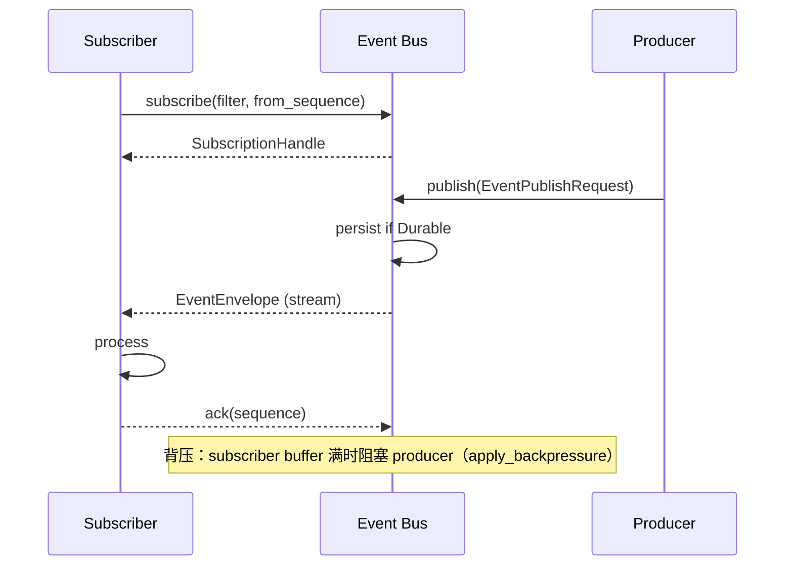
```mermaid
sequenceDiagram
    participant Sub as Subscriber
    participant EB as Event Bus
    participant Pub as Producer
    Sub->>EB: subscribe(filter, from_sequence)
    EB-->>Sub: SubscriptionHandle
    Pub->>EB: publish(EventPublishRequest)
    EB->>EB: persist if Durable
    EB-->>Sub: EventEnvelope (stream)
    Sub->>Sub: process
    Sub-->>EB: ack(sequence)
    Note over EB: 背压：subscriber buffer 满时阻塞 producer（apply_backpressure）
```

**Idempotency / Retry**

- Publish：内部 API，不暴露给外部调用方；唯一保证：`(workspace_id, sequence)` 唯一。
- Subscribe：客户端可重连 + 指定 `from_sequence` 重放；EventBus 保证 at-least-once 投递 + 单 subscriber 内有序。
- Durable event 持久化后保证 at-least-once；Transient 事件进程崩溃即丢失（明确契约）。

**Timeout / 背压**

- Publish 同步阶段：超时 **【TBD：默认 100ms，仅持久化阶段；待 NFR-001 §1 确认】**。
- 订阅流：subscriber buffer 默认 1024；满后 producer `tokio::sync::watch` 等待；最长等待 **【TBD：默认 5s，否则丢弃 Transient / 阻塞 Durable】**。
- 取消：`CancellationToken` 触发后 stream 优雅结束（最终 emit `SubscriptionClosed`）。

**可测试性导出**

| 维度 | 测试方法 |
|---|---|
| 顺序 | 多个 publish 验证 sequence 递增 |
| 过滤 | filter 不匹配时不投递 |
| 重放 | 断开后 from_sequence 续传 |
| 背压 | 满 buffer 后 producer 阻塞 |
| Durable | 模拟进程崩溃后重启验证持久化 |
| 取消 | 取消订阅后流关闭 |

---

### 7.3 IF-CAP-001 Capability Resolve / Invoke

| 项目 | 内容 |
|---|---|
| IF ID | IF-CAP-001 |
| 名称 | Capability Resolve / Invoke |
| 上游 IF | IFD-001 §IF-CAP-001 |
| 对应 REQ | REQ-001 §29-32 |
| 对应 BD | AD-001 §7 Capability Registry |
| 对应 DD | DD-01 §8 Capability Registry |
| 关联 Traceability ID | DD-CAP-001 |
| 调用方 | Application Service / 外部 Adapter / 其他 Plugin |
| 实现方 | Core Capability Registry (MOD-CR-001) + Provider Adapter |
| 层级 | Caller → Router → Provider（Plugin / Core 内置 / External） |

**Request Schema**

```rust
pub struct CapabilityInvokeRequest {
    pub capability_id: String,          // 必填，例 "ai.embed"
    pub version: Option<String>,        // 可选，例 "^1.0"
    pub arguments: serde_json::Value,   // 必填
    pub routing_policy: RoutingPolicy,  // Performance | Priority | Cost | Specific(provider_id)
    pub session_id: SessionId,          // 必填
    pub execution_id: Option<ExecutionId>,
    pub timeout_ms: Option<u32>,
    pub cancellation: CancellationToken,
}
```

**Response Schema**

```rust
pub struct CapabilityInvokeResponse {
    pub result: serde_json::Value,
    pub provider_id: ProviderId,        // 实际命中的 provider
    pub provider_version: String,
    pub latency_ms: u64,
    pub cache_hit: bool,                // 若 Router 命中 cache
    pub diagnostics: Vec<Diagnostic>,
}
```

**处理顺序（I-001 ～ I-010）**

| 步骤 | 动作 | 错误 |
|---|---|---|
| I-001 | 验证 capability_id 格式 | ERR-VAL-005 |
| I-002 | Session 检查（参见 IF-SES-001） | ERR-BIZ-001 |
| I-003 | 授权检查（session 拥有该 capability 权限） | ERR-AUTHZ-002 |
| I-004 | 查找候选 providers（version + availability 过滤） | ERR-SYS-006（无 provider） |
| I-005 | 应用 routing_policy（性能 / 优先级 / 成本） | — |
| I-006 | 校验 provider 状态（不可达 → 下一个；QUARANTINED 跳过） | — |
| I-007 | 构造 provider-specific request（可能类型转换） | ERR-VAL-001 |
| I-008 | 调用 provider（in-process / IPC / WASM / HTTP） | ERR-EXT-007/008/009/010 |
| I-009 | Response 转换与诊断收集 | — |
| I-010 | Cache 写入（cache_key = hash(capability + args + provider_id)） | （失败降级为 WARN） |

**Sequence Diagram（正常）**

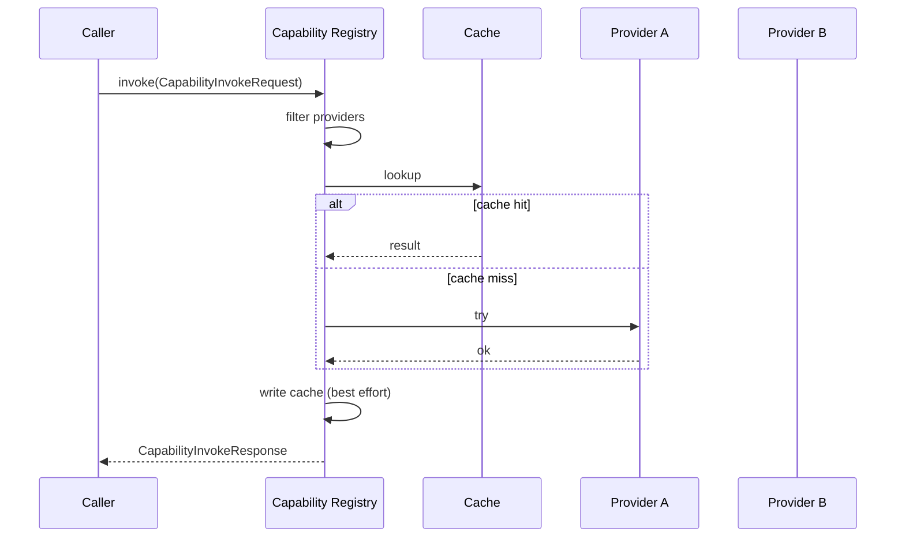
```mermaid
sequenceDiagram
    participant Caller
    participant CR as Capability Registry
    participant Cache
    participant P1 as Provider A
    participant P2 as Provider B
    Caller->>CR: invoke(CapabilityInvokeRequest)
    CR->>CR: filter providers
    CR->>Cache: lookup
    alt cache hit
        Cache-->>CR: result
    else cache miss
        CR->>P1: try
        P1-->>CR: ok
    end
    CR->>CR: write cache (best effort)
    CR-->>Caller: CapabilityInvokeResponse
```

**Sequence Diagram（Provider 失败切换）**

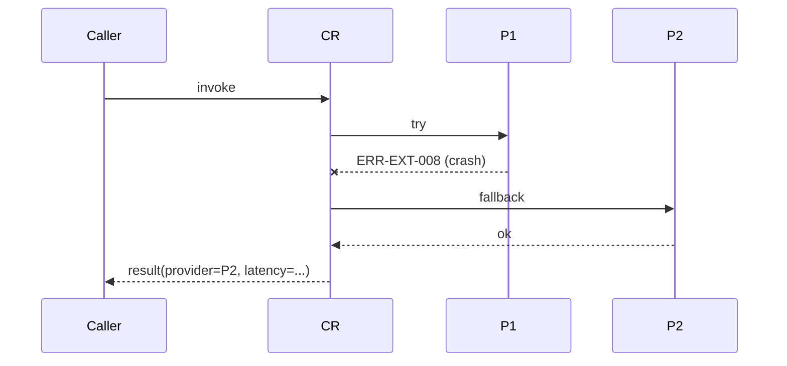
```mermaid
sequenceDiagram
    Caller->>CR: invoke
    CR->>P1: try
    P1--xCR: ERR-EXT-008 (crash)
    CR->>P2: fallback
    P2-->>CR: ok
    CR-->>Caller: result(provider=P2, latency=...)
```

**Idempotency**

- 读能力（`ai.embed` 等）依赖 cache；cache_key 包含 args 哈希，自然幂等。
- 写能力（如 `git.commit`）由 Plugin 在能力内部实现幂等；本接口不强制 `idempotency_key`。

**Retry / Timeout / 熔断**

- Retry：默认对 `retryable` 错误（ERR-EXT-001/004/005/008/009/010/011）自动重试下一个 provider。
- Max attempts：≤ candidates 数，且每 provider 限 1 次（避免 retry storm）。
- Backoff：**【TBD：默认 jitter 100-300ms，待 NFR-001 确认】**。
- Circuit Breaker：Provider 连续失败 N 次（**【TBD：N=3，duration=30s，待 NFR-001 确认】**）→ 标记 QUARANTINED，跳过该 provider。
- Timeout：per-provider `timeout_ms`；硬上限 **【TBD：默认 60s，待 NFR-001 §1 性能侧确认】**。

**可测试性导出**

| 维度 | 测试方法 |
|---|---|
| Filter | 注入 version 不匹配 / 不可达 provider |
| Routing | 提供多 provider + 不同 policy |
| 缓存 | 第二次 invoke 命中 cache_hit=true |
| 熔断 | mock provider 失败 N 次后被跳过 |
| 超时 | `tokio::time::pause` + 推进时间 |
| 取消 | CancellationToken 触发后 ERR-BIZ-008 |
| 错误聚合 | 全部 provider 失败时聚合所有错误返回 |

---

### 7.4 IF-SES-001 Session Lifecycle

| 项目 | 内容 |
|---|---|
| IF ID | IF-SES-001 |
| 名称 | Session Lifecycle（Create / Get / List / Suspend / Resume / Close） |
| 上游 IF | IFD-001 §IF-SES-001 |
| 对应 REQ | REQ-001 §9-10 |
| 对应 BD | AD-001 §9 Session Manager |
| 对应 DD | DD-02 §6 Session Manager (MOD-SM-001) |
| 关联 Traceability ID | DD-SES-001 |
| 调用方 | Adapter / Application Service / Plugin |
| 实现方 | Core Session Manager (MOD-SM-001) |
| 层级 | Caller → Session Manager → SessionStore（内存 + 可选持久化） |

**Request Schema（Create）**

```rust
pub struct SessionCreateRequest {
    pub workspace_id: WorkspaceId,         // 必填
    pub actor: ActorRef,                   // 必填
    pub initial_permissions: Vec<Capability>, // 必填
    pub resource_budget: ResourceBudget,   // 必填
    pub context_budget: Option<TokenBudget>,// 可选
    pub metadata: BTreeMap<String, String>,
    pub client_info: ClientInfo,           // 必填（用于 audit）
}
```

**Response Schema**

```rust
pub struct SessionInfo {
    pub session_id: SessionId,             // 全局唯一 ULID
    pub workspace_id: WorkspaceId,
    pub actor: ActorRef,
    pub permissions: Vec<Capability>,
    pub resource_budget: ResourceBudget,
    pub context_budget: Option<TokenBudget>,
    pub state: SessionState,               // Active | Suspended | Closed
    pub created_at: DateTime<Utc>,
    pub last_active_at: DateTime<Utc>,
    pub metadata: BTreeMap<String, String>,
}
```

**处理顺序（Create S-001 ～ S-008）**

| 步骤 | 动作 | 错误 |
|---|---|---|
| S-001 | 验证 workspace 存在且可访问 | ERR-BIZ-001 / ERR-AUTHZ-003 |
| S-002 | 验证 actor 凭证（IF-AUTH-001） | ERR-AUTH-001/002/003 |
| S-003 | 计算初始权限（actor role + 显式 initial_permissions） | ERR-AUTHZ-001 |
| S-004 | 校验 resource_budget 不超过 workspace 上限 | ERR-BIZ-006 |
| S-005 | 生成 session_id（ULID，含时间序） | — |
| S-006 | 持久化 SessionRecord | ERR-DB-001 |
| S-007 | 发布 SessionCreated 事件 | ERR-EXT-*（降级为 WARN） |
| S-008 | 返回 SessionInfo | — |

**Sequence Diagram（Create）**

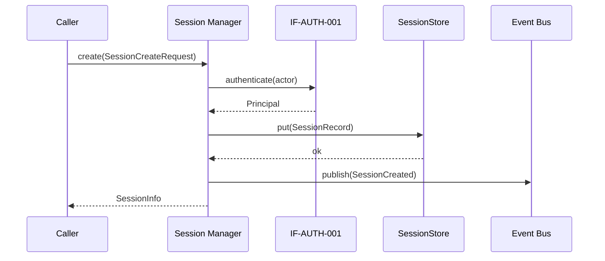
```mermaid
sequenceDiagram
    participant Caller
    participant SM as Session Manager
    participant Auth as IF-AUTH-001
    participant Store as SessionStore
    participant EB as Event Bus
    Caller->>SM: create(SessionCreateRequest)
    SM->>Auth: authenticate(actor)
    Auth-->>SM: Principal
    SM->>Store: put(SessionRecord)
    Store-->>SM: ok
    SM->>EB: publish(SessionCreated)
    SM-->>Caller: SessionInfo
```

**Sequence Diagram（Suspend / Resume）**

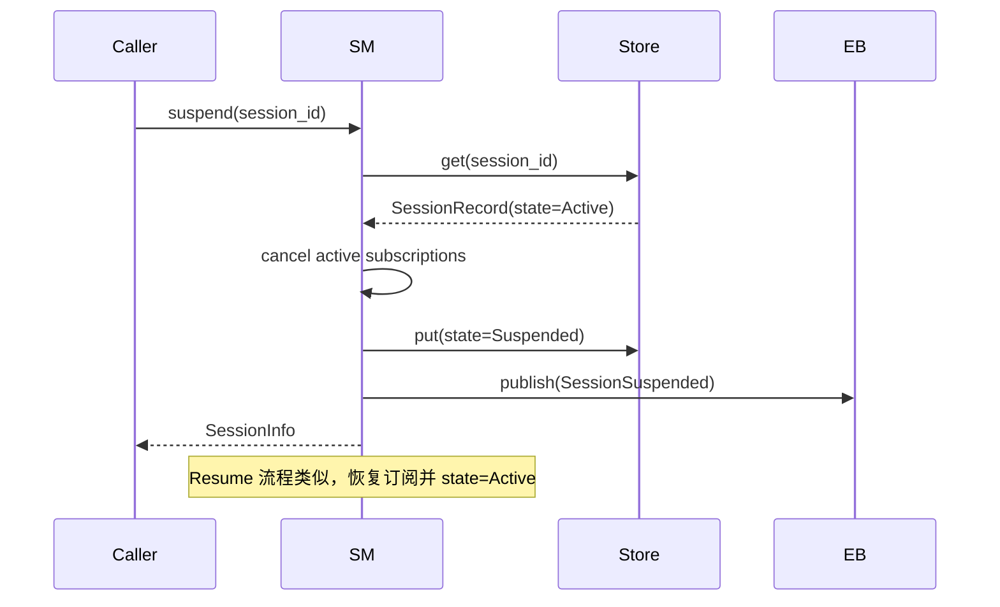
```mermaid
sequenceDiagram
    Caller->>SM: suspend(session_id)
    SM->>Store: get(session_id)
    Store-->>SM: SessionRecord(state=Active)
    SM->>SM: cancel active subscriptions
    SM->>Store: put(state=Suspended)
    SM->>EB: publish(SessionSuspended)
    SM-->>Caller: SessionInfo
    Note over SM: Resume 流程类似，恢复订阅并 state=Active
```

**Sequence Diagram（Close 异常路径）**

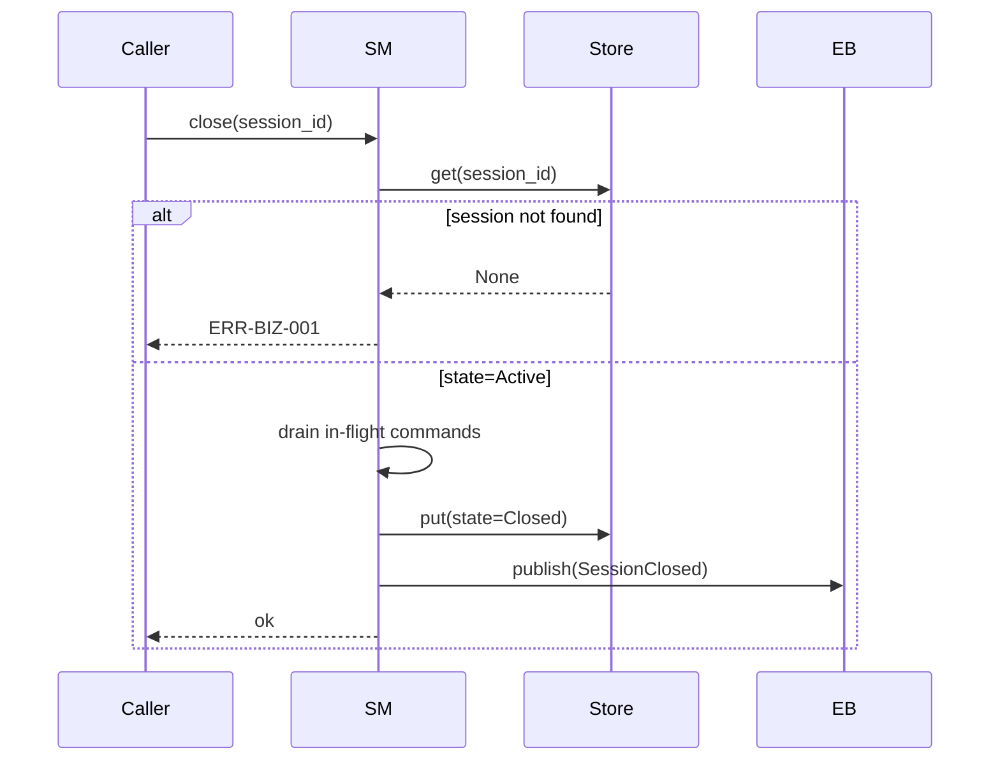
```mermaid
sequenceDiagram
    Caller->>SM: close(session_id)
    SM->>Store: get(session_id)
    alt session not found
        Store-->>SM: None
        SM-->>Caller: ERR-BIZ-001
    else state=Active
        SM->>SM: drain in-flight commands
        SM->>Store: put(state=Closed)
        SM->>EB: publish(SessionClosed)
        SM-->>Caller: ok
    end
```

**Idempotency**

- Create：依赖 client 提供的 `client_info.request_id` 防止同 client 并发重复；如检测到重复 → 返回原 SessionInfo，error.code=ERR-BIZ-004。
- Suspend / Resume / Close：状态机非法 → ERR-BIZ-003；幂等（同状态重复调用返回 200）。

**Retry / Timeout**

- Create：客户端重试安全（依赖幂等键）。
- Close：失败时系统会通过后台 task 强制回收（TTL **【TBD：默认 1h，待 NFR-001 确认】**）。

**可测试性导出**

| 维度 | 测试方法 |
|---|---|
| 权限 | 注入越权 permission |
| Budget 超限 | 注入 resource_budget > workspace 上限 |
| 同 client 重复 | client_info.request_id 相同 |
| Suspend 后调用 | 期望 ERR-BIZ-003 |
| 并发 | 多 actor 同 workspace |
| 持久化 | 模拟 DB 失败 |
| 关闭竞态 | 关闭同时有 command 执行中 |

---

### 7.5 IF-TXN-001 Transaction Lifecycle

| 项目 | 内容 |
|---|---|
| IF ID | IF-TXN-001 |
| 名称 | Transaction Lifecycle（Begin / AddOp / Commit / Rollback） |
| 上游 IF | IFD-001 §IF-TXN-001 |
| 对应 REQ | REQ-001 §20-23 |
| 对应 BD | AD-001 §10 Transaction Manager |
| 对应 DD | DD-02 §7 Transaction Manager (MOD-TM-001) |
| 关联 Traceability ID | DD-TXN-001 |
| 调用方 | Application Service（事务性命令 handler） |
| 实现方 | Core Transaction Manager (MOD-TM-001) |
| 层级 | Caller → Txn Manager → Buffer/FS/Index/Plugin（参与者） |

**Request Schema**

```rust
pub struct TxnBeginRequest {
    pub session_id: SessionId,             // 必填
    pub workspace_id: WorkspaceId,         // 必填
    pub isolation: TxnIsolation,           // 必填 Snapshot | Serializable
    pub participants: Vec<ParticipantId>,  // 必填，预声明参与者
    pub metadata: BTreeMap<String, String>,
    pub timeout_ms: Option<u32>,           // 可选
}

pub struct TxnAddOpRequest {
    pub transaction_id: TransactionId,
    pub op: TxnOp,                        // BufferPatch | FileWrite | IndexUpdate | PluginCall
    pub compensating_op: Option<TxnOp>,   // 可选，反向操作
}

pub struct TxnCommitRequest {
    pub transaction_id: TransactionId,
    pub finalize: bool,                   // true = 物理落盘
}

pub struct TxnRollbackRequest {
    pub transaction_id: TransactionId,
    pub reason: String,
}
```

**Response Schema**

```rust
pub struct TxnInfo {
    pub transaction_id: TransactionId,
    pub state: TxnState,                   // New | Active | Validating | Committed | RollingBack | RolledBack | Failed
    pub operations_count: u32,
    pub participants: Vec<ParticipantId>,
    pub started_at: DateTime<Utc>,
    pub committed_at: Option<DateTime<Utc>>,
    pub rolled_back_at: Option<DateTime<Utc>>,
    pub diagnostics: Vec<Diagnostic>,
}
```

**State Machine**

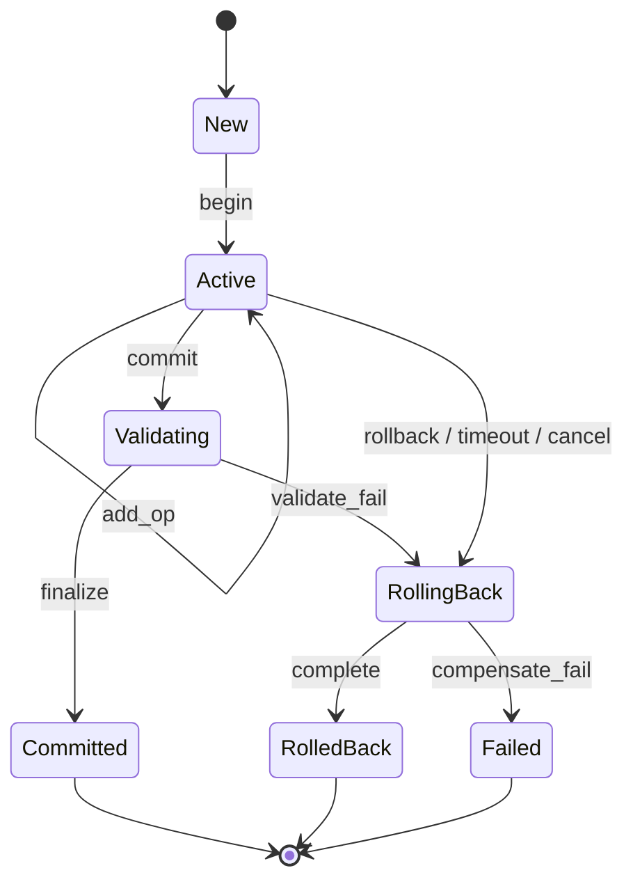
```mermaid
stateDiagram-v2
    [*] --> New
    New --> Active: begin
    Active --> Active: add_op
    Active --> Validating: commit
    Validating --> Committed: finalize
    Validating --> RollingBack: validate_fail
    Active --> RollingBack: rollback / timeout / cancel
    RollingBack --> RolledBack: complete
    RollingBack --> Failed: compensate_fail
    Committed --> [*]
    RolledBack --> [*]
    Failed --> [*]
```

**处理顺序（Begin T-001 ～ T-005）**

| 步骤 | 动作 | 错误 |
|---|---|---|
| T-001 | Session 存在性 + 写权限检查 | ERR-BIZ-001 / ERR-AUTHZ-001 |
| T-002 | 检查已有 active_txn（同时只允许一个 active） | ERR-BIZ-003 |
| T-003 | 生成 transaction_id | — |
| T-004 | 写入 WAL（begin 记录） | ERR-DB-001 |
| T-005 | 返回 TxnInfo(state=Active) | — |

**处理顺序（Commit T-C01 ～ T-C07）**

| 步骤 | 动作 | 错误 |
|---|---|---|
| T-C01 | 验证 transaction_id 仍为 Active | ERR-BIZ-003 |
| T-C02 | 通知所有 participants 进入 Validating | ERR-EXT-* |
| T-C03 | 各 participants 执行预提交检查（版本/约束/资源） | ERR-BIZ-005/007 |
| T-C04 | 两阶段：第一阶段所有 participants prepare | ERR-DB-001/002/004 |
| T-C05 | 写入 WAL prepare 记录 | ERR-DB-001 |
| T-C06 | 第二阶段所有 participants commit | ERR-DB-001 |
| T-C07 | 写入 WAL commit 记录 + state=Committed | — |

**Sequence Diagram（Commit 成功）**

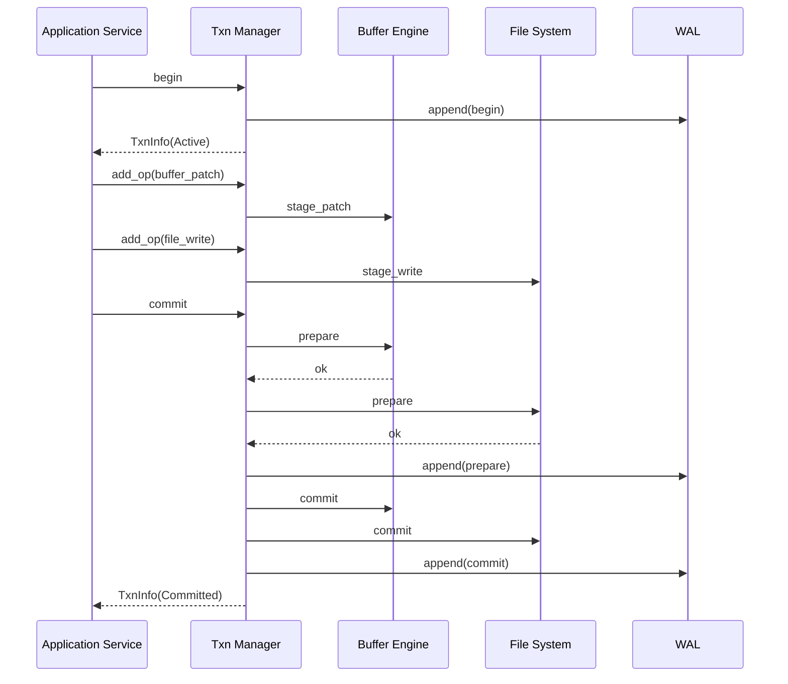
```mermaid
sequenceDiagram
    participant App as Application Service
    participant TM as Txn Manager
    participant Buf as Buffer Engine
    participant FS as File System
    participant WAL
    App->>TM: begin
    TM->>WAL: append(begin)
    TM-->>App: TxnInfo(Active)
    App->>TM: add_op(buffer_patch)
    TM->>Buf: stage_patch
    App->>TM: add_op(file_write)
    TM->>FS: stage_write
    App->>TM: commit
    TM->>Buf: prepare
    Buf-->>TM: ok
    TM->>FS: prepare
    FS-->>TM: ok
    TM->>WAL: append(prepare)
    TM->>Buf: commit
    TM->>FS: commit
    TM->>WAL: append(commit)
    TM-->>App: TxnInfo(Committed)
```

**Sequence Diagram（Commit 失败回滚）**

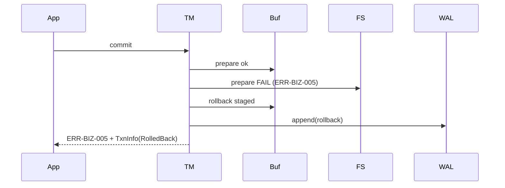
```mermaid
sequenceDiagram
    App->>TM: commit
    TM->>Buf: prepare ok
    TM->>FS: prepare FAIL (ERR-BIZ-005)
    TM->>Buf: rollback staged
    TM->>WAL: append(rollback)
    TM-->>App: ERR-BIZ-005 + TxnInfo(RolledBack)
```

**Idempotency / 隔离**

- Begin：依赖 session；同 session 不允许并发 active txn。
- AddOp：要求 transaction_id 处于 Active；否则 ERR-BIZ-003。
- Commit/Rollback：要求对应 state；否则 ERR-BIZ-003；重复 commit 等同无操作（state=Committed → 200）。
- 隔离：Snapshot（默认）/ Serializable；具体实现参见 DD-02 §7。

**Retry / Timeout**

- Begin：客户端可重试（依赖 session 状态检查）。
- Commit：失败可重试，TxnManager 探测 state 后返回正确结果。
- AddOp：失败必须回滚（不重试，避免部分应用）。
- 整体 timeout：Begin 时声明；超时后自动 RollingBack。

**可测试性导出**

| 维度 | 测试方法 |
|---|---|
| Begin 并发 | 同 session 并发 begin 第二次失败 |
| AddOp 后取消 | add_op → rollback → 检查 no side effect |
| Commit 失败 | mock participant prepare 失败 |
| 两阶段一致性 | commit 中途 crash 后重启验证 WAL |
| 隔离 | Snapshot 读已 commit 数据；Serializable 检测冲突 |
| 跨进程 | Participant 进程崩溃时 Txn 进入 Failed |

---

### 7.6 IF-BUF-001 Buffer Read / Patch

| 项目 | 内容 |
|---|---|
| IF ID | IF-BUF-001 |
| 名称 | Buffer Read / Patch |
| 上游 IF | IFD-001 §IF-BUF-001 |
| 对应 REQ | REQ-001 §14-19 |
| 对应 BD | AD-001 §11 Buffer Engine |
| 对应 DD | DD-02 §8 Buffer Engine (MOD-BE-001) |
| 关联 Traceability ID | DD-BUF-001 |
| 调用方 | Application Service（editor / search）/ TUI / Plugin |
| 实现方 | Core Buffer Engine (MOD-BE-001) |
| 层级 | Caller → Buffer Engine → FS Adapter (异步) |

**Request Schema**

```rust
pub struct BufferReadRequest {
    pub buffer_id: BufferId,               // 必填
    pub range: Option<Range<Position>>,   // 可选，None = 全量
    pub encoding: Option<Encoding>,       // 可选（重写编码）
    pub version: Option<u64>,              // 期望版本（一致性检查）
}

pub struct BufferPatchRequest {
    pub buffer_id: BufferId,               // 必填
    pub expected_version: u64,             // 必填（乐观锁）
    pub before_hash: Option<ContentHash>,  // 可选
    pub patches: Vec<Patch>,               // 必填，至少 1 个
    pub transaction_id: Option<TransactionId>, // 可选，事务性修改
    pub session_id: SessionId,
}
```

**Response Schema**

```rust
pub struct BufferReadResponse {
    pub buffer_id: BufferId,
    pub content: String,                   // 编码后文本
    pub encoding: Encoding,
    pub version: u64,                      // 当前版本号（递增）
    pub content_hash: ContentHash,
    pub line_count: u32,
    pub next_cursor: Option<Cursor>,
}

pub struct BufferPatchResponse {
    pub buffer_id: BufferId,
    pub new_version: u64,
    pub new_content_hash: ContentHash,
    pub diff_summary: DiffSummary,
    pub warnings: Vec<Diagnostic>,
}
```

**处理顺序（Patch B-001 ～ B-009）**

| 步骤 | 动作 | 错误 |
|---|---|---|
| B-001 | Session 写权限 + Buffer 存在性 | ERR-BIZ-001 / ERR-AUTHZ-001 |
| B-002 | 检查 expected_version 与 current 一致 | ERR-BIZ-005（乐观锁冲突） |
| B-003 | 检查 before_hash 与 current 一致 | ERR-BIZ-009 |
| B-004 | 验证所有 Patch 范围合法 | ERR-VAL-004 / ERR-VAL-008 |
| B-005 | 事务性修改：加入 transaction；非事务：直接应用 | — |
| B-006 | 应用 Patch（Patch Merge 冲突 → ERR-BIZ-007） | ERR-BIZ-007 |
| B-007 | 重新计算 content_hash + 版本号 +1 | — |
| B-008 | 触发 Index Invalidator（范围 hash 广播） | （降级为 WARN） |
| B-009 | 发布 BufferChanged 事件 + 返回 response | — |

**Sequence Diagram（Patch 成功）**

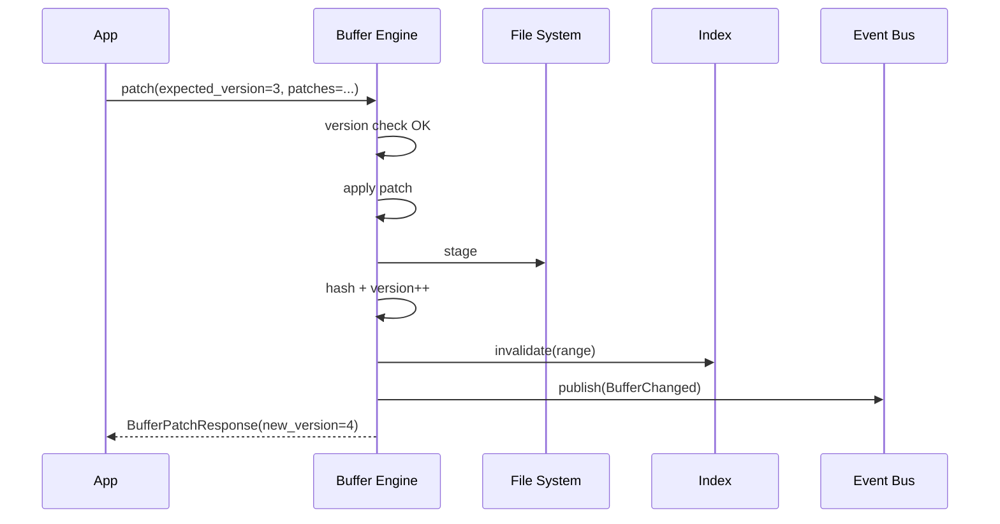
```mermaid
sequenceDiagram
    participant App
    participant BE as Buffer Engine
    participant FS as File System
    participant Idx as Index
    participant EB as Event Bus
    App->>BE: patch(expected_version=3, patches=...)
    BE->>BE: version check OK
    BE->>BE: apply patch
    BE->>FS: stage
    BE->>BE: hash + version++
    BE->>Idx: invalidate(range)
    BE->>EB: publish(BufferChanged)
    BE-->>App: BufferPatchResponse(new_version=4)
```

**Sequence Diagram（乐观锁冲突）**

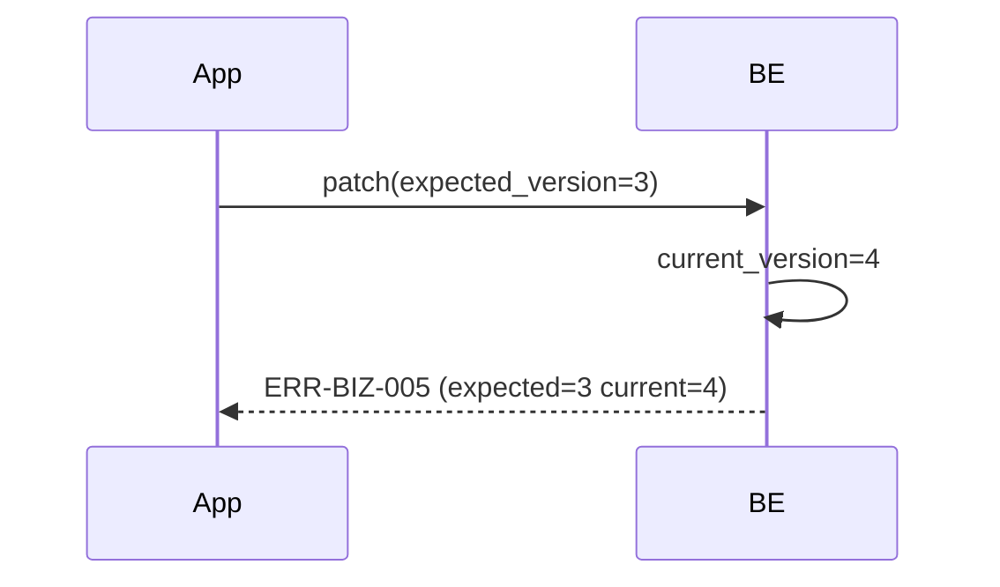
```mermaid
sequenceDiagram
    App->>BE: patch(expected_version=3)
    BE->>BE: current_version=4
    BE-->>App: ERR-BIZ-005 (expected=3 current=4)
```

**Idempotency**

- Patch 自身非天然幂等（重复 patch 会再 +1 version）。
- 客户端应使用：(a) 读最新 version 后重发；或 (b) 携带 `idempotency_key`（由 Application Service 转译为 version check + 缓存结果）。
- 事务性 patch：依赖 transaction_id 幂等。

**Retry / Timeout**

- 冲突类错误（ERR-BIZ-005/009）必须客户端重试：先重新读 latest version，再 patch。
- 写盘失败：可由事务回滚，客户端不直接重试。

**可测试性导出**

| 维度 | 测试方法 |
|---|---|
| 乐观锁 | expected_version 不匹配 |
| Patch 越界 | range 超过 buffer 长度 |
| 编码 | 提供 Shift-JIS 编码文件 |
| 大文件 | 1GB 文件不进入全内存 |
| 事务 | 在事务中 patch 然后 rollback |
| 并发 | 多 session 同 buffer 写 |
| Hash 校验 | 修改文件后 before_hash 不匹配 |

---

### 7.7 IF-FS-001 File System Internal API

| 项目 | 内容 |
|---|---|
| IF ID | IF-FS-001 |
| 名称 | File System Internal API（read / write / stat / watch） |
| 上游 IF | IFD-001 §IF-FS-001 |
| 对应 REQ | REQ-001 §14, §118 |
| 对应 BD | AD-001 §12 Workspace Abstraction |
| 对应 DD | DD-04b §10 + DD-01 §9 |
| 关联 Traceability ID | DD-FS-001 |
| 调用方 | Buffer Engine / Plugin / Command Handler |
| 实现方 | Core File System Adapter (capability.fs) |
| 层级 | Caller → FS Adapter → OS（tokio::fs） |

**Request Schema**

```rust
pub struct FsReadRequest {
    pub path: WorkspacePath,               // 必填，相对 workspace 根
    pub offset: Option<u64>,               // 可选（chunk read）
    pub length: Option<u64>,               // 可选
    pub encoding: Option<Encoding>,       // 可选
    pub follow_symlinks: bool,            // 默认 false
}

pub struct FsWriteRequest {
    pub path: WorkspacePath,
    pub content: Bytes,
    pub mode: WriteMode,                   // Create | Overwrite | Append
    pub create_parents: bool,
    pub transaction_id: Option<TransactionId>,
}

pub struct FsStatRequest {
    pub path: WorkspacePath,
}

pub struct FsWatchRequest {
    pub paths: Vec<WorkspacePath>,
    pub recursive: bool,
    pub event_mask: WatchEventMask,        // Create | Modify | Delete | Rename
}
```

**处理顺序（Write F-W01 ～ F-W06）**

| 步骤 | 动作 | 错误 |
|---|---|---|
| F-W01 | 解析 WorkspacePath → 物理路径（含 sandbox 校验） | ERR-VAL-008 / ERR-AUTHZ-003 |
| F-W02 | 校验 actor 对目标路径有 write 权限 | ERR-AUTHZ-003 |
| F-W03 | 检查路径在 `allowed_paths` / `write_paths` 内 | ERR-AUTHZ-003 |
| F-W04 | 检查磁盘配额 | ERR-BIZ-006 |
| F-W05 | 事务性：加入 transaction；非事务：直接写 | — |
| F-W06 | `tokio::fs::write`（临时文件 + atomic rename） | ERR-DB-001 / ERR-SYS-005 |

**Sequence Diagram（Write 原子化）**

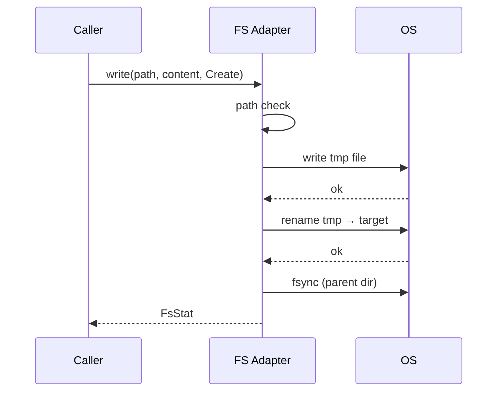
```mermaid
sequenceDiagram
    participant Caller
    participant FS as FS Adapter
    participant OS
    Caller->>FS: write(path, content, Create)
    FS->>FS: path check
    FS->>OS: write tmp file
    OS-->>FS: ok
    FS->>OS: rename tmp → target
    OS-->>FS: ok
    FS->>OS: fsync (parent dir)
    FS-->>Caller: FsStat
```

**Sequence Diagram（越界）**

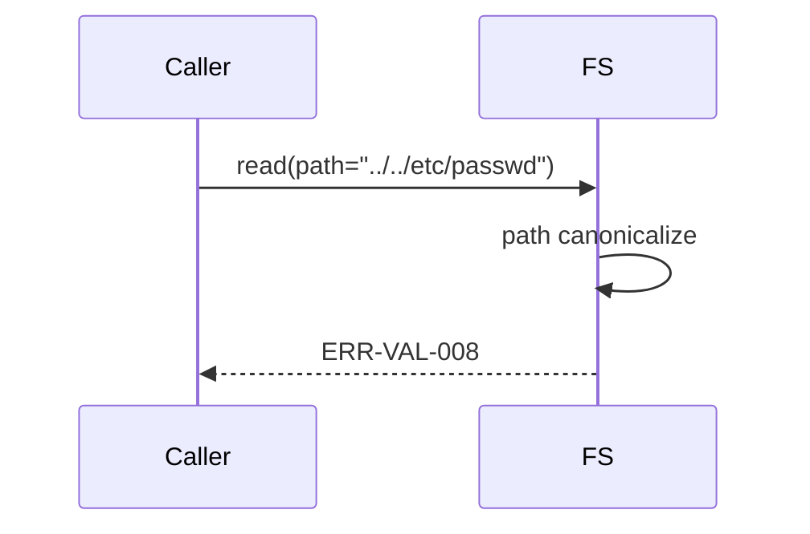
```mermaid
sequenceDiagram
    Caller->>FS: read(path="../../etc/passwd")
    FS->>FS: path canonicalize
    FS-->>Caller: ERR-VAL-008
```

**Idempotency**

- Write 非幂等（重复写覆盖）；客户端必须依赖事务或 `idempotency_key`。
- Read 幂等。

**Retry / Timeout**

- 临时文件 rename 失败（Windows 上常见）→ 退避重试 3 次（**【TBD：默认 100/200/400ms 指数退避，待 NFR-001 确认】**）。
- 磁盘满：ERR-SYS-005，不重试。

**可测试性导出**

| 维度 | 测试方法 |
|---|---|
| 越界 | path = "../" |
| 符号链接 | symlink 指向 workspace 外部 |
| 并发 | 多 actor 同文件写 |
| 大文件 | offset/length chunk read |
| 原子性 | write 中途 kill 进程，验证原文件不变 |
| 事务 | 在事务中 write 然后 rollback |

---

### 7.8 IF-IDX-001 Index Internal API

| 项目 | 内容 |
|---|---|
| IF ID | IF-IDX-001 |
| 名称 | Index Internal API（update / query / invalidate） |
| 上游 IF | IFD-001 §IF-IDX-001 |
| 对应 REQ | REQ-001 §52-54, §103 |
| 对应 BD | AD-001 §13 Local Compute Layer |
| 对应 DD | DD-01 §10 + DD-02 §9 |
| 关联 Traceability ID | DD-IDX-001 |
| 调用方 | Buffer Engine（invalidate 触发）/ Search & Symbol Command |
| 实现方 | Core Index Service (MOD-IDX-001) |
| 层级 | Caller → Index Service → 后端（tantivy / redb / 自实现 CRDT） |

**Request Schema**

```rust
pub struct IndexUpdateRequest {
    pub workspace_id: WorkspaceId,
    pub document_id: DocumentId,
    pub content_hash: ContentHash,         // 必填，去重
    pub text: String,                      // 必填
    pub language: Option<String>,
    pub transaction_id: Option<TransactionId>,
}

pub struct IndexQueryRequest {
    pub workspace_id: WorkspaceId,
    pub query: IndexQuery,                 // TextQuery | RegexQuery | SymbolQuery | SemanticQuery
    pub limit: u32,                        // 默认 100
    pub cursor: Option<Cursor>,
}

pub struct IndexInvalidateRequest {
    pub workspace_id: WorkspaceId,
    pub document_id: DocumentId,
    pub content_hash: ContentHash,         // 旧 hash（确认仍需失效）
}
```

**处理顺序（Update I-U01 ～ I-U05）**

| 步骤 | 动作 | 错误 |
|---|---|---|
| I-U01 | 检查 content_hash 与已索引一致 | （一致 → 跳过；幂等） |
| I-U02 | 事务性：加入 transaction；非事务：直接更新 | — |
| I-U03 | 分词 / 解析 / Embedding（异步 Background Task） | ERR-EXT-011（embedding 失败） |
| I-U04 | 写入索引后端 | ERR-DB-001/002 |
| I-U05 | 发布 IndexUpdated 事件 | （降级为 WARN） |

**Sequence Diagram（Query）**

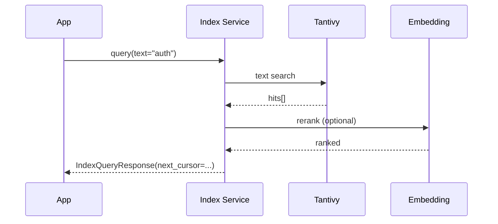
```mermaid
sequenceDiagram
    participant App
    participant Idx as Index Service
    participant BE as Tantivy
    participant Emb as Embedding
    App->>Idx: query(text="auth")
    Idx->>BE: text search
    BE-->>Idx: hits[]
    Idx->>Emb: rerank (optional)
    Emb-->>Idx: ranked
    Idx-->>App: IndexQueryResponse(next_cursor=...)
```

**Idempotency**

- Update：content_hash 相同则跳过（天然幂等）。
- Invalidate：content_hash 匹配才执行（防误删）。

**Retry / Timeout**

- Embedding 失败：标记 index 为 stale，前端查询降级为纯文本搜索。
- Index 后端不可用：返回 ERR-DB-001，客户端可降级为 streaming search。

**可测试性导出**

| 维度 | 测试方法 |
|---|---|
| 幂等 | 同 content_hash 多次 update |
| 失效 | 改 hash 后 invalidate |
| 错误聚合 | embedding 失败时降级 |
| 大规模 | 100k 文档查询 |
| 并发 | 多 session 并发 query |

---

### 7.9 IF-PLG-001 Plugin Manager Internal API

| 项目 | 内容 |
|---|---|
| IF ID | IF-PLG-001 |
| 名称 | Plugin Manager Internal API（discover / install / enable / load / unload / hot-swap） |
| 上游 IF | IFD-001 §IF-PLG-001 |
| 对应 REQ | REQ-001 §36-47 |
| 对应 BD | AD-001 §15 Plugin Manager |
| 对应 DD | DD-03 §5-8 |
| 关联 Traceability ID | DD-PLG-001 |
| 调用方 | Command Handler / Adapter / Capability Registry |
| 实现方 | Core Plugin Manager (MOD-PM-001) + Loader (MOD-PL-001) + Sandbox (MOD-PS-001) |
| 层级 | Caller → PM → Loader → Sandbox → Worker / WASM |

**Request Schema**

```rust
pub struct PluginLoadRequest {
    pub plugin_id: PluginId,                // 必填
    pub manifest: PluginManifest,           // 必填（DD-03 §6）
    pub runtime: PluginRuntime,             // Wasm | NativeWorker
    pub signature: Option<Signature>,       // 可选
    pub session_id: SessionId,
}

pub struct PluginUnloadRequest {
    pub plugin_id: PluginId,
    pub drain_timeout_ms: u32,              // 等待活跃任务结束
    pub force: bool,                        // true = 强制 cancel
}

pub struct PluginHotSwapRequest {
    pub plugin_id: PluginId,
    pub new_manifest: PluginManifest,
    pub state_migration: Option<StateMigrationSpec>, // 状态迁移规约
}
```

**State Machine**

参见 DD-03 §7（Installed → Resolved → Loaded → Initialized → Active → Suspended → Unloaded；异常 FAILED / QUARANTINED）。

**处理顺序（Load PL-001 ～ PL-007）**

| 步骤 | 动作 | 错误 |
|---|---|---|
| PL-001 | 验证 manifest 签名（SD-001 §3.4） | ERR-AUTH-003 / ERR-SYS-006 |
| PL-002 | 权限检查（session 拥有 install capability） | ERR-AUTHZ-001 |
| PL-003 | 资源预算检查（CPU/RAM/disk） | ERR-BIZ-006 |
| PL-004 | 加载到 runtime（dlopen / wasmtime / spawn） | ERR-EXT-007/008/010 |
| PL-005 | 验证 Plugin 报告的 capabilities 与 manifest 一致 | ERR-SYS-006 |
| PL-006 | 注册到 Capability Registry | ERR-BIZ-002（重复 ID） |
| PL-007 | 发布 PluginLoaded 事件 | （降级为 WARN） |

**Sequence Diagram（Load）**

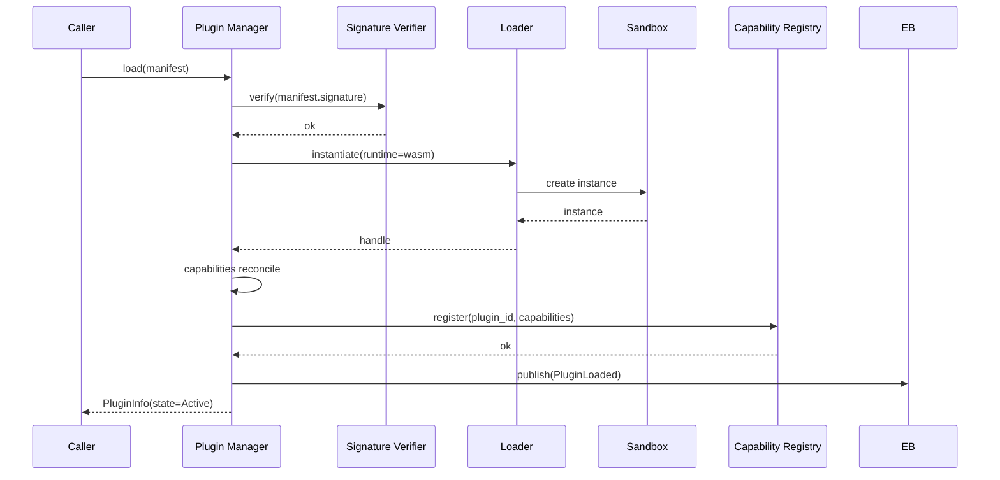
```mermaid
sequenceDiagram
    participant Caller
    participant PM as Plugin Manager
    participant Sig as Signature Verifier
    participant Ld as Loader
    participant SB as Sandbox
    participant CR as Capability Registry
    Caller->>PM: load(manifest)
    PM->>Sig: verify(manifest.signature)
    Sig-->>PM: ok
    PM->>Ld: instantiate(runtime=wasm)
    Ld->>SB: create instance
    SB-->>Ld: instance
    Ld-->>PM: handle
    PM->>PM: capabilities reconcile
    PM->>CR: register(plugin_id, capabilities)
    CR-->>PM: ok
    PM->>EB: publish(PluginLoaded)
    PM-->>Caller: PluginInfo(state=Active)
```

**Sequence Diagram（Unload 失败）**

```mermaid
sequenceDiagram
    Caller->>PM: unload(plugin_id, drain_timeout=5s)
    PM->>PM: stop accepting new
    PM->>PM: wait for drain (5s)
    alt tasks finished
        PM->>CR: unregister
        PM-->>Caller: ok
    else timeout
        PM->>PM: force cancel active tasks
        PM->>CR: unregister
        PM->>EB: publish(PluginFailed)
        PM-->>Caller: ERR-BIZ-011
    end
```

**Sequence Diagram（Hot Swap）**

参见 DD-03 §8（含 state migration / graceful shutdown）。

**Idempotency / Retry / Timeout**

- Load：重复 load 同 ID → ERR-BIZ-002；卸载后重试 OK。
- Unload：force=false 时等待 drain；force=true 时立即取消（可能引发未保存状态丢失，需调用方接受）。
- Timeout：drain 默认 5s（**【TBD：待 NFR-001 确认】**）。

**可测试性导出**

| 维度 | 测试方法 |
|---|---|
| 签名 | 篡改 manifest 后 verify 失败 |
| 资源 | 注入超额资源预算 |
| WASM Trap | mock plugin WASM trap |
| Worker 崩溃 | kill -9 worker 后 PluginFailed |
| 卸载竞态 | 卸载时同时 invoke capability |
| Hot Swap | 旧实例状态迁移到新实例 |

---

### 7.10 IF-SCH-001 Scheduler Internal API

| 项目 | 内容 |
|---|---|
| IF ID | IF-SCH-001 |
| 名称 | Scheduler Internal API（submit / cancel / status） |
| 上游 IF | IFD-001 §IF-SCH-001 |
| 对应 REQ | REQ-001 §107, §108 |
| 对应 BD | AD-001 §14 Scheduler |
| 对应 DD | DD-01 §11 |
| 关联 Traceability ID | DD-SCH-001 |
| 调用方 | Command Handler / Background Services |
| 实现方 | Core Task Scheduler (MOD-SCH-001) |
| 层级 | Caller → Scheduler → Worker Pool（Tokio） |

**Request Schema**

```rust
pub struct TaskSubmitRequest {
    pub task_id: Option<TaskId>,            // 客户端可选
    pub kind: TaskKind,                     // Indexing | Embedding | Build | Test | Search | Custom
    pub priority: Priority,                 // Low | Normal | High | Critical
    pub payload: serde_json::Value,
    pub session_id: SessionId,
    pub dependencies: Vec<TaskId>,          // DAG
    pub deadline: Option<DateTime<Utc>>,
    pub cancellation: CancellationToken,
}

pub struct TaskCancelRequest {
    pub task_id: TaskId,
    pub reason: String,
}
```

**处理顺序（Submit SC-001 ～ SC-006）**

| 步骤 | 动作 | 错误 |
|---|---|---|
| SC-001 | Session 资源预算检查 | ERR-BIZ-006 |
| SC-002 | 验证 dependencies 存在 | ERR-BIZ-001 |
| SC-003 | 分配 task_id（缺则生成） | — |
| SC-004 | 插入调度队列（按 priority + deadline） | — |
| SC-005 | 唤醒 worker pool | — |
| SC-006 | 返回 TaskInfo(state=Queued) | — |

**Sequence Diagram（Submit + Execute）**

```mermaid
sequenceDiagram
    participant Caller
    participant Sch as Scheduler
    participant Pool as Worker Pool
    participant Exec as Executor
    Caller->>Sch: submit(TaskSubmitRequest)
    Sch->>Sch: priority queue put
    Sch-->>Caller: TaskInfo(Queued)
    Pool->>Sch: pull
    Sch-->>Pool: task
    Pool->>Exec: spawn
    Exec-->>Sch: progress events
    Exec-->>Sch: completed / failed
    Sch-->>Caller: TaskInfo(Completed)
```

**Idempotency / Retry / Timeout**

- Submit：依赖 `task_id` 客户端提供 → 重复提交返回原 task。
- Cancel：幂等；非 Queued 状态也允许 cancel，会触发 CancellationToken。
- Timeout：deadline 到期自动 cancel。

**可测试性导出**

| 维度 | 测试方法 |
|---|---|
| 优先级 | 高优先级先于低优先级 |
| DAG | 依赖未完成时阻塞 |
| 取消 | cancel 后 Execution 收到 ERR-BIZ-008 |
| Deadline | deadline 到期自动 cancel |
| 资源预算 | 超出后 task 排队 |

---

### 7.11 IF-REST-002 REST Adapter → Core

| 项目 | 内容 |
|---|---|
| IF ID | IF-REST-002 |
| 名称 | REST Adapter → Core（HTTP/JSON） |
| 上游 IF | IFD-001 §IF-REST-002 |
| 对应 REQ | REQ-001 §59-68 |
| 对应 BD | AD-001 §4.2 Adapter Layer |
| 对应 DD | DD-04b §11 (HTTP server) |
| 关联 Traceability ID | DD-REST-002 |
| 调用方 | 外部 HTTP Client（CI / Web IDE / Remote Tool） |
| 实现方 | REST Adapter (MOD-REST-001) → IF-CMD-001 |
| 层级 | Client → HTTP Server (axum) → Middleware Chain → IF-CMD-001 |

**路由（与 REQ-001 §64 对齐）**

| Method | Path | 下游 IF |
|---|---|---|
| GET | /v1/system/health | Health Check（不经过 IF-AUTH-001） |
| GET | /v1/system/info | IF-CMD-001 `system.info` |
| POST | /v1/commands | IF-CMD-001 |
| GET | /v1/commands/{id} | IF-CMD-001 `command.get` |
| GET | /v1/capabilities | IF-CAP-001 `capability.list` |
| POST | /v1/capabilities/{id}/invoke | IF-CAP-001 |
| POST/GET/DELETE | /v1/sessions | IF-SES-001 |
| POST | /v1/transactions | IF-TXN-001 |
| GET | /v1/events | IF-EVT-001（升级为 SSE） |
| POST/GET | /v1/files, /v1/buffers, /v1/symbols, /v1/search, /v1/diagnostics, /v1/context, /v1/tasks, /v1/plugins | 对应 IF |

**Middleware Chain（顺序敏感）**

```mermaid
flowchart LR
    A[HTTP Request] --> B[TraceID 注入]
    B --> C[Rate Limit（per IP / per session）]
    C --> D[CORS]
    D --> E[Body Size Limit]
    E --> F[Authentication 提取]
    F --> G[Authorization 粗粒度检查]
    G --> H[Timeout 注入]
    H --> I[Request Logging]
    I --> J[MOD-API-001]
    J --> K[Response 序列化]
    K --> L[Audit Log 写入]
    L --> M[HTTP Response]
```

**处理顺序（R-001 ～ R-008）**

| 步骤 | 动作 | 错误 |
|---|---|---|
| R-001 | 分配/提取 trace_id（`X-Request-Id` 或生成） | — |
| R-002 | 限流（per-IP / per-session token bucket） | ERR-BIZ-006（429） |
| R-003 | 验证 Body Size ≤ **【TBD：默认 16 MiB，待 NFR-001 确认】** | ERR-VAL-003（413） |
| R-004 | 提取并验证 Authorization header | ERR-AUTH-001 |
| R-005 | 反序列化 Body | ERR-VAL-001 |
| R-006 | 注入 CancellationToken（HTTP client 断开时 cancel） | — |
| R-007 | 转发到 IF-CMD-001 | （透传） |
| R-008 | 序列化 Response（含 trace_id 写入 header） | — |

**Idempotency / Retry / Timeout**

- 默认 30s 硬超时（**【TBD：待 NFR-001 确认】**），可在 `Timeout` header 覆盖。
- 客户端重试：参考 IF-CMD-001 的 `idempotency_key` 机制。
- HTTP 层面 Retry-After header 在 503/429 时由 adapter 自动填充。

**HTTP Status 对应**

参见 §6.1 与 IF-CMD-001 §7.1。SSE 升级路径见 §7.13。

**可测试性导出**

| 维度 | 测试方法 |
|---|---|
| 限流 | 超过 RPS 触发 429 |
| 超大 Body | 发送 > 16MiB |
| Token 缺失 | 无 Authorization |
| 超时 | 慢 handler 触发 504 |
| 取消 | Client 断开连接 |
| SSE 升级 | Accept: text/event-stream |
| Trace | 注入 X-Request-Id 后在日志中验证 |

---

### 7.12 IF-JSONRPC-001 stdio JSON-RPC Adapter

| 项目 | 内容 |
|---|---|
| IF ID | IF-JSONRPC-001 |
| 名称 | stdio JSON-RPC Adapter |
| 上游 IF | IFD-001 §IF-JSONRPC-001 |
| 对应 REQ | REQ-001 §62 P0 / §71 LangGraph Adapter |
| 对应 BD | AD-001 §4.2 |
| 对应 DD | DD-04b §11 |
| 关联 Traceability ID | DD-JRPC-001 |
| 调用方 | LangGraph / 本地 Agent |
| 实现方 | JSON-RPC Adapter (MOD-JRPC-001) → IF-CMD-001 |
| 层级 | Client ↔ stdin/stdout ↔ JSON-RPC ↔ IF-CMD-001 |

**请求体（JSON-RPC 2.0）**

```json
{
  "jsonrpc": "2.0",
  "id": "01J...",
  "method": "command.dispatch",
  "params": { "name": "file.read", "arguments": {...}, "session_id": "..." }
}
```

**响应体**

```json
{
  "jsonrpc": "2.0",
  "id": "01J...",
  "result": { "status": "Ok", "data": {...} }
}
```

**错误映射（JSON-RPC error.code）**

| JSON-RPC code | CoreError | 含义 |
|---|---|---|
| -32700 | — | Parse error（包装 ERR-VAL-001） |
| -32600 | — | Invalid Request |
| -32601 | ERR-SYS-006 | Method not found |
| -32602 | ERR-VAL-001/002/007 | Invalid params |
| -32603 | ERR-SYS-001/002 | Internal error |
| -32000 ～ -32099 | （自定义） | 服务端自定义错误（参见 §6.1） |

**处理顺序（JR-001 ～ JR-006）**

| 步骤 | 动作 | 错误 |
|---|---|---|
| JR-001 | 读取 line-delimited JSON | ERR-VAL-001（Parse） |
| JR-002 | 验证 JSON-RPC 2.0 格式 | ERR-VAL-001 |
| JR-003 | 反序列化 params → CommandRequest | ERR-VAL-001/007 |
| JR-004 | 转发到 IF-CMD-001 | （透传） |
| JR-005 | 序列化 Response | — |
| JR-006 | 写 stdout + flush | ERR-SYS-005 |

**Idempotency / Retry / Timeout**

- JSON-RPC 单连接单请求响应模型，**默认无流**（流式见 §7.13 SSE）。
- 客户端断开（EOF）：服务端 cancel 所有 in-flight Execution。
- 心跳：可选 `$/ping` 方法（**【TBD：是否需要，待 NFR-001 确认】**）。

**可测试性导出**

| 维度 | 测试方法 |
|---|---|
| 格式错误 | 发送非法 JSON |
| Method 不存在 | method="unknown" |
| 长任务 | 发送长任务后断开 |
| 并发 | 单连接单请求（标准）；如需并发需多连接 |
| Auth | 透传 token（由 LangGraph Adapter 注入） |

---

### 7.13 IF-SSE-001 SSE Stream Internal API

| 项目 | 内容 |
|---|---|
| IF ID | IF-SSE-001 |
| 名称 | Server-Sent Events Stream |
| 上游 IF | IFD-001 §IF-SSE-001 |
| 对应 REQ | REQ-001 §80-81 |
| 对应 BD | AD-001 §4.2 |
| 对应 DD | DD-04b §11 |
| 关联 Traceability ID | DD-SSE-001 |
| 调用方 | HTTP Client（CI / Web IDE / Stream 消费者） |
| 实现方 | SSE Adapter (MOD-SSE-001) → IF-CMD-001 + IF-EVT-001 |
| 层级 | Client → HTTP/1.1 chunked → SSE parser → IF-CMD-001 (POST → stream) 或 IF-EVT-001 (GET → subscribe) |

**两种语义**

| Endpoint | 语义 | 适用 |
|---|---|---|
| POST /v1/commands → 升级为 `Accept: text/event-stream` | 单命令流式结果（边算边推） | Search / Build / Test / AI Inference |
| GET /v1/events?filter=... | 持续事件订阅 | 实时 UI 更新 / Agent 状态监控 |

**Event 帧**

```text
id: <sequence>
event: <EventType>
data: <JSON payload>

```

**Sequence Diagram（Command Stream）**

```mermaid
sequenceDiagram
    participant Cli
    participant SSE
    participant CB
    participant H as Handler
    Cli->>SSE: POST /v1/commands (Accept: text/event-stream)
    SSE->>CB: dispatch
    CB->>H: invoke
    H-->>CB: CommandStarted
    CB-->>SSE: emit
    SSE-->>Cli: event: CommandStarted
    loop progress
        H-->>CB: TaskProgress
        CB-->>SSE: emit
        SSE-->>Cli: event: TaskProgress
    end
    H-->>CB: CommandCompleted
    CB-->>SSE: emit + close
    SSE-->>Cli: event: CommandCompleted + close
```

**Sequence Diagram（Event Subscribe）**

```mermaid
sequenceDiagram
    Cli->>SSE: GET /v1/events?filter=File*
    SSE->>EB: subscribe(filter)
    EB-->>SSE: handle
    SSE-->>Cli: : connected
    loop events
        EB-->>SSE: EventEnvelope
        SSE-->>Cli: event: FileOpened\ndata: {...}
    end
    Cli->>SSE: disconnect
    SSE->>EB: cancel subscription
```

**Idempotency / Retry / Timeout**

- Event Stream：客户端应通过 `Last-Event-Id` 头实现重连续传（IF-EVT-001 `from_sequence`）。
- Command Stream：单次执行；失败可由 IF-CMD-001 的 `idempotency_key` 重试。
- 心跳：默认 30s（**【TBD：待 NFR-001 确认】**）；超时未发心跳则视为客户端断开。
- 取消：客户端断开 → CancellationToken 触发。

**可测试性导出**

| 维度 | 测试方法 |
|---|---|
| 流式 | progress 事件实时到达 |
| 重连 | 断开 + Last-Event-Id |
| 取消 | 客户端断开 |
| 过滤 | filter 不匹配时不推送 |
| 心跳 | 30s 未交互 |

---

### 7.14 IF-MCP-001 MCP Adapter Internal API

| 项目 | 内容 |
|---|---|
| IF ID | IF-MCP-001 |
| 名称 | MCP Adapter（Model Context Protocol） |
| 上游 IF | IFD-001 §IF-MCP-001 |
| 对应 REQ | REQ-001 §132 |
| 对应 BD | AD-001 §4.2 |
| 对应 DD | DD-04b §11 |
| 关联 Traceability ID | DD-MCP-001 |
| 调用方 | MCP Client（Claude Desktop / 其他 MCP 兼容 Agent） |
| 实现方 | MCP Adapter (MOD-MCP-001) → IF-CMD-001 |
| 层级 | MCP Client ↔ stdio/HTTP ↔ MCP Adapter ↔ IF-CMD-001 |

**Tools 映射**

MCP Tool description 直接派生自 Rust Type → JSON Schema（参见 REQ-001 §61），Tool handler 路由到 `IF-CMD-001`。

**Tool Schema 示例（`file.read`）**

```json
{
  "name": "file.read",
  "description": "Read a file from workspace",
  "inputSchema": {
    "type": "object",
    "properties": {
      "path": { "type": "string" },
      "range": { "type": "object", "properties": { "start": {"type": "integer"}, "end": {"type": "integer"} } }
    },
    "required": ["path"]
  }
}
```

**处理顺序（MC-001 ～ MC-005）**

| 步骤 | 动作 | 错误 |
|---|---|---|
| MC-001 | 解析 MCP `tools/call` 请求 | ERR-VAL-001 |
| MC-002 | 映射到 CommandRequest | ERR-SYS-006 |
| MC-003 | 转发到 IF-CMD-001 | （透传） |
| MC-004 | 包装响应为 MCP `content` 数组 | — |
| MC-005 | 返回 MCP `CallToolResult` | — |

**Idempotency / Retry / Timeout**

- MCP 协议层：客户端可重试；服务端依赖 IF-CMD-001 的幂等机制。
- Auth：MCP 透传客户端的 session_id / token（由 MCP Client 注入）。

**可测试性导出**

| 维度 | 测试方法 |
|---|---|
| Tool 列表 | tools/list 验证 |
| Tool 调用 | tools/call file.read |
| 错误 | 错误响应格式符合 MCP spec |
| Schema | 字段类型与 REQ-001 §61 一致 |

---

### 7.15 IF-AUTH-001 Internal Auth Pipeline

| 项目 | 内容 |
|---|---|
| IF ID | IF-AUTH-001 |
| 名称 | Internal Auth Pipeline（authenticate + authorize） |
| 上游 IF | IFD-001 §IF-AUTH-001 |
| 对应 REQ | REQ-001 §117-122 |
| 对应 BD | SD-001 §3-4 |
| 对应 DD | DD-04b §12 Security Common |
| 关联 Traceability ID | DD-AUTH-001 |
| 调用方 | 所有 Adapter（IF-REST-002 / IF-JSONRPC-001 / IF-SSE-001 / IF-MCP-001） |
| 实现方 | Core Security Module (MOD-SEC-001) |
| 层级 | Adapter → Auth Pipeline → Security Module → Session/Policy Store |

**Request Schema（内部）**

```rust
pub struct AuthRequest {
    pub credential: Credential,            // Bearer token | mTLS | API key
    pub requested_session: Option<SessionId>, // 可选，绑定到现有 session
    pub requested_workspace: Option<WorkspaceId>,
    pub client_info: ClientInfo,
}

pub struct AuthorizeRequest {
    pub principal: Principal,
    pub action: Action,                    // capability id 或 command name
    pub target: Option<Target>,            // path / buffer / resource
    pub context: AuthorizeContext,         // session / time / network / process
}
```

**处理顺序（Authenticate AU-001 ～ AU-005）**

| 步骤 | 动作 | 错误 |
|---|---|---|
| AU-001 | 提取 credential（Header / Body / TLS） | ERR-AUTH-001 |
| AU-002 | 验证凭证格式 | ERR-AUTH-001 |
| AU-003 | 解析并验证签名/有效性 | ERR-AUTH-002/003/004 |
| AU-004 | 解析 claims（subject / scope / workspace / session binding） | ERR-AUTH-003 |
| AU-005 | 返回 Principal（含 actor / role / scope / session 候选） | — |

**处理顺序（Authorize AZ-001 ～ AZ-004）**

| 步骤 | 动作 | 错误 |
|---|---|---|
| AZ-001 | 加载 RBAC 策略（session + role + workspace） | ERR-DB-001 |
| AZ-002 | 匹配 action → required capabilities | — |
| AZ-003 | 校验 target 路径在 allowed_paths | ERR-AUTHZ-003 |
| AZ-004 | 校验 network / process 策略 | ERR-AUTHZ-004/005 |
| 结果 | Allow / Deny | ERR-AUTHZ-001 |

**Sequence Diagram（Authn + Authz）**

```mermaid
sequenceDiagram
    participant Adp as Adapter
    participant AP as Auth Pipeline
    participant Sec as Security Module
    participant Pol as Policy Store
    Adp->>AP: authenticate(credential)
    AP->>Sec: verify(credential)
    Sec-->>AP: Principal
    Adp->>AP: authorize(Principal, action, target)
    AP->>Pol: load(workspace, role)
    Pol-->>AP: policy
    AP->>AP: decision
    AP-->>Adp: Allow / Deny (ERR-AUTHZ-001)
```

**Idempotency / Retry / Timeout**

- Authn：内部 API，调用方一般同步调用；credential 解析可缓存（**【TBD：缓存 TTL，待 NFR-001 确认】**）。
- Authz：每次决策都需重新评估（含 session 状态、time-of-day、target）。

**可测试性导出**

| 维度 | 测试方法 |
|---|---|
| Token 缺失 | 无 Authorization header |
| Token 过期 | expired token |
| 签名错误 | 篡改 token |
| 越权 | principal 没有目标 capability |
| 越界 | path 不在 allowed_paths |
| RBAC | role 升级 |
| Time-based | 时段限制策略 |

---

## 8. Traceability 总表

| DD ID | BD ID | NFR ID | SD ID | REQ ID | 实现对象 | 测试观点 |
|---|---|---|---|---|---|---|
| DD-CMD-001 | BD-5.1 | NFR-3.2 安全 | SD-3.1, SD-4.1 | REQ-24, REQ-25, REQ-26, REQ-65, REQ-68 | MOD-API-001 | §7.1 表 |
| DD-EVT-001 | BD-6.1 | NFR-5.2 观测 | — | REQ-33, REQ-34, REQ-35 | Event Bus | §7.2 表 |
| DD-CAP-001 | BD-7.1 | NFR-3.1 性能 | SD-4.3 | REQ-29, REQ-30, REQ-31, REQ-32 | Capability Registry | §7.3 表 |
| DD-SES-001 | BD-9.1 | NFR-2.1 可用性 | SD-3.2 | REQ-9, REQ-10 | Session Manager | §7.4 表 |
| DD-TXN-001 | BD-10.1 | NFR-3.4 一致性 | — | REQ-20, REQ-21, REQ-22, REQ-23 | Transaction Manager | §7.5 表 |
| DD-BUF-001 | BD-11.1 | NFR-1.2 性能 | — | REQ-14, REQ-15, REQ-16, REQ-17, REQ-18, REQ-19 | Buffer Engine | §7.6 表 |
| DD-FS-001 | BD-12.1 | NFR-3.3 安全 | SD-5.2, SD-6.2 | REQ-14, REQ-118 | FS Adapter | §7.7 表 |
| DD-IDX-001 | BD-13.1 | NFR-1.3 性能 | — | REQ-52, REQ-53, REQ-54, REQ-103 | Index Service | §7.8 表 |
| DD-PLG-001 | BD-15.1 | NFR-3.5 隔离 | SD-3.4, SD-6.1 | REQ-36-47 | Plugin Manager | §7.9 表 |
| DD-SCH-001 | BD-14.1 | NFR-1.4 调度 | — | REQ-107, REQ-108 | Scheduler | §7.10 表 |
| DD-REST-002 | BD-4.2 | NFR-2.2 可用性, NFR-3.2 安全 | SD-3.1, SD-8.1 | REQ-59, REQ-60, REQ-62, REQ-64, REQ-65, REQ-66, REQ-67, REQ-68 | REST Adapter | §7.11 表 |
| DD-JRPC-001 | BD-4.2 | NFR-2.2 | SD-3.1 | REQ-62, REQ-71, REQ-72 | JSON-RPC Adapter | §7.12 表 |
| DD-SSE-001 | BD-4.2 | NFR-5.2 | — | REQ-80, REQ-81 | SSE Adapter | §7.13 表 |
| DD-MCP-001 | BD-4.2 | NFR-3.2 | SD-3.1 | REQ-132 | MCP Adapter | §7.14 表 |
| DD-AUTH-001 | BD-3.1 | NFR-3.1 安全 | SD-3, SD-4 | REQ-117-122 | Security Module | §7.15 表 |
| DD-ERR-001 | BD-4.4 | NFR-3.2, NFR-2.3 | — | REQ-65 | Error System | §6 全表 |

---

## 9. 未决事项一览（TBD）

| TBD ID | 内容 | 影响范围 | 负责人 | 期限 | 状态 |
|---|---|---|---|---|---|
| TBD-04-01 | IF-CMD-001 幂等键 TTL（建议 24h） | IF-CMD-001 / IF-REST-002 | 【TBD：NFR-001 §4 运维负责人】 | 【TBD】 | 待确认 |
| TBD-04-02 | Command timeout 硬上限（建议 30s） | IF-CMD-001 全局 | 【TBD：NFR-001 §1 性能负责人】 | 【TBD】 | 待确认 |
| TBD-04-03 | EventBus publish timeout（建议 100ms） | IF-EVT-001 | 【TBD】 | 【TBD】 | 待确认 |
| TBD-04-04 | Capability Router 熔断阈值（N=3, duration=30s） | IF-CAP-001 | 【TBD】 | 【TBD】 | 待确认 |
| TBD-04-05 | FS write rename 退避（100/200/400ms） | IF-FS-001 | 【TBD】 | 【TBD】 | 待确认 |
| TBD-04-06 | Session TTL（关闭失败时强制回收，1h） | IF-SES-001 | 【TBD】 | 【TBD】 | 待确认 |
| TBD-04-07 | Plugin unload drain timeout（5s） | IF-PLG-001 | 【TBD】 | 【TBD】 | 待确认 |
| TBD-04-08 | REST Body Size 上限（16 MiB） | IF-REST-002 | 【TBD】 | 【TBD】 | 待确认 |
| TBD-04-09 | REST Command timeout 默认（30s） | IF-REST-002 | 【TBD】 | 【TBD】 | 待确认 |
| TBD-04-10 | JSON-RPC 是否提供 `$/ping` 心跳 | IF-JSONRPC-001 | 【TBD】 | 【TBD】 | 待确认 |
| TBD-04-11 | SSE 心跳间隔（30s） | IF-SSE-001 | 【TBD】 | 【TBD】 | 待确认 |
| TBD-04-12 | Authn 凭证缓存 TTL | IF-AUTH-001 | 【TBD】 | 【TBD】 | 待确认 |
| TBD-04-13 | Capability Router per-provider timeout 上限（60s） | IF-CAP-001 | 【TBD】 | 【TBD】 | 待确认 |
| TBD-04-14 | EventBus subscribe backpressure 最长等待（5s） | IF-EVT-001 | 【TBD】 | 【TBD】 | 待确认 |

---

## 10. 设计问题分类

- 【设计缺失】
  - 当前未发现关键缺失；本表与 DD-04b 共同构成 Cross-Cutting 设计全集。

- 【设计不整合】
  - 【待 DD-05 Cross-Review 验证】 DD-04 与 DD-01/02/03 的模块边界、ID 命名、Error 码一致性。

- 【上位设计确认事项】
  - REQ-001 §84 Agent Resource Budget 中 Context Tokens 的实际管理归属（建议归 Session），需与 DD-02 Session Manager 二次确认。
  - AD-001 §15 Plugin 加载机制候选：DD-03 §3 已展开；本表引用其结论。

- 【TBD】 见表 §9。

- 【性能验证必要】
  - IF-CMD-001 高并发幂等键查重（KV 后端选型 + QPS）。
  - IF-EVT-001 Durable event 持久化吞吐（决定 event_type 写入是否走 batch）。
  - IF-CAP-001 Cache 后端选型（moka vs dashmap vs 自实现）。
  - IF-IDX-001 Tantivy + Embedding 协同的 P99 延迟。

- 【安全确认必要】
  - IF-AUTH-001 的 mTLS 在 Windows + Rustls 上的兼容性。
  - IF-REST-002 的 Rate Limit 在 Cluster 模式下的共享策略（待 Cluster 化决策后再细化）。

---

## 11. 自审 Checklist

按 skill-multica-2 §47 执行：

- [x] 与 REQ-001 比较：所有 IF 都对应到 REQ 中已声明的外部契约（§24-68, §80-81, §132）
- [x] 与 AD-001 比较：模块 ID 全部对应到 AD-001 §4-15
- [x] Traceability：§8 完整
- [x] 正常流程：每个 IF 至少 1 个正常路径 Sequence
- [x] 异常流程：每个 IF 至少 1-2 个异常路径 Sequence（Validation / Authz / Timeout / Cancel / 冲突）
- [x] 数据设计：每个 IF 的 Request/Response Rust Type 完整
- [x] Transaction：IF-TXN-001 完整设计
- [x] 排他：IF-BUF-001 乐观锁、IF-TXN-001 状态机
- [x] Timeout：每个 IF 标注 TBD
- [x] Retry：每个 IF 标注可重试错误与策略
- [x] Idempotency：每个 IF 明确幂等机制
- [x] Security：IF-AUTH-001 + 各 IF 的 Authz 步骤
- [x] Logging：见 DD-04b §3
- [x] 运维/恢复：Session TTL、Plugin drain、Transaction WAL
- [x] Testability：每个 IF 末尾有可测试性表
- [x] TBD：所有 TBD 汇总于 §9
