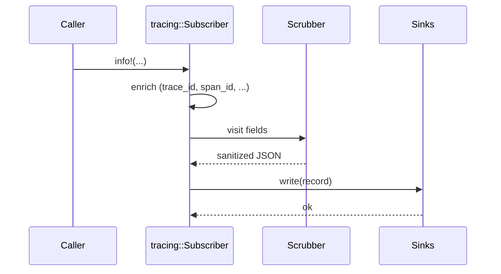
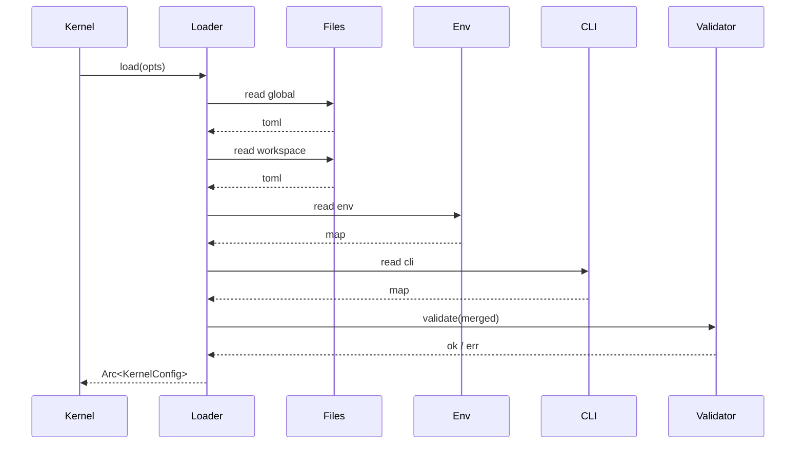
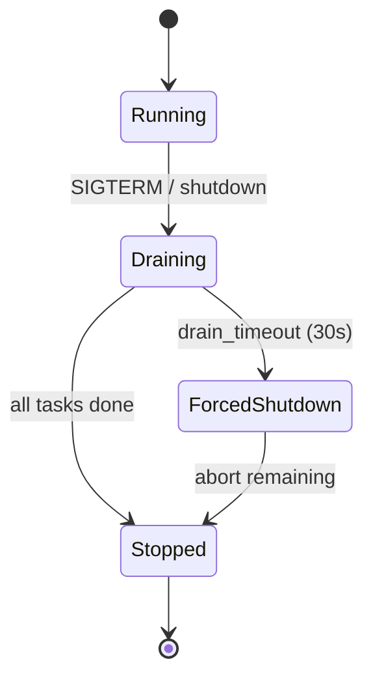
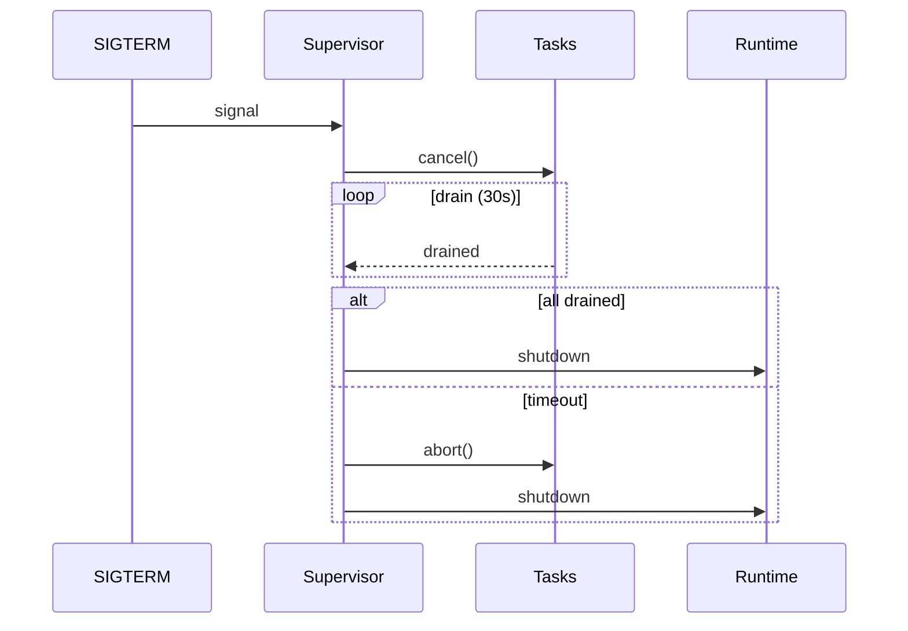
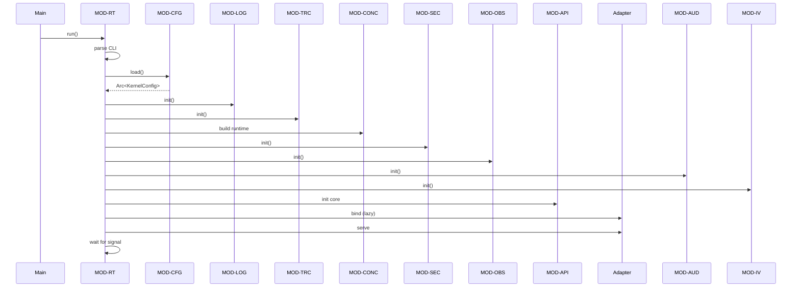
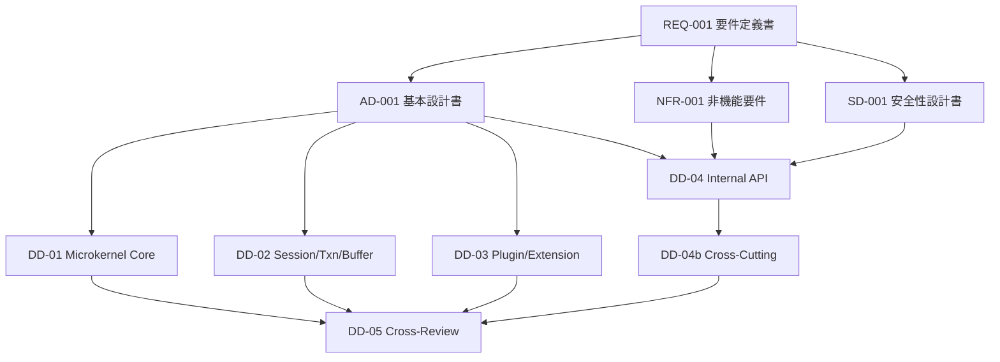

# DD-04b Cross-Cutting Concerns 詳細設計書

| 项目 | 内容 |
|---|---|
| 文档 ID | DD-04b |
| 文档名称 | Cross-Cutting Concerns 詳細設計書 |
| 系统名称 | Pure Rust AI Native CLI Development Kernel |
| 子系统 / 模块 | Logging / Tracing / Concurrency / Configuration / Security Common / Observability / Performance / Audit / Input Validation |
| 上位文档 | REQ-001 / NFR-001 / AD-001 / SD-001 / IFD-001 |
| 并列文档 | DD-04_Internal_API_詳細設計書.md |
| 版本 | 0.1 (Draft) |
| 作成日 | 2026-09-14 |
| 作成者 | MiniMax-M3（Agent / ULYS-41） |
| Review 状态 | 未 Review |
| 修订履历 | v0.1 初版作成 |

---

## 1. 文档目的

本文详细设计横切关注点（Cross-Cutting Concerns），对应 DD-04 §5 提到的六个横切模块：

- **MOD-LOG-001** Logging（§3）
- **MOD-TRC-001** Tracing（§4）
- **MOD-CFG-001** Configuration（§5）
- **MOD-SEC-001** Security Common（§6）
- **MOD-CONC-001** Concurrency Model（§7）
- **MOD-OBS-001** Observability（Metrics / Health / Alert）（§8）
- **MOD-AUD-001** Audit（§9）
- **MOD-IV-001** Input Validation Middleware Chain（§10）
- **MOD-RT-001** Runtime（Tokio 配置 / 启动序列）（§11）

每个模块独立成节，包含模块表、关键数据结构、处理顺序、可观测性钩子、可测试性导出。

不在本文范围（已由其他文档覆盖）：

- 15 个内部 API 的 Request/Response Schema 与 Sequence → **DD-04**
- 错误码主表与命名空间 → **DD-04 §6**
- 三大总线、Session/Transaction/Buffer、Plugin 子系统的模块级设计 → **DD-01/02/03**

## 2. 术语和缩略语

| 术语 | 定义 |
|---|---|
| Structured Log | 字段化的日志条目（JSON / logfmt），非自由文本 |
| Trace ID | 单次端到端调用的全局唯一 ID（`01J...` ULID） |
| Span ID | 单个逻辑工作单元 ID（`01J...` ULID） |
| Span | Tracing 树中的一个节点，含 name / start / end / attributes / events |
| Context Propagation | 跨进程 / 跨 task 边界传递 Trace / Span 上下文 |
| Idempotency Key | 客户端提供的重复请求去重键 |
| CancellationToken | tokio_util::sync::CancellationToken 的层级化使用 |
| Backpressure | 上游速率 > 下游消费速率时的反压机制 |
| Worktree | 在多任务隔离下的轻量目录副本 |
| Tokio Runtime | 异步运行时（multi-thread / current-thread） |
| Wasmtime | WASM 运行时 |
| CancellationToken Tree | CancellationToken 父子树，子随父取消 |
| Log Scrubber | 自动从日志中过滤敏感信息的中间件 |
| OpenTelemetry | 分布式追踪与指标标准（可选实现） |
| Prometheus | 指标采集标准（可选实现） |
| SIEM | Security Information & Event Management |
| PII | Personally Identifiable Information |
| CORS | Cross-Origin Resource Sharing |
| mTLS | Mutual TLS |
| JWT | JSON Web Token |

## 3. 参考资料

| 文档 | 版本 | 对应章节 |
|---|---|---|
| REQ-001 | Final Reviewed | §9 Session / §17 大文件 / §23 Crash Recovery / §29 Capability / §33-35 Event / §40 Worker Crash / §45 Plugin Protocol / §60-68 API / §68 Correlation / §84 Agent Budget / §117-129 Security+Config+Observability / §134-137 Performance |
| NFR-001 | Final Reviewed | §1 性能 / §2 可用性 / §3 安全 / §4 运维 / §5 可观测性 |
| AD-001 | Approved | §4 Core / §13 Local Compute / §15 Plugin |
| SD-001 | Approved | §3 AuthN / §4 AuthZ / §5 Input Validation / §6 Secret / §7 Audit / §8 Rate Limit / §9 Network / §10 Plugin Sandbox |
| DD-01 | Draft | MOD-CB/EB/CR/SCH |
| DD-02 | Draft | MOD-SM/TM/BE |
| DD-03 | Draft | MOD-PM/PL/PS/PHS/CPI |
| DD-04 | Draft | IF-XXX（15 个内部 API） |
| OpenTelemetry Specification | latest | Trace / Span / Resource / Context |
| tokio_util::sync::CancellationToken | tokio-util latest | 取消传播 |
| OWASP ASVS | 4.0.3 | 输入校验 / Secret / Logging |

## 4. 横切模块总览

| MOD ID | 名称 | 关键依赖 | 主要被谁使用 |
|---|---|---|---|
| MOD-LOG-001 | Logging | tracing, tracing-subscriber | 所有模块 |
| MOD-TRC-001 | Tracing | tracing, opentelemetry (optional) | 所有模块 |
| MOD-CFG-001 | Configuration | figment, toml, serde | 所有模块 |
| MOD-SEC-001 | Security Common | jsonwebtoken, rustls, argon2 | 所有 Adapter + Core 入口 |
| MOD-CONC-001 | Concurrency | tokio, tokio-util, parking_lot | 所有模块 |
| MOD-OBS-001 | Observability | prometheus, opentelemetry-metrics | Runtime / Health / Alert |
| MOD-AUD-001 | Audit | 自实现 + Append-only WAL | 所有 mutation 入口 |
| MOD-IV-001 | Input Validation | serde, garde, json-schema | Adapter + Command 入口 |
| MOD-RT-001 | Runtime | tokio, tokio-metrics | Kernel 启动 / 关闭 |

---

## 5. MOD-LOG-001 Logging

### 5.1 模块表

| 项目 | 内容 |
|---|---|
| Module ID | MOD-LOG-001 |
| 名称 | 统一日志（Structured Logging） |
| 对应 BD | AD-001 §4.6 Observability |
| 对应 REQ | REQ-001 §123-124, §129 |
| 对应 NFR | NFR-001 §5.1 |
| 对应 SD | SD-001 §7.3 |
| 职责 | (1) 统一日志入口（tracing 宏）;(2) 字段规范与必含字段;(3) Sink 抽象（stdout / file / OTLP）;(4) Log Scrubber（敏感信息过滤）;(5) Level 控制与采样;(6) 与 Trace ID 关联 |
| 输入 | tracing::Event（含 span context） |
| 输出 | 序列化日志条目（JSON Lines / logfmt） |
| 依赖 | tracing, tracing-subscriber, secrecy, jsonwebtoken |
| 对外接口 | `pub fn init(cfg: &LogConfig) -> Result<LogGuard, CoreError>` |
| 使用数据 | 配置：level / format / sinks / scrubber rules |
| 状态 | 全局（通过 tracing::subscriber 持有） |
| Transaction | 不参与 |
| Error | 配置错误 → ERR-SYS-004；自身 panic → ERR-SYS-002 |

### 5.2 日志级别

| Level | 用途 | 示例 |
|---|---|---|
| ERROR | 影响单个请求/事务失败 | Adapter 反序列化失败、DB 连接断开 |
| WARN | 可恢复异常、需关注 | Retry、降级、证书即将过期、Plugin 进入 QUARANTINED |
| INFO | 关键业务事件（生命周期） | Session 创建、Plugin 加载、Transaction 提交 |
| DEBUG | 内部状态变更（开发） | span 进入/退出、内部决策 |
| TRACE | 极细粒度（关闭默认） | 每条 message 序列化细节 |

**Level 策略：**

- 生产默认：INFO
- 开发默认：DEBUG
- 通过 env `KERNEL_LOG=warn,mod_buf=debug,mod_evt=info` 精细控制
- 通过 `RUST_LOG` 标准 env（向后兼容）

### 5.3 结构化格式（JSON Lines）

```json
{
  "ts": "2026-09-14T03:12:34.567Z",
  "level": "INFO",
  "target": "kernel::command_bus",
  "msg": "command completed",
  "trace_id": "01JAB...",
  "span_id": "01JAB...",
  "span_name": "command.dispatch",
  "request_id": "01JAB...",
  "session_id": "01JAB...",
  "execution_id": "01JAB...",
  "workspace_id": "ws_01JAB...",
  "actor": "human:user:42",
  "command_name": "file.read",
  "operation": "command.dispatch",
  "target": "/v1/commands",
  "result": "Ok",
  "error_code": null,
  "latency_ms": 12,
  "attrs": { "capability": "fs.read", "buffer_id": "buf_..." }
}
```

### 5.4 必含字段清单

| 字段 | 类型 | 来源 | 是否必含 |
|---|---|---|---|
| `ts` | RFC3339 UTC | 框架注入 | 必含 |
| `level` | enum | 框架注入 | 必含 |
| `target` | str | 框架注入 | 必含 |
| `msg` | str | 调用方 | 必含 |
| `trace_id` | ULID | MOD-TRC-001 | 必含（无 span 时为 `-`） |
| `span_id` | ULID | MOD-TRC-001 | 必含 |
| `span_name` | str | MOD-TRC-001 | 必含 |
| `request_id` | ULID | Adapter | 必含（系统日志可空） |
| `session_id` | ULID | MOD-SES-001 | 可选（系统日志可空） |
| `execution_id` | ULID | IF-CMD-001 | 可选 |
| `workspace_id` | str | MOD-SES-001 | 可选 |
| `actor` | str | MOD-SES-001 | 可选（plugin / system 时为 `system`） |
| `operation` | str | 手动 | 必含 |
| `target` | str | 手动 | 必含 |
| `result` | enum: Ok / Error / Partial | 手动 | 必含 |
| `error_code` | str | MOD-ERR-001 | 仅 result=Error |
| `latency_ms` | u64 | Span 自动 | 仅耗时操作 |
| `attrs` | object | 手动 | 可选 |

### 5.5 不应记录的敏感信息（Scrubber 规则）

> Scrubber 在写入 Sink 前过滤；不依赖调用方自觉。

| 类别 | 字段 / Pattern | 替换策略 |
|---|---|---|
| 密码 | `password`, `passwd`, `pwd` | `***` |
| 私钥 | `private_key`, `BEGIN PRIVATE KEY` | `***` |
| Token | `bearer`, `access_token`, `refresh_token` | 前 4 + `***` |
| API Key | `api_key`, `apikey`, `x-api-key` | 前 4 + `***` |
| Cookie | `cookie`, `set-cookie` | `***` |
| 信用卡 | `\d{13,19}` (luhn 校验) | `***` |
| Email | `[A-Za-z0-9._%+-]+@[A-Za-z0-9.-]+` | `u***@***` |
| 完整 IP | `0.0.0.0`/`::` (内网判断) | 保留 / 替换为 `***` 由配置决定 |
| PII 自定义 | 配置 regex 列表 | 替换为 `***` |
| 文件绝对路径含用户名 | `/Users/<name>/` | 替换为 `/Users/***/` |

**实现方式**：

- 自定义 `LogScrubber` visitor，遍历 `serde_json::Value`。
- 对已知敏感字段名（dictionary）+ 正则 pattern 双重匹配。
- 不可逆替换（不打印 hash）。
- 失败安全：scrubber 自身 panic 时降级为 **丢弃整条日志**（fail-closed），由 `result=Error` 标记。

### 5.6 Sink 抽象

```rust
pub trait LogSink: Send + Sync {
    fn write(&self, record: &LogRecord) -> Result<(), LogError>;
    fn flush(&self) -> Result<(), LogError>;
}

// 内置实现
pub struct StdoutSink { ... }      // 生产（容器友好）
pub struct FileSink { path, rotation: Rotation }  // 本地开发
pub struct OtlpSink { endpoint, batch_size }       // 集中采集
pub struct SyslogSink { ... }     // STG/PROD 运维侧
```

**采样策略**（防日志洪水）：

- 同一 `(target, msg, error_code)` 在 1s 内重复超过 **【TBD：默认 10，待 NFR-001 确认】** → 丢弃后续并 emit 一条 `sampled=true` 的汇总日志。
- 高频 CursorMove / DiagnosticUpdated 等 Transient 事件 → 默认 **不上日志**（应走 Metric）。

### 5.7 启动顺序

1. 读取配置（`LogConfig` from MOD-CFG-001）
2. 构造 subscriber（fmt + json + filter）
3. 注册 Scrubber visitor
4. 构造 sinks 并 attach
5. `set_global_default()` 失败 → 退出（ERR-SYS-004）

### 5.8 Sequence Diagram



### 5.9 可测试性导出

| 维度 | 测试方法 |
|---|---|
| Level 过滤 | 不同 env 配置下断言 level 行为 |
| 必含字段 | 用 `tracing_subscriber::with_test_writer` 捕获输出 |
| Scrubber | 注入 password / token / 信用卡 验证被替换 |
| 采样 | 短时间内高频 emit 验证丢弃 |
| Panic 安全 | scrubber 抛错时整条日志被丢弃 |
| Sink 失败 | OTLP 不可达时降级为 stdout |

---

## 6. MOD-TRC-001 Tracing（Distributed Tracing）

### 6.1 模块表

| 项目 | 内容 |
|---|---|
| Module ID | MOD-TRC-001 |
| 名称 | 分布式追踪 |
| 对应 BD | AD-001 §4.6 |
| 对应 REQ | REQ-001 §68, §124 |
| 对应 NFR | NFR-001 §5.2 |
| 职责 | (1) Trace/Span 生成与 ID 分配（ULID，含时间序）;(2) Span 划分规则;(3) 跨进程传递（HTTP header / stdio metadata / IPC header）;(4) 采样策略;(5) OTLP 导出 |
| 输入 | `tracing::Span` enter / exit 事件 |
| 输出 | Span 数据（OTLP）→ Jaeger / Tempo / OTel Collector |
| 依赖 | tracing, tracing-opentelemetry, opentelemetry, ulid |
| 对外接口 | `pub fn init(cfg: &TraceConfig) -> Result<TraceGuard, CoreError>` |
| 使用数据 | 配置：sampler / endpoint / resource attributes |
| 状态 | 全局 |
| Transaction | 不参与 |
| Error | 同 MOD-LOG-001 |

### 6.2 Trace ID / Span ID 生成

- **算法**：ULID（Universally Unique Lexicographically Sortable Identifier）
  - 26 字符 base32；前 10 字符 = 时间戳（毫秒精度）；后 16 字符 = 随机
  - 单调：相同 ms 内单调递增
  - 全局唯一：128 bit 随机空间
- **格式**：`01JABCDEFGHJKMNPQRSTVWX`（例 `01JAB1234567890ABCDEFGHJ`）
- **生成器**：`ulid::Ulid::new()` + `monotonic()` 包装，确保单线程内单调。

### 6.3 Span 划分规则

| Span 名称 | 起点 | 终点 | 父 Span | Attributes |
|---|---|---|---|---|
| `http.request` | Adapter 接收到请求 | Response 写出 | （root） | http.method, http.target, http.status |
| `command.dispatch` | MOD-API-001 接收 | CommandResult 返回 | http.request | command.name, command.version, session_id |
| `command.execute` | Application Service 调用 | 业务逻辑完成 | command.dispatch | capability.required |
| `capability.invoke` | IF-CAP-001 接收 | Response 转换完成 | command.execute | capability_id, provider_id |
| `db.query` | Repository 调用 | Result 返回 | command.execute | db.system, db.statement, db.rows |
| `txn.commit` | IF-TXN-001 commit 开始 | 状态机结束 | command.execute | txn.id, txn.participants |
| `event.publish` | IF-EVT-001 publish 接收 | 广播完成 | command.execute | event.type, event.level |
| `plugin.call` | IF-CAP-001 → Provider | 返回 | capability.invoke | plugin.id, plugin.runtime |
| `plugin.load` | IF-PLG-001 load 接收 | 注册完成 | command.execute | plugin.id, plugin.runtime |
| `fs.read` / `fs.write` | IF-FS-001 接收 | OS 调用完成 | command.execute | fs.path, fs.size, fs.cached |
| `buf.patch` | IF-BUF-001 接收 | 应用完成 | command.execute | buffer.id, patch.count |
| `idx.query` | IF-IDX-001 接收 | 结果返回 | command.execute | idx.kind, idx.hits |

**Span 嵌套规则**：

- 子 Span 必须在父 Span context 内创建。
- 跨进程边界：父 Span 导出 context（trace_id + span_id + flags），子进程 reconstruct。
- 无 Span 上下文时自动创建 root。

### 6.4 跨进程传递

| 协议 | Header / 字段 | 备注 |
|---|---|---|
| HTTP | `traceparent`（W3C TraceContext） + `tracestate` | 标准 |
| HTTP | `X-Request-Id`（回退） | 与 Adapter 兼容 |
| stdio JSON-RPC | params.metadata.traceparent | 透传 |
| Unix Domain Socket | IPC frame header | 自定义 |
| Named Pipe（Windows） | 同上 | 自定义 |
| WASM（wasmtime） | host import function | 透传 |
| Worker（子进程） | env `KERNEL_TRACE_CONTEXT` | 启动时注入 |
| SSE | `Last-Event-Id` 不用于 trace（仅 sequence） | — |

### 6.5 采样策略

| 模式 | 描述 | 适用 |
|---|---|---|
| AlwaysOn | 100% | 开发 / 关键事务 |
| AlwaysOff | 0% | 压力测试 |
| ParentBased + TraceIDRatio | 父决定子；root 按 ratio 采样 | 生产默认 |
| Error | 错误必采 | 关键命令（capability 列表） |

**默认 ratio**：`0.1`（10%），可通过 `KERNEL_TRACE_RATIO` env 覆盖。

**强制采样标记**：

- `command.metadata.trace_priority = Critical` → 必采
- `error_code` 非空 → 必采
- `actor = system`（内部批处理）→ 必采

### 6.6 Resource Attributes

固定属性集（OTLP Resource）：

| Attribute | 值 |
|---|---|
| `service.name` | `kernel` |
| `service.version` | `KERNEL_VERSION` env |
| `service.instance.id` | 启动时生成的 ULID |
| `host.name` | hostname（已 scrubber） |
| `host.arch` | `x86_64` / `aarch64` |
| `os.type` | `linux` / `darwin` / `windows` |
| `process.pid` | PID |
| `kernel.mode` | `standalone` / `headless` / `ipc` / `embedded` |

### 6.7 启动顺序

1. 读 TraceConfig
2. 构造 OTLP Exporter（HTTP / gRPC）
3. 构造 Sampler
4. 构造 Resource
5. 构造 TracerProvider
6. 注册为全局 tracer
7. 关闭时 flush（timeout 5s）

### 6.8 与 Logging 的关系

- 日志条目的 `trace_id` / `span_id` / `span_name` 来自当前 Span context。
- Trace 导出失败 → 仅影响 OTLP 导出，不影响日志。
- 日志的 `KERNEL_TRACE_RATIO` 同步决定日志中是否省略 trace 字段（防止稀疏 trace 占用日志体积）。

### 6.9 可测试性导出

| 维度 | 测试方法 |
|---|---|
| ID 格式 | 断言 ULID 格式 |
| 单调性 | `monotonic()` 后递增 |
| 上下文传播 | 嵌套 span 时 trace_id 一致 |
| 跨进程 | header 透传后子 span 父亲正确 |
| 采样 | ratio=0 + non-priority → 不导出 |
| 强制采样 | priority=Critical 必采 |
| Export 失败 | OTLP endpoint 不可达时不 panic |

---

## 7. MOD-CFG-001 Configuration

### 7.1 模块表

| 项目 | 内容 |
|---|---|
| Module ID | MOD-CFG-001 |
| 名称 | 统一配置加载与生命周期 |
| 对应 BD | AD-001 §4.7 Configuration |
| 对应 REQ | REQ-001 §126-128 |
| 对应 NFR | NFR-001 §4 |
| 职责 | (1) 多源合并（Defaults / File / Env / CLI）;(2) Schema 验证（JSON Schema 派生自 Rust）;(3) 热重载（不重启）;(4) Secret 处理（不落盘 / 内存解密）;(5) 环境差异（DEV/TEST/STG/PROD）;(6) Config Snapshot（原子替换） |
| 输入 | 文件路径 / env / CLI args / Secret backend |
| 输出 | `KernelConfig`（typed struct tree） |
| 依赖 | figment, toml, serde, json-schema, notify（热重载） |
| 对外接口 | `pub async fn load(opts: LoadOptions) -> Result<Arc<KernelConfig>, CoreError>` |
| 使用数据 | 配置文件 + Env + CLI |
| 状态 | 全局 Snapshot（`ArcSwap`） |
| Transaction | 不参与 |
| Error | ERR-SYS-004（配置错误） |

### 7.2 配置源优先级（与 REQ-001 §127 对齐）

```text
Defaults (代码内 Default)
   ↓ 覆盖
File:  ~/.kernel/config.toml    (Global)
   ↓ 覆盖
File:  <workspace>/.kernel/config.toml   (Workspace)
   ↓ 覆盖
File:  --config <path>         (CLI 指定)
   ↓ 覆盖
Env:   KERNEL_*                (Environment)
   ↓ 覆盖
CLI:   --key=value             (最终)
```

> 优先级数字越大越优先。**后置源覆盖前置源**。

### 7.3 Schema 验证

- 所有配置结构体 derive `Deserialize + Validate`。
- 验证时机：load 完成时（启动时） + 热重载时（diff 完成后）。
- 失败行为：拒绝新配置（保留旧 Snapshot），输出 ERR-SYS-004 详细错误。

**示例（KernelConfig）**：

```rust
#[derive(Deserialize, Validate)]
pub struct KernelConfig {
    #[validate(nested)]
    pub runtime: RuntimeConfig,
    #[validate(nested)]
    pub log: LogConfig,
    #[validate(nested)]
    pub trace: TraceConfig,
    #[validate(nested)]
    pub security: SecurityConfig,
    #[validate(nested)]
    pub concurrency: ConcurrencyConfig,
    #[validate(nested)]
    pub storage: StorageConfig,
    #[validate(nested)]
    pub network: NetworkConfig,
    #[validate(nested)]
    pub secrets: SecretsConfig,
    #[validate(nested)]
    pub plugin: PluginConfig,
    pub env: Environment,   // DEV | TEST | STG | PROD
}
```

### 7.4 热重载

| 类别 | 是否支持热重载 | 重载行为 |
|---|---|---|
| `log.level` | ✅ | 重新构造 subscriber |
| `log.sinks` | ✅ | 增删 sink |
| `trace.ratio` | ✅ | 重新构造 sampler |
| `concurrency.worker_threads` | ❌ | 需重启 |
| `security.policy` | ✅ | 重新加载 |
| `secrets.backend` | ❌ | 需重启 |
| `plugin.*` | ✅ | 触发 hot reload（DD-03 §8） |
| `network.listen` | ❌ | 需重启 |
| `storage.path` | ❌ | 需重启 |

**实现方式**：

- 使用 `notify` crate 监听文件变化。
- debounce 500ms。
- 解析 + 验证 + diff。
- 验证失败：保留旧 Snapshot + 发出 `ConfigRejected` 事件。
- 验证成功：原子替换（`arc_swap::ArcSwap`）。

### 7.5 Secret 处理

> 详见 SD-001 §6，本节为配置层实现。

| 策略 | 描述 | 落盘？ |
|---|---|---|
| `env` | 直接读 env var（`KERNEL_SECRET_<NAME>`） | 否 |
| `file` | 从 `~/.kernel/secrets.toml` 读（文件 mode 0600） | 是（需权限保护） |
| `keyring` | OS Keyring（macOS Keychain / Linux Secret Service / Windows Credential Manager） | 否 |
| `vault` | HashiCorp Vault（生产） | 否 |
| `kms` | 云 KMS（AWS KMS / GCP KMS） | 否 |

**配置示例**：

```toml
[secrets]
backend = "keyring"

[secrets.items."github.token"]
backend = "env"
key = "GITHUB_TOKEN"
required = true
```

**解析**：

- 启动时同步加载所有 `required = true` 的 secret。
- 失败 → ERR-SYS-004，启动失败。
- 热重载：secret backend 变更 → ERR-SYS-004（必须重启）。
- Secret **永不入日志**（MOD-LOG-001 Scrubber 配合）。

### 7.6 环境差异矩阵

| 配置键 | DEV | TEST | STG | PROD |
|---|---|---|---|---|
| `log.level` | DEBUG | DEBUG | INFO | INFO |
| `log.format` | pretty | json | json | json |
| `log.sinks` | [stdout, file] | [stdout] | [stdout, otlp] | [stdout, otlp, syslog] |
| `trace.ratio` | 1.0 | 1.0 | 0.5 | 0.1 |
| `security.policy.strict` | false | true | true | true |
| `security.rate_limit.enabled` | false | true | true | true |
| `storage.path` | `/tmp/kernel-dev` | `/var/tmp/kernel-test` | `/var/lib/kernel/stg` | `/var/lib/kernel/prod` |
| `concurrency.worker_threads` | 2 | 4 | 8 | num_cpu |
| `secrets.backend` | env | env | keyring | vault |
| `network.listen` | 127.0.0.1:0 | 127.0.0.1:9090 | 0.0.0.0:9090 | 0.0.0.0:9090 |
| `network.tls.enabled` | false | false | true | true |
| `plugin.auto_load` | [git, search] | [] | [] | [] |
| `plugin.allow_unsigned` | true | false | false | false |
| `ai.remote.enabled` | true | true | false | false |

### 7.7 Config Snapshot

```rust
pub struct ConfigSnapshot {
    inner: ArcSwap<KernelConfig>,
    version: AtomicU64,   // 单调递增
}

impl ConfigSnapshot {
    pub fn current(&self) -> Arc<KernelConfig> { ... }
    pub fn replace(&self, new: KernelConfig) -> Result<(), CoreError> { ... }
    pub async fn watch(&self) -> impl Stream<Item = Arc<KernelConfig>> { ... }
}
```

### 7.8 启动顺序

1. 确定 env（`KERNEL_ENV` env 或默认 `DEV`）
2. 加载 Defaults
3. 加载 Global File（`~/.kernel/config.toml`）
4. 加载 Workspace File（如有）
5. 合并 Env（`KERNEL_*` 前缀 + `__` 分隔嵌套）
6. 合并 CLI（`--key=value` 或 `--config`）
7. Schema 验证
8. Secret 解析
9. 发布 `ConfigLoaded` 事件
10. 安装 hot reload watcher

### 7.9 Sequence Diagram（启动加载）



### 7.10 可测试性导出

| 维度 | 测试方法 |
|---|---|
| 优先级 | 多源同 key 时 CLI 胜出 |
| Schema 失败 | 注入非法值 |
| 热重载 | 改文件 → 验证 snapshot.version++ |
| Secret 屏蔽 | secret 值不出现在日志 |
| 切换 backend | DEV→PROD 时所有相关 key 切换 |
| 失败保留 | 热重载失败时旧 snapshot 继续可用 |

---

## 8. MOD-CONC-001 Concurrency Model

### 8.1 模块表

| 项目 | 内容 |
|---|---|
| Module ID | MOD-CONC-001 |
| 名称 | 并发模型（Tokio + CancellationToken + Backpressure） |
| 对应 BD | AD-001 §4.8 Concurrency |
| 对应 REQ | REQ-001 §85, §108-110 |
| 对应 NFR | NFR-001 §1 |
| 职责 | (1) Tokio runtime 配置与启动;(2) 任务调度（Scheduler）;(3) 取消传播（CancellationToken Tree）;(4) 背压策略（bounded channels / semaphore）;(5) Panic 处理（catch_unwind + restart）;(6) 资源预算（CPU/MEM Budget） |
| 输入 | 配置（`ConcurrencyConfig`） |
| 输出 | 启动的 Tokio runtime + 后台 tasks |
| 依赖 | tokio, tokio-util, parking_lot, tokio-metrics |
| 对外接口 | `pub fn build_runtime(cfg: &ConcurrencyConfig) -> Result<Runtime, CoreError>` |
| 使用数据 | 配置：worker_threads / max_blocking / scheduler |
| 状态 | 全局 |
| Transaction | 不参与 |
| Error | ERR-SYS-002（Panic） / ERR-SYS-003（OOM） |

### 8.2 Tokio Runtime 配置

| 字段 | 含义 | 默认 | 推荐范围 |
|---|---|---|---|
| `runtime.kind` | `multi_thread` / `current_thread` / `single_thread` | `multi_thread` | — |
| `worker_threads` | 工作线程数 | num_cpu | 1 ~ 2×num_cpu |
| `thread_name` | 线程名前缀 | `kernel-worker` | — |
| `thread_stack_size` | 线程栈大小（bytes） | 2 MiB | 1 MiB ~ 8 MiB |
| `max_blocking_threads` | blocking pool 大小 | 512 | 64 ~ 1024 |
| `enable_io` | IO driver | true | — |
| `enable_time` | Time driver | true | — |
| `enable_metrics` | tokio-metrics | true | — |
| `unhandled_panic` | panic 行为 | `shutdown_runtime` | — |
| `global_queue_interval` | 全局队列调度间隔 | 31 | 1 ~ 1024 |
| `event_interval` | event 间隔 | 61 | 1 ~ 1024 |
| `metrics_poll_interval_ms` | metrics 抓取间隔 | 1000 | — |

```rust
let rt = tokio::runtime::Builder::new_multi_thread()
    .worker_threads(cfg.worker_threads)
    .thread_name("kernel-worker")
    .thread_stack_size(cfg.thread_stack_size)
    .max_blocking_threads(cfg.max_blocking_threads)
    .enable_all()
    .unhandled_panic(UnhandledPanic::ShutdownRuntime)
    .build()?;
```

### 8.3 任务模型

| 任务类别 | 调度策略 | 优先级 | 数量上限 |
|---|---|---|---|
| API Request | multi-thread | High | num_cpu × 2 |
| Event Bus subscriber | multi-thread | Normal | num_cpu × 4 |
| Event Bus publisher | multi-thread | High | num_cpu × 2 |
| Capability invocation | multi-thread | Normal | num_cpu × 4 |
| Index background | multi-thread | Low | num_cpu |
| Plugin (WASM) | current_thread per instance | Normal | num_plugins |
| Plugin (Native Worker) | 独立进程 | Normal | num_plugins |
| Background AI (Embedding) | multi-thread | Low | num_cpu / 2 |
| Audit log writer | 单线程 + bounded channel | High | 1 |
| Log writer | 单线程 + bounded channel | High | 1 |

**实现**：

- `tokio::spawn` 默认在全局 runtime。
- 高负载路径用 `tokio::task::JoinSet` 收集结果。
- 后台 tasks 用 `Arc<SpawnedTask>` 句柄 + `CancellationToken` 控制生命周期。

### 8.4 取消传播（CancellationToken）

#### 8.4.1 Token 树

```text
[Root: Kernel Shutdown]
  ├── [Runtime Hot Reload]
  ├── [Workspace <workspace_id>]
  │   ├── [Session <session_id>]
  │   │   ├── [Execution <execution_id>]
  │   │   │   ├── [Capability invoke <cap_id>]
  │   │   │   └── [Span child <span_id>]
  │   │   └── [Subscription <sub_id>]
  │   └── [Transaction <txn_id>]
  └── [Plugin <plugin_id>]
      └── [Worker task <worker_id>]
```

#### 8.4.2 取消规则

| 触发源 | 传播范围 | 行为 |
|---|---|---|
| Kernel shutdown | All | 优雅关闭（drain 30s） |
| Workspace close | Workspace subtree | drain session |
| Session close | Session subtree | drain execution |
| Execution timeout | Execution subtree | 写 ERR-BIZ-008 |
| Client disconnect (HTTP/SSE/JSON-RPC) | Execution subtree | 同上 |
| Plugin unload | Plugin subtree | drain / force |
| Transaction rollback | Txn scope | 通知所有 participants |
| Adapter circuit breaker | Provider scope | 隔离 provider |

#### 8.4.3 取消传播模式

```rust
let root = CancellationToken::new();
let child = root.child_token();

let task = tokio::spawn(async move {
    tokio::select! {
        _ = child.cancelled() => {
            // 优雅退出
            cleanup().await;
            return Err(ERR_BIZ_008);
        }
        result = do_work() => {
            return result;
        }
    }
});

// 触发取消
root.cancel();
```

**规则**：

- 任何 `await` 必须 select 至少一次 `cancelled()`。
- 长循环（CPU 密集）需定期 `cancelled().is_cancelled()` 检查。
- IO 操作依赖 tokio 自动中断（`select!`）。
- 不可取消的 IO（如某些 syscall）需 `tokio::task::spawn_blocking` + 手动 timeout。

#### 8.4.4 优雅关闭协议



### 8.5 背压策略

| 通道 | 容量 | 行为 |
|---|---|---|
| `command_request` (Adapter → Core) | **【TBD：默认 1024，待 NFR-001 确认】** | 满 → 客户端 429 |
| `event_publish` (Provider → Event Bus) | 1024 | 满 → producer await |
| `event_subscribe` (Event Bus → Subscriber) | 1024 per subscriber | 满 → subscriber await |
| `audit_log` (各 module → Audit) | 8192 | 满 → 阻塞 writer |
| `log` (各 module → Log) | 8192 | 满 → 降级为 stderr |
| `plugin_call` (Core → Worker) | 256 per worker | 满 → core await |
| `background_task` (Scheduler → Pool) | num_cpu × 4 | 满 → 排队 |

**Semaphore 限制**：

```rust
let sem = Arc::new(Semaphore::new(num_cpu * 2));
let permit = sem.acquire().await?;
// critical section
drop(permit);
```

**流控算法**：

- 默认：bounded MPSC + 主动 await（应用层背压）。
- 关键命令（`command.dispatch`）：Token Bucket（per session, refilled by time）。
- 长流（SSE / Stream）：滑动窗口。

### 8.6 Panic 处理

#### 8.6.1 任务级 Panic

```rust
let join = tokio::spawn(async {
    // risky work
}).await;

match join {
    Ok(Ok(v)) => v,
    Ok(Err(e)) => { /* business error */ }
    Err(join_err) if join_err.is_panic() => {
        // 捕获 panic，转换为 ERR-SYS-002
        tracing::error!(error_code = "ERR-SYS-002", panic = ?join_err);
        return Err(CoreError::Sys(SysError::Panic));
    }
}
```

#### 8.6.2 Runtime 级 Panic

- `unhandled_panic = ShutdownRuntime` → 触发 SIGTERM 流程。
- 启动专用 supervisor task 监听 runtime。

#### 8.6.3 Plugin Panic

- WASM：`wasmtime` trap → 隔离 → ERR-EXT-010。
- Native Worker：进程崩溃 → 重新拉起（最多 N 次）→ QUARANTINED。

### 8.7 资源预算

#### 8.7.1 Per-Session Budget（REQ-001 §84）

| 项 | 单位 | 默认 | 上限 |
|---|---|---|---|
| CPU time | ms/sec | 1000 | 10000 |
| RAM | MiB | 256 | 4096 |
| Disk IO | MiB/sec | 50 | 500 |
| Process count | count | 4 | 32 |
| Network | KiB/sec | 1024 | 10240 |
| AI tokens | tokens/min | 60000 | 600000 |
| Context tokens | tokens | 100000 | 800000 |

实现：每 session 关联 `ResourceLimiter`（参考 `limits-rs` 或自实现 cgroup / job object）。

#### 8.7.2 全局 Budget

- `RUST_MAX_MEMORY` env → OOM 风险时拒绝新 session 创建（ERR-SYS-003）。
- Disk 配额由 FS Adapter 监控。

### 8.8 Tokio Metrics

通过 `tokio-metrics` 暴露：

- `tokio_tasks_total` (gauge)
- `tokio_active_tasks` (gauge)
- `tokio_worker_threads_busy` (gauge, per worker)
- `tokio_blocking_threads` (gauge)
- `tokio_instrumented_poll_duration` (histogram)

→ 注入到 `MOD-OBS-001`。

### 8.9 启动顺序

1. 读 ConcurrencyConfig
2. 构造 Runtime
3. 进入 Runtime：`runtime.block_on(async { ... })`
4. 启动 supervisor task（监控 panic / metrics / signal）
5. 启动其余后台 task（Event Bus / Index / Audit 等）
6. 等待 SIGTERM / SIGINT / shutdown 命令
7. 触发 CancellationToken::root().cancel()
8. 等待 drain（默认 30s，**【TBD：待 NFR-001 确认】**）
9. timeout 后强制 abort
10. Runtime shutdown

### 8.10 Sequence Diagram（Drain）



### 8.11 可测试性导出

| 维度 | 测试方法 |
|---|---|
| 取消传播 | parent.cancel() → child 任务立即收到 |
| 嵌套取消 | root → workspace → session → execution |
| 优雅关闭 | SIGTERM 后 drain 时间内完成 |
| Panic 隔离 | 单个 task panic 不影响其他 |
| 背压 | bounded channel 满后 producer await |
| 资源预算 | 注入超限 session 行为 |
| 优先级 | 高优先级 task 优先调度 |

---

## 9. MOD-SEC-001 Security Common

### 9.1 模块表

| 项目 | 内容 |
|---|---|
| Module ID | MOD-SEC-001 |
| 名称 | Security Common（认证 / 授权 / Secret / 审计入口 / Rate Limit / Network 策略） |
| 对应 BD | SD-001 全文 |
| 对应 REQ | REQ-001 §117-122 |
| 对应 NFR | NFR-001 §3 |
| 职责 | (1) Authentication 多种凭证支持;(2) Authorization RBAC 决策点;(3) Input Validation 中间件链;(4) Secret 抽象与获取 API;(5) Audit 写入入口;(6) Rate Limit;(7) Network / Process 策略执行 |
| 输入 | 凭证 / 请求上下文 / 策略 |
| 输出 | Principal / 决策（Allow/Deny）/ Audit Record |
| 依赖 | jsonwebtoken, rustls, argon2, keyring, governor, hickory-resolver |
| 对外接口 | `pub struct SecurityModule { ... }` (singleton) |
| 使用数据 | 策略文件 / Secret backend / 凭证缓存 |
| 状态 | 全局 + per-Session |
| Transaction | 不参与 |
| Error | ERR-AUTH-* / ERR-AUTHZ-* / ERR-BIZ-006（限流） |

### 9.2 认证实现

#### 9.2.1 支持的凭证类型

| 类型 | 描述 | 适用 |
|---|---|---|
| `bearer-jwt` | JWT（HS256 / RS256 / EdDSA） | HTTP / JSON-RPC |
| `bearer-token` | 静态 token（Argon2 hash 存） | CLI / Dev |
| `mtls` | mTLS 客户端证书 | Server-to-Server / Enterprise |
| `api-key` | 简单 API Key | CI / 简单集成 |
| `session-cookie` | HttpOnly Cookie | TUI 本地连接 |
| `unix-peer-cred` | SO_PEERCRED（Linux） | stdio JSON-RPC 本地 |
| `pipe-token` | Named Pipe + Token（Windows） | stdio JSON-RPC 本地 |

#### 9.2.2 JWT Claims

```rust
#[derive(Deserialize)]
pub struct KernelClaims {
    pub iss: String,            // issuer (kernel)
    pub sub: String,            // subject (actor id)
    pub aud: Vec<String>,       // audience
    pub exp: i64,               // expiry (Unix)
    pub iat: i64,               // issued at
    pub jti: String,            // JWT ID
    pub scope: Vec<String>,     // capabilities 列表
    pub workspace_id: Option<WorkspaceId>,
    pub session_id: Option<SessionId>,
    pub actor: ActorRef,
}
```

#### 9.2.3 凭证缓存

- 凭证 → Principal 映射 LRU 缓存，TTL **【TBD：默认 5min，待 NFR-001 确认】**。
- Cache key = `credential_hash` (不存原始凭证)。
- 撤销列表优先于缓存（`/security/revocations` 内存表）。

### 9.3 授权（RBAC）

#### 9.3.1 角色与策略

| 角色 | 描述 | 默认权限 |
|---|---|---|
| `human:developer` | 开发人员 | workspace.read, workspace.write, search.*, file.*, test.* |
| `human:reviewer` | Reviewer | workspace.read, search.*, diagnostics.* |
| `agent:coder` | AI 编码 Agent | workspace.read, workspace.write, search.*, file.patch, transaction.* |
| `agent:reader` | AI 只读 Agent | workspace.read, search.* |
| `ci:runner` | CI | workspace.read, test.run, build.run, git.* |
| `system:kernel` | 内部系统 | * |
| `system:plugin` | 内部插件 | 由 manifest 声明 |

#### 9.3.2 策略文件（TOML）

```toml
# ~/.kernel/policy.toml
[roles."agent:coder"]
allow = [
    "capability:workspace.read",
    "capability:workspace.write",
    "capability:file.read",
    "capability:file.patch",
    "capability:search.*",
    "capability:transaction.*",
]
deny = [
    "capability:git.reset_hard",
    "capability:process.spawn",
]
constraints = { "network" = "lan-only", "paths" = ["./src/**", "./test/**"] }

[roles."agent:reader"]
allow = ["capability:workspace.read", "capability:search.*"]
```

#### 9.3.3 决策点位置

> 详见 DD-04 §7.15 IF-AUTH-001。

| 决策点 | 触发 | 失败行为 |
|---|---|---|
| Adapter 入口（Authn） | 收到请求 | ERR-AUTH-001 |
| Adapter 入口（Authz 粗粒度） | path / method | ERR-AUTHZ-001 |
| IF-CMD-001 P-006 | 解析 command 后 | ERR-AUTHZ-001 |
| IF-CAP-001 I-003 | 解析 capability 后 | ERR-AUTHZ-002 |
| IF-SES-001 S-003 | session 创建 | ERR-AUTHZ-001 |
| IF-TXN-001 T-001 | transaction begin | ERR-AUTHZ-001 |
| IF-BUF-001 B-001 | buffer 访问 | ERR-AUTHZ-001 |
| IF-FS-001 F-W02 | 写文件 | ERR-AUTHZ-003 |
| IF-PLG-001 PL-002 | 加载插件 | ERR-AUTHZ-001 |

### 9.4 Input Validation 中间件链

参见 §11 MOD-IV-001。

### 9.5 Secret 管理

#### 9.5.1 抽象

```rust
#[async_trait]
pub trait SecretStore: Send + Sync {
    async fn get(&self, name: &str) -> Result<SecretString, CoreError>;
    async fn list(&self) -> Result<Vec<String>, CoreError>;
    async fn set(&self, name: &str, value: &SecretString) -> Result<(), CoreError>;
    async fn rotate(&self, name: &str) -> Result<(), CoreError>;
}
```

#### 9.5.2 Plugin 访问方式

- Plugin **不得直接读 env**。只能通过：
  - Manifest 声明 `secrets = ["github.token"]`
  - Plugin 启动时由 host 注入到 WASM/Worker 内存（指定 key）
  - 运行时通过 `host_import(secret_get, name) → SecretString` 调用

#### 9.5.3 内存保护

- `SecretString` 实现 `Zeroize` + `ZeroizeOnDrop`。
- 调试格式化（`{:?}`）输出 `SecretString([REDACTED])`。
- 禁止将 `SecretString` 序列化为日志（即使经过 Scrubber 也禁止）。

### 9.6 Audit 落盘格式

> 详细见 §10 MOD-AUD-001。简要：

```json
{
  "audit_id": "01JAB...",
  "ts": "2026-09-14T03:12:34.567Z",
  "actor": "human:developer:42",
  "session_id": "01JAB...",
  "workspace_id": "ws_01JAB...",
  "operation": "command.dispatch",
  "target": "file.patch:/src/auth.rs",
  "side_effect": "WORKSPACE_MUTATION",
  "command_name": "file.patch",
  "before": { "version": 3, "hash": "abc..." },
  "after": { "version": 4, "hash": "def..." },
  "result": "Ok",
  "error_code": null,
  "transaction_id": "tx_01JAB...",
  "trace_id": "01JAB..."
}
```

**触发条件**（必须审计）：

- 所有 `SideEffectLevel ∈ {WORKSPACE_MUTATION, PROCESS_EXECUTION, NETWORK, DESTRUCTIVE}` 的命令
- 认证/授权失败（仅记录 actor + 失败原因，不含凭证）
- 配置变更（`ConfigLoaded` / `ConfigRejected`）
- Plugin 加载/卸载/失败
- Session 创建/关闭
- Transaction 提交/回滚

### 9.7 Rate Limit

```rust
pub struct RateLimiter {
    pub strategy: RateLimitStrategy,  // TokenBucket | SlidingWindow | FixedWindow
    pub key_fn: fn(&AuthContext) -> String,  // per-IP | per-session | per-actor
    pub limits: HashMap<String, Quota>,  // per-operation quotas
}

pub struct Quota {
    pub capacity: u32,        // burst
    pub refill_per_sec: u32,
}
```

**默认配额**：

| Operation | 容量 | Refill/s |
|---|---|---|
| `command.dispatch` (READ_ONLY) | 500 | 100 |
| `command.dispatch` (MUTATION) | 100 | 20 |
| `search.text` | 1000 | 200 |
| `ai.complete` | 20 | 1 |
| `event.subscribe` | 50 | 0.1 |

**实现**：

- 使用 `governor` crate。
- 全局内存（Cluster 模式需共享，**【TBD：待 Cluster 化决策】**）。
- 超限 → ERR-BIZ-006，HTTP 429 + `Retry-After` 头。

### 9.8 Network 策略

| 模式 | 行为 |
|---|---|
| `NoNetwork` | 拒绝所有出站（除 localhost） |
| `LANOnly` | 仅 RFC1918 私有 IP |
| `DomainAllowlist` | 仅白名单域名（DNS 解析后 IP 校验） |
| `FullNetwork` | 无限制（需 admin role） |

**实现**：

- 通过 tokio 的 `Socket` connect 时拦截。
- DNS 解析后再次校验 IP，防 DNS rebinding。

### 9.9 Process 策略

- `executable_allowlist`: `Vec<String>` 路径模式
- `working_directory`: 限制 cwd
- `environment_filter`: `Vec<String>` 允许的 env var 名
- `timeout_ms`: 单次执行超时
- `resource_limit`: cgroup / job object

### 9.10 启动顺序

1. 读 SecurityConfig
2. 加载策略文件（policy.toml + 角色定义）
3. 初始化 Secret backend
4. 构造 PrincipalCache
5. 构造 RateLimiter
6. 启动 mTLS（如启用）
7. 注册 Adapter middleware

### 9.11 可测试性导出

| 维度 | 测试方法 |
|---|---|
| JWT 过期 | exp < now → ERR-AUTH-002 |
| RBAC 越权 | actor 角色不允许 |
| Secret 内存 | drop 后立即清零（test 内存扫描） |
| Audit 必写 | 触发 mutation → 验证 audit entry |
| Rate Limit | 高于 quota 触发 429 |
| Network 策略 | DNS rebinding 拒绝 |
| Process 策略 | 非 allowlist 拒绝 spawn |

---

## 10. MOD-AUD-001 Audit Log

### 10.1 模块表

| 项目 | 内容 |
|---|---|
| Module ID | MOD-AUD-001 |
| 名称 | 审计日志（Append-only, tamper-evident） |
| 对应 BD | AD-001 §4.6 + SD-001 §7 |
| 对应 REQ | REQ-001 §122 |
| 对应 NFR | NFR-001 §3.4 |
| 职责 | (1) 异步写入（不阻塞主流程）;(2) 持久化到 append-only WAL / file;(3) 与 syslog/SIEM 集成;(4) 完整性校验（hash chain）;(5) 保留策略 |
| 输入 | AuditRecord（from any module） |
| 输出 | 持久化文件 + 可选 OTLP/SIEM |
| 依赖 | tokio, fs2（flock）, ring（hash） |
| 对外接口 | `pub fn audit(record: AuditRecord)` |
| 使用数据 | 配置：path / flush_interval / retention / hash_algo |
| 状态 | 全局 writer（单线程） |
| Transaction | 不参与 |
| Error | 失败 → 降级为 stderr + ERROR 日志（不阻塞主） |

### 10.2 AuditRecord 结构

```rust
pub struct AuditRecord {
    pub audit_id: Ulid,
    pub ts: DateTime<Utc>,
    pub actor: ActorRef,
    pub session_id: Option<SessionId>,
    pub workspace_id: Option<WorkspaceId>,
    pub operation: String,             // 例 "command.dispatch"
    pub target: String,                // 例 "file.patch:/src/auth.rs"
    pub side_effect: SideEffectLevel,
    pub command_name: Option<String>,
    pub before: Option<serde_json::Value>,
    pub after: Option<serde_json::Value>,
    pub result: AuditResult,           // Ok | Denied | Error
    pub error_code: Option<String>,
    pub transaction_id: Option<TransactionId>,
    pub trace_id: TraceId,
    pub client_info: ClientInfo,
}
```

### 10.3 落盘格式

**单行 JSON Lines**（与日志同格式但独立文件 `/var/log/kernel/audit.jsonl`）。

**完整性保护**（Hash Chain）：

```text
record[N].hash = SHA256(record[N-1].hash || record[N].payload)
```

- 启动时验证整链。
- 验证失败 → 启动失败（运维介入）。
- 简化方案：每 1000 条追加一个 `chain.checkpoint` 行（含当前 hash）。

### 10.4 写入流

```mermaid
sequenceDiagram
    participant App
    participant Bus as Audit Bus (bounded)
    participant Wr as Audit Writer
    participant FS as Audit File
    participant SIEM
    App->>Bus: audit(record)
    Note over Bus: bounded(8192); 满 → 阻塞 caller（短期背压）
    Bus->>Wr: deliver
    Wr->>Wr: serialize + hash chain
    Wr->>FS: write + fsync (every N or T)
    Wr->>SIEM: forward (optional)
```

### 10.5 保留与轮转

| 策略 | 描述 |
|---|---|
| `time` | 保留 N 天（**【TBD：默认 90 天，待 NFR-001 确认】**） |
| `size` | 文件超过 N MiB 滚动 |
| `archive` | 滚动后 gzip 到 `./archive/audit-{ts}.jsonl.gz` |
| `s3-sync` | 同步到对象存储（可选） |

### 10.6 可测试性导出

| 维度 | 测试方法 |
|---|---|
| 必写 | mutation 命令后立即可见 |
| Hash 链 | 修改历史行后启动验证失败 |
| 背压 | 满 buffer 后 caller 阻塞（短时） |
| 保留 | 时间过期后旧文件被压缩 |
| SIEM | mock 接收端验证格式 |

---

## 11. MOD-IV-001 Input Validation Middleware Chain

### 11.1 模块表

| 项目 | 内容 |
|---|---|
| Module ID | MOD-IV-001 |
| 名称 | 输入校验中间件链 |
| 对应 BD | SD-001 §5 |
| 对应 REQ | REQ-001 §61（Schema Single Source of Truth） |
| 对应 NFR | NFR-001 §3.1 |
| 职责 | (1) Request 体大小限制;(2) JSON Schema / Rust Type 校验;(3) 路径规范化与 sandbox 校验;(4) 编码校验（UTF-8）;(5) 业务规则验证（基本） |
| 输入 | 原始 request bytes / deserialized struct |
| 输出 | 校验通过的 request / ValidationError |
| 依赖 | serde, garde, json-schema, json-schema-diff |
| 对外接口 | `pub fn validate<T: Validate>(req: &T) -> Result<(), ValidationError>` |
| 使用数据 | schema（编译期派生） |
| 状态 | 无（pure function） |
| Transaction | 不参与 |
| Error | ERR-VAL-001/002/003/004/005/006/007/008 |

### 11.2 校验顺序

```text
1. Body Size Limit  → ERR-VAL-003 (413)
2. Deserialization   → ERR-VAL-001 (400)
3. Encoding (UTF-8) → ERR-VAL-006 (400)
4. Schema (类型)     → ERR-VAL-007 (400)
5. Field Required    → ERR-VAL-002 (400)
6. Field Range/Length→ ERR-VAL-003/004 (400)
7. Enum Value        → ERR-VAL-005 (400)
8. Path Sandbox      → ERR-VAL-008 (400)
9. Business Rule     → ERR-BIZ-007 (422)
10. Idempotency      → ERR-BIZ-004 (200, idempotent hit)
```

### 11.3 路径 Sandbox

- 拒绝 `..`、绝对路径（workspace 根之外）。
- Symlink 跟随后再次校验 canonical path。
- Windows：拒绝 `C:\`、`\\?\`、UNC。

### 11.4 业务规则

> 此层只做"基本业务规则"。复杂业务规则在 Domain 层。

- Buffer ID / Session ID / Workspace ID 必须 ULID 格式
- Patch range 必须在 buffer 长度内
- Transaction participants 必须预声明
- Idempotency key 长度 ≤ 256 字符

### 11.5 可测试性导出

| 维度 | 测试方法 |
|---|---|
| Body Size | 发送 > limit 触发 413 |
| Schema | 缺字段、错类型、越界值 |
| 编码 | 提供 Shift-JIS 字节流 |
| 路径 | `../../etc/passwd` |
| 业务 | 重复 idempotency_key |
| 嵌套 | DTO 嵌套字段错误 |

---

## 12. MOD-OBS-001 Observability（Metrics / Health / Alert）

### 12.1 模块表

| 项目 | 内容 |
|---|---|
| Module ID | MOD-OBS-001 |
| 名称 | 可观测性聚合（Metrics / Health Check / Alert Rules） |
| 对应 BD | AD-001 §4.6 |
| 对应 REQ | REQ-001 §123-125 |
| 对应 NFR | NFR-001 §5 |
| 职责 | (1) Metrics 注册与导出（Prometheus / OTLP）;(2) Health Check（liveness / readiness）;(3) Alert 规则评估;(4) Resource Inspector（REQ-001 §125） |
| 输入 | 各模块的 metric events / health probes |
| 输出 | /metrics endpoint（PROD 关闭或仅内网）+ alert notifications |
| 依赖 | prometheus, opentelemetry-prometheus, sysinfo |
| 对外接口 | `pub fn init(cfg: &ObsConfig) -> Result<ObsHandle, CoreError>` |
| 使用数据 | 配置：export_endpoint / alert_rules |
| 状态 | 全局 |
| Transaction | 不参与 |
| Error | ERR-SYS-002/004 |

### 12.2 Metrics 列表

#### 12.2.1 Command Metrics

| Metric | Type | Labels | 说明 |
|---|---|---|---|
| `kernel_command_total` | counter | command, side_effect, result | 命令总数 |
| `kernel_command_duration_seconds` | histogram | command, side_effect | 命令耗时 |
| `kernel_command_active` | gauge | command | 正在执行 |
| `kernel_command_concurrent` | gauge | — | 并发数 |
| `kernel_command_idempotent_hit_total` | counter | command | 幂等命中 |

#### 12.2.2 Event Bus Metrics

| Metric | Type | Labels | 说明 |
|---|---|---|---|
| `kernel_event_publish_total` | counter | event_type, level | 发布数 |
| `kernel_event_subscribe_active` | gauge | subscriber_id | 活跃订阅 |
| `kernel_event_dispatch_duration_seconds` | histogram | event_type | 派发耗时 |
| `kernel_event_backpressure_total` | counter | — | 背压触发次数 |

#### 12.2.3 Capability Metrics

| Metric | Type | Labels | 说明 |
|---|---|---|---|
| `kernel_capability_invoke_total` | counter | capability, provider, result | 调用数 |
| `kernel_capability_invoke_duration_seconds` | histogram | capability, provider | 调用耗时 |
| `kernel_capability_provider_state` | gauge | provider, state | provider 状态 |
| `kernel_capability_circuit_breaker_open_total` | counter | capability, provider | 熔断触发 |

#### 12.2.4 Buffer / FS / Index Metrics

| Metric | Type | Labels | 说明 |
|---|---|---|---|
| `kernel_buffer_open_count` | gauge | — | 打开数 |
| `kernel_buffer_patch_total` | counter | result | patch 次数 |
| `kernel_buffer_version_conflict_total` | counter | — | 乐观锁冲突 |
| `kernel_fs_read_bytes_total` | counter | — | 读字节 |
| `kernel_fs_write_bytes_total` | counter | — | 写字节 |
| `kernel_idx_query_duration_seconds` | histogram | query_type | 索引查询 |
| `kernel_idx_update_total` | counter | status | 索引更新 |

#### 12.2.5 Plugin Metrics

| Metric | Type | Labels | 说明 |
|---|---|---|---|
| `kernel_plugin_state` | gauge | plugin_id, state | 状态 |
| `kernel_plugin_load_duration_seconds` | histogram | plugin_id | 加载耗时 |
| `kernel_plugin_crash_total` | counter | plugin_id | 崩溃次数 |

#### 12.2.6 Concurrency / Runtime Metrics

| Metric | Type | Labels | 说明 |
|---|---|---|---|
| `kernel_runtime_active_tasks` | gauge | — | 活跃 task |
| `kernel_runtime_worker_busy` | gauge | worker_id | 忙 worker |
| `kernel_runtime_blocking_threads` | gauge | — | blocking pool |
| `kernel_runtime_cancellation_total` | counter | source | 取消触发 |
| `kernel_runtime_panic_total` | counter | — | panic 次数 |

#### 12.2.7 Resource Metrics

| Metric | Type | Labels | 说明 |
|---|---|---|---|
| `kernel_memory_rss_bytes` | gauge | — | 常驻内存 |
| `kernel_cpu_usage_ratio` | gauge | — | CPU 使用率 |
| `kernel_disk_io_bytes` | counter | direction | 磁盘 IO |
| `kernel_open_file_descriptors` | gauge | — | fd 数 |

### 12.3 Health Check

| Endpoint | 检查 | 失败影响 |
|---|---|---|
| `GET /v1/system/health` | 所有关键模块可响应 | 仅汇报（5xx if down） |
| `GET /v1/system/live` | 进程存活 | k8s liveness |
| `GET /v1/system/ready` | 依赖（DB / Plugin / EventBus）就绪 | k8s readiness |

**Liveness 简单返回 200**（仅证明进程未死锁）。

**Readiness 检查项**：

- MOD-CFG-001 配置加载成功
- Secret backend 可达
- Capability Registry 至少有 1 个 provider（若 env=PROD）
- Event Bus 正常处理
- 磁盘空间 > 100 MiB

### 12.4 Alert 规则

| Alert | 条件 | 严重度 | 通知 |
|---|---|---|---|
| `KernelDown` | /v1/system/live 5xx > 1min | Critical | PagerDuty |
| `MemoryPressure` | rss > 1 GiB 持续 5min | Warning | Slack |
| `DiskFull` | free < 100 MiB | Critical | Slack + PagerDuty |
| `PluginCrashLoop` | 单 plugin crash > 5/5min | Error | Slack |
| `CommandP99High` | command.dispatch p99 > 1s 持续 5min | Warning | Slack |
| `AuthFailureSpike` | ERR-AUTH-001 rate > 100/min | Warning | SIEM |
| `RateLimitHit` | ERR-BIZ-006 rate > 1000/min | Info | — |

**实现**：

- 使用 `prometheus` 自身 + `alertmanager` 规则文件。
- 内置简单 evaluator（**【TBD：是否在 Kernel 内置，待 NFR-001 确认】**）。

### 12.5 启动顺序

1. 读 ObsConfig
2. 注册所有 metrics（lazy_static! 或 inventory）
3. 启动 metrics exporter task（Prometheus pull / OTLP push）
4. 注册 health check 路由
5. 加载 alert 规则
6. 启动 alert evaluator（可选）

### 12.6 可测试性导出

| 维度 | 测试方法 |
|---|---|
| Metric 计数 | emit N 次 → 抓取 /metrics 验证 |
| 标签 | 不同 actor/command 标签正确 |
| Histogram | 验证 bucket 分布 |
| Liveness | 死锁模拟（注入长 sleep）→ 仍 200 |
| Readiness | mock 依赖失败 → 503 |
| Alert | 触发条件 → 验证通知 |

---

## 13. MOD-RT-001 Runtime（启动 / 关闭序列）

### 13.1 模块表

| 项目 | 内容 |
|---|---|
| Module ID | MOD-RT-001 |
| 名称 | 启动 / 关闭序列（Kernel Bootstrap） |
| 对应 BD | AD-001 §4 / §137 |
| 对应 REQ | REQ-001 §137 Startup Sequence |
| 对应 NFR | NFR-001 §1, §2 |
| 职责 | (1) 命令行参数解析;(2) 启动序列编排（按依赖顺序）;(3) 信号处理（SIGTERM/SIGINT）;(4) 关闭序列（drain） |
| 输入 | CLI args / env |
| 输出 | 运行中的 Kernel |
| 依赖 | clap, tokio::signal |
| 对外接口 | `pub async fn run(opts: RunOptions) -> Result<(), CoreError>` |
| 使用数据 | — |
| 状态 | 全局 |
| Transaction | 不参与 |
| Error | ERR-SYS-004 / ERR-SYS-002 |

### 13.2 启动序列



### 13.3 启动步骤（详细）

| 步骤 | 动作 | 失败时 |
|---|---|---|
| 1 | 解析 CLI args（clap） | ERR-SYS-004 |
| 2 | 设置 process name（prctl / SetProcessDescription） | 警告 |
| 3 | 加载 Config（MOD-CFG-001） | ERR-SYS-004 |
| 4 | 初始化 Logging（MOD-LOG-001） | ERR-SYS-004 |
| 5 | 初始化 Tracing（MOD-TRC-001） | ERR-SYS-004 |
| 6 | 构造 Tokio Runtime（MOD-CONC-001） | ERR-SYS-002 |
| 7 | 初始化 Security（MOD-SEC-001） | ERR-SYS-004 |
| 8 | 初始化 Audit（MOD-AUD-001） | 降级 stderr |
| 9 | 初始化 Input Validation（MOD-IV-001） | ERR-SYS-004 |
| 10 | 初始化 Internal API Gateway（MOD-API-001） | ERR-SYS-002 |
| 11 | 构造 Command/Event/Capability Registry | ERR-SYS-002 |
| 12 | 启动 Adapters（lazy bind，仅 standalone 启动 TUI） | 警告 |
| 13 | 启动 Headless / IPC 监听 | ERR-EXT-007 |
| 14 | 发布 `KernelReady` 事件 | 警告 |
| 15 | 启动信号处理 task | — |
| 16 | block on `wait_for_shutdown()` | — |

### 13.4 关闭序列

| 步骤 | 动作 | 超时 |
|---|---|---|
| 1 | 收到 SIGTERM / SIGINT / Ctrl-C | — |
| 2 | 标记 shutdown 状态，发布 `KernelShuttingDown` | 立即 |
| 3 | 拒绝新请求（Adapters 503） | 立即 |
| 4 | 取消所有 CancellationToken（root） | 立即 |
| 5 | 等待 in-flight requests 结束 | 30s（**【TBD】**） |
| 6 | 关闭 Audit 写入 + flush | 5s |
| 7 | 关闭 Log 写入 + flush | 5s |
| 8 | 关闭 Trace exporter + flush | 5s |
| 9 | 关闭 Observability | 立即 |
| 10 | 关闭 Security（含凭证缓存清零） | 立即 |
| 11 | 关闭 Config watcher | 立即 |
| 12 | 退出 Tokio Runtime | 5s |
| 13 | 退出 process（exit code 0） | — |

### 13.5 信号处理

```rust
let mut sigterm = signal(SignalKind::terminate())?;
let mut sigint = signal(SignalKind::interrupt())?;
let mut sighup = signal(SignalKind::hangup())?;  // hot reload 触发

tokio::select! {
    _ = sigterm.recv() => { shutdown_handle.trigger(ShutdownReason::SIGTERM); }
    _ = sigint.recv()  => { shutdown_handle.trigger(ShutdownReason::SIGINT); }
    _ = sighup.recv()  => { config::trigger_reload(); }
}
```

### 13.6 启动性能目标（REQ-001 §135）

| 阶段 | 目标 |
|---|---|
| Kernel Init → Config | ≤ 20ms |
| Config → Logging | ≤ 5ms |
| Logging → Tracing | ≤ 5ms |
| Tracing → Runtime | ≤ 30ms |
| Runtime → Security | ≤ 30ms |
| Security → Core API | ≤ 30ms |
| Core API → TUI Ready | ≤ 30ms |
| **总计：冷启动到可编辑状态** | **≤ 150ms** |
| Core Idle Memory | ≤ 50 MiB |
| Plugin 加载（lazy） | 首次调用时 ≤ 200ms |

> **【性能验证必要】** 通过 bench + criterion 持续监控。

### 13.7 可测试性导出

| 维度 | 测试方法 |
|---|---|
| 启动顺序 | 注入 mock 失败 → 验证 fail-fast |
| 关闭 drain | 30s 内完成 |
| SIGHUP | 热重载触发 |
| 启动性能 | bench / 进程度量 |
| 重复启动 | 第二次启动失败（端口占用） |

---

## 14. 整体性能设计

### 14.1 性能目标（REQ-001 §135）

| 指标 | 目标 | 当前实现 | 备注 |
|---|---|---|---|
| 冷启动 → 可编辑 | ≤ 150ms | 【性能验证必要】 | 包含 config + plugin scan + TUI ready |
| 热启动（第二次启动） | ≤ 50ms | 【性能验证必要】 | 复用 config + plugin cache |
| Core Idle Memory | ≤ 50 MiB | 【性能验证必要】 | 不含 plugin / AI |
| 常规输入事件 P99 | < 16ms | 【性能验证必要】 | 键盘 / 鼠标 / 滚动 |
| Local IPC 框架额外开销 P95 | < 10ms | 【性能验证必要】 | stdio JSON-RPC vs 直接调用 |
| AI 输入不可阻塞 | 必须 | by design | 异步 + 独立 worker |
| Search Streaming | 第一条 < 100ms | 【性能验证必要】 | 起算：API 接收到 |
| Patch 应用（1MB 文件） | P99 < 50ms | 【性能验证必要】 | 不含 commit |
| 启动并发数 | ≥ 1000 actor | 【性能验证必要】 | 多 session 同一 kernel |
| Capability invoke 内存开销 | < 100 KiB per call | 【性能验证必要】 | 不含 provider |

### 14.2 资源占用预算

| 资源 | 默认 | 上限 | 触发降级 |
|---|---|---|---|
| 内存 | 200 MiB | 1 GiB | ERR-SYS-003（拒绝新 session） |
| CPU（持续） | 50% × num_cpu | 80% × num_cpu | 拒绝 AI 任务 |
| 磁盘 I/O | 50 MiB/s | 200 MiB/s | 限流 background index |
| 网络 | 1 MiB/s | 10 MiB/s | 限流 plugin / AI |
| FDs | 1024 | 4096 | 拒绝新 connection |
| Threads | num_cpu + 64 | 2048 | 拒绝 new tokio task |

### 14.3 性能验证方法

- `criterion` 写 micro-bench
- 集成 `divan` 或 `iai` 作 end-to-end bench
- 持续集成中运行 `cargo bench --bench startup` 跟踪变化
- 性能回归报警：>5% 退化即警告

### 14.4 性能 TBD

| TBD | 默认 | 待确认 |
|---|---|---|
| 冷启动目标 150ms | 150ms | NFR-001 §1 |
| Core Idle 50 MiB | 50 MiB | NFR-001 §1 |
| 常规事件 P99 16ms | 16ms | NFR-001 §1 |
| IPC P95 10ms | 10ms | NFR-001 §1 |
| Patch P99 50ms | 50ms | NFR-001 §1 |

---

## 15. Traceability 总表

| DD ID | BD ID | NFR ID | SD ID | REQ ID | 实现对象 | 测试观点 |
|---|---|---|---|---|---|---|
| DD-LOG-001 | BD-4.6 | NFR-5.1 | SD-7.3 | REQ-123, REQ-124, REQ-129 | MOD-LOG-001 | §5.9 |
| DD-TRC-001 | BD-4.6 | NFR-5.2 | — | REQ-68, REQ-124 | MOD-TRC-001 | §6.9 |
| DD-CFG-001 | BD-4.7 | NFR-4 | SD-6 | REQ-126, REQ-127, REQ-128 | MOD-CFG-001 | §7.10 |
| DD-CONC-001 | BD-4.8 | NFR-1 | — | REQ-85, REQ-108, REQ-109, REQ-110 | MOD-CONC-001 | §8.11 |
| DD-SEC-001 | BD-3 | NFR-3 | SD-3-8 | REQ-117, REQ-118, REQ-119, REQ-120, REQ-121, REQ-122 | MOD-SEC-001 | §9.11 |
| DD-AUD-001 | BD-4.6 | NFR-3.4 | SD-7 | REQ-122 | MOD-AUD-001 | §10.6 |
| DD-IV-001 | BD-3.5 | NFR-3.1 | SD-5 | REQ-61 | MOD-IV-001 | §11.5 |
| DD-OBS-001 | BD-4.6 | NFR-5 | — | REQ-123, REQ-124, REQ-125 | MOD-OBS-001 | §12.6 |
| DD-RT-001 | BD-4 | NFR-1, NFR-2 | — | REQ-135, REQ-136, REQ-137 | MOD-RT-001 | §13.7 |
| DD-PERF-001 | — | NFR-1 | — | REQ-134, REQ-135, REQ-136 | (overall) | §14.3 |

---

## 16. 未决事项一览（TBD）

| TBD ID | 内容 | 影响范围 | 负责人 | 期限 | 状态 |
|---|---|---|---|---|---|
| TBD-04b-01 | Log 采样阈值（1s 内重复 10 条） | MOD-LOG-001 | 【TBD：NFR-001 §5 确认】 | 【TBD】 | 待确认 |
| TBD-04b-02 | Trace 采样 ratio（默认 0.1） | MOD-TRC-001 | 【TBD：NFR-001 §5 确认】 | 【TBD】 | 待确认 |
| TBD-04b-03 | Secret 凭证缓存 TTL（建议 5min） | MOD-SEC-001 | 【TBD：NFR-001 §3 确认】 | 【TBD】 | 待确认 |
| TBD-04b-04 | Rate Limit 默认配额 | MOD-SEC-001 | 【TBD：NFR-001 §3 确认】 | 【TBD】 | 待确认 |
| TBD-04b-05 | Audit 保留期（建议 90 天） | MOD-AUD-001 | 【TBD：NFR-001 §4 确认】 | 【TBD】 | 待确认 |
| TBD-04b-06 | Command dispatch channel 容量（建议 1024） | MOD-CONC-001 | 【TBD：NFR-001 §1 确认】 | 【TBD】 | 待确认 |
| TBD-04b-07 | 启动 drain timeout（建议 30s） | MOD-CONC-001 | 【TBD：NFR-001 §2 确认】 | 【TBD】 | 待确认 |
| TBD-04b-08 | 性能指标全部目标值（参见 §14.1） | overall | 【TBD：NFR-001 §1 确认】 | 【TBD】 | 待确认 |
| TBD-04b-09 | 是否内置 alert evaluator | MOD-OBS-001 | 【TBD：NFR-001 §5 确认】 | 【TBD】 | 待确认 |
| TBD-04b-10 | Rate Limit Cluster 共享方案 | MOD-SEC-001 | 【TBD：Cluster 化决策后】 | 【TBD】 | 待确认 |
| TBD-04b-11 | Log 采样具体实现（governor / 自实现） | MOD-LOG-001 | 【TBD】 | 【TBD】 | 待确认 |
| TBD-04b-12 | 启动步骤时间预算的微调（≤150ms 总量分配） | MOD-RT-001 | 【TBD】 | 【TBD】 | 待确认 |

---

## 17. 设计问题分类

- 【设计缺失】
  - 当前未发现关键缺失；本表与 DD-04 共同构成 Internal API + Cross-Cutting 设计全集。

- 【设计不整合】
  - 【待 DD-05 Cross-Review 验证】 DD-04 与 DD-04b 之间的接口一致性（如：DD-04 §7.11 引用了 MOD-SEC-001 的 §9，本节提供了完整定义；DD-04 §7.13 SSE 心跳与 §13 Runtime drain timeout 应共同确认）。

- 【上位设计确认事项】
  - REQ-001 §84 Agent Resource Budget 中 Context Tokens 字段（建议归 Session），需与 DD-02 §6 二次确认。
  - NFR-001 §1 性能具体目标值：本文档 §14.1 给出初版建议，需 NFR 负责人确认。
  - NFR-001 §3 安全 / §4 运维 / §5 观测 的具体阈值（TBD 汇总），需 NFR 负责人逐条确认。
  - SD-001 §6 Secret 多 backend 选择的成本 / 平台兼容性矩阵，需 SD 负责人补充。

- 【TBD】 见表 §16。

- 【性能验证必要】
  - 冷启动 ≤ 150ms 涉及多个模块协作（config + log + trace + runtime + security + audit + core + adapter + tui），必须通过 criterion / divan bench 持续跟踪。
  - 常规事件 P99 < 16ms 依赖 Buffer Engine + Input Pipeline + Event Bus 全链路优化。
  - Capability invoke 内存开销 < 100 KiB 需要 `dhat` / heaptrack 验证。
  - SSE 心跳对长连接 fd 占用的影响。

- 【安全确认必要】
  - mTLS 在 Windows + Rustls 上的互操作性。
  - JSON-RPC stdio 模式的 unix-peer-cred 在 macOS 上的限制。
  - Secret backend 切换过程中的内存残留。
  - RBAC 决策的冷启动延迟（决策 1ms 内？）。

---

## 18. 自审 Checklist（按 skill-multica-2 §47）

- [x] 与 REQ-001 比较：每个模块对应到 REQ 中已声明的关注点
- [x] 与 AD-001 比较：模块 ID 全部对应到 AD-001 §4.x
- [x] 与 SD-001 比较：MOD-SEC-001 / MOD-AUD-001 完整覆盖 SD 全文
- [x] Traceability：§15 完整
- [x] 正常流程：每个模块至少 1 个正常路径
- [x] 异常流程：Config 验证失败、Secret 不可达、Token 过期、RBAC 拒绝、Panic 等
- [x] 数据设计：所有 Rust Type / JSON Schema 完整
- [x] Transaction：Cross-cutting 不引入新事务边界
- [x] 排他：Token 缓存 LRU 互斥；Rate Limiter 信号量
- [x] Timeout：所有 IO 都标注 TBD
- [x] Retry：Log/Trace/Metrics Export 失败均降级不 panic
- [x] Idempotency：Audit 写入幂等；Log Scrubber 幂等
- [x] Security：MOD-SEC-001 + MOD-IV-001 完整
- [x] Logging：MOD-LOG-001 完整覆盖必含字段、敏感信息、采样
- [x] 运维/恢复：Runtime Drain / Audit WAL Hash Chain / Config 验证失败保留
- [x] Testability：每个模块末尾有可测试性表
- [x] TBD：所有 TBD 汇总于 §16

---

## 19. 文档关系图



DD-04 与 DD-04b 共同构成 Stage 1 详细设计全集，等待 DD-05（Stage 2）做 Cross-Review。
