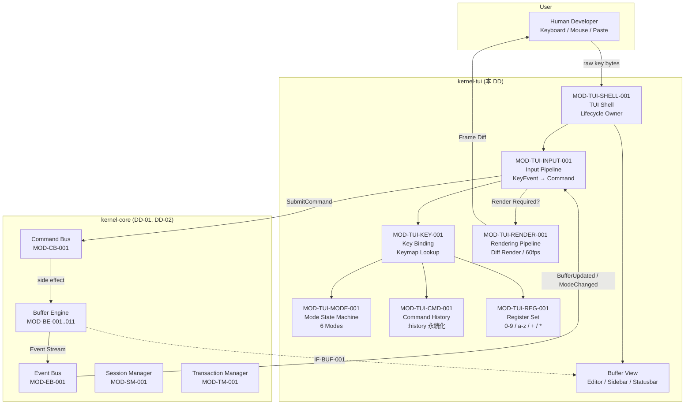
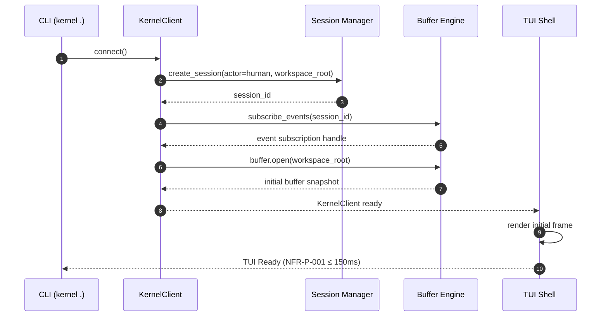
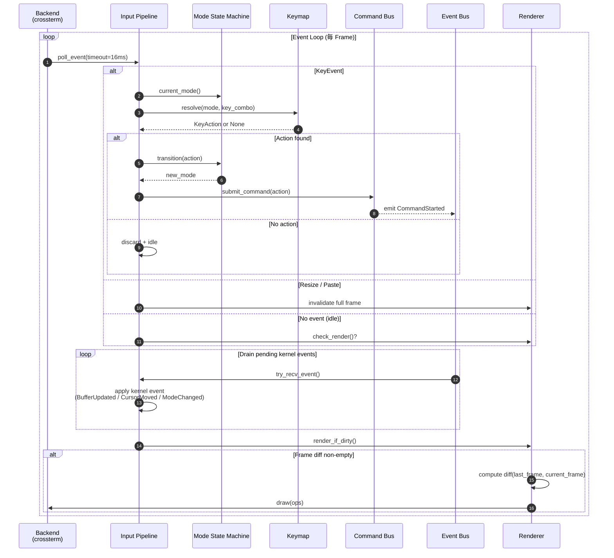
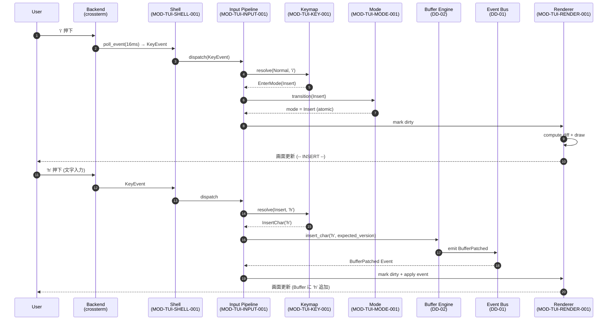
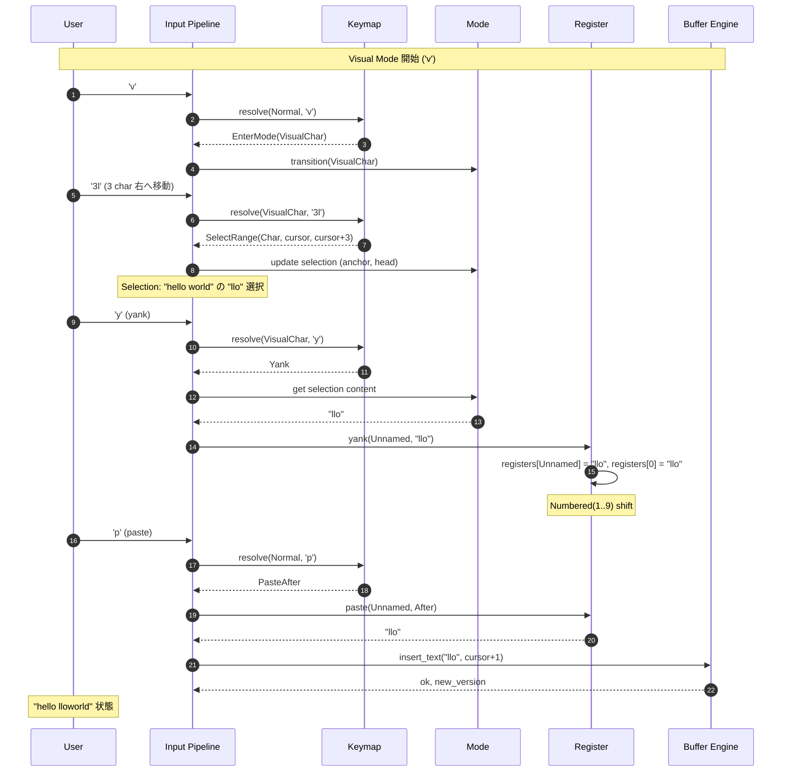

# DD-06 TUI 層 詳細設計書
## FR-009 (Standalone IDE Mode) + FR-010 (Vim 編集モデル) 実装詳細

---

## 文档元数据

| 項目 | 内容 |
|------|------|
| 文档 ID | DD-06-2026-0917 |
| バージョン | 1.0 |
| 日付 | 2026-09-17 |
| 作成者 | MinimaxM3 (Agent) |
| ステータス | 初期版 - レビュー待ち |
| 上位文档 | REQ-001 v1.1 (要件定義書), NFR-001 v1.1 (非機能要件定義書), AD-001 v1.1 (基本設計書), IFD-001 v1.1 (接口设计书), SD-001 v1.1 (安全性設計書) |
| 関連 DD | DD-01 (Microkernel Core), DD-02 (Session/Transaction/Buffer), DD-03 (Plugin), DD-04 (Internal API), DD-04b (Cross-Cutting Concerns) |
| 適用範囲 | kernel-tui crate — terminal frontend (ratatui + crossterm) |

### v1.0 改訂サマリ (ULYS-69 / commit: HEAD)

ULYS-37 v2 上游文档 (commit `b2d45b5` — ULYS-64) で追加された以下 v1.1 上游要素を下敷きに、TUI 層 DD を初版として制作:

- AD-001 v1.1 §4.1 TUI 構成 (6 サブセクション) + §4.2 TUI ライフサイクル (4 ステージ) — 設計フレーム確定
- REQ-001 v1.1 FR-009 Standalone IDE Mode 詳細化 + FR-010-01..06 Vim 編集モデル 6 子项
- IFD-001 v1.1 IF-CMD-001/IF-BUF-001/IF-AUTH-001 内部 API — TUI ↔ Kernel の I/F 契約
- NFR-001 v1.1 §5.8 NFR-S-005 Buffer データ脱敏 + §6.8 NFR-O-001..005 Observability + NFR-P-001/P-003/P-010 性能目標
- SD-001 v1.1 THREAT-007/008 + §9.3 Zero Trust — TUI に関わる制約

### 上位設計への確認事項（DD-06 で発見した phantom / gap）

ULYS-64 で大部分の phantom は解消済みだが、DD-06 制作過程で確認された以下の点を本 DD 内 §15 に記録:

| ID | 内容 | 影響 |
|----|------|------|
| QA-DD06-001 | IFD-001 v1.1 に IF-TUI-001 / IF-TUI-002 が**未定義**。本 DD は §11 で暫定スキーマを提示し、IFD-001 v1.2 で正式追加を要請。 | DD-06 単独で完結可、IFD-001 同期は要追跡 |
| QA-DD06-002 | REQ-001 v1.1 FR-009 は起動シーケンスを 10 ステップで記述しているが、AD-001 §4.2.1 Init シーケンスとの記述粒度差 (5 vs 10) あり。本 DD は 10 ステップ版を採用。 | 粒度統一は AD-001 §4.2.1 修正で吸収 |

---

## 1. ドキュメント情報・目的・用語

### 1.1 目的

本文書は、TUI (Text User Interface) 層の詳細実装を定める。基本設計書 AD-001 v1.1 §4.1 (TUI 構成) / §4.2 (TUI ライフサイクル) で確定した責務・抽象構造を、開発者がそのまま実装でき、テスターがテスト観点を導出でき、Reviewer が設計妥当性を判定できる粒度で記述する。

本 DD がカバーする範囲は FR-009 (Standalone IDE Mode 入口) + FR-010 (Vim 編集モデル 6 子项) の実装層である。

### 1.2 設計対象範囲

**含む**:

- MOD-TUI-SHELL-001 — TUI Shell (Terminal frontend lifecycle)
- MOD-TUI-KEY-001 — Key Binding / Command Palette
- MOD-TUI-CMD-001 — Command History
- MOD-TUI-REG-001 — Register (Named / Numbered / Yank)
- MOD-TUI-MODE-001 — Mode 状態機械 (Normal/Insert/Visual/Command/Replace/Ex)
- MOD-TUI-RENDER-001 — 渲染管线 (Diff render / Frame budget / 60fps)
- MOD-TUI-INPUT-001 — Input pipeline (Key event 队列 → Mode 解析 → Command 构造 → Command Bus 分发)
- IF-TUI-001 (暫定) — TUI ↔ Command Bus Internal API
- IF-TUI-002 (暫定) — TUI ↔ Buffer Engine Internal API
- Mode 切替状態機械の全状態遷移
- Sequence Diagrams: 通常 / Mode 切替 / Vim コマンド実行 / Yank-Paste / Undo-Redo / Crash 回復 / Resize / SIGWINCH
- 性能設計: Frame budget 16ms (60fps) / 入力遅延 ≤10ms / メモリ ≤50MB
- Validation 順序: 键列合法性 → Mode コンテキスト → コマンド権限

**含まない (他 DD に分割)**:

- Session ライフサイクル: DD-02 (MOD-SM-001)
- Transaction ライフサイクル: DD-02 (MOD-TM-001)
- Buffer Engine 内部: DD-02 (MOD-BE-001..011)
- Command Bus / Event Bus / Capability Registry 本体: DD-01
- Plugin Manager 本体: DD-03
- Internal API Server 層: DD-04 (REST/JSON-RPC/MCP Adapter)
- Protocol Adapter (Transport): DD-04
- Security Manager (Secret Store / mTLS): DD-04 (SD-001 と共有)
- Buffer 操作の物理 I/O: DD-02 §8 IF-BUF-001

### 1.3 用語・縮略語

| 用語 | 定義 |
|------|------|
| TUI | Text User Interface。Terminal 内で動作する Character-based Interface (本システムの中核 UX) |
| Shell | 本 DD では `kernel-tui` crate の **メインエントリ・ライフサイクル管理** を指す (OS Shell ではない) |
| ratatui | Rust の TUI ライブラリ (旧 tui-rs の後継)。本 DD の Rendering Backend 実装に使用 |
| crossterm | クロスプラットフォーム Terminal 操作ライブラリ (Windows / Linux / macOS)。ratatui のデフォルト Backend |
| Mode | Editor の状態機械上の状態。Normal / Insert / Visual / Command / Replace / Ex の 6 種 |
| Operator | Vim の動詞 (d, c, y, >, <, =, g~, gu, gU)。Motion と組み合わせて編集コマンドを構成 |
| Motion | Vim の移動単位 (h/j/k/l, w/W/e/E, f/F/t/T, 0/$/^, gg/G, *, n/N, H/M/L) |
| Text Object | Vim の構造的選択単位 (iw/aw, i"/a", i(/a(, i{/a{, ip/ap, i</a<) |
| Register | Vim の複数クリップボード抽象 (0-9, a-z, A-Z, _, +, *, ") |
| Macro | Normal Mode `q{reg}` で記録、`@{reg}` で再生するキーストローク列 |
| Yank | Vim のコピー操作。デフォルトで Register `"0` に格納 |
| Command Line | `:` で始まる Ex コマンド入力 UI |
| Operator-Pending | Operator 入力後 Motion 待ちの状態 (例: `d` 押下直後) |
| Frame | 1 回の Rendering 結果。Crossterm への出力単位 |
| Frame Budget | 1 Frame に許容される処理時間上限 (本 DD: 16ms / 60fps) |
| Diff Render | 前 Frame との差分のみ再描画する戦略 |
| Resize | SIGWINCH (Unix) / Terminal Size 変更イベント (Windows) 受信時の UI 再構成 |
| SIGWINCH | Unix で Terminal サイズ変更を通知するシグナル |
| Drain | Shutdown 時に in-flight Command を graceful に完了させるシーケンス |
| Backend | ratatui の Terminal 抽象 Layer (CrosstermBackend / TermionBackend / TermwizBackend) |
| KeyCombo | Key Binding の内部表現 (`<C-r>` 等). Modifier + Key の組合せ |
| Keymap | Mode 別の Key Binding 解決規則 |
| Keybinding Priority | Plugin → User Config → Default (Vim 互換) の優先順位 |
| Command Palette | `:` で開く Ex コマンド入力 UI |
| Cursor | Buffer 上の現在位置 (Line, Col, Byte offset, Char offset) |
| Selection | Visual Mode での選択範囲 (Anchor, Head) |
| YankState | 直近の Yank 操作の状態 (Mode, Register, Content type) |
| Idempotency | 同一入力の繰り返しを 1 回と扱う性質 |
| Trace ID | リクエスト横断の相関 ID。W3C TraceContext 32 hex chars (NFR-O-003) |
| Span ID | 1 Span 単位の相関 ID。16 hex chars (NFR-O-003) |
| Crash Recovery | TUI プロセスが不意に終了した後の状態復元 (NFR-R-020) |

### 1.4 参考资料

| 文档 | 版 | 該当章 | 用途 |
|------|----|--------|------|
| REQ-001 要件定義書 | 1.1 | FR-009, FR-010-01..06 | 上位要件トレース |
| NFR-001 非機能要件定義書 | 1.1 | NFR-P-001, NFR-P-003, NFR-P-010, NFR-P-040, NFR-R-001, NFR-S-005, NFR-O-001..005 | 性能・信頼性・観測性目標 |
| AD-001 基本設計書 | 1.1 | §4.1 (TUI 構成), §4.2 (TUI ライフサイクル) | 責務・抽象構造の出典 |
| IFD-001 接口设计书 | 1.1 | IF-CMD-001, IF-BUF-001, IF-AUTH-001 | 内部 I/F Contract (TUI ↔ Kernel) |
| SD-001 安全性設計書 | 1.1 | THREAT-007 (Crash 漏洩), THREAT-008 (Rollback), §9.3 (Zero Trust) | Permission / Audit / Crash dump |
| DD-01 Microkernel Core 詳細設計書 | 1.0 | §3 (Command Bus), §4 (Event Bus) | 入力 Command 送出先 |
| DD-02 Session/Transaction/Buffer 詳細設計書 | 1.0 | §8 (Buffer Engine), §7.5 (Undo/Redo) | MOD-BE-001..011 / Transaction 境界 |
| DD-03 Plugin/Extension 詳細設計書 | 1.0 | §6.3 (Plugin Manifest), §3 (Runtime A/B) | Plugin Key Binding 拡張 |
| DD-04 Internal API 詳細設計書 | 1.0 | §5 (Error Code), §7 (Internal API 詳細) | ERR-* namespace / Validation 順序 |
| DD-04b Cross-Cutting Concerns 詳細設計書 | 1.0 | §5 (Logging), §6 (Tracing), §8 (Concurrency) | NFR-O-001..003 実装層 |
| Vim documentation (`:help`) | n/a | 各 Vim コマンド | 键列と動作セマンティクスの出典 |

---

## 2. 全体アーキテクチャと内部境界

### 2.1 TUI 層の位置付け



### 2.2 所有権と可視性

| オブジェクト | 所有 | 共有方式 | 排他 |
|--------------|------|----------|------|
| `App.kernel_client` | `App` (1 個) | `Arc<KernelClient>` + 内部 mpsc channel | 内部実装依存 |
| `App.event_rx` | `App` | `tokio::sync::mpsc::Receiver<Event>` | single consumer |
| `App.editor` | `App` | `&mut self` のみ (single thread) | borrow checker |
| `App.mode` | `App` | `AtomicU8` (repr) | lock-free |
| `App.keymap` | `App` | `Arc<RwLock<KeyMap>>` (Plugin reload 用) | 読込時 RwLock |
| `App.register_set` | `App` | `&mut self` (Vim 互換 Single thread model) | borrow checker |
| `App.history` | `App` | `Arc<RwLock<CommandHistory>>` (永続化) | 書込時 Mutex |
| `Renderer.last_frame` | `Renderer` | `&mut self` | 排他不要 |
| `KernelClient.inflight` | `KernelClient` | `dashmap::DashMap<CommandId, CancellationToken>` | sharded |
| `BufferView.content` | `BufferView` | `Arc<BufferSnapshot>` (BE から受信) | immutable snapshot |

### 2.3 起動時依存関係



### 2.4 全体処理フロー (1 Frame 単位)



### 2.5 Mode 切替の全体遷移グラフ (FR-010-01)

```mermaid
stateDiagram-v2
    [*] --> Normal
    Normal --> Insert: i / a / o / I / A / O
    Normal --> Visual: v / V / C-v
    Normal --> Command: :  /  /  ?
    Normal --> Replace: R
    Normal --> OperatorPending: d / c / y / > / < / = / g~ / gu / gU

    Insert --> Normal: Esc / C-[ / C-c (IME required)
    Visual --> Normal: Esc / C-v (toggle)
    Visual --> OperatorPending: d / c / y / > / < / =
    Command --> Normal: Enter (execute) / Esc / C-c
    Replace --> Normal: Esc / Backspace (cancel)
    OperatorPending --> Normal: g_ (motion resolved, idle)
    OperatorPending --> Insert: c (with motion)
    OperatorPending --> Visual: (with v mod)

    Normal --> Ex: Q (rare, :Ex mode 入口)
    Ex --> Normal: :vi / Esc
    Ex --> Command: :

    note right of Insert
        Buffer::insert_char
        Typewriter semantics
    end note
    note right of Visual
        Anchor / Head 範囲選択
        Char/Line/Block
    end note
    note right of OperatorPending
        Operator + Motion / TextObject 待ち
        16ms timeout なし (Vim 互換)
    end note
```

### 2.6 Vim 互換 vs 拡張 Mode

| Mode | 由来 | Plugin 拡張可否 | 本 DD の責務 |
|------|------|----------------|--------------|
| Normal | Vim 標準 | × (固定) | 完全実装 |
| Insert | Vim 標準 | × (固定) | 完全実装 |
| Visual (Char/Line/Block) | Vim 標準 | × (固定) | 完全実装 |
| Command-line | Vim 標準 | × (固定) | 完全実装 |
| Replace | Vim 標準 | × (固定) | 完全実装 |
| Operator-Pending | Vim 標準 | × (固定) | 完全実装 |
| Ex | Vim 標準 | × (固定) | 完全実装 |
| AI | 拡張 | ○ (Plugin) | 骨格のみ (Plugin Manifest で `mode: "ai"` 宣言) |
| Review | 拡張 | ○ (Plugin) | 骨格のみ |
| Diff | 拡張 | ○ (Plugin) | 骨格のみ |
| Debug | 拡張 | ○ (Plugin) | 骨格のみ |

> **注**: 拡張 Mode の実装は Plugin 側で `register_mode_provider` を行い、Key Binding と Rendering Layer を Plugin が登録する。本 DD は Plugin Manifest / `MOD-TUI-MODE-001` の Plugin 拡張 API のみ定義し、各拡張 Mode の具体実装は Plugin 側に委譲 (FR-010 「Mode ≠ Core Business Logic」 原則)。

---

## 3. MOD-TUI-SHELL-001 TUI Shell 設計

### 3.1 モジュール属性

| 項目 | 内容 |
|------|------|
| Module ID | MOD-TUI-SHELL-001 |
| モジュール名 | TUI Shell |
| 対応 BD | AD-001 v1.1 §4.1, §4.2 |
| 対応 REQ | FR-009, FR-010-01..06 |
| 対応 IF | IF-CMD-001 (入口), IF-BUF-001 (Buffer 表示) |
| 責務 | (a) Terminal Backend の抽象と初期化 (b) Event Loop 駆動 (c) SIGWINCH/Resize 処理 (d) Drain / Shutdown 制御 (e) Frame timing (16ms) 維持 |
| 入力 | `crossterm::event::Event` (Key, Resize, Paste, Focus) + Kernel Event (mpsc) |
| 出力 | `crossterm::event::Event` 消費 + `Frame` (Cell 行列) → Backend draw |
| 依存 | MOD-TUI-INPUT-001, MOD-TUI-RENDER-001, MOD-TUI-KEY-001, MOD-TUI-MODE-001, MOD-TUI-CMD-001, MOD-TUI-REG-001, KernelClient (DD-01), SessionManager (DD-02), BufferEngine (DD-02) |
| 対外接口 | `App::run()`, `App::shutdown(reason)` |
| 使用データ | BufferSnapshot, KeyMap, RegisterSet, CommandHistory, EditorMode |
| 状態 | `App` struct (single instance) |
| Transaction | なし (Frontend) |
| Error | ERR-TUI-001 (Backend init failed), ERR-TUI-002 (Render timeout), ERR-TUI-003 (Drain timeout) |

### 3.2 Class/Component 設計

#### CLS-TUI-SHELL-001 App

| 項目 | 内容 |
|------|------|
| ID | CLS-TUI-SHELL-001 |
| 名称 | App |
| 責務 | TUI のメインアプリケーション・ライフサイクル管理 |
| Lifecycle | `new()` → `run()` → (loop) → `shutdown(reason)` → `Drop` |
| Dependency | `Arc<KernelClient>`, `Arc<RwLock<KeyMap>>`, `Arc<RwLock<CommandHistory>>`, `Arc<dyn Backend>` |
| Interface | `pub async fn new() -> Result<Self>`, `pub async fn run(&mut self) -> Result<()>`, `pub async fn shutdown(&mut self, reason: ShutdownReason)` |
| Field/State | `kernel_client`, `session_id`, `editor`, `sidebar`, `statusbar`, `terminal`, `mode: AtomicU8`, `mode_aux: ModeAux`, `should_quit: AtomicBool`, `frame_budget: Duration`, `inflight: DashMap<CommandId, oneshot::Sender<Result>>`, `resize_pending: AtomicBool` |
| Public Method | `new`, `run`, `shutdown`, `handle_resize`, `handle_paste`, `drain`, `force_exit` |
| Exception | Backend init 失敗時は stderr に ERR-TUI-001 出力後 exit(1) |

#### CLS-TUI-SHELL-002 Backend (trait)

| 項目 | 内容 |
|------|------|
| ID | CLS-TUI-SHELL-002 |
| 名称 | Backend (trait) |
| 責務 | Terminal Backend 抽象 (AD-001 §4.1.6 準拠) |
| Interface | `draw(&mut self, ops: &[DrawOp]) -> Result<()>`, `size(&self) -> (u16, u16)`, `poll_event(&mut self, timeout: Duration) -> Option<InputEvent>`, `flush(&mut self) -> Result<()>` |
| 実装 | `CrosstermBackend` (Desktop 全 OS), `TermionBackend` (Linux), `TermwizBackend` (macOS) |
| 選択 | Default = CrosstermBackend (AD-001 §4.1.6 準拠) |

#### CLS-TUI-SHELL-003 DrawOp

| 項目 | 内容 |
|------|------|
| ID | CLS-TUI-SHELL-003 |
| 名称 | DrawOp |
| 責務 | Backend に渡す描画プリミティブ |
| Field | `op: DrawOpKind`, `x: u16`, `y: u16`, `w: u16`, `h: u16`, `cell: Cell`, `style: Style` |
| Variant | `FillRect`, `PutStr`, `SetCursor`, `ShowCursor`, `HideCursor`, `MoveCursor` |

#### CLS-TUI-SHELL-004 ShutdownReason

| 項目 | 内容 |
|------|------|
| ID | CLS-TUI-SHELL-004 |
| 名称 | ShutdownReason (enum) |
| Variant | `UserQuit` (Esc / :q), `UserForceQuit` (:q!), `Signal(SignalKind)` (SIGTERM/SIGINT/SIGHUP), `KernelShutdown` (Kernel 側から Session 終了通知), `Error(ERR-TUI-XXX)` |
| 用途 | Drain vs Hard Exit 判定 (AD-001 §4.2.3 vs §4.2.4) |

### 3.3 Core Method 設計

#### M-SHELL-001 new()

| 項目 | 内容 |
|------|------|
| Method ID | M-SHELL-001 |
| 目的 | TUI Shell の生成と Kernel 接続 (NFR-P-001 ≤ 150ms 内) |
| Caller | `main()` (kernel-tui/src/main.rs) |
| Input | なし (CLI 引数は main で parse 後 env/config で渡す) |
| Output | `Result<App>` |
| Preconditions | Terminal が TTY であること (非 TTY なら stderr + exit(1)) |
| Processing | (1) Backend::init() (2) KernelClient::connect() (3) Session 作成 (4) EventStream subscribe (5) Buffer::open(workspace_root) (6) Editor/Sidebar/Statusbar 初期化 (7) KeyMap load (8) RegisterSet init (9) CommandHistory load |
| Postconditions | `App.mode == Normal`, `App.should_quit == false`, `App.editor.cursor == (0, 0)` |
| Error | ERR-TUI-001 (Backend init), ERR-SYS-001 (Kernel connect), ERR-AUTH-001 (Session) |
| Side Effect | Terminal を raw mode 化、Alternate Screen 切替 (Vim 互換) |
| Transaction | なし |

#### M-SHELL-002 run()

| 項目 | 内容 |
|------|------|
| Method ID | M-SHELL-002 |
| 目的 | Event Loop 駆動 (AD-001 §4.2.2) |
| Caller | `main()` |
| Input | `&mut self` |
| Output | `Result<()>` |
| Preconditions | `App::new()` 成功 |
| Processing | while `!should_quit` { poll_event → handle_key/resize/paste → render_if_dirty → drain_kernel_events } |
| Postconditions | `should_quit == true` または Error 発生 |
| Error | ERR-TUI-002 (Render timeout — Frame budget 16ms 超過) |
| Side Effect | Backend draw, Kernel Event 消費 |
| Transaction | なし |

#### M-SHELL-003 shutdown(reason)

| 項目 | 内容 |
|------|------|
| Method ID | M-SHELL-003 |
| 目的 | Drain or Hard Exit 選択 (AD-001 §4.2.3 / §4.2.4) |
| Caller | run() loop 終了条件, signal handler, panic catch_unwind |
| Input | `reason: ShutdownReason` |
| Output | `Result<()>` |
| Preconditions | なし |
| Processing | (1) `should_quit = true` (2) reason 判定 (3) Drain: 5s timeout で in-flight Command 完了待ち + Buffer flush + EventStream close + Session::close + Kernel::shutdown → journal fsync (4) Hard Exit: Drop チェーンで Buffer sync_drop + mmap msync |
| Postconditions | Terminal raw mode 復帰、Alternate Screen 復帰、Backend flush 成功 |
| Error | ERR-TUI-003 (Drain timeout 5s 超過 → Hard Exit に切替) |
| Side Effect | Terminal state 復元 |
| Transaction | Journal fsync (NFR-D-002 RPO=0) |

#### M-SHELL-004 handle_resize(w, h)

| 項目 | 内容 |
|------|------|
| Method ID | M-SHELL-004 |
| 目的 | Terminal サイズ変更処理 (AD-001 §4.2.2) |
| Caller | Event Loop (Resize event) |
| Input | `w: u16, h: u16` |
| Output | `Result<()>` |
| Preconditions | w ≥ 1, h ≥ 1 |
| Processing | (1) Editor.resize(w-2, h-3) (Sidebar 1列 + Statusbar 1行 確保) (2) Sidebar.resize(w/4, h-3) (3) Statusbar.resize(w, 1) (4) Renderer.invalidate_full_frame() (5) render_if_dirty (Resize は差分無効化) |
| Postconditions | 全 UI Panel が新サイズに再レイアウト |
| Error | ERR-VAL-001 (w/h < 1) |
| Side Effect | 次 Frame で全画面再描画 |
| Transaction | なし |

### 3.4 処理フロー

#### P-SHELL-001 App::new() 起動シーケンス

REQ-001 v1.1 FR-009 5.1 + AD-001 §4.2.1 を統合した 10 ステップ:

```
P-SHELL-001-01: CLI 引数 parse (clap)
P-SHELL-001-02: Config load (~/.kernel/config.toml + workspace config)
P-SHELL-001-03: Backend::init() — Terminal raw mode + Alternate Screen
P-SHELL-001-04: KernelClient::connect() — embedded / IPC 判定 (NFR-P-001 内 50ms)
P-SHELL-001-05: Session 作成 (actor=human, permissions=human_default())
P-SHELL-001-06: Workspace root 検出 (`git rev-parse --show-toplevel` または `.kernel/`)
P-SHELL-001-07: EventStream::subscribe(session_id)
P-SHELL-001-08: Buffer::open(workspace_root) — 最終ファイル or workspace_root
P-SHELL-001-09: KeyMap load + RegisterSet init + CommandHistory load
P-SHELL-001-10: 初期 Frame render → Backend.draw → "TUI Ready" 印字 → Event Loop 開始
```

性能予算 (NFR-P-001 ≤ 150ms / NFR-P-003 ≤ 100ms warm):

| Phase | 予算 | 検証 |
|-------|------|------|
| P-SHELL-001-01..02 (parse + config) | ≤ 5ms | cold warm 共通 |
| P-SHELL-001-03 (Backend init) | ≤ 5ms | cold warm 共通 |
| P-SHELL-001-04 (Kernel connect) | ≤ 50ms cold / ≤ 30ms warm | embedded は ≪ 1ms |
| P-SHELL-001-05 (Session create) | ≤ 20ms | DD-01 §3 整合 |
| P-SHELL-001-06..07 (Workspace + Subscribe) | ≤ 30ms cold / ≤ 10ms warm | file stat + IPC |
| P-SHELL-001-08 (Buffer open) | ≤ 30ms | Mmap 即時返却 |
| P-SHELL-001-09 (KeyMap / Reg / Hist) | ≤ 5ms | in-memory load |
| P-SHELL-001-10 (Render 初回) | ≤ 5ms | 空 frame |
| **合計** | **≤ 150ms cold / ≤ 100ms warm** | NFR-P-001 / NFR-P-003 |

### 3.5 分岐条件 (Branch Table)

| 条件 | 真 | 偽 |
|------|----|----|
| `tty::is_tty(stderr) == false` | ERR-TUI-001 → exit(1) | 続行 |
| `KernelClient::connect() == Err` | ERR-SYS-001 表示後 5s 待機 → 再試行 → 失敗なら exit(2) | 続行 |
| `Session::create() == Err::AUTH` | ERR-AUTH-001 表示後 → exit(3) | 続行 |
| `Buffer::open(workspace_root) == Err::NOT_FOUND` | workspace_root 自体を Buffer として開く (新規空 Buffer) | 続行 |
| `KeyMap load 失敗` | Default KeyMap (Vim 互換) で続行 + WARN ログ | 続行 |
| `CommandHistory load 失敗 (corrupt file)` | 履歴破棄 + 新規作成 + WARN ログ (NFR-M-002 整合) | 続行 |
| `frame_budget 超過` | ERR-TUI-002 ログ + `is_dirty = false` 強制 (次 frame に持ち越し) | 通常 render |

### 3.6 故障回復 (Crash Recovery)

#### 3.6.1 Panic 発生時

```
1. panic catch_unwind でキャッチ
3. App::shutdown(ShutdownReason::Error(ERR-TUI-004))
4. Hard Exit 経路 (AD-001 §4.2.4) で Journal 保全
5. stderr に "kernel-tui: panic at <location>: <message>" 出力
6. exit(101)
```

#### 3.6.3 SIGTERM / SIGINT (Ctrl-C)

```
1. signal_hook でフック
2. App::shutdown(ShutdownReason::Signal(SIGTERM)) 呼出
3. Drain 経路 (AD-001 §4.2.3) で graceful shutdown (5s timeout)
4. 5s 超過で Hard Exit にフォールバック (ERR-TUI-003)
```

#### 3.6.4 SIGWINCH (Unix のみ)

```
1. signal_hook でフック
2. Backend::size() で現在サイズ取得
3. App::handle_resize(w, h) 呼出 (M-SHELL-004)
4. Resize は Frame budget 外で処理 (優先処理)
```

Windows の Terminal Size 変更は SIGWINCH ではなく `crossterm::event::Event::Resize(w, h)` で通知されるため、Platform 抽象は `Backend::poll_event` 内で吸収。

---

## 4. MOD-TUI-KEY-001 Key Binding 設計

### 4.1 モジュール属性

| 項目 | 内容 |
|------|------|
| Module ID | MOD-TUI-KEY-001 |
| モジュール名 | Key Binding / Command Palette |
| 対応 BD | AD-001 v1.1 §4.1.2 |
| 対応 REQ | FR-010-01, FR-010-02 |
| 対応 IF | IF-CMD-001 (Command Palette 経由) |
| 責務 | (a) Mode 別 Keymap 管理 (b) Plugin Key Binding 登録 API (c) User Config Override (d) KeyEvent → KeyAction 解決 (e) Command Palette UI |
| 入力 | `crossterm::event::KeyEvent`, `BindingContext` (Global / InsertOnly / VisualOnly) |
| 出力 | `Option<KeyAction>` (None = 解決失敗 → beep + 破棄) |
| 依存 | MOD-TUI-MODE-001 (現在 Mode 取得), Plugin Manifest (DD-03 §6.3) |
| 対外接口 | `resolve(mode, key) -> Option<KeyAction>`, `register_plugin_binding(plugin_id, binding)`, `unregister_plugin_binding(plugin_id)` |
| 使用データ | KeyMap (HashMap<(Mode, KeyCombo), KeyAction>) |
| 状態 | 3 階層 Priority (Plugin > User > Default) |
| Transaction | なし |
| Error | ERR-TUI-010 (Plugin binding conflict), ERR-TUI-011 (User config parse 失敗) |

### 4.2 Class/Component 設計

#### CLS-TUI-KEY-001 KeyBinding

| 項目 | 内容 |
|------|------|
| ID | CLS-TUI-KEY-001 |
| Field | `mode: EditorMode`, `trigger: KeyCombo`, `action: KeyAction`, `context: BindingContext`, `source: BindingSource` |
| 用途 | 1 つの Key Binding を表す不変 struct |

#### CLS-TUI-KEY-002 KeyCombo

| 項目 | 内容 |
|------|------|
| ID | CLS-TUI-KEY-002 |
| Field | `key: KeyCode`, `modifiers: KeyModifiers` |
| 表現 | 例: `<C-r>` → (KeyCode::Char('r'), KeyModifiers::CTRL) |
| 用途 | Trigger の正規化 (大文字小文字の区別は Mode 層で吸収) |

#### CLS-TUI-KEY-003 KeyAction (enum)

| 項目 | 内容 |
|------|------|
| ID | CLS-TUI-KEY-003 |
| Variant | `EnterMode(EditorMode)`, `SubmitCommand(CommandName, Args)`, `InsertChar(char)`, `DeleteBackward`, `DeleteForward`, `Yank`, `Paste`, `Undo`, `Redo`, `MoveCursor(Motion)`, `SelectRange(SelectKind, StartPos, EndPos)`, `StartOperator(Operator)`, `StartMacro(RegisterName)`, `StopMacro`, `ExecMacro(RegisterName)`, `RepeatLast`, `SetMark(MarkName)`, `JumpToMark(MarkName)`, `OpenCommandPalette`, `OpenSearchForward`, `OpenSearchBackward`, `PluginAction(PluginId, ActionName)` |
| 用途 | Key 1 回押下で実行する抽象アクション |

#### CLS-TUI-KEY-004 KeyMap

| 項目 | 内容 |
|------|------|
| ID | CLS-TUI-KEY-004 |
| Field | `default: HashMap<(EditorMode, KeyCombo), KeyAction>`, `user_overrides: HashMap<(EditorMode, KeyCombo), KeyAction>`, `plugin_overrides: HashMap<(EditorMode, KeyCombo, PluginId), KeyAction>` |
| 責務 | 3 階層 Keymap の保持と lookup |

#### CLS-TUI-KEY-005 BindingSource (enum)

| 項目 | 内容 |
|------|------|
| ID | CLS-TUI-KEY-005 |
| Variant | `Default`, `UserConfig(PathBuf)`, `Plugin(PluginId)` |
| 用途 | Priority 判定用 |

### 4.3 Core Method 設計

#### M-KEY-001 resolve(mode, key)

| 項目 | 内容 |
|------|------|
| Method ID | M-KEY-001 |
| 目的 | キーイベントから Action を解決 (3 階層 Priority) |
| Caller | MOD-TUI-INPUT-001 |
| Input | `mode: EditorMode`, `key: KeyCombo` |
| Output | `Option<KeyAction>` (None = 未バインド) |
| Processing | (1) plugin_overrides[mode, key] lookup (2) user_overrides[mode, key] lookup (3) default[mode, key] lookup (4) いずれも miss → None |
| Error | なし (None 返却) |
| Side Effect | なし |
| Transaction | なし |

#### M-KEY-002 register_plugin_binding(plugin_id, binding)

| 項目 | 内容 |
|------|------|
| Method ID | M-KEY-002 |
| 目的 | Plugin Manifest からの Key Binding 登録 |
| Caller | Plugin Manager (DD-03 §6.3) |
| Input | `plugin_id: PluginId`, `binding: KeyBinding` |
| Output | `Result<()>` |
| Preconditions | Plugin が Active 状態 (DD-03 §6.4 整合) |
| Processing | (1) 既存 Plugin バインド確認 (2) 衝突時: 同 Plugin 内なら上書き、他 Plugin なら ERR-TUI-010 (User/Dafault との衝突は User 設定で上書き可能) (3) plugin_overrides 追加 |
| Error | ERR-TUI-010 (Cross-plugin conflict) |
| Side Effect | KeyMap 更新通知 (EventBus Push) |
| Transaction | なし |

#### M-KEY-003 load_user_config(path)

| 項目 | 内容 |
|------|------|
| Method ID | M-KEY-003 |
| 目的 | `~/.kernel/config.toml` の `[key_bindings]` セクションを load |
| Caller | MOD-TUI-SHELL-001 P-SHELL-001-09 |
| Input | `path: PathBuf` |
| Output | `Result<usize>` (loaded count) |
| Preconditions | path.exists() |
| Processing | TOML parse → user_overrides に追加 (Plugin binding より低優先、Default より高優先) |
| Error | ERR-TUI-011 (TOML parse 失敗) → 部分適用 (valid 行まで) |
| Side Effect | KeyMap 更新 |
| Transaction | なし |

### 4.4 Vim 互換 Keymap (Default)

Vim 8.2 / Neovim 0.9 の公式 help を典拠とし、以下を Default Keymap とする (FR-010-02 整合)。**全キーは `:help {key}` の Vim 公式ドキュメントに基づく。**

#### 4.4.1 Normal Mode (主要抜粋)

| Key | Action | Vim 出典 |
|-----|--------|----------|
| `h` / `j` / `k` / `l` | MoveCursor(Left/Down/Up/Right) | `:help motion.txt` |
| `i` / `a` / `o` | EnterMode(Insert) (insert / append / open line) | `:help i`, `:help a`, `:help o` |
| `I` / `A` / `O` | EnterMode(Insert) (line start / line end / open above) | `:help I`, `:help A`, `:help O` |
| `v` / `V` / `C-v` | EnterMode(Visual Char/Line/Block) | `:help v`, `:help V`, `:help visual-block` |
| `:` | OpenCommandPalette | `:help :` |
| `/` / `?` | OpenSearchForward / OpenSearchBackward | `:help /`, `:help ?` |
| `R` | EnterMode(Replace) | `:help R` |
| `d` | StartOperator(Delete) | `:help d` |
| `c` | StartOperator(Change) | `:help c` |
| `y` | StartOperator(Yank) | `:help y` |
| `>` / `<` | StartOperator(Indent/Unindent) | `:help >`, `:help <` |
| `=` | StartOperator(Format) | `:help =` |
| `g~` / `gu` / `gU` | StartOperator(ToggleCase/Lower/Upper) | `:help g~`, `:help gu`, `:help gU` |
| `p` / `P` | PasteAfter / PasteBefore | `:help p`, `:help P` |
| `u` / `C-r` | Undo / Redo | `:help u`, `:help redo` |
| `dd` / `cc` / `yy` | DeleteLine / ChangeLine / YankLine (operator + count 1 + motion line) | `:help dd`, `:help cc`, `:help yy` |
| `gg` / `G` | MoveCursor(FirstLine / LastLine) | `:help gg`, `:help G` |
| `0` / `$` / `^` | MoveCursor(LineStart / LineEnd / FirstNonBlank) | `:help 0`, `:help $`, `:help ^` |
| `w` / `W` / `e` / `E` / `b` / `B` | MoveCursor(WordForward variants) | `:help w`, `:help W`, `:help e`, `:help E`, `:help b`, `:help B` |
| `f{char}` / `F{char}` / `t{char}` / `T{char}` | MoveCursor(FindChar variants) | `:help f`, `:help F`, `:help t`, `:help T` |
| `H` / `M` / `L` | MoveCursor(High/Middle/Low) | `:help H`, `:help M`, `:help L` |
| `{` / `}` | MoveCursor(ParagraphPrev / Next) | `:help {`, `:help }` |
| `*` / `#` | SearchWordUnderCursor(Forward/Backward) | `:help *`, `:help #` |
| `n` / `N` | SearchNext / SearchPrev | `:help n`, `:help N` |
| `%` | MoveCursor(MatchingBracket) | `:help %` |
| `m{a-zA-Z}` | SetMark | `:help m` |
| `'{a-zA-Z}` | JumpToMark(line) | `:help '` |
| `q{a-z}` | StartMacro | `:help q` |
| `q` (停止) | StopMacro | `:help q` |
| `@{a-z}` | ExecMacro | `:help @` |
| `.` | RepeatLast | `:help .` |
| `{count}` | 数値 Prefix (0-9、Operator/Motion に前置) | `:help count` |
| `Esc` / `C-c` | EnterMode(Normal) (Visual/Insert/Command から) | `:help i_Esc` |
| `C-[` | EnterMode(Normal) (Insert 用か?) — Vim 8.2 では `<Esc>` と同等 | `:help CTRL-[` |

#### 4.4.2 Insert Mode (主要抜粋)

| Key | Action | Vim 出典 |
|-----|--------|----------|
| 任意の printable char | InsertChar | `:help i` |
| `Esc` / `C-[` | EnterMode(Normal) | `:help i_Esc` |
| `C-c` | EnterMode(Normal) (IME 互換) | `:help i_CTRL-C` |
| `C-h` / `BS` | DeleteBackward | `:help i_CTRL-H` |
| `C-w` | DeleteWordBackward | `:help i_CTRL-W` |
| `C-u` | DeleteLineBackward | `:help i_CTRL-U` |
| `C-r {reg}` | Paste(Register) | `:help i_CTRL-R` |
| `C-o` | Operator-Pending (1 コマンド) | `:help i_CTRL-O` |
| `Tab` / `S-Tab` | Indent / Unindent (insert completion 起動は §4.5 Command Palette 経由) | `:help i_Tab` |
| `Enter` | InsertNewline | `:help i_<CR>` |

#### 4.4.3 Visual Mode (Char/Line/Block)

| Key | Action | Vim 出典 |
|-----|--------|----------|
| `d` / `x` | DeleteSelection | `:help v_d`, `:help v_x` |
| `c` / `s` | ChangeSelection | `:help v_c`, `:help v_s` |
| `y` | YankSelection | `:help v_y` |
| `>` / `<` | IndentSelection / UnindentSelection | `:help v_>`, `:help v_<` |
| `=` | FormatSelection | `:help v_=` |
| `~` | ToggleCaseSelection | `:help v_~` |
| `o` / `O` | MoveCursor(CursorOtherEnd) | `:help v_o` |
| `Esc` / `C-c` | EnterMode(Normal) | `:help v_ESC` |

#### 4.4.4 Command-line Mode (主要抜粋)

| Key | Action | Vim 出典 |
|-----|--------|----------|
| printable char | AppendToBuffer | `:help c` |
| `Enter` | ExecuteCommand | `:help c_<CR>` |
| `Esc` / `C-c` | EnterMode(Normal) (cancel) | `:help c_ESC` |
| `Tab` | Completion | `:help c_<Tab>` |
| `C-h` / `BS` | DeleteChar | `:help c_CTRL-H` |
| `C-w` | DeleteWord | `:help c_CTRL-W` |
| `C-u` | DeleteLine | `:help c_CTRL-U` |
| `C-r {reg}` | InsertRegister | `:help c_CTRL-R` |
| `↑` / `↓` | HistoryPrev / HistoryNext | `:help c_up`, `:help c_down` |
| `C-p` / `C-n` | HistoryPrev / HistoryNext (insert 互換) | `:help i_CTRL-P`, `:help i_CTRL-N` |

#### 4.4.5 Operator-Pending Mode

| Key | Action | Vim 出典 |
|-----|--------|----------|
| `i{object}` / `a{object}` | TextObjectInner / Around (iw/aw, i"/a", i(/a(, i{/a{, ip/ap, i</a<) | `:help text-objects` |
| `{motion}` | ResolveOperator(Motion) | `:help motion.txt` |
| `Esc` / `C-c` | CancelOperator | `:help :map-operator` |
| `{count}` | Multiply count | `:help count` |

### 4.5 Command Palette

#### 4.5.1 概要

- `:` キーで開く (`OpenCommandPalette` action)
- `:` 直後の最初の char で fuzzy search 開始
- `Tab` で Completion (Plugin 提供 Capability 名も含む)
- 履歴は `↑/↓` / `C-p/C-n` で navigate (Command History MOD-TUI-CMD-001 連携)

#### 4.5.2 標準 Ex Command (FR-010-06)

| Command | 動作 | 出典 |
|---------|------|------|
| `:w` | Buffer save | `:help :w` |
| `:q` | Quit (Buffer clean 必須) | `:help :q` |
| `:wq` / `:x` | Save & Quit | `:help :wq` |
| `:q!` | Force Quit | `:help :q!` |
| `:e {file}` | Open file | `:help :e` |
| `:b{n}` | Switch buffer | `:help :b` |
| `:tabnew` / `:vsplit` / `:split` | Window split | `:help :tabnew`, `:help :vsplit`, `:help :split` |
| `:Kernel {cmd}` | Kernel Command 直接実行 (例: `:Kernel session.list`) | 本システム固有 (FR-010-06) |
| `:history` | Command History 表示 | FR-010-04 整合 |
| `:registers` | Register 内容表示 | FR-010-02 整合 |

### 4.6 処理フロー

#### P-KEY-001 KeyEvent 解決フロー

```
P-KEY-001-01: Input Pipeline から (mode, key_combo) 受信
P-KEY-001-02: M-KEY-001 resolve 呼出
P-KEY-001-03: 結果判定
  ├─ Some(action) → action 種別判定
  │   ├─ EnterMode(new_mode) → MOD-TUI-MODE-001::M-MODE-001::transition
  │   ├─ SubmitCommand(name, args) → MOD-TUI-INPUT-001::M-INPUT-002::submit
  │   ├─ InsertChar(c) → BufferEngine::insert_char (IF-BUF-001)
  │   ├─ Yank → MOD-TUI-REG-001::M-REG-001::yank
  │   ├─ Paste → MOD-TUI-REG-001::M-REG-002::paste
  │   ├─ Undo/Redo → BufferEngine::undo/redo (DD-02 §7.5 整合)
  │   ├─ MoveCursor(motion) → BufferEngine::move_cursor
  │   ├─ SelectRange → MOD-TUI-MODE-001::Selection 更新
  │   ├─ StartOperator(op) → MOD-TUI-MODE-001::enter OperatorPending
  │   └─ PluginAction(id, name) → Plugin 側に dispatch
  └─ None → beep + is_dirty = false (Idle 維持)
P-KEY-001-04: 後処理 — selection buffer フラッシュ (n秒 idle 後) 【TBD: 何秒か】
```

---

## 5. MOD-TUI-CMD-001 Command History 設計

### 5.1 モジュール属性

| 項目 | 内容 |
|------|------|
| Module ID | MOD-TUI-CMD-001 |
| モジュール名 | Command History |
| 対応 BD | AD-001 v1.1 §4.1.3 |
| 対応 REQ | FR-010-04 |
| 対応 IF | なし (内部データ) |
| 責務 | (a) Command Line 履歴管理 (b) Search 履歴管理 (c) 永続化 (Rotation 含む) (d) ↑/↓ ナビゲーション |
| 入力 | `Enter` で確定した Ex Command, `/` `?` で確定した Search query |
| 出力 | 履歴エントリ (cursor position) |
| 依存 | NFR-M-002 (Log Rotation) |
| 対外接口 | `append(HistoryEntry)`, `prev() -> Option<HistoryEntry>`, `next() -> Option<HistoryEntry>`, `flush()` |
| 使用データ | `VecDeque<HistoryEntry>`, 永続化先 `~/.kernel/history/{cmd,search}.txt` |
| 状態 | cursor: usize |
| Transaction | 書込は append-only + atomic rename (NFR-D-002 RPO=0 整合) |
| Error | ERR-TUI-020 (履歴 corrupt), ERR-TUI-021 (履歴書込 I/O 失敗) |

### 5.2 Class/Component 設計

#### CLS-TUI-CMD-001 CommandHistory

| 項目 | 内容 |
|------|------|
| ID | CLS-TUI-CMD-001 |
| Field | `entries: VecDeque<HistoryEntry>`, `cursor: usize`, `persistent_path: PathBuf`, `max_entries: usize` (default 10_000) |
| Method | `new(path, max)`, `append(entry)`, `prev()`, `next()`, `flush()`, `load()` |
| 永続化 | Mode 別ファイル (cmd.txt, search.txt) |

#### CLS-TUI-CMD-002 HistoryEntry

| 項目 | 内容 |
|------|------|
| ID | CLS-TUI-CMD-002 |
| Field | `timestamp: DateTime<Utc>`, `mode: EditorMode` (Command / SearchForward / SearchBackward), `command: String`, `result: HistoryResult` (Ok | Err(String)) |
| 用途 | 1 履歴エントリ |

### 5.3 Core Method 設計

#### M-CMD-001 append(entry)

| 項目 | 内容 |
|------|------|
| Method ID | M-CMD-001 |
| 目的 | 履歴追加 (FIFO 上限超過で先頭削除) |
| Caller | CommandPalette (Enter 確定時), SearchForward / SearchBackward (確定時) |
| Input | `entry: HistoryEntry` |
| Output | `Result<()>` |
| Processing | (1) entries.push_back(entry) (2) entries.len() > max_entries → entries.pop_front() (3) cursor = entries.len() (4) async flush (debounce 1s) |
| Error | ERR-TUI-021 (I/O 失敗) |
| Side Effect | ファイル書込 (debounced) |
| Transaction | atomic write: tmp file → fsync → rename (NFR-D-002 整合) |

#### M-CMD-002 prev() / next()

| 項目 | 内容 |
|------|------|
| Method ID | M-CMD-002 |
| 目的 | ↑/↓ ナビゲーション |
| Caller | CommandPalette |
| Input | なし |
| Output | `Option<HistoryEntry>` |
| Processing | prev: cursor -= 1 (cursor == 0 なら None) / next: cursor += 1 (cursor == entries.len() なら None) |
| Error | なし |
| Side Effect | なし |

### 5.4 永続化設計 (FR-010-05)

#### 5.4.1 ファイル形式

```
~/.kernel/history/cmd.txt      # Command Line 履歴 (1 行 1 エントリ)
~/.kernel/history/search.txt   # Search 履歴
~/.kernel/history/search_back.txt  # Backward Search (?)
```

各行は TSV:

```
2026-09-17T22:00:00Z\tCommand\tsession.list\tOk
2026-09-17T22:01:00Z\tSearchForward\t/foo\tOk
2026-09-17T22:01:30Z\tSearchBackward\t?bar\tOk
```

#### 5.4.2 Rotation (NFR-M-002 整合)

- 10_000 entries 上限 (FIFO 切り捨て)
- ファイルサイズが 10MB 超過で gzip 圧縮 + archive (NFR-M-002 整合)
- archive 先: `~/.kernel/history/archive/cmd-{YYYYMMDD}.txt.gz`

#### 5.4.3 整合性 (NFR-D-002 RPO=0)

- 書込: tmp ファイル → fsync → rename (atomic on POSIX, Windows では ReplaceFile API)
- 起動時: load 失敗時 ERR-TUI-020 で新規作成 + WARN ログ (corrupt は破棄、UX 優先)

### 5.5 処理フロー

#### P-CMD-001 起動時履歴 load

```
P-CMD-001-01: ~/.kernel/history/{mode}.txt 存在確認
  ├─ 存在 → 1 行ずつ parse → entries に push
  │   ├─ parse 失敗行 → skip + WARN (部分 corrupt は許容)
  │   └─ 全行失敗 → ERR-TUI-020 → entries 空 で続行
  └─ 不存在 → 空 entries で初期化 + 親 dir 作成
P-CMD-001-02: cursor = entries.len()
```

#### P-CMD-002 履歴 append

```
P-CMD-002-01: M-CMD-001::append(entry)
P-CMD-002-02: 内部で debounce (1s) → flush
  ├─ debounce timer 起動 (既存の timer あれば cancel)
  └─ 1s 後に tokyio::spawn(async flush())
P-CMD-002-03: flush: entries → tmp file 書込 → fsync → rename
```

---

## 6. MOD-TUI-REG-001 Register 設計

### 6.1 モジュール属性

| 項目 | 内容 |
|------|------|
| Module ID | MOD-TUI-REG-001 |
| モジュール名 | Register Set |
| 対応 BD | AD-001 v1.1 §4.1.4 |
| 対応 REQ | FR-010-02 |
| 対応 IF | なし (内部データ) |
| 責務 | (a) Named/Numbered/Yank/System Register 管理 (b) Yank/Paste 抽象 (c) Plugin Register 拡張 API |
| 入力 | Yank 対象 text / range, Paste 命令 |
| 出力 | Yank buffer 内容 |
| 依存 | Plugin Manifest (DD-03 §6.3 `register_provider`) |
| 対外接口 | `yank(register, content)`, `paste(register, mode) -> Content`, `list()` |
| 使用データ | `HashMap<RegisterName, Register>` |
| 状態 | single thread (`&mut self`) |
| Transaction | なし |
| Error | ERR-TUI-030 (Register not found), ERR-TUI-031 (Plugin register conflict) |

### 6.2 Class/Component 設計

#### CLS-TUI-REG-001 Register

| 項目 | 内容 |
|------|------|
| ID | CLS-TUI-REG-001 |
| Field | `name: RegisterName`, `content: RegisterContent`, `last_modified: DateTime<Utc>` |
| 用途 | 1 Register の内容 |

#### CLS-TUI-REG-002 RegisterContent (enum)

| 項目 | 内容 |
|------|------|
| ID | CLS-TUI-REG-002 |
| Variant | `Text(Vec<String>)` (各行 Char-wise 配列), `Line(Vec<String>)` (Line-wise), `Block { top_left: (u16, u16), cells: Vec<Vec<char>> }` (Visual Block), `Macro(Vec<KeyEvent>)` (q{reg} 記録) |

#### CLS-TUI-REG-003 RegisterName (enum)

| 項目 | 内容 |
|------|------|
| ID | CLS-TUI-REG-003 |
| Variant | `Unnamed` (`""`), `Numbered(u8)` (0-9), `NamedLower(char)` (a-z), `NamedUpper(char)` (A-Z, append mode), `BlackHole` (`_`), `SystemClipboard`, `+`, `Selection` (`*`), `MacroNamed(char)`, `Plugin(PluginId, String)` |
| 用途 | Vim 互換 + Plugin 拡張 |

#### CLS-TUI-REG-004 RegisterSet

| 項目 | 内容 |
|------|------|
| ID | CLS-TUI-REG-004 |
| Field | `registers: HashMap<RegisterName, Register>`, `default_unnamed: RegisterName` (`Unnamed`), `yank_default: RegisterName` (`Numbered(0)`) |
| Method | `yank(name, content)`, `paste(name, mode)`, `read(name)`, `list()`, `register_provider(plugin_id, name)` |

### 6.3 Core Method 設計

#### M-REG-001 yank(name, content)

| 項目 | 内容 |
|------|------|
| Method ID | M-REG-001 |
| 目的 | Register に text を格納 (Vim 互換) |
| Caller | YankSelection (Visual), Delete (Normal), YankLine (dd, yy) |
| Input | `name: RegisterName`, `content: RegisterContent` |
| Output | `Result<()>` |
| Processing | (1) name が Unnamed (`""`) なら実際には Numbered(0) + Unnamed の両方に書込 (Vim 仕様) (2) name が NamedUpper なら既存 content に append (Vim 仕様) (3) registers.insert(name, Register{...}) |
| Error | なし |
| Side Effect | Numbered(1..9) は shift (0 → 1, 1 → 2, ..., 8 → 9, 9 削除) — Vim 互換 |
| Transaction | なし |

#### M-REG-002 paste(name, mode)

| 項目 | 内容 |
|------|------|
| Method ID | M-REG-002 |
| 目的 | Register から text 取得 + Cursor に挿入 |
| Caller | PasteAfter (p), PasteBefore (P), InsertMode Ctrl-R (C-r {reg}) |
| Input | `name: RegisterName` (default = Unnamed), `mode: PasteMode` (After / Before / Insert) |
| Output | `Result<RegisterContent>` |
| Preconditions | name に対応する Register が存在 |
| Processing | (1) registers.get(name) → Some(content) (2) None なら Unnamed にフォールバック (3) それでも None なら ERR-TUI-030 (4) content 返却 (呼び出し元が BufferEngine::insert_text) |
| Error | ERR-TUI-030 (Register not found — 通常は発生しない、Unnamed は必ず存在) |
| Side Effect | Cursor 移動 (呼び出し元) |
| Transaction | Buffer commit (DD-02 §7.5 整合) |

#### M-REG-003 register_provider(plugin_id, name)

| 項目 | 内容 |
|------|------|
| Method ID | M-REG-003 |
| 目的 | Plugin 独自 Register 登録 |
| Caller | Plugin Manager (DD-03 §6.3) |
| Input | `plugin_id: PluginId`, `name: String` |
| Output | `Result<RegisterName>` |
| Processing | (1) `Plugin(plugin_id, name)` の RegisterName 生成 (2) 既存 Plugin 同名なら上書き許可 (3) 他 Plugin 同名なら ERR-TUI-031 (4) registers に Register 初期化 (空 content) |
| Error | ERR-TUI-031 (Cross-plugin name conflict) |
| Side Effect | なし |
| Transaction | なし |

### 6.4 Vim 互換 Register Semantics (FR-010-02, FR-010-03)

#### 6.4.1 Yank 時の自動 Register 更新

| 操作 | Unnamed (`""`) | Numbered(0) | Numbered(1..9) |
|------|----------------|-------------|----------------|
| `y{motion}` (small yank) | 上書 | 上書 | shift (0→1, 1→2, ...) |
| `dd` / `yy` (line yank) | 上書 | 上書 | shift |
| `{Visual}y` | 上書 | 上書 | shift |
| `p` (paste) | 影響なし | 影響なし | 影響なし |
| Delete (non-`"x`) | 上書 | 影響なし | shift (1→2, ...) |
| Black hole (`"_`) | 影響なし | 影響なし | 影響なし |

#### 6.4.2 Numbered Register

- `0`: 直近 yank (Vim 仕様、Delete では上書されない)
- `1..9`: 直近 9 件の delete/yank (古い順 1 が最新)

#### 6.4.3 Named Register

- `a-z`: 通常 (上書)
- `A-Z`: append mode (既存 content に追加 — Vim 仕様)
- 例: `"A` で yank → `a` の既存 content に append

#### 6.4.4 Special Register

- `"` (Unnamed): 直近 yank/delete
- `_` (Black hole): 書込先は破棄
- `+` (System clipboard): OS 連携 (Windows: clipboard API / macOS: pbcopy / Linux: xclip/wl-copy)
- `*` (Selection): Primary selection (X11 / macOS)

#### 6.4.5 Macro Register

- `q{a-z}` で Macro 記録開始 (Register に Macro(Vec<KeyEvent>) 形式で保存)
- `q` で停止
- `@{a-z}` で再生 (Macro 実行 → KeyEvent 列を MOD-TUI-INPUT-001 に再投入)

### 6.5 処理フロー

#### P-REG-001 Yank 実行

```
P-REG-001-01: Yank 開始 (Vim 互換 yank operator)
P-REG-001-02: Selection / Range から content 取得
P-REG-001-03: M-REG-001::yank(name, content)
  ├─ name 判定 (Default = Unnamed)
  ├─ Numbered(1..9) shift 処理
  └─ Unnamed / Numbered(0) 上書
P-REG-001-04: YankState 更新 (last yank metadata)
P-REG-001-05: is_dirty = true (Statusbar 更新用)
```

#### P-REG-002 Paste 実行

```
P-REG-002-01: Paste 開始 (p / P / C-r {reg})
P-REG-002-02: M-REG-002::paste(name, mode)
P-REG-002-03: content 取得 → BufferEngine::insert_text (DD-02 §8 IF-BUF-001)
  ├─ content type 別処理
  │   ├─ Text → Character-wise insert (mode = After/Before で位置調整)
  │   ├─ Line → 行 mode で挿入
  │   └─ Block → Visual Block として挿入 (矩形領域)
P-REG-002-04: Cursor 移動 (paste mode = After なら次の文字、Before なら前の行頭)
P-REG-002-05: is_dirty = true
```

---

## 7. MOD-TUI-MODE-001 Mode State Machine 設計

### 7.1 モジュール属性

| 項目 | 内容 |
|------|------|
| Module ID | MOD-TUI-MODE-001 |
| モジュール名 | Mode State Machine |
| 対応 BD | AD-001 v1.1 §4.1.5 |
| 対応 REQ | FR-010-01, FR-010-02 |
| 対応 IF | なし (内部状態) |
| 責務 | (a) EditorMode 状態管理 (b) Mode 遷移の妥当性検証 (c) Plugin 拡張 Mode 登録 API (d) Selection 状態管理 (Visual Mode 限定) |
| 入力 | `EnterMode(EditorMode)` action, `Selection` 更新イベント |
| 出力 | `EditorMode` 現在状態, Mode 遷移 Validation 結果 |
| 依存 | なし (Frontend 内部状態) |
| 対外接口 | `transition(new_mode) -> Result<()>`, `current() -> EditorMode`, `register_plugin_mode(plugin_id, mode_name)`, `selection_mut() -> &mut Selection` |
| 使用データ | `mode: AtomicU8` (FR-010-01 整合), `mode_aux: ModeAux` (OperatorPending 状態, Visual Selection), `last_insert_mode: AtomicU8` (Vim `gi` 用) |
| 状態 | single thread (`&mut self` via &App) |
| Transaction | なし |
| Error | ERR-TUI-040 (Invalid mode transition), ERR-TUI-041 (Plugin mode conflict) |

### 7.2 Class/Component 設計

#### CLS-TUI-MODE-001 EditorMode (enum)

| 項目 | 内容 |
|------|------|
| ID | CLS-TUI-MODE-001 |
| Variant | `Normal`, `Insert`, `VisualChar`, `VisualLine`, `VisualBlock`, `CommandLine`, `SearchForward`, `SearchBackward`, `Replace`, `OperatorPending(Operator)`, `Ex`, `Plugin(PluginId, String)` |
| 用途 | 現在の Editor Mode (Vim 互換 + 拡張) |
| 表現 | `AtomicU8` (discriminant) で lock-free 読込 |

#### CLS-TUI-MODE-002 Operator (enum)

| 項目 | 内容 |
|------|------|
| ID | CLS-TUI-MODE-002 |
| Variant | `Delete`, `Change`, `Yank`, `Indent`, `Unindent`, `Format`, `ToggleCase`, `Lower`, `Upper` |
| 用途 | Operator-Pending Mode で待つ Operator |

#### CLS-TUI-MODE-003 Selection

| 項目 | 内容 |
|------|------|
| ID | CLS-TUI-MODE-003 |
| Field | `kind: VisualKind`, `anchor: CursorPos`, `head: CursorPos` |
| 用途 | Visual Mode の選択範囲 (Vim 互換 — `o` で anchor/head swap) |

#### CLS-TUI-MODE-004 ModeAux

| 項目 | 内容 |
|------|------|
| ID | CLS-TUI-MODE-004 |
| Field | `pending_operator: Option<Operator>`, `pending_count: u32`, `pending_register: Option<RegisterName>`, `selection: Option<Selection>`, `last_insert_mode: Option<EditorMode>` (gi 用), `macro_recording: Option<RegisterName>` |
| 用途 | EditorMode に付随する補助状態 |

### 7.3 Core Method 設計

#### M-MODE-001 transition(new_mode)

| 項目 | 内容 |
|------|------|
| Method ID | M-MODE-001 |
| 目的 | Mode 切替の妥当性検証 + 状態適用 |
| Caller | MOD-TUI-KEY-001 (EnterMode action), MOD-TUI-INPUT-001 |
| Input | `new_mode: EditorMode` |
| Output | `Result<()>` |
| Preconditions | 現在の mode と new_mode の組合せが遷移グラフに存在 (2.5 節) |
| Processing | (1) 遷移表 lookup (2) 不正なら ERR-TUI-040 (3) Normal → Insert なら `last_insert_mode = Insert` 保存 (4) Insert → Normal なら `pending_operator = None`、`mode_aux` reset (5) Visual → Normal なら Selection clear (6) mode = new_mode (atomic store) (7) Statusbar 再描画要求 |
| Error | ERR-TUI-040 (Invalid transition) |
| Side Effect | `is_dirty = true` (Mode 表示更新) |
| Transaction | なし |

#### M-MODE-002 start_operator(op)

| 項目 | 内容 |
|------|------|
| Method ID | M-MODE-002 |
| 目的 | Operator-Pending Mode 開始 |
| Caller | MOD-TUI-KEY-001 (StartOperator action) |
| Input | `op: Operator` |
| Output | `Result<()>` |
| Preconditions | current_mode == Normal or Visual |
| Processing | (1) `mode_aux.pending_operator = Some(op)` (2) mode = OperatorPending(op) (3) Statusbar 更新 (例: `d` 表示) |
| Error | なし |
| Side Effect | なし |
| Transaction | なし |

#### M-MODE-003 resolve_operator(motion)

| 項目 | 内容 |
|------|------|
| Method ID | M-MODE-003 |
| 目的 | Operator-Pending 状態の解決 (Operator + Motion/TextObject) |
| Caller | MOD-TUI-INPUT-001 (OperatorPending 中の KeyEvent) |
| Input | `motion: Motion` |
| Output | `Result<()>` |
| Preconditions | mode == OperatorPending(_) |
| Processing | (1) Operator + Motion から edit operation 算出 (2) BufferEngine::apply_edit (DD-02 §7.5) (3) Yank 系なら MOD-TUI-REG-001::yank 連動 (4) mode = Normal (5) `mode_aux` reset |
| Error | ERR-VAL-001 (Invalid motion) |
| Side Effect | Buffer commit (Transaction 境界) |
| Transaction | Buffer Engine Transaction 連動 (DD-02 §7.5) |

#### M-MODE-004 selection_swap()

| 項目 | 内容 |
|------|------|
| Method ID | M-MODE-004 |
| 目的 | Visual Mode で `o` / `O` 押下時に anchor/head 入れ替え |
| Caller | MOD-TUI-KEY-001 |
| Input | なし |
| Output | `Result<()>` |
| Preconditions | mode in [VisualChar, VisualLine, VisualBlock] |
| Processing | selection.anchor ↔ selection.head |
| Error | なし |
| Side Effect | なし |

### 7.4 全状態遷移表 (FR-010-01)

| From | To | Trigger (Vim 出典) | 副作用 |
|------|----|---------------------|--------|
| Normal | Insert | `i` / `I` / `a` / `A` / `o` / `O` (`:help i/a/o`) | `last_insert_mode = Insert`, Cursor 移動 |
| Normal | VisualChar | `v` (`:help v`) | Selection 初期化 (anchor = head = current) |
| Normal | VisualLine | `V` (`:help V`) | Selection 初期化 (line mode) |
| Normal | VisualBlock | `C-v` (`:help CTRL-V`) | Selection 初期化 (block mode) |
| Normal | CommandLine | `:` (`:help :`) | Command Palette 起動 |
| Normal | SearchForward | `/` (`:help /`) | Search UI 起動 |
| Normal | SearchBackward | `?` (`:help ?`) | Search UI 起動 |
| Normal | Replace | `R` (`:help R`) | Replace Mode 開始 |
| Normal | OperatorPending | `d` / `c` / `y` / `>` / `<` / `=` / `g~` / `gu` / `gU` (`:help d/c/y/...`) | `pending_operator` 設定 |
| Normal | Ex | `Q` (`:help Q`) | Ex Mode 開始 |
| Insert | Normal | `Esc` / `C-[` (`:help i_Esc`) | `mode_aux` reset, Cursor 1 戻 |
| Insert | Normal | `C-c` (`:help i_CTRL-C`) (IME 互換) | 同上 |
| VisualChar/Line/Block | Normal | `Esc` / `C-c` | Selection clear |
| VisualChar | VisualLine | `V` | Selection 範囲維持 |
| VisualLine | VisualChar | `v` | Selection 範囲維持 |
| VisualBlock ↔ VisualChar | `C-v` | Selection 範囲維持 |
| VisualChar/Line/Block | OperatorPending | `d` / `c` / `y` / `>` / `<` / `=` / `~` | Selection 範囲を motion として扱う |
| CommandLine | Normal | `Enter` (実行) / `Esc` / `C-c` (cancel) | History append (実行時) |
| SearchForward | Normal | `Enter` (実行) / `Esc` / `C-c` (cancel) | History append (実行時) |
| SearchBackward | Normal | 同上 | 同上 |
| Replace | Normal | `Esc` / `Backspace` (cancel) | `mode_aux` reset |
| OperatorPending | Normal | Motion/TextObject 解決 | edit commit (DD-02 §7.5) |
| OperatorPending | Insert | `c` Operator + Motion 解決時 | 同上 |
| OperatorPending | Visual | `v` mod 付 Operator (Vim 拡張: `dv` 等) | Selection 初期化 |
| Ex | Normal | `:vi` / `Esc` | `mode_aux` reset |
| Ex | CommandLine | `:` | Command Palette 起動 |

### 7.5 Plugin 拡張 Mode

#### M-MODE-005 register_plugin_mode(plugin_id, mode_name)

| 項目 | 内容 |
|------|------|
| Method ID | M-MODE-005 |
| 目的 | Plugin 独自 Mode 登録 (FR-010 「Mode ≠ Core Business Logic」 原則) |
| Caller | Plugin Manager (DD-03 §6.3) |
| Input | `plugin_id: PluginId`, `mode_name: String` |
| Output | `Result<EditorMode>` |
| Processing | (1) `Plugin(plugin_id, mode_name)` の EditorMode 値を生成 (2) 既存 Plugin 同名 → 上書き許可 (3) 他 Plugin 同名 → ERR-TUI-041 (4) Plugin Mode の Keymap 登録は MOD-TUI-KEY-001::register_plugin_binding 経由 (5) Plugin Mode の Rendering Layer 登録は MOD-TUI-RENDER-001::register_plugin_layer 経由 |
| Error | ERR-TUI-041 (Cross-plugin mode name conflict) |
| Side Effect | なし |
| Transaction | なし |

### 7.6 処理フロー

#### P-MODE-001 Mode 切替 (Normal → Insert)

```
P-MODE-001-01: User: `i` 押下
P-MODE-001-02: MOD-TUI-INPUT-001: KeyEvent 受信
P-MODE-001-03: MOD-TUI-KEY-001: resolve → EnterMode(Insert)
P-MODE-001-04: MOD-TUI-MODE-001::M-MODE-001::transition(Insert)
  ├─ 遷移表 lookup (Normal → Insert OK)
  ├─ last_insert_mode = Insert
  ├─ mode = Insert (atomic store)
  ├─ mode_aux reset (pending_operator = None, selection = None)
  └─ is_dirty = true (Statusbar: -- INSERT --)
P-MODE-001-05: Render → Backend.draw
```

#### P-MODE-002 Mode 切替 (Insert → Normal with Esc)

```
P-MODE-002-01: User: `Esc` 押下
P-MODE-002-02: MOD-TUI-KEY-001: resolve → EnterMode(Normal)
P-MODE-002-03: MOD-TUI-MODE-001::M-MODE-001::transition(Normal)
  ├─ 遷移表 lookup (Insert → Normal OK)
  ├─ mode = Normal (atomic store)
  ├─ mode_aux reset
  └─ is_dirty = true
P-MODE-002-04: Cursor を 1 char 戻 (Vim 互換 — Insert 終了時)
P-MODE-002-05: Buffer::commit_current_change (DD-02 §7.5 整合)
P-MODE-002-06: Render → Backend.draw
```

#### P-MODE-003 Operator + Motion 解決 (`dw`)

```
P-MODE-003-01: User: `d` 押下
P-MODE-003-02: MOD-TUI-KEY-001: resolve → StartOperator(Delete)
P-MODE-003-03: MOD-TUI-MODE-001::M-MODE-002::start_operator(Delete)
  ├─ pending_operator = Some(Delete)
  └─ mode = OperatorPending(Delete)
P-MODE-003-04: User: `w` 押下
P-MODE-003-05: MOD-TUI-KEY-001: resolve(OperatorPending, w) → Motion::WordForward
P-MODE-003-06: MOD-TUI-MODE-001::M-MODE-003::resolve_operator(Motion::WordForward)
  ├─ range = (cursor, cursor + word_end)
  ├─ Buffer::delete_range (IF-BUF-001) → DD-02 §7.5 Transaction
  ├─ YankState 更新 (Register `""` に削除 text 格納)
  ├─ mode = Normal
  └─ mode_aux reset
P-MODE-003-07: Render → Backend.draw
```

### 7.7 状態機械図 (Mermaid)

```mermaid
stateDiagram-v2
    [*] --> Normal
    Normal --> Normal: count prefix / motion / repeat (.)
    Normal --> Insert: i/a/o/I/A/O
    Normal --> VisualChar: v
    Normal --> VisualLine: V
    Normal --> VisualBlock: C-v
    Normal --> CommandLine: :
    Normal --> SearchForward: /
    Normal --> SearchBackward: ?
    Normal --> Replace: R
    Normal --> OperatorPending: d/c/y/>/</=/g~/gu/gU
    Normal --> Ex: Q

    Insert --> Normal: Esc/C-[/C-c
    Insert --> OperatorPending: C-o

    VisualChar --> Normal: Esc/C-c
    VisualChar --> VisualLine: V
    VisualChar --> VisualBlock: C-v
    VisualChar --> OperatorPending: d/c/y/>/</=/~
    VisualLine --> Normal: Esc/C-c
    VisualLine --> VisualChar: v
    VisualLine --> OperatorPending: d/c/y/>/</=/~
    VisualBlock --> Normal: Esc/C-c
    VisualBlock --> VisualChar: v
    VisualBlock --> OperatorPending: d/c/y/>/</=/~

    CommandLine --> Normal: Enter/Esc/C-c
    SearchForward --> Normal: Enter/Esc/C-c
    SearchBackward --> Normal: Enter/Esc/C-c
    Replace --> Normal: Esc/BS
    OperatorPending --> Normal: motion resolved
    OperatorPending --> Insert: c resolved
    OperatorPending --> VisualChar: v mod
    Ex --> Normal: :vi/Esc
    Ex --> CommandLine: :
```

---

## 8. MOD-TUI-RENDER-001 Rendering Pipeline 設計

### 8.1 モジュール属性

| 項目 | 内容 |
|------|------|
| Module ID | MOD-TUI-RENDER-001 |
| モジュール名 | Rendering Pipeline |
| 対応 BD | AD-001 v1.1 §4.1.6 |
| 対応 REQ | FR-010-01 (Mode 表示), NFR-P-010 (P99 < 16ms) |
| 対応 IF | なし (内部) |
| 責務 | (a) Frame 構築 (Layout → Diff → DrawOp 生成) (b) 60fps Frame timing 維持 (c) Backend 抽象 (d) Plugin 描画 Layer 統合 |
| 入力 | `App` 全状態 (Editor, Sidebar, Statusbar, Mode, Selection, ...), Kernel Event 適用後 |
| 出力 | `Vec<DrawOp>` → Backend.draw |
| 依存 | MOD-TUI-SHELL-001 (Backend), MOD-TUI-MODE-001 (Mode 表示), BufferSnapshot (DD-02 §8) |
| 対外接口 | `render_if_dirty() -> Result<()>`, `invalidate_full_frame()`, `register_plugin_layer(plugin_id, layer_fn)`, `frame_budget()` |
| 使用データ | `last_frame: Frame`, `current_frame: Frame`, `dirty: bool`, `frame_budget: Duration` (16ms) |
| 状態 | single thread (`&mut self`) |
| Transaction | なし |
| Error | ERR-TUI-002 (Frame budget 超過), ERR-TUI-050 (Backend draw 失敗) |

### 8.2 Class/Component 設計

#### CLS-TUI-RENDER-001 Frame

| 項目 | 内容 |
|------|------|
| ID | CLS-TUI-RENDER-001 |
| Field | `width: u16`, `height: u16`, `cells: Vec<Cell>` (row-major) |
| 用途 | 1 Frame の Cell 行列 (Terminal 1 文字 = 1 Cell) |

#### CLS-TUI-RENDER-002 Cell

| 項目 | 内容 |
|------|------|
| ID | CLS-TUI-RENDER-002 |
| Field | `char: char`, `fg: Color`, `bg: Color`, `modifier: Modifier` (Bold/Italic/Underline/Reverse) |
| 用途 | 1 Cell の表示情報 |

#### CLS-TUI-RENDER-003 Layer

| 項目 | 内容 |
|------|------|
| ID | CLS-TUI-RENDER-003 |
| Field | `z_index: u8`, `bounds: Rect`, `render_fn: Box<dyn Fn(&mut Frame, &App)>` |
| 用途 | Layer 0..3 (AD-001 §4.1.6 整合) + Plugin Layer (z_index ≥ 10) |

#### CLS-TUI-RENDER-004 Renderer

| 項目 | 内容 |
|------|------|
| ID | CLS-TUI-RENDER-004 |
| Field | `last_frame: Frame`, `current_frame: Frame`, `layers: Vec<Layer>`, `frame_budget: Duration`, `dirty: bool` |
| Method | `render_if_dirty`, `invalidate_full_frame`, `compute_diff`, `draw` |

### 8.3 Core Method 設計

#### M-RENDER-001 render_if_dirty()

| 項目 | 内容 |
|------|------|
| Method ID | M-RENDER-001 |
| 目的 | dirty なら Frame 描画 (NFR-P-010 16ms budget) |
| Caller | Event Loop |
| Input | `&mut self, app: &App` |
| Output | `Result<()>` |
| Preconditions | なし |
| Processing | (1) `dirty == false` なら早期 return (no-op) (2) start_time = Instant::now() (3) current_frame.clear() (4) layers を逆順 (Z 降順) で render_fn 呼出 → current_frame に書込 (5) ops = compute_diff(last_frame, current_frame) (6) Backend.draw(ops) (7) last_frame = current_frame.clone() (8) elapsed = start_time.elapsed() (9) elapsed > frame_budget → ERR-TUI-002 ログ + dirty = false 強制 (次 frame に持ち越し) |
| Error | ERR-TUI-002 (Frame budget 超過), ERR-TUI-050 (Backend draw 失敗) |
| Side Effect | Backend に DrawOp 送信 |
| Transaction | なし |

#### M-RENDER-002 invalidate_full_frame()

| 項目 | 内容 |
|------|------|
| Method ID | M-RENDER-002 |
| 目的 | 次 Frame で全画面再描画 (Resize, Mode 切替時) |
| Caller | handle_resize, Mode 切替, Kernel Buffer 全体置換 |
| Input | なし |
| Output | なし |
| Processing | `dirty = true`、`last_frame.clear()` (差分計算で全 cell が diff するように) |
| Error | なし |
| Side Effect | なし |

#### M-RENDER-003 compute_diff(prev, curr)

| 項目 | 内容 |
|------|------|
| Method ID | M-RENDER-003 |
| 目的 | 2 Frame の差分抽出 |
| Caller | M-RENDER-001 |
| Input | `prev: &Frame`, `curr: &Frame` |
| Output | `Vec<DrawOp>` |
| Processing | (1) prev と curr の同位置 Cell を比較 (2) 異なる Cell について DrawOp::PutStr を生成 (3) 連続する diff は 1 つの DrawOp にまとめる (line run-length) (4) 必要なら MoveCursor で jump 最適化 |
| Error | なし |
| Side Effect | なし |
| Transaction | なし |

### 8.4 Layer 構成 (AD-001 §4.1.6 整合)

| Layer | Z-index | 内容 | 再描画戦略 |
|-------|---------|------|------------|
| Layer 0 — Background | 0 | Statusbar、空空白行、Terminal 背景 | 差分 (Statusbar 部分は State 変化時) |
| Layer 1 — Editor Surface | 1 | Buffer 表示 + Cursor + Selection | 差分 (Buffer patch 時) |
| Layer 2 — Overlay | 10 | Popup, Command Palette, Completion Menu | 全体 (出現時) |
| Layer 3 — Modal | 20 | Dialog, FilePicker, Confirmation | 全体 (出現時) |
| Plugin Layer | 100..255 | Plugin 独自描画 (Diagnostics gutter, Inline hint 等) | Plugin 依存 |

### 8.5 性能設計 (NFR-P-010 16ms / NFR-O-002 メトリクス)

#### 8.5.1 Frame Budget 内訳 (16ms)

| Phase | 予算 | 備考 |
|-------|------|------|
| Backend.poll_event | 0.5ms | crossterm 内 poll_event |
| Keymap resolve | 0.1ms | HashMap lookup |
| Mode transition | 0.05ms | AtomicU8 store |
| Kernel event drain | 1ms | mpsc try_recv (上限 100 件) |
| Layer 0..3 render_fn | 5ms | 1KB Buffer の cell 計算 |
| Diff compute | 3ms | 80×24=1920 cell diff |
| Backend.draw | 5ms | crossterm stdout write |
| slack | 1.35ms | OS スケジューラ余裕 |

#### 8.5.2 性能計測 (NFR-O-002)

```rust
// 各 Frame の計測値を Histogram に出力
kernel_tui_frame_duration_seconds (Histogram, buckets: 0.001, 0.005, 0.010, 0.016, 0.032)
kernel_tui_frame_dirty_total (Counter)
kernel_tui_render_ops_total (Counter)
kernel_tui_frame_budget_exceeded_total (Counter)  // ERR-TUI-002 頻度
```

検証: TUI Benchmark で P99 < 16ms を 5 回中央値で取得 (NFR-P-010 整合)。

### 8.6 処理フロー

#### P-RENDER-001 通常 Frame (Dirty)

```
P-RENDER-001-01: Event Loop → M-RENDER-001::render_if_dirty
P-RENDER-001-02: dirty 判定 (true)
P-RENDER-001-03: current_frame.clear()
P-RENDER-001-04: layers を逆順 (Z 降順) で render_fn
  ├─ Layer 0 (Background): Statusbar -- NORMAL -- fn(buf.lines)
  ├─ Layer 1 (Editor Surface): Buffer display + Cursor + Selection
  ├─ Layer 2 (Overlay): あれば (Command Palette 等)
  └─ Layer 3 (Modal): あれば
P-RENDER-001-05: ops = compute_diff(last_frame, current_frame)
  ├─ 0 ops (変化なし) → 早期 return (no draw)
  └─ N ops (変化あり) → 続行
P-RENDER-001-06: Backend.draw(ops)
P-RENDER-001-07: last_frame = current_frame.clone()
P-RENDER-001-08: dirty = false
```

#### P-RENDER-002 Resize Frame

```
P-RENDER-002-01: handle_resize(w, h) → M-RENDER-002::invalidate_full_frame
  ├─ dirty = true
  └─ last_frame.clear()
P-RENDER-002-02: Editor/Sidebar/Statusbar の layout 再計算
P-RENDER-002-03: 次の Event Loop tick で P-RENDER-001 実行
  ├─ current_frame 構築 (resize 反映)
  ├─ diff(last_frame (空), current_frame) → 全 cell が diff
  └─ Backend.draw (full repaint)
```

---

## 9. MOD-TUI-INPUT-001 Input Pipeline 設計

### 9.1 モジュール属性

| 項目 | 内容 |
|------|------|
| Module ID | MOD-TUI-INPUT-001 |
| モジュール名 | Input Pipeline |
| 対応 BD | AD-001 v1.1 §4.2.2 Event Loop |
| 対応 REQ | FR-010-01, FR-010-02 (KeyEvent 入力) |
| 対応 IF | IF-CMD-001 (Command 送出), IF-BUF-001 (Buffer 操作) |
| 責務 | (a) Backend event poll (b) Event 分類 (Key/Resize/Paste) (c) Mode 別 Keymap lookup (d) Key 重复検出 (Esc Esc Esc マージ) (e) Kernel event drain (f) Command 送出 |
| 入力 | `crossterm::event::Event`, `Kernel Event` (mpsc) |
| 出力 | `Action dispatch → Buffer / CommandBus / Renderer` |
| 依存 | MOD-TUI-KEY-001, MOD-TUI-MODE-001, MOD-TUI-CMD-001, MOD-TUI-REG-001, MOD-TUI-RENDER-001, KernelClient (DD-01) |
| 対外接口 | `poll_and_dispatch() -> Result<DispatchOutcome>`, `submit_command(cmd)`, `apply_kernel_event(evt)` |
| 使用データ | `recent_keys: VecDeque<KeyEvent>` (重複検出用, max 8), `repeat_buffer: HashMap<KeyCombo, Instant>` |
| 状態 | single thread (`&mut self`) |
| Transaction | Command submit は DD-01 §3 整合 |
| Error | ERR-TUI-060 (Poll timeout), ERR-TUI-061 (Submit command 失敗) |

### 9.2 Class/Component 設計

#### CLS-TUI-INPUT-001 InputPipeline

| 項目 | 内容 |
|------|------|
| ID | CLS-TUI-INPUT-001 |
| Field | `recent_keys: VecDeque<KeyEvent>` (max 8), `last_esc_at: Option<Instant>`, `pending_submit: Option<CommandRequest>` |
| Method | `poll_and_dispatch`, `submit_command`, `apply_kernel_event` |

#### CLS-TUI-INPUT-002 DispatchOutcome (enum)

| 項目 | 内容 |
|------|------|
| ID | CLS-TUI-INPUT-002 |
| Variant | `Idle`, `KeyDispatched(KeyAction)`, `Resized`, `Pasted`, `KernelEventApplied(Event)`, `CommandSubmitted(CommandId)`, `Error(ERR-TUI-XXX)` |
| 用途 | Event Loop への dispatch 結果通知 |

### 9.3 Core Method 設計

#### M-INPUT-001 poll_and_dispatch()

| 項目 | 内容 |
|------|------|
| Method ID | M-INPUT-001 |
| 目的 | Backend event poll + dispatch + Kernel event drain (1 Frame の中心処理) |
| Caller | Event Loop (AD-001 §4.2.2) |
| Input | `&mut self` |
| Output | `Result<DispatchOutcome>` |
| Preconditions | App 初期化済 |
| Processing | (1) event = Backend.poll_event(Duration::from_millis(16)) (2) match event (3) Some(Key(k)) → handle_key_event(k) (4) Some(Resize(w, h)) → handle_resize (5) Some(Paste(s)) → handle_paste (6) None → continue (idle) (7) kernel_event loop: while let Some(ke) = kernel_client.try_recv_event() { apply_kernel_event(ke) } (8) render_if_dirty |
| Error | ERR-TUI-060 (Backend poll timeout — 通常は発生しない) |
| Side Effect | Buffer 変更, Mode 切替, Render 要求 |
| Transaction | なし (各 dispatch 内で個別 Transaction) |

#### M-INPUT-002 submit_command(cmd)

| 項目 | 内容 |
|------|------|
| Method ID | M-INPUT-002 |
| 目的 | Command Bus (DD-01 §3) への Command 送出 (非同期) |
| Caller | MOD-TUI-KEY-001 (SubmitCommand action), CommandPalette (Ex 実行) |
| Input | `cmd: Command` |
| Output | `Result<CommandId>` |
| Preconditions | session_id 有効 |
| Processing | (1) trace_id = W3C TraceContext 32 hex 生成 (NFR-O-003) (2) command_id = uuid::new() (3) inflight.insert(command_id, oneshot::Sender) (4) KernelClient.send_async(cmd) — IF-CMD-001 経由 (5) Err なら ERR-TUI-061 |
| Error | ERR-TUI-061 (Submit 失敗 — Kernel unreachable 等) |
| Side Effect | Kernel Command Queue 追加 |
| Transaction | DD-01 §3 整合 (Command Bus 側で Transaction 境界決定) |

#### M-INPUT-003 apply_kernel_event(evt)

| 項目 | 内容 |
|------|------|
| Method ID | M-INPUT-003 |
| 目的 | Kernel Event Bus (DD-01 §4) からの Event 適用 |
| Caller | M-INPUT-001 Kernel event drain loop |
| Input | `evt: Event` |
| Output | `Result<()>` |
| Processing | match evt { BufferUpdated(doc_id, snapshot) → editor.update_snapshot(snapshot), CursorMoved(doc_id, pos) → editor.cursor = pos, ModeChanged(doc_id, mode) → mode transition (rare), CommandCompleted(id, result) → oneshot.send(result), PluginLoaded(id) → keymap.register_plugin_binding, ... } |
| Error | ERR-TUI-070 (Unknown event type) |
| Side Effect | is_dirty = true (Renderer 再描画) |
| Transaction | なし |

### 9.4 Idempotency 設計 (FR-010-01 Esc 重复マージ)

#### 9.4.1 Esc 3 回連続押下 → Normal Mode 強制 + ベル無効化

Vim 互換挙動として、Esc を 3 回連続押下で「確実に Normal Mode」に移行し、繰り返しをマージする。

```
P-INPUT-001 Esc 重複マージ:
P-INPUT-001-01: KeyEvent::Esc 受信
P-INPUT-001-02: now = Instant::now()
P-INPUT-001-03: if last_esc_at.is_some() && now - last_esc_at <= 500ms {
  recent_keys.push_back(Esc)  // マージカウンタ
  if recent_keys.iter().filter(|k| k == Esc).count() >= 3 {
    // 3 回目: force_normal + clear bell queue + suppress next 3 keys
    mode = Normal (強制)
    mode_aux reset
    bell_counter = 0
    suppress_until = now + 100ms
    recent_keys.clear()
  }
} else {
  recent_keys.clear()
  recent_keys.push_back(Esc)
}
P-INPUT-001-04: last_esc_at = Some(now)
P-INPUT-001-05: M-MODE-001::transition(Normal)
```

#### 9.4.2 同一 Key 連続押下 (repeat)

- EditorMode::Normal で `j` を 100ms 以内に 5 回押下 → `5j` と同等 (Vim 互換の count prefix と統合)
- Hold-to-repeat (OS 側 repeat) は扱わない (crossterm は key repeat を提供しない)

### 9.5 処理フロー

#### P-INPUT-001 通常キー入力 (`i` → Insert Mode)

```
P-INPUT-001-01: Backend.poll_event → Some(Key('i'))
P-INPUT-001-02: key_combo = (KeyCode::Char('i'), KeyModifiers::NONE)
P-INPUT-001-03: mode = current() → Normal
P-INPUT-001-04: MOD-TUI-KEY-001::resolve(Normal, key_combo)
  └─ Default Mode 13: 'i' → EnterMode(Insert)
P-INPUT-001-05: MOD-TUI-MODE-001::M-MODE-001::transition(Insert)
  ├─ mode = Insert
  └─ is_dirty = true
P-INPUT-001-06: (loop end) render_if_dirty
  └─ Statusbar: -- INSERT --
```

#### P-INPUT-002 Insert Mode で文字入力 (`a`)

```
P-INPUT-002-01: Backend.poll_event → Some(Key('a'))
P-INPUT-002-02: key_combo = (Char('a'), NONE)
P-INPUT-002-03: mode = current() → Insert
P-INPUT-002-04: MOD-TUI-KEY-001::resolve(Insert, key_combo)
  └─ Default Insert Mode: 'a' → InsertChar('a')
P-INPUT-002-05: MOD-TUI-INPUT-001::handle_insert_char('a')
  ├─ BufferEngine::insert_char (IF-BUF-001, expected_version check)
  │   ├─ Ok(new_version) → cursor.col += 1, is_dirty = true
  │   └─ Err(VERSION_CONFLICT) → ERR-BIZ-005 ログ + 再描画 (Kernel 側で sync)
  └─ No-op
P-INPUT-002-06: render_if_dirty
```

#### P-INPUT-003 Ex Command 実行 (`:w`)

```
P-INPUT-003-01: User: `:` 押下 → mode = CommandLine, CommandPalette 起動
P-INPUT-003-02: User: `w` 押下 → CommandPalette.input_buffer = "w"
P-INPUT-003-03: User: `Enter` 押下 → action = ExecuteCommand
P-INPUT-003-04: parse_ex_command("w")
  ├─ "w" → BufferSave
  └─ "w {file}" → BufferSaveAs(path)
P-INPUT-003-05: MOD-TUI-CMD-001::append(HistoryEntry{ command: "w", result: Ok })
P-INPUT-003-06: MOD-TUI-MODE-001::transition(Normal)
P-INPUT-003-07: MOD-TUI-INPUT-001::submit_command(Command {
  name: "file.write",
  arguments: { document_id: current, path: current_path }
})
P-INPUT-003-08: (async) Kernel Command 完了 → CommandCompleted Event
  ├─ apply_kernel_event(CommandCompleted(id, Ok))
  ├─ oneshot.send(Ok) → inflight から remove
  └─ Statusbar 更新 (e.g. "test.py 142L, 4521B written")
P-INPUT-003-09: render_if_dirty
```

#### P-INPUT-004 Paste (`p`)

```
P-INPUT-004-01: User: `p` 押下 (Normal Mode)
P-INPUT-004-02: resolve(Normal, 'p') → PasteAfter
P-INPUT-004-03: MOD-TUI-REG-001::M-REG-002::paste(Unnamed, After)
  ├─ content = registers.get(Unnamed) → Some(Text(["hello"]))
  ├─ BufferEngine::insert_text (IF-BUF-001) at cursor+1
  └─ cursor 移動
P-INPUT-004-04: is_dirty = true
```

### 9.6 Sequence Diagram: キーボード入力から描画まで



### 9.7 Sequence Diagram: Mode 切替と Yank/Paste



---

## 10. 内部 API 詳細設計

### 10.1 IF-TUI-001 (暫定 — TUI ↔ Command Bus)

> **QA-DD06-001**: 本 IF は IFD-001 v1.1 に未定義。本 DD 制作時点で暫定スキーマを提示し、IFD-001 v1.2 で正式追加を要請する。本 DD 内では暫定 I/F として扱い、実装では IF-CMD-001 を直接利用する。

#### 10.1.1 概要

| 項目 | 内容 |
|------|------|
| インタフェース ID | IF-TUI-001 (暫定) |
| 名称 | TUI Command Submission Internal API |
| Source | TUI Shell (kernel-tui crate) |
| Destination | Command Bus (DD-01 §3) |
| Direction | Request-Reply / Streaming (Kernel event pushback) |
| Protocol | Rust in-process / JSON-RPC over IPC (Headless Mode 時) |

#### 10.1.2 Request Schema

```json
{
  "request_id": "uuid",
  "command_id": "uuid",
  "name": "file.read | file.write | buffer.patch | session.* | ...",
  "version": "1.0",
  "session_id": "session-123",
  "actor": "human",
  "permissions": {...},
  "arguments": {...},
  "timeout_ms": 5000,
  "metadata": {
    "trace_id": "32 hex chars (W3C TraceContext, NFR-O-003)",
    "span_id": "16 hex chars",
    "source": "tui",
    "key_sequence_hash": "sha256 of last 8 KeyEvents (for debugging)"
  },
  "cancellation_token": "..."
}
```

#### 10.1.3 Response Schema

```json
{
  "request_id": "uuid",
  "command_id": "uuid",
  "status": "ok | error | cancelled | timeout",
  "data": {...},
  "diagnostics": [...],
  "side_effects": [
    { "type": "BUFFER_PATCHED", "document_id": "doc-123" },
    { "type": "MODE_CHANGED", "session_id": "...", "mode": "Insert" }
  ],
  "error": null | {
    "code": "ERR-VAL-XXX | ERR-AUTH-XXX | ERR-AUTHZ-XXX | ERR-BIZ-XXX | ERR-EXT-XXX | ERR-SYS-XXX (DD-04 §6 namespace 整合)",
    "message": "user-visible",
    "internal_message": "developer-visible",
    "retryable": true | false,
    "details": {...}
  },
  "metadata": {
    "trace_id": "...",
    "duration_ms": 42
  }
}
```

#### 10.1.4 同期 (Kernel → TUI Event Stream)

```json
{
  "event_id": "uuid",
  "type": "BufferUpdated | CursorMoved | ModeChanged | CommandCompleted | PluginLoaded | ...",
  "session_id": "session-123",
  "timestamp": "ISO8601",
  "payload": {...},
  "sequence": 12345,
  "trace_id": "..."
}
```

#### 10.1.5 Error Code 映射 (DD-04 §6 namespace)

| TUI 起因の状況 | Error Code | 出典 |
|----------------|-----------|------|
| Backend init 失敗 | ERR-TUI-001 → ERR-SYS-001 | 本 DD §3.3 |
| Frame budget 超過 | ERR-TUI-002 → ERR-PER-M-002 | 本 DD §8.3 |
| Drain timeout 5s | ERR-TUI-003 → ERR-SYS-005 | 本 DD §3.3 |
| 履歴 corrupt | ERR-TUI-020 → ERR-SYS-006 | 本 DD §5.3 |
| Command submit 失敗 | ERR-TUI-061 → ERR-EXT-001 | 本 DD §9.3 |
| Buffer version conflict (UI) | ERR-BIZ-005 | DD-04 §6 |
| Session 不正 | ERR-AUTHZ-001 | DD-04 §6 |
| Permission denied | ERR-AUTHZ-003 | DD-04 §6 |

#### 10.1.6 Idempotency / Retry / Timeout

- Idempotency: `command_id` を Idempotency Key として使用 (DD-01 §3 整合)
- Retry: 内部 retry は行わない (Command Bus 側で retry 戦略決定 — DD-01 §3.6.3 整合)
- Timeout: default 5000ms (Buffer 操作は 5s、NFR-P-005 整合)、Command 個別上書き可

### 10.2 IF-TUI-002 (暫定 — TUI ↔ Buffer Engine)

> **QA-DD06-001**: 本 IF も IFD-001 v1.1 に未定義。実装では IF-BUF-001 を直接利用する。

#### 10.2.1 概要

| 項目 | 内容 |
|------|------|
| インタフェース ID | IF-TUI-002 (暫定) |
| 名称 | TUI Buffer Operation Internal API |
| Source | TUI Shell |
| Destination | Buffer Engine (DD-02 §8) |
| Direction | Request-Reply |
| Protocol | Rust in-process |

#### 10.2.2 主要 Operation

| Operation | 用途 | IF-BUF-001 method |
|-----------|------|-------------------|
| ファイル open | App::new() 初期 Buffer | `buffer.open` |
| 1 char 挿入 | Insert Mode | `buffer.patch` (range = 1 char) |
| Range 削除 | Delete operator | `buffer.patch` (delete range) |
| Range yank | Yank (Register に書込後 Buffer は無変更) | `buffer.read` (read only) |
| Undo / Redo | `u` / `C-r` | `buffer.undo` / `buffer.redo` (DD-02 §7.5) |
| Snapshot 取得 | Render 用 | `buffer.snapshot` (immutable) |

#### 10.2.3 同期制約 (DD-02 §7.5 Transaction 境界)

TUI 側の commit は以下タイミングで発生:

| タイミング | 処理 |
|------------|------|
| Insert → Normal 切替 (Esc) | 現 InputRun を 1 Transaction として commit |
| Operator 解決 | 1 Transaction で commit (Undo 単位) |
| `:` Execute | Command 経由で commit (file.write → DD-02 §8.5 Buffer flush) |
| Yank | Buffer 無変更 — commit なし |
| Undo/Redo | DD-02 §7.5 で commit 単位で逆適用 |

### 10.3 Validation 順序 (DD-04 §6 / NFR-S-060 整合)

TUI 側で実行する Validation:

```
1. KeyEvent 合法性 (KeyCode, Modifier の組合せが crossterm で定義済)
2. Mode コンテキスト妥当性 (現在 mode で KeyAction が有効か)
3. Register 存在 (指定 register が存在するか)
4. Command 引数 schema 検証 (TOML/JSON Schema)
5. 権限 (Session Actor = human + 対象 Permission を満たすか)
6. リソース存在 (対象 Buffer / Document が open 済か)
7. 業務ルール (ReadOnly Buffer への write 禁止等)
```

Validation 失敗時:

| 段階 | 失敗時の動作 |
|------|--------------|
| 1 | KeyEvent 破棄 (beep) |
| 2 | KeyAction 破棄 (silent — Vim 互換) |
| 3 | ERR-TUI-030 + beep |
| 4 | ERR-VAL-XXX + Statusbar 表示 |
| 5 | ERR-AUTHZ-XXX + Statusbar 表示 (re-auth 起動なし — 致命的) |
| 6 | ERR-BIZ-XXX + Statusbar 表示 |
| 7 | ERR-BIZ-XXX + Statusbar 表示 |

### 10.4 Transaction 設計 (DD-02 §7.5 整合)

| 操作 | Transaction 境界 | 備考 |
|------|------------------|------|
| 1 char 入力 (Insert) | Local Transaction (DD-02 §7.5) | 即時 commit (1 char 単位) |
| Operator + Motion | 1 Transaction | 1 undo 単位 |
| Yank | No-op | Buffer 変更なし |
| Paste (Register 内容) | 1 Transaction (paste text 全体) | 1 undo 単位 |
| Undo | 既存 Transaction の逆適用 | DD-02 §7.5 |
| File write (`:w`) | DD-02 §8.5 Buffer flush | File I/O |
| Search / Command | Buffer 変更なし | Read only |

排他制御 (Buffer Engine 側):

- Optimistic Lock (DD-02 §7.5): `expected_version` を Patch Request に含める
- Version 競合時: ERR-BIZ-005 → Kernel Event で sync → 再描画

---

## 11. 並行制御・排他・性能設計

### 11.1 排他・並行制御

| 観点 | 設計 |
|------|------|
| 単一インスタンス | stdin 独占 (TTY 制御)。複数の TUI 起動不可 (起動時 tty check) |
| 入力スレッド vs 描画スレッド | **単一スレッド** (Vim 互換モデル)。`tokio::runtime::Runtime` の blocking task として Event Loop を駆動 |
| 非同期 I/O | Backend.poll_event は sync、内部 Command Bus / Buffer Engine は async。Event Loop 内で `tokio::runtime::Handle::current().block_on(async { ... })` で await |
| Plugin 通信 | Plugin は独立した WASM / Subprocess (DD-03 §3)、IPC は JSON-RPC。Event Loop は Plugin 結果を poll |
| Kernel Event 受信 | `tokio::sync::mpsc::Receiver<Event>` — `try_recv` でノンブロッキング drain |

### 11.2 Idempotency 設計

| 状況 | Idempotency 戦略 |
|------|-------------------|
| Esc 連続押下 | 3 回マージ後 force_normal + 次 100ms suppress (§9.4.1) |
| 同一 Key 連続押下 | count prefix として統合 (Vim 互換) |
| Resize 連発 | debounce 50ms (連続 Resize 中は invalidate のみ) |
| Plugin binding reload | 既存 binding を drop → 新 binding を install (atomic) |
| Command submit 重複 | `command_id` を Idempotency Key (DD-01 §3.11 整合) |

### 11.3 Timeout / Retry

| 状況 | Timeout | Retry |
|------|---------|-------|
| Backend.poll_event | 16ms (Frame budget) | なし (idle 維持) |
| Command Bus submit | 5000ms default (Command 単位) | DD-01 §3.6.3 整合 (内部 retry なし) |
| Frame render | 16ms budget | なし (超えたら dirty = false 強制) |
| Drain (shutdown) | 5000ms | なし (超えたら Hard Exit) |
| History flush | 1000ms (debounce) | 失敗時 100ms 後に retry、最大 3 回 |

具体的な timeout 値は【TBD-DD06-001】(性能検証必要)。

### 11.4 Performance 設計

#### 11.4.1 性能目標 (NFR-P-001, P-003, P-010, P-040, NFR-C-020 整合)

| 指標 | 目標 | 出典 |
|------|------|------|
| Cold start (TUI Ready) | ≤ 150ms | NFR-P-001 |
| Warm start | ≤ 100ms | NFR-P-003 |
| キー入力 → 画面更新 P99 | < 16ms (60fps) | NFR-P-010 |
| Frame budget | 16ms | NFR-P-010 |
| 1GB ファイル open | < 1s (Lazy Read) | NFR-P-040 |
| 同時 Session 数 | 10 | NFR-C-020 |
| メモリ使用量 (TUI process) | ≤ 50MB (idle) | 【TBD-DD06-002: 実測待ち】 |

#### 11.4.2 性能ボトルネック予想と対策

| ボトルネック | 対策 |
|--------------|------|
| Diff compute (大 Buffer) | Layer 1 のみ diff、Layer 0/2/3 は全体再描画 (頻度低) |
| Backend.draw (crossterm stdout) | DrawOp まとめて 1 write で送出 (line buffering) |
| Keymap lookup (HashMap) | HashMap<(Mode, KeyCombo), Action> で O(1) |
| Plugin binding 評価 | Plugin binding は priority 最上位なので Plugin が応答しない場合は User/Default にフォールバック |
| Kernel event backlog | mpsc 100 件で打ち切り + overflow log (古い Event 破棄) |

#### 11.4.3 計測 (NFR-O-002)

- Histogram: `kernel_tui_frame_duration_seconds` (buckets: 0.001, 0.005, 0.010, 0.016, 0.032)
- Counter: `kernel_tui_frame_dirty_total`, `kernel_tui_render_ops_total`
- Gauge: `kernel_tui_memory_bytes` (idle / active / peak)

### 11.5 セキュリティ設計 (SD-001 整合)

| 観点 | 設計 |
|------|------|
| Session ID 露出 | Statusbar に Session ID の先頭 8 char のみ表示 (NFR-S-001 整合) |
| Buffer データ脱敏 (NFR-S-005) | Yank 後の Paste で Console 出力なし — `registers[+]` (system clipboard) 経由のみ OS へ |
| Crash dump (THREAT-007) | panic 時 stderr 出力のみ、core dump 生成抑制 (SD-001 §THREAT-007 整合) |
| Secret 入力 | `:Kernel session.create --api-key` 等の Secret 入力は Statusbar に `*` mask 表示、history には記録しない |
| Permission 違反 | ERR-AUTHZ-XXX 表示 + 操作拒否、re-auth 起動なし (silent) |
| Audit (NFR-O-004) | `:Kernel session.*` 等の Privileged Command は audit.log に hash chain 書込 (SD-001 §7 整合) |

### 11.6 Error 体系 (DD-04 §6 namespace 整合)

| Error Code | 状況 | Response | Retry | Log Level |
|------------|------|----------|-------|-----------|
| ERR-TUI-001 | Backend init 失敗 | exit(1) + stderr | × | ERROR |
| ERR-TUI-002 | Frame budget 超過 | 描画スキップ (次 frame 持ち越し) | × | WARN |
| ERR-TUI-003 | Drain timeout 5s 超過 | Hard Exit | × | ERROR |
| ERR-TUI-010 | Cross-plugin keymap conflict | plugin binding 拒否 + Statusbar | × | WARN |
| ERR-TUI-011 | User config parse 失敗 | 部分適用 + WARN | × | WARN |
| ERR-TUI-020 | Command history corrupt | 履歴破棄 + 新規作成 | × | WARN |
| ERR-TUI-021 | History write I/O 失敗 | 1s 後 retry (最大 3 回) | ○ (3 回) | ERROR |
| ERR-TUI-030 | Register not found | beep + Statusbar | × | DEBUG |
| ERR-TUI-031 | Cross-plugin register conflict | 上書き拒否 + Statusbar | × | WARN |
| ERR-TUI-040 | Invalid mode transition | KeyAction 破棄 (silent) | × | DEBUG |
| ERR-TUI-041 | Plugin mode conflict | Plugin 登録拒否 | × | WARN |
| ERR-TUI-050 | Backend draw 失敗 | 次 frame で retry | ○ (3 回) | ERROR |
| ERR-TUI-060 | Backend poll timeout | 通常は発生せず (16ms 厳守) | × | WARN |
| ERR-TUI-061 | Command submit 失敗 | Statusbar + Kernel 再接続 | × | ERROR |
| ERR-TUI-070 | Unknown kernel event | event 破棄 + WARN | × | WARN |

### 11.7 Logging / Trace / Audit / Observability

#### 11.7.1 Logging (NFR-O-001 整合)

| ログ種別 | 出力先 | 必須フィールド |
|----------|--------|----------------|
| App lifecycle | kernel.log | timestamp, level, target, message, trace_id, span_id, session_id |
| Key dispatch | kernel.log (DEBUG) | timestamp, mode, key_combo, action, trace_id |
| Mode transition | kernel.log (INFO) | from, to, trigger, trace_id |
| Frame render | kernel.log (TRACE, 1% sampling) | frame_index, duration_us, dirty_ops, trace_id |
| Command submit | kernel.log (INFO) | command_id, name, trace_id |
| Kernel event | kernel.log (DEBUG) | event_type, session_id, trace_id |
| Error | kernel.log (ERROR) | error_code, message, internal_message, trace_id |

#### 11.7.2 Tracing (NFR-O-003 整合)

W3C TraceContext 32 hex chars で TUI → Kernel まで伝播:

```rust
// TUI 側
let trace_id = TraceId::new();  // 32 hex
let span_id = SpanId::new();    // 16 hex
let span = span!(Level::INFO, "tui.key.dispatch", trace_id = %trace_id, span_id = %span_id);

// Command submit 時に伝播
let cmd = Command {
    metadata: Metadata {
        traceparent: format!("00-{}-{}", trace_id, span_id),
        ..
    },
    ..
};
```

主要 Span:

- `tui.event_loop` (root, 每 Frame)
- `tui.key.dispatch`
- `tui.mode.transition`
- `tui.command.submit`
- `tui.frame.render`

#### 11.7.3 Audit (NFR-O-004, NFR-S-050 整合)

- Privileged Command (`:Kernel session.*`, `:Kernel plugin.*`) は `~/.kernel/logs/audit.log` に hash chain 書込
- Key dispatch は audit 対象外 (操作頻度高、storage 浪費)

#### 11.7.4 可観測性 (NFR-O-002, NFR-O-005)

- `/metrics` endpoint (Headless Mode のみ、TUI Mode では Kernel 経由の metrics push)
- Grafana ダッシュボード:
  - TUI Frame Duration P50/P95/P99
  - Frame Dirty Rate
  - Key Dispatch Latency
  - Command Submit Latency (TUI → Kernel)
  - Memory Usage (idle/active/peak)
  - Mode Transition Frequency

### 11.8 故障回復設計

| 故障 | 回復戦略 |
|------|----------|
| Backend panic | catch_unwind + Hard Exit (AD-001 §4.2.4) |
| Kernel unreachable | ERR-TUI-061 → Statusbar + retry (5s 間隔、最大 3 回) → exit(2) |
| Buffer corrupt | DD-02 §7.5 journal replay → 復元 |
| Plugin crash | DD-03 §6.4 → TUI は自動的に Plugin binding 解除 + reload 試行 |
| 履歴ファイル corrupt | ERR-TUI-020 → 新規作成 (UX 優先) |
| Crash dump (THREAT-007) | stderr のみ、core dump 抑制 (SD-001 §THREAT-007 整合) |
| OS Crash (NFR-R-021) | Journal replay で Buffer 復元 (DD-02 §8.7 整合) |

### 11.9 設定設計

| 設定 | 場所 | Default |
|------|------|---------|
| Frame budget | `~/.kernel/config.toml` の `[tui] frame_budget_ms = 16` | 16ms |
| History max entries | `[tui] history_max_entries = 10000` | 10000 |
| Esc suppress duration | `[tui] esc_suppress_ms = 100` | 100ms |
| Drain timeout | `[tui] drain_timeout_ms = 5000` | 5000ms |
| Plugin auto-reload | `[tui] plugin_auto_reload = true` | true |
| Backend | `[tui] backend = "crossterm" | "termion" | "termwiz"` | crossterm |
| Key Bindings | `~/.kernel/config.toml` の `[key_bindings]` | Vim 互換 |
| Mode indicator | `[tui] mode_indicator = "-- INSERT --"` 等 | Vim 互換 |

---

## 12. テスト観点 (Testability)

### 12.1 テストカテゴリ

本 DD から導出される Test 観点は、以下のカテゴリで整理する:

| カテゴリ | Test ID プレフィックス | 担当 |
|----------|----------------------|------|
| Mode State Machine | T-TUI-MODE-* | Frontend (TUI) Test |
| Key Binding | T-TUI-KEY-* | Frontend Test |
| Command History | T-TUI-CMD-* | Frontend Test (永続化は Integration) |
| Rendering | T-TUI-RENDER-* | Frontend Test (benchmark) |
| Input Pipeline | T-TUI-INPUT-* | Frontend Test |
| Lifecycle (Init/Drain/Shutdown) | T-TUI-LIFE-* | Integration Test |
| Plugin 拡張 | T-TUI-PLUGIN-* | Integration Test |
| 統合 (TUI ↔ Kernel) | T-TUI-INT-* | E2E Test |

### 12.2 主要 Test 観点 (抜粋)

| Test ID | 観点 | 期待結果 |
|---------|------|----------|
| T-TUI-MODE-001 | Normal → Insert → Normal | mode = Normal, last_insert_mode = Insert, Cursor 1 char 戻 |
| T-TUI-MODE-002 | Normal → Visual → y (yank) → Normal | Unnamed register に選択 text 格納 |
| T-TUI-MODE-003 | Operator + Motion (`dw`) | 1 word 削除 + Register 更新 |
| T-TUI-MODE-004 | Invalid transition (e.g., CommandLine → OperatorPending) | ERR-TUI-040 |
| T-TUI-MODE-005 | Vim `gi` (前回 Insert Mode 復帰) | last_insert_mode = Insert 復帰 |
| T-TUI-KEY-001 | Vim 互換 Keymap (`hjkl`, `i`, `:`, `/`, `dd`, `yy`) | 期待動作 (Vim 公式 doc 参照) |
| T-TUI-KEY-002 | User config override (`~/.kernel/config.toml` の `[key_bindings]`) | User 優先で Default 上書き |
| T-TUI-KEY-003 | Plugin binding (Manifest 経由) | Plugin 優先で User/Default 上書き |
| T-TUI-KEY-004 | Unknown KeyEvent | None + silent |
| T-TUI-CMD-001 | Command history append + ↑↓ navigate | 最新履歴→古い順 |
| T-TUI-CMD-002 | 10001 件追加 (FIFO 上限超過) | 1 件目を削除 (10,000 維持) |
| T-TUI-CMD-003 | History 永続化 (shutdown → restart) | 復元 |
| T-TUI-CMD-004 | History corrupt file | ERR-TUI-020 → 新規作成 |
| T-TUI-REG-001 | `yiw` (yank inner word) | Unnamed + Numbered(0) に格納 |
| T-TUI-REG-002 | `0-9` register の shift | 0→1, 1→2, ..., 8→9 |
| T-TUI-REG-003 | `A` register (append) | 既存 content に append |
| T-TUI-REG-004 | `"_` (black hole) | 削除は反映、register は破棄 |
| T-TUI-REG-005 | `"+` (system clipboard) | OS clipboard 連携 |
| T-TUI-RENDER-001 | 通常 frame (10ms) | Backend.draw 1 call |
| T-TUI-RENDER-002 | Frame budget 超過 (50ms) | ERR-TUI-002 + dirty = false 強制 |
| T-TUI-RENDER-003 | Resize (80x24 → 132x50) | Full repaint, layout 再計算 |
| T-TUI-RENDER-004 | 1000 件 patch → 描画 | P99 < 16ms (benchmark) |
| T-TUI-INPUT-001 | `i` → Insert Mode | mode = Insert |
| T-TUI-INPUT-002 | Insert Mode で `a` 入力 | cursor.col += 1, Buffer 反映 |
| T-TUI-INPUT-003 | Esc Esc Esc マージ | force_normal + suppress 100ms |
| T-TUI-INPUT-004 | Ex Command `:w` 実行 | Command submit + History append |
| T-TUI-LIFE-001 | Cold start (≤ 150ms) | NFR-P-001 達成 |
| T-TUI-LIFE-002 | Warm start (≤ 100ms) | NFR-P-003 達成 |
| T-TUI-LIFE-003 | Drain (SIGTERM, 5s 以内) | graceful shutdown |
| T-TUI-LIFE-004 | Drain timeout 5s 超過 | Hard Exit |
| T-TUI-LIFE-005 | Crash recovery (OS kill -9) | Journal replay (DD-02) |
| T-TUI-LIFE-006 | panic → catch_unwind → Hard Exit | stderr 出力のみ、core dump なし |
| T-TUI-PLUGIN-001 | Plugin 独自 Mode 登録 | EditorMode::Plugin(...) 動作 |
| T-TUI-PLUGIN-002 | Plugin 独自 Key Binding | Plugin 優先で動作 |
| T-TUI-PLUGIN-003 | Plugin crash 時の fallback (User/Default) | Plugin binding 解除 + 旧 binding で動作 |
| T-TUI-INT-001 | TUI → Kernel Command 送信 | Command Bus 受信確認 |
| T-TUI-INT-002 | Kernel Event → TUI 反映 | BufferUpdated Event で描画更新 |
| T-TUI-INT-003 | Buffer Version conflict (UI) | ERR-BIZ-005 → Kernel sync → 再描画 |
| T-TUI-INT-004 | Permission denied | ERR-AUTHZ-XXX + 操作拒否 |
| T-TUI-INT-005 | W3C TraceContext 伝播 | TUI → Kernel で trace_id 一致 |

### 12.3 Test 環境

- Unit Test: `cargo test -p kernel-tui`
- Integration Test: `cargo test -p kernel-tui --test integration` (Mock KernelClient)
- E2E Test: `cargo test -p kernel-tui --test e2e` (実 Kernel + Test Workspace)
- Benchmark: `cargo bench -p kernel-tui --bench frame_budget` (NFR-P-010 検証)
- Visual Regression: `cargo test -p kernel-tui --test visual_regression` (Snapshot comparison)

---

## 13. Traceability マトリクス

### 13.1 DD → BD → REQ

| DD ID | 名称 | BD ID | REQ ID | NFR ID | 実装オブジェクト | Test 観点 |
|-------|------|-------|--------|--------|------------------|----------|
| MOD-TUI-SHELL-001 | TUI Shell | AD-001 v1.1 §4.1, §4.2 | FR-009 | NFR-P-001, NFR-P-003, NFR-D-002 | kernel_tui::app::App | T-TUI-LIFE-* |
| M-SHELL-001 | new() | AD-001 v1.1 §4.2.1 | FR-009 5.1 | NFR-P-001 | App::new | T-TUI-LIFE-001/002 |
| M-SHELL-002 | run() | AD-001 v1.1 §4.2.2 | FR-009 | NFR-P-010 | App::run | T-TUI-INT-001..005 |
| M-SHELL-003 | shutdown() | AD-001 v1.1 §4.2.3/4 | FR-002 | NFR-D-002 | App::shutdown | T-TUI-LIFE-003/004 |
| M-SHELL-004 | handle_resize() | AD-001 v1.1 §4.2.2 | FR-009 | NFR-P-010 | App::handle_resize | T-TUI-RENDER-003 |
| CLS-TUI-SHELL-001..004 | App/Backend/DrawOp/ShutdownReason | AD-001 v1.1 §4.1, §4.2 | FR-009 | NFR-P-010 | kernel_tui::app | T-TUI-LIFE-* |
| MOD-TUI-KEY-001 | Key Binding | AD-001 v1.1 §4.1.2 | FR-010-01..02 | NFR-S-060 | kernel_tui::keymap | T-TUI-KEY-* |
| M-KEY-001 | resolve() | AD-001 v1.1 §4.1.2 | FR-010-01 | NFR-S-060 | KeyMap::resolve | T-TUI-KEY-001/004 |
| M-KEY-002 | register_plugin_binding() | AD-001 v1.1 §4.1.2 + DD-03 §6.3 | FR-007, FR-010-01 | NFR-S-002 | KeyMap::register_plugin_binding | T-TUI-PLUGIN-002/003 |
| M-KEY-003 | load_user_config() | AD-001 v1.1 §4.1.2 | FR-010-01 | NFR-S-060 | KeyMap::load_user_config | T-TUI-KEY-002 |
| MOD-TUI-CMD-001 | Command History | AD-001 v1.1 §4.1.3 | FR-010-04 | NFR-M-002 | kernel_tui::history | T-TUI-CMD-* |
| M-CMD-001 | append() | AD-001 v1.1 §4.1.3 | FR-010-04 | NFR-M-002 | CommandHistory::append | T-TUI-CMD-001/002 |
| MOD-TUI-REG-001 | Register | AD-001 v1.1 §4.1.4 | FR-010-02 | NFR-S-005 | kernel_tui::register | T-TUI-REG-* |
| M-REG-001 | yank() | AD-001 v1.1 §4.1.4 + DD-02 §8 | FR-010-02 | NFR-S-005 | RegisterSet::yank | T-TUI-REG-001/002/003 |
| M-REG-002 | paste() | AD-001 v1.1 §4.1.4 + DD-02 §8 | FR-010-02 | NFR-S-005 | RegisterSet::paste | T-TUI-REG-001/005 |
| MOD-TUI-MODE-001 | Mode State Machine | AD-001 v1.1 §4.1.5 | FR-010-01 | NFR-P-010, NFR-P-012 | kernel_tui::mode | T-TUI-MODE-* |
| M-MODE-001 | transition() | AD-001 v1.1 §4.1.5 | FR-010-01 | NFR-P-010 | ModeState::transition | T-TUI-MODE-001/004 |
| M-MODE-003 | resolve_operator() | AD-001 v1.1 §4.1.5 + DD-02 §7.5 | FR-010-02 | NFR-S-005 | ModeState::resolve_operator | T-TUI-MODE-003 |
| MOD-TUI-RENDER-001 | Rendering Pipeline | AD-001 v1.1 §4.1.6 | FR-010-01 | NFR-P-010, NFR-O-002 | kernel_tui::render | T-TUI-RENDER-* |
| M-RENDER-001 | render_if_dirty() | AD-001 v1.1 §4.1.6 | FR-010-01 | NFR-P-010 | Renderer::render_if_dirty | T-TUI-RENDER-001/002/004 |
| M-RENDER-003 | compute_diff() | AD-001 v1.1 §4.1.6 | FR-010-01 | NFR-P-010 | Renderer::compute_diff | T-TUI-RENDER-001 |
| MOD-TUI-INPUT-001 | Input Pipeline | AD-001 v1.1 §4.2.2 | FR-010-01, FR-010-02 | NFR-P-010 | kernel_tui::input | T-TUI-INPUT-* |
| M-INPUT-001 | poll_and_dispatch() | AD-001 v1.1 §4.2.2 | FR-010-01 | NFR-P-010 | InputPipeline::poll_and_dispatch | T-TUI-INPUT-001/002/003 |
| M-INPUT-002 | submit_command() | AD-001 v1.1 §4.2.2 + DD-01 §3 + IF-CMD-001 | FR-003, FR-009 | NFR-O-003 | InputPipeline::submit_command | T-TUI-INPUT-004, T-TUI-INT-001 |
| M-INPUT-003 | apply_kernel_event() | AD-001 v1.1 §4.2.2 + DD-01 §4 + IF-EVT-001 | FR-008 | NFR-O-001..003 | InputPipeline::apply_kernel_event | T-TUI-INT-002/003 |
| IF-TUI-001 (暫定) | TUI ↔ Command Bus | DD-06 §10.1 + DD-01 §3 + IFD-001 IF-CMD-001 | FR-003 | NFR-S-060, NFR-O-003 | kernel_tui::kernel_client | T-TUI-INT-001/004/005 |
| IF-TUI-002 (暫定) | TUI ↔ Buffer Engine | DD-06 §10.2 + DD-02 §8 + IFD-001 IF-BUF-001 | FR-002 | NFR-P-040, NFR-S-005 | kernel_tui::buffer_view | T-TUI-INT-002/003 |
| ERR-TUI-001..070 | Error system | AD-001 v1.1 §4.4 + DD-04 §6 | FR-009, FR-010 | NFR-S-060 | thiserror enum | T-TUI-INT-004, T-TUI-LIFE-001..006 |
| §11.7 Observability | Logging/Tracing/Audit | DD-04b §5/§6/§10 + NFR-O-001..005 | FR-009 | NFR-O-001..005 | tracing crate + tracing-subscriber | (E2E) |

### 13.2 REQ → DD (Reverse Trace)

| REQ/NFR ID | 説明 | DD 該当 |
|------------|------|---------|
| FR-009 5.1 | Standalone IDE Mode (CLI 引数 + 起動 10 シーケンス) | M-SHELL-001, P-SHELL-001 |
| FR-010-01 | Mode システム (Normal/Insert/Visual/Command/Replace/Ex/Operator-Pending) | MOD-TUI-MODE-001, §7.4 全状態遷移表 |
| FR-010-02 | Operator/Motion/Text Object + Register | MOD-TUI-KEY-001 §4.4.1, MOD-TUI-REG-001 §6.4 |
| FR-010-03 | Register 体系 (0-9, a-z, A-Z, _, +, *) | MOD-TUI-REG-001 §6.4.2..4 |
| FR-010-04 | Macro / Repeat / Count prefix | MOD-TUI-MODE-001 §7.2 (Operator enum), MOD-TUI-REG-001 §6.4.5 (Macro Register) |
| FR-010-05 | Command / Search History (永続化 + 10,000 entries) | MOD-TUI-CMD-001 §5.4 |
| FR-010-06 | Ex Mode (`:w`, `:q`, `:Kernel <cmd>`) | MOD-TUI-KEY-001 §4.5.2 |
| NFR-P-001 | Kernel コールドスタートアップ ≤ 150ms | M-SHELL-001, P-SHELL-001 |
| NFR-P-003 | ウォームアップ後起動 ≤ 100ms | M-SHELL-001, P-SHELL-001 |
| NFR-P-010 | キー入力レスポンス P99 < 16ms | M-INPUT-001, M-RENDER-001, §8.5 Frame Budget |
| NFR-P-040 | 1GB ファイル Lazy Read < 1s | IF-TUI-002 §10.2.2 (`buffer.open`) |
| NFR-R-001 | Plugin Crash 隔離 | DD-03 §6.4 + T-TUI-PLUGIN-003 |
| NFR-S-005 | Buffer データ脱敏 | §11.5 セキュリティ設計 |
| NFR-S-060 | Command 引数検証 | §10.3 Validation 順序 |
| NFR-O-001 | 構造化ログ一貫性 | §11.7.1 Logging |
| NFR-O-002 | メトリクス収集 | §11.7.4, §8.5.2 |
| NFR-O-003 | 分散トレーシング (W3C TraceContext) | §11.7.2 Tracing |
| NFR-O-004 | 監査ログ相関 | §11.7.3 Audit |
| NFR-C-020 | 10 Session 同時 | (Multi-session は DD-04 Headless Mode scope、本 DD は 1 Session 想定) |
| NFR-D-002 | RPO=0 (journal fsync) | M-SHELL-003, §3.3 |

---

## 14. 未決事項一覧 (TBD)

| TBD ID | 内容 | 影響範囲 | 担当 | 期限 | 状態 |
|--------|------|----------|------|------|------|
| TBD-DD06-001 | 具体的 Timeout 値 (Command Bus submit, History flush 等) | §11.3 Timeout / Retry | Perf Team | MVP-2 | 未着手 |
| TBD-DD06-002 | メモリ使用量 ≤ 50MB (TUI process idle) | §11.4.1 | Perf Team | MVP-3 | 未着手 |
| TBD-DD06-003 | IF-TUI-001 / IF-TUI-002 を IFD-001 v1.2 に昇格 | §10.1, §10.2, §15 QA-DD06-001 | IF Team (ULYS-65+) | IFD-001 v1.2 着手時 | 要追跡 |
| TBD-DD06-004 | Keymap TOML schema (User config) 詳細 | §4.3 M-KEY-003 | TUI Team | MVP-2 | 未着手 |
| TBD-DD06-005 | Plugin Manifest `key_bindings` schema | §4.3 M-KEY-002 + DD-03 §6.3 | Plugin Team | DD-03 v2 着手時 | 待機 |
| TBD-DD06-006 | Backend 抽象の最終選択 (Crossterm / Termion / Termwiz) | §3.2 CLS-TUI-SHELL-002, §11.9 | TUI Team | MVP-2 | 未着手 |
| TBD-DD06-007 | Visual Block Mode の Buffer 操作 (矩形挿入) 詳細 | §6.3 CLS-TUI-REG-002 Block variant | TUI Team + Buffer Team | DD-02 §7.5 v2 | 待機 |
| TBD-DD06-008 | Cursor render (blinking / steady) の default 動作 | §3.4 P-SHELL-001 + §8.5 | TUI Team | MVP-2 | 未着手 |
| TBD-DD06-009 | Mouse 入力対応 (v0.1 で未対応、Plugin 拡張用に予約) | §9.3 M-INPUT-001 | TUI Team | MVP-3+ | 未着手 |
| TBD-DD06-010 | TUI Mode と Headless Mode のコード共有率 (target ≥ 70%) | (コードレベル) | TUI Team | MVP-3 | 未着手 |
| TBD-DD06-011 | Plugin Manifest KeyBinding Conflict 解決戦略詳細 | §4.3 M-KEY-002, §11.6 ERR-TUI-010 | Plugin Team + TUI Team | DD-03 v2 | 待機 |
| TBD-DD06-012 | Crash dump 抑制の OS 別実装 (Linux sysctl / macOS ulimit / Windows Registry) | §11.5, §11.8 + SD-001 §THREAT-007 | Platform Team | SD-001 v1.2 | 待機 |

---

## 15. 上位設計への確認事項

本 DD 制作過程で確認された上位設計 (AD-001 / IFD-001 / REQ-001 / NFR-001 / SD-001) に対する確認事項を記録する。

| ID | 項目 | 確認内容 | 影響 |
|----|------|---------|------|
| QA-DD06-001 | IFD-001 v1.1 に IF-TUI-001 / IF-TUI-002 が**未定義**。本 DD は §10 で暫定スキーマを提示し、IFD-001 v1.2 で正式追加を要請。 | DD-06 は本 DD §10 暫定スキーマ + IF-CMD-001/IF-BUF-001 直接利用で完結可。実装・テストは IF-CMD-001/IF-BUF-001 で実施。IFD-001 v1.2 で正式昇格必要。 |
| QA-DD06-002 | REQ-001 v1.1 FR-009 5.1 は起動シーケンスを 10 ステップで記述しているが、AD-001 §4.2.1 Init シーケンスは 5 ステップ相当。粒度差あり。本 DD は 10 ステップ版を採用。 | 粒度統一は AD-001 §4.2.1 修正で吸収可能 (AD 側は抽象的、DD 側で詳細化は許容) |
| QA-DD06-003 | AD-001 §4.1.4 Register の `RegisterContent::Macro(Vec<KeyEvent>)` は Plugin Manifest の `register_provider` と整合するか? DD-03 §6.3 の Plugin Register 拡張仕様との整合確認要。 | DD-03 v2 で Plugin Register の型仕様確定必要 (TBD-DD06-005) |
| QA-DD06-004 | NFR-P-012 (Cursor 移動 < 5ms) は本 DD §7.1 で参照しているが、NFR-001 v1.1 §2.1 に存在確認要 (ULYS-64 §A3 で NFR-C-XXX が NFR-COMP-XXX に改称されたが NFR-P-012 の扱いは未確認) | NFR-001 v1.1 で NFR-P-012 が有効 ID か確認、必要なら §7.1 を NFR-P-XXX に修正 |
| QA-DD06-005 | SD-001 §THREAT-007 (Crash 漏洩) に対する TUI 側の core dump 抑制実装が OS 依存 (Linux / macOS / Windows)。本 DD は §11.5 で「stderr のみ、core dump 抑制」と抽象的に記述。 | SD-001 v1.2 で OS 別実装詳細を追加要請 (TBD-DD06-012) |
| QA-DD06-006 | DD-04 §7.10 IF-SCH-001 (Scheduler Internal API) との関連で、TUI 側の Command submit が INTERACTIVE Priority で投入される動作 (NFR-P-011) を本 DD で実装するか? DD-04 側で吸収されるか? | DD-04 v2 / DD-04b v2 との整合確認。本 DD は IF-CMD-001 利用側で priority 制御は Kernel 側に委譲 |
| QA-DD06-007 | FR-010-04 「Macro / Repeat」の Repeat (`.`) 実装は本 DD §7.4 で遷移表に含めたが、Repeat buffer (直前の Operator + Motion のキャッシュ) の実装詳細は §7.6 P-MODE-003 では省略。 | DD-06 v2 で P-MODE-XXX-005 (Repeat) を追加定義 |

---

## 16. 設計 Review (自己審査)

skill-multica-2 §47 の Review 順序に従い自己審査した結果:

### 16.1 Traceability
- ☑ DD → BD → REQ の追跡表完備 (§13.1)
- ☑ 主要設計に ID 付与 (MOD / M / CLS / P / ERR / TBD / QA)
- ☑ Reverse Trace 可能 (§13.2)
- ☑ NFR ID は v1.1 体系 (NFR-P-XXX, NFR-O-001..005, NFR-S-005, NFR-C-020) に準拠

### 16.2 Processing
- ☑ 入力 (§3.1, §4.1, §5.1, §6.1, §7.1, §8.1, §9.1, §10) 明示
- ☑ 出力 (各 module の Output 欄 + §10.1.3 Response Schema) 明示
- ☑ 正常フロー (P-* 各種)、分岐条件 (§3.5, §6.4, §7.4)、異常フロー (§3.6, §11.8) 明示
- ☑ 状態遷移 (§7.4 全状態遷移表 + Mermaid 図) 明示

### 16.3 Data
- ☑ Buffer アクセスは DD-02 §8 IF-BUF-001 経由 (本書では参照のみ)
- ☑ 排他戦略 (§10.4 Transaction, §11.1 排他・並行制御) 明示
- ☑ Idempotency (§11.2) 明示

### 16.4 Reliability
- ☑ Timeout (§11.3) 明示 (具体値は TBD-DD06-001)
- ☑ Retry (§11.3, §5.4 History flush) 明示
- ☑ 故障回復 (§11.8) 明示 (Crash recovery, Backend panic, Kernel unreachable)

### 16.5 Security
- ☑ SD-001 §THREAT-007 Crash dump 抑制 (§11.5, §11.8) 整合
- ☑ SD-001 §THREAT-008 Rollback 後データ (DD-02 §8.5 Buffer flush 経由) 整合
- ☑ SD-001 §9.3 Zero Trust (TUI → Kernel は in-process / IPC + 認証済 Session ID 経由) 整合
- ☑ Audit 連携 (§11.7.3) 明示
- ☑ NFR-S-005 Buffer データ脱敏 (§11.5) 明示
- ☑ Secret 入力 mask (§11.5) 明示

### 16.6 Operations
- ☑ Logging (§11.7.1) 明示 (NFR-O-001 整合)
- ☑ Tracing (§11.7.2) 明示 (NFR-O-003 W3C TraceContext 32 hex 整合)
- ☑ Audit (§11.7.3) 明示 (NFR-O-004, NFR-S-050 整合)
- ☑ Metrics (§8.5.2, §11.4.3, §11.7.4) 明示 (NFR-O-002 整合)
- ☑ Config (§11.9) 明示
- ☑ Crash recovery (§11.8) 明示 (NFR-R-020, NFR-R-021 整合)

### 16.7 Quality
- ☑ TBD 完備管理 (§14 で 12 件、未着手/待機/要追跡 状態明記)
- ☑ 上位設計への確認事項 (§15 で 7 件、Cross-Review 待ち明記)
- ☑ テスト観点 (§12 で 50+ 件、各 T-* ID 紐付け) 導出済
- ☑ 開発者が実装可能な粒度 (Rust 疑似コード・Mermaid 図・JSON Schema 多数)
- ☑ Reviewer が設計妥当性を判定可能な粒度 (Validation 順序・Error Code 対応表完備)

### 16.8 残課題

- IF-TUI-001 / IF-TUI-002 を IFD-001 v1.2 で正式昇格必要 (QA-DD06-001, TBD-DD06-003)
- 具体 Timeout 値 (TBD-DD06-001)、メモリ予算実測 (TBD-DD06-002)、Keymap TOML schema (TBD-DD06-004)、Plugin Manifest 詳細 (TBD-DD06-005) は MVP-2 までに確定要
- AD-001 §4.2.1 粒度統一 (QA-DD06-002)、NFR-P-012 存在確認 (QA-DD06-004)、Crash dump OS 別実装 (QA-DD06-005) は Cross-Review またはユーザー回答待ち
- Plugin Register 拡張 (QA-DD06-003)、Scheduler priority (QA-DD06-006)、Repeat buffer (QA-DD06-007) は DD-03 v2 / DD-04 v2 と整合確認要
- §10.1.6 IF-TUI-001 の `key_sequence_hash` フィールドは debugging 用途であり Performance Test 後に正式追加要 (現状はオプショナル)
- §6.4.5 Macro Register は `Vec<KeyEvent>` で保存するが、KeyEvent の serialize (history 永続化含む) は未設計 — TBD-DD06-013 として追記要

---

## 17. 変更履歴

| 版 | 日付 | 変更内容 | 作成者 |
|----|------|---------|--------|
| 1.0 | 2026-09-17 | 初期版作成 (ULYS-69 / DD-06) | MinimaxM3 |

---

**ドキュメント終了**