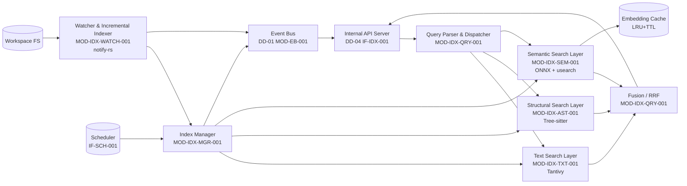
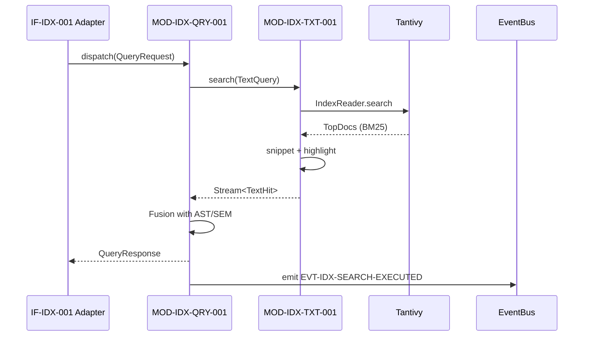
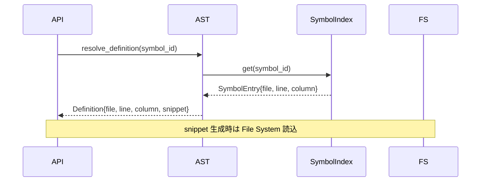
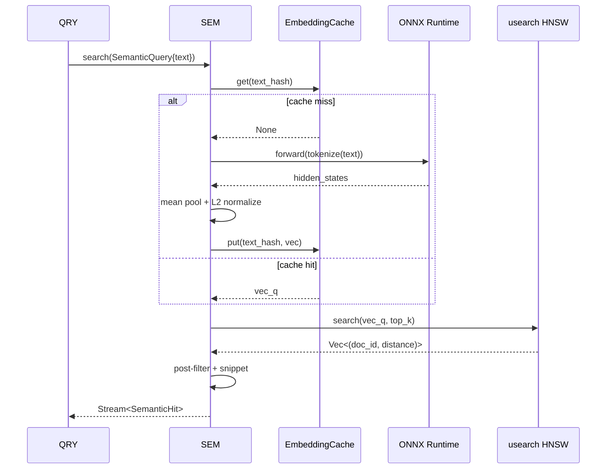
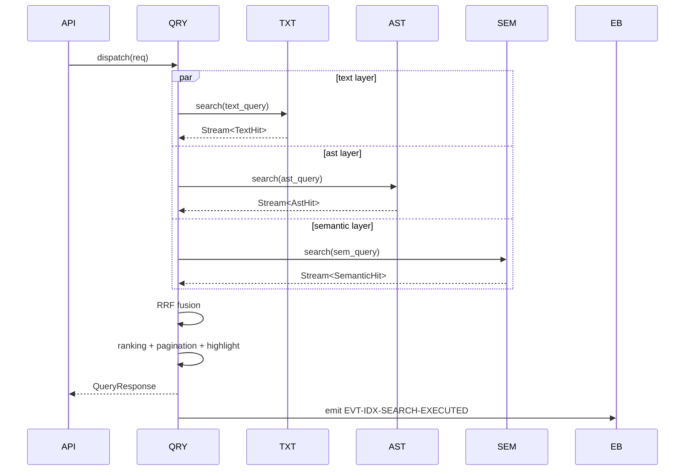
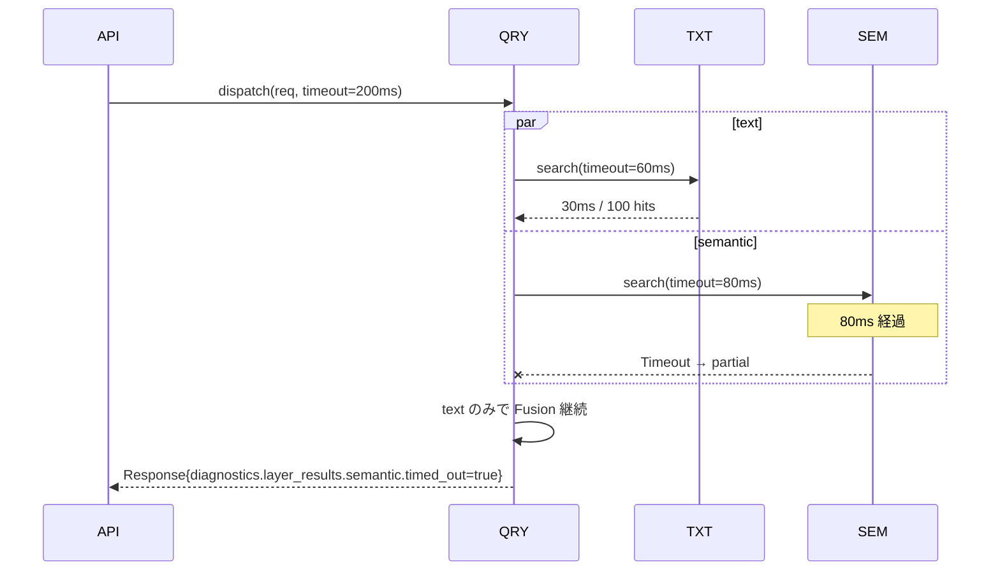
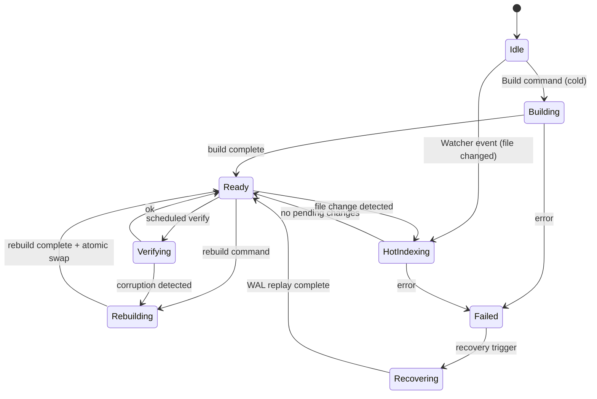

# DD-07 検索エンジン 詳細設計書
## Text / Structural / Semantic 3 層検索エンジン

---

## ドキュメント元データ

| 項目 | 内容 |
|------|------|
| 文档 ID | DD-07-2026-0917 |
| バージョン | 1.0 |
| 日付 | 2026-09-17 |
| 作成者 | MinimaxM3 (Agent) |
| ステータス | 初期版 - 上位設計 v1.1 着地待ち（ULYS-37v2 = ULYS-64）|
| 上位文档 | REQ-001 v1.0（5,207 行草稿 §52-53） / AD-001 v1.0 §X【TBD: ULYS-37v2 章番号確定待ち】/ IFD-001 v1.0 IF-IDX-001【TBD: ULYS-37v2 着地後 ID 確定】/ NFR-001 v1.0 NFR-P-001 / NFR-C-xxx / NFR-R-xxx / NFR-S-xxx / NFR-O-xxx / SD-001 v1.0 §X |
| 関連 DD | DD-01 Microkernel Core（Event Bus 連動）, DD-02 Session/Transaction/Buffer（検索命中→編集）, DD-03 Plugin（外部検索 Provider プラグイン）, DD-04 内部 API + 横断关切（IF-IDX-001 Adapter 層）, DD-08 Context Compiler, DD-09 Local Compute |
| 適用範囲 | `kernel-search` crate — text / structural / semantic / query / manager / watcher サブモジュール |

---

## 0. 概要

本文書は、Microkernel AI Native CLI の **3 層検索エンジン**（Text / Structural / Semantic）の詳細設計を定める。基本設計書 AD-001 §X【TBD: ULYS-37v2 章番号】が規定する「並列 dispatch → 結果 fusion」の枠組みを、Tantivy / Tree-sitter / ONNX Runtime + usearch という具体的実装にブレークダウンし、開発者がそのまま実装でき、テスターがテスト観点を導出でき、Reviewer が設計妥当性を判定できる粒度で記述する。

設計対象範囲は以下の 6 モジュール：

| Module ID | 名称 | 主依存技術 |
|-----------|------|------------|
| MOD-IDX-TXT-001 | Text Search Layer | Tantivy (Rust BM25) |
| MOD-IDX-AST-001 | Structural Search Layer | Tree-sitter (AST query) |
| MOD-IDX-SEM-001 | Semantic Search Layer | ONNX Runtime + all-MiniLM-L6-v2 + usearch (HNSW) |
| MOD-IDX-QRY-001 | Query Parser & Dispatcher / Fusion | 自前 Parser + Reciprocal Rank Fusion |
| MOD-IDX-MGR-001 | Index Manager | Tantivy Index + Embedding Cache + Fragmentation Monitor |
| MOD-IDX-WATCH-001 | Watcher & Incremental Indexer | notify-rs + Debouncer + WAL |

含まない（他 DD / 他コンポーネント）：

- Session / Transaction 状態管理：DD-02
- Plugin Manager 本体：DD-03
- 内部 API Server 層 (REST/JSON-RPC/MCP)：DD-04
- Event Bus 本体：DD-01（MOD-EB-001）。本 DD は同 BUS に `IndexUpdated` / `SearchExecuted` 等の Durable Event を発行するのみ。
- Embedding モデル学習・微調整：DD-08 Context Compiler（必要時のみ参照）

---

## 1. ドキュメント情報・目的・用語・参考资料

### 1.1 目的

本文書は REQ-001 v1.0 §52-53「Search Engine」「Search Engine の 3 層化」「Search Streaming」要件と、AD-001 v1.0 §X【TBD: ULYS-37v2 章番号確定待ち】が規定する 3 層検索アーキテクチャの実装詳細を定める。詳細粒度は skill-multica-2 §2 の「HOW（システム内部具体にどう実装するか）」を満たすものとし、実装者が追加の意思決定を要さずに実装に着手でき、テスターが Test 観点を導出でき、Reviewer が設計の妥当性を判定できるレベルとする。

### 1.2 設計対象範囲

**含む（本文書）**：

- 3 層検索エンジン（Text / Structural / Semantic）の実装方式と内部スキーマ
- Query Parser → Dispatcher → 並列 Search → Fusion → Highlight → Pagination の一気通貫処理
- Index Manager（増分 index / rebuild / fragmentation 監視）
- Watcher（notify-rs + Debouncer + WAL）
- 統合検索 API IF-IDX-001 の Request/Response 詳細スキーマ
- Error namespace `ERR-IDX-XXX`（DD-04 §6 外部統一 namespace ERR-VAL/AUTH/AUTHZ/BIZ/DB/EXT/SYS との Crosswalk を §11.4 に明記）
- Performance / Security / Logging / Recovery / Testability

**含まない（他 DD / 別 Issue）**：

- 検索 UI / TUI 描画：DD-06 TUI 層
- Embedding 学習パイプライン：DD-08 Context Compiler / 将来 Issue
- 検索ランキングモデル改善：Performance Test Issue
- 分散 Index（複数 Kernel 間での Index 同期）：MVP-3 以降

### 1.3 用語・縮略語

| 用語 | 定義 |
|------|------|
| Text Search | 文字列マッチによる検索。BM25 スコアリング。Tantivy が実装。 |
| Structural Search | ソースコード構造（AST）に基づく検索。Tree-sitter が実装。 |
| Semantic Search | 自然言語クエリとコードの意味的類似性に基づく検索。Embedding + Vector Index。 |
| BM25 | Best Matching 25。古典的 TF-IDF 系ランキング関数。Tantivy デフォルト。 |
| Inverted Index | 転置索引。ターム → Posting List の構造。 |
| AST Query | Tree-sitter の S-expression パターンによる AST ノード マッチ。 |
| Embedding | テキストを dense vector（典型的 384/768/1024 次元）に写像した表現。 |
| HNSW | Hierarchical Navigable Small World。usearch のデフォルト近似 NN アルゴリズム。 |
| usearch | C++/Rust 実装の Vector Index ライブラリ（HNSW 等の ANN 対応）。 |
| RRF | Reciprocal Rank Fusion。複数ランキングを順位ベースで合成する手法。 |
| Fragmentation | Index セグメントの断片化。検索性能低下・ディスク増大の原因。 |
| WAL | Write-Ahead Log。Index 更新を永続化する先行書込みログ。 |
| Idempotency Key | 重複 Index 更新抑止用の一意キー（DD-02 MOD-IDM-001 と共有想定）。 |
| Snapshot Isolation | 検索時点において Index が一貫した状態であることを保証する読み取り隔離方式。 |
| Read-Write Lock | 読み取りは並行・書き込みは排他とする同期プリミティブ。 |
| Trace ID | リクエスト横断の相関 ID。Log/Metric/Trace の link key。DD-01 §1.3 共通。 |
| Correlation ID | 業務フロー単位（例：1 つの Agent Task）の相関 ID。 |
| BM25 Score | Tantivy が計算する関連度スコア。 |
| Embedding Cache | 同一テキストの Embedding 再計算を避けるための LRU + TTL Cache。 |
| Tantivy Schema | Field 名・Tokenizer・Index option・Stored option 等のメタ定義。 |
| Posting List | Inverted Index の値側。文書 ID + 位置情報のリスト。 |
| Snippet | 検索結果の該当箇所周辺をハイライト表示した抜粋。 |
| Recall@k | 上位 k 件に正解が含まれる割合。Semantic Search の評価指標。 |
| Cold Index | 初回 / rebuild 後の新規構築 Index。 |
| Hot Index | 増分更新が継続している運用中 Index。 |

### 1.4 参考资料

| 文档 | 版 | 該当章 | 用途 |
|------|----|--------|------|
| REQ-001 要件定義書 | v1.0（5,207 行草稿）| §52（Search Engine 3 層定義）/ §53（Search Streaming）| 上位要件 FR-011-01..03 / FR-011-S01（streaming） |
| REQ-001 v1.1 | 【TBD: ULYS-37v2 着地後更新】| FR-011-NN 子项展开 | 本 DD §3-§9 で参照する章番号を確定 |
| NFR-001 非機能要件定義書 | v1.0 | NFR-P-001（検索 P99 < 50ms）/ NFR-C-xxx（容量）/ NFR-R-xxx（復旧）/ NFR-S-xxx（セキュリティ）/ NFR-O-xxx（運用）| 性能・信頼性・セキュリティ目標 |
| AD-001 基本設計書 | v1.0 | §X【TBD: ULYS-37v2 章番号確定待ち】| 責務・抽象構造の出典 |
| AD-001 v1.1 | 【TBD】| §X | 本 DD §3-§8 で参照する章番号を確定 |
| IFD-001 接口设计书 | v1.0 | IF-IDX-001（ULYS-37v2 で追加）【TBD: 着地後】| 外部 Contract |
| IFD-001 v1.1 | 【TBD】| IF-IDX-001 | 本 DD §9 で参照 |
| SD-001 安全性設計書 | v1.0 | §X【TBD】| Permission / Audit / Secret |
| DD-01 Microkernel Core 詳細設計書 | v1.0 | §4 Event Bus / §10 故障回復 | 連携 Event の具体 |
| DD-02 Session / Transaction / Buffer Engine | v1.1 | §7.5 Index update と Buffer commit の境界 | Transaction 順序 |
| DD-03 Plugin / Extension 詳細設計書 | v1.2 | §X 外部検索 Provider プラグイン化 | 拡張 IF |
| DD-04 内部 API + 横断关切 詳細設計書 | v2 (in_review) | §6 Error namespace（外部統一 ERR-VAL/AUTH/AUTHZ/BIZ/DB/EXT/SYS）| 本 DD ERR-IDX-XXX の Crosswalk 相手 |
| DD-04b Cross-Cutting Concerns 詳細設計書 | v2 (in_review) | §14 Performance Test Suite | 性能計測手順 |
| DD-08 Context Compiler 詳細設計書 | v1.0 | §X Embedding 再利用 | Embedding キャッシュの共有方針 |
| DD-09 Local Compute 詳細設計書 | v1.0 | §X Local Compute Pipeline | Semantic Layer との接続 |

---

## 2. 全体アーキテクチャと内部境界

### 2.1 システム内位置づけ



3 層検索は独立した非同期タスクではなく、`Arc` 共有 + 内部 `RwLock` / `Mutex` による **In-Process コンポーネント**として実装する（AD-001 §2.X【TBD】準拠）。単一 Kernel プロセス内で完結する設計とし、プロセス間通信は DD-04 の Adapter 層に委譲する。

### 2.2 モジュール所有権と可視性

| オブジェクト | 所有 | 共有方式 | 排他 |
|--------------|------|----------|------|
| `IndexManager.indexes` (Text/AST/Semantic) | `IndexManager` | `tokio::sync::RwLock<HashMap<WorkspaceId, IndexSet>>` | 書き込み時独占 |
| `TextLayer.tantivy_index` | `TextLayer` | `Arc<TantivyIndex>` 内部 `RwLock` | Search 時は read / rebuild 時は write |
| `StructuralLayer.grammars` | `StructuralLayer` | `RwLock<HashMap<LanguageId, Arc<tree_sitter::Language>>>` | 書き込み時独占 |
| `SemanticLayer.vector_index` | `SemanticLayer` | `Arc<usearch::Index>` 内部 mut / Snapshot Reader | rebuild 時は新 Index → atomic swap |
| `EmbeddingCache.entries` | `EmbeddingCache` | `dashmap::DashMap<CacheKey, CacheValue>` | sharded |
| `EmbeddingCache.lru_list` | `EmbeddingCache` | `Mutex<LruList>` | 短時間 lock |
| `Watcher.debouncer` | `Watcher` | `notify::RecommendedWatcher` | 内部実装依存 |
| `IndexerWAL.records` | `Manager` | `Arc<RwLock<Vec<WalRecord>>>` | append 時独占 |
| `QueryDispatcher.inflight` | `Dispatcher` | `dashmap::DashMap<QueryId, CancellationToken>` | sharded |
| `FusionBuffer.partial` | `Dispatcher` | `Mutex<Vec<PartialResult>>` | 結果収集時短時間 |

### 2.3 レイヤー間契約

| 上位 → 下位 | 契約 |
|-------------|------|
| API → Dispatcher | `QueryRequest` (IF-IDX-001) JSON-RPC 2.0 |
| Dispatcher → TextLayer | `TextQuery { raw, mode, limit, offset, filters }` |
| Dispatcher → StructuralLayer | `AstQuery { pattern: SExpr, language, limit }` |
| Dispatcher → SemanticLayer | `SemanticQuery { text, model_id, top_k, ef_search }` |
| TextLayer → Dispatcher | `Stream<TextHit>` |
| StructuralLayer → Dispatcher | `Stream<AstHit>` |
| SemanticLayer → Dispatcher | `Stream<SemanticHit>` |
| Dispatcher → Fusion | `Vec<LayerResult>` (部分結果蓄積) |
| Fusion → API | `QueryResponse { hits: Vec<RankedHit>, total, took_ms, diagnostics }` |

### 2.4 Event Bus 連携（DD-01 §4 Event Bus）

| Event ID | 発行元 | 種類 | Payload |
|----------|--------|------|---------|
| EVT-IDX-FILE-INDEXED | Index Manager | Durable | `{ workspace_id, path, content_hash, layer: text\|ast\|semantic, took_ms }` |
| EVT-IDX-FILE-DELETED | Index Manager | Durable | `{ workspace_id, path }` |
| EVT-IDX-REBUILD-STARTED | Index Manager | Transient | `{ workspace_id, reason }` |
| EVT-IDX-REBUILD-COMPLETED | Index Manager | Durable | `{ workspace_id, docs, took_ms }` |
| EVT-IDX-SEARCH-EXECUTED | Dispatcher | Transient | `{ query_id, layer_mask, total_hits, took_ms }` |
| EVT-IDX-INDEX-CORRUPTED | Index Manager | Durable | `{ workspace_id, layer, recovery_action }` |

`Durable` Event は DD-01 §4.4 の方針に従い Durable Log に書込み、`Transient` Event は in-process 配信のみ。

---

## 3. MOD-IDX-TXT-001 Text Search Layer 設計

### 3.1 モジュール属性

| 項目 | 内容 |
|------|------|
| Module ID | MOD-IDX-TXT-001 |
| モジュール名 | Text Search Layer |
| 対応 BD | AD-001 §X【TBD: ULYS-37v2 章番号】/ FR-011-01 Text Search |
| 対応 REQ | FR-011-01-01 Exact / FR-011-01-02 Case Sensitive / FR-011-01-03 Case Insensitive / FR-011-01-04 Regex / FR-011-01-05 Glob / FR-011-01-06 Grep |
| 対応 NFR | NFR-P-001（検索 P99 < 50ms 単層目標）|
| 対応 IF | IF-IDX-001（外部）/ IF-IDX-TXT-001（内部） |
| 責務 | (a) Tantivy Schema 構築 (b) Document Ingest (c) Text Query Parse (d) BM25 スコア計算 (e) Snippet 生成 (f) Highlight (g) Index Commit |
| 入力 | `TextQuery { raw: String, mode: Exact\|Regex\|Glob\|Grep, case_sensitive: bool, filters: Option<PathFilter>, limit: usize, offset: usize }` |
| 出力 | `Stream<TextHit> { doc_id, path, line, column, snippet, score, highlights }` |
| 依存 | `tantivy` 0.22+（Rust BM25 Inverted Index）/ DD-01 EventBus（index 更新通知）/ DD-02 Buffer Engine（snippet 内ヒット箇所の編集連携）|
| 対外接口 | `search(q) -> Stream<TextHit>` / `ingest(doc)` / `delete(doc_id)` / `commit()` / `rebuild()` |
| 使用データ | Workspace FS のファイル content + メタデータ（path / mtime / size / lang）|
| 状態 | Cold Building / Hot Indexing / Ready / Stale / Rebuilding / Corrupted |
| Transaction | 単一 commit は Atomic（DD-02 §7.5 と整合。Buffer commit と Index commit の順序は §7.5 横断設計参照）|
| Error | ERR-IDX-TXT-001 〜 020（§11 Error 設計） |

### 3.2 Tantivy Schema

```text
Field              Type        Tokenizer   Index     Stored    DocValue
path               text        raw         --        yes       --
content            text        default     yes       yes       --
line_starts        u64[..]     --          --        yes       --
lang               text        raw         --        yes       --
size_bytes         u64         --          --        yes       yes
mtime_unix         u64         --          --        yes       yes
content_hash       bytes       --          --        yes       --
```

- `content` のデフォルト Tokenizer = `default()`（Unicode 単語分割 + lowercase）。Case Sensitive モードのみ別 Analyzer。
- `line_starts` は Document ごとに content の各行頭 byte offset 配列。Snippet 計算高速化用。
- `mtime_unix` / `size_bytes` は DocValue 列により sort 高速化。
- Fast field（DocValue）：sort / aggregation / filter で利用。

### 3.3 Document Ingest (P-TXT-001..005)

```
P-TXT-001 受信: ingest(Document) → Document{path, content, mtime, size, lang, content_hash}
P-TXT-002 検証: path ∈ workspace + size < 50MB【TBD: 上限確認】
P-TXT-003 前処理: content → 行分割 + 各行先頭 offset を line_starts に格納
P-TXT-004 Schema 適用: tantivy::Document::add_text / add_u64 / add_bytes で構築
P-TXT-005 追加: tantivy_writer.add_document(doc) → commit_interval 経過後に commit
```

- `commit_interval` = 1s（デフォルト）【TBD: Performance Test で最適化】
- 受信側で同一 path の重複は content_hash 一致時スキップ（Idempotency）。

### 3.4 Query Parse & Execute (P-TXT-010..020)

```
P-TXT-010 受信: TextQuery
P-TXT-011 モード判定:
  IF mode == Exact   → TermQuery (case_sensitive ? raw : lower)
  IF mode == Regex   → RegexQuery
  IF mode == Glob    → PatternQuery (内部 Regex 変換)
  IF mode == Grep    → 多行 RegexQuery
P-TXT-012 フィルタ適用: path glob, lang, mtime range, size range
P-TXT-013 検索: IndexReader.search(query, top_k) → TopDocs (BM25 score 降順)
P-TXT-014 スニペット生成: content[line_starts[hit.line]] 周辺 ±2 行 + ハイライト
P-TXT-015 ページング: offset..offset+limit を返却
P-TXT-016 結果返却: Stream<TextHit>
```

### 3.5 分岐条件

```
IF index.state == ColdBuilding
    return ERR-IDX-TXT-001 (Index not ready)
ELSE IF index.state == Corrupted
    return ERR-IDX-TXT-002 (Index corrupted, recovery in progress)
ELSE IF index.state == Rebuilding
    既存 Index で検索継続（旧 Index を維持しつつ新 Index を構築）【性能検証必要】
ELSE (Ready / Stale)
    proceed
```

### 3.6 Timeout / Retry / Idempotency

| 項目 | 値 |
|------|---|
| 単一 Query Timeout | 50ms（単層目標、Query Parser が内層に伝播）【NFR-P-001】 |
| Regex 評価 Timeout | 50ms（ReDoS 防止のため Regex 評価を別スレッド + watchdog） |
| commit Timeout | 5s（DD-02 §7.5 と整合） |
| Retry | Index Commit 失敗時のみ（最大 3 回、指数 Backoff 100ms→400ms→1.6s） |
| Idempotency Key | `workspace_id + path + content_hash`（同一 hash 時は ingest スキップ） |

### 3.7 内部 API（IF-IDX-TXT-001）

```rust
// kernel_search::text
pub trait TextSearch: Send + Sync {
    async fn search(&self, q: TextQuery) -> Result<TextSearchStream>;
    async fn ingest(&self, doc: IngestDoc) -> Result<()>;
    async fn delete(&self, doc_id: DocId) -> Result<()>;
    async fn commit(&self) -> Result<CommitTicket>;
    async fn rebuild(&self) -> Result<RebuildHandle>;
    async fn status(&self) -> IndexStatus;
}
```

### 3.8 Sequence: 通常検索



### 3.9 性能設計（【性能検証必要】）

| 観点 | 目標 | 検証方法 |
|------|------|----------|
| 単層 Query P99 | < 50ms（単層）| criterion bench + 10K files fixture |
| Regex Query P99 | < 50ms | ReDoS 評価 + bench |
| commit latency | < 5s（10K doc batch）| criterion bench |
| Index size | < 500MB（10K files, 100MB ソース）【TBD】| ls + du |
| メモリ footprint | < 300MB【TBD】| heaptrack |

### 3.10 Test 観点

| ID | 観点 | Expected |
|----|------|----------|
| T-TXT-001 | Exact "foo" で完全一致 | BM25 score 1.0 + snippet 正確 |
| T-TXT-002 | Regex `\bTODO\b` | 単語境界マッチ |
| T-TXT-003 | Glob `*.rs` | Rust ファイルのみ |
| T-TXT-004 | Case Insensitive | 大小無視マッチ |
| T-TXT-005 | limit/offset ページング | 順序保たれた部分集合 |
| T-TXT-006 | 同一 content_hash 再 ingest | ERR なし、冪等 |
| T-TXT-007 | 10K 並列 Query | P99 < 50ms（【性能検証必要】）|
| T-TXT-008 | Index Corrupted | ERR-IDX-TXT-002、rebuild 起動 |
| T-TXT-009 | Timeout 50ms 超 | 部分結果返却 + diagnostics.timed_out_layer = text |

---

## 4. MOD-IDX-AST-001 Structural Search Layer 設計

### 4.1 モジュール属性

| 項目 | 内容 |
|------|------|
| Module ID | MOD-IDX-AST-001 |
| モジュール名 | Structural Search Layer |
| 対応 BD | AD-001 §X【TBD】/ FR-011-02 Structural Search |
| 対応 REQ | FR-011-02-01 AST / FR-011-02-02 Symbol / FR-011-02-03 Definition / FR-011-02-04 Reference / FR-011-02-05 Call Site |
| 対応 NFR | NFR-P-001（単層 P99 < 50ms）|
| 対応 IF | IF-IDX-001（外部）/ IF-IDX-AST-001（内部）|
| 責務 | (a) Tree-sitter Parser Pool (b) AST Index 構築（Path 単位の AST ノード列）(c) S-expression Query 評価 (d) Symbol 抽出 (e) Definition / Reference / Call Site 解決 |
| 入力 | `AstQuery { pattern: SExpr, language: LanguageId, capture_names: Vec<String>, limit: usize }` |
| 出力 | `Stream<AstHit> { node_id, path, line, column, kind, capture_map, snippet }` |
| 依存 | `tree-sitter` 0.23+ + 各言語 grammar（rust / typescript / python / go 等）/ DD-01 EventBus |
| 対外接口 | `search(q) -> Stream<AstHit>` / `parse(path) -> Tree` / `index_symbols(path)` / `resolve_definition(symbol_id)` / `resolve_references(symbol_id)` |
| 使用データ | Workspace FS（ファイル content + path → AST Tree キャッシュ）|
| 状態 | Cold Parsing / Hot Indexing / Ready / Stale / Rebuilding / Corrupted |
| Transaction | 単一ファイル Parse は Atomic |
| Error | ERR-IDX-AST-001 〜 020（§11） |

### 4.2 Tree-sitter Parser Pool

```rust
pub struct ParserPool {
    pool: Vec<Mutex<tree_sitter::Parser>>,
    lang_table: Arc<LangTable>, // LanguageId -> tree_sitter::Language
}

impl ParserPool {
    pub fn acquire(&self, lang: LanguageId) -> ParserGuard<'_>;
    pub fn parse(&self, lang: LanguageId, src: &[u8]) -> tree_sitter::Tree;
}
```

- Pool size = `min(num_cpus, 8)`【TBD: Performance Test】
- 各 Parser は再利用（初期化コスト削減）
- Parse 失敗時（構文誤り）は partial Tree を返却（Error ノードを含む）

### 4.3 AST Index 構造

```text
SymbolIndex {
  by_workspace: RwLock<HashMap<WorkspaceId, WorkspaceSymbolIndex>>,
}

WorkspaceSymbolIndex {
  symbols: HashMap<SymbolId, SymbolEntry>,
  by_name: HashMap<String, Vec<SymbolId>>,    // inverted by qualified name
  by_file: HashMap<PathBuf, Vec<SymbolId>>,
  references: HashMap<SymbolId, Vec<Reference>>,
  definitions: HashMap<SymbolId, Definition>,
}

SymbolEntry {
  id: SymbolId,
  kind: Function | Struct | Impl | Trait | Const | Static | Enum | Module | Macro | Variable,
  name: String,
  qualified_name: String,
  file: PathBuf,
  line: u32,
  column: u32,
  parent: Option<SymbolId>,
  signature: Option<String>,
  doc: Option<String>,
}

Reference {
  symbol_id: SymbolId,
  file: PathBuf,
  line: u32,
  column: u32,
  kind: Call | TypeRef | Import | Use,
}
```

- Inverted by name は `RwLock` で保護し、Index 追加時に partial 書込み。
- SymbolId = `blake3(file + "::" + qualified_name) [0..16]` で 128bit 一意。

### 4.4 S-expression Query Parser

```
(QUERY
  ((function_item
    name: (identifier) @func.name
    parameters: (parameters) @func.params
    body: (block) @func.body)
   (#eq? @func.name "main")))
```

- 入力：S-expression 文字列 or jq 風 simplified pattern（例: `function main()`）。
- Parser は簡易 Parser を自前実装し、内部で tree-sitter Query に変換。
- 対応 capture：`@name` `@params` `@body` `@type` `@receiver` 等（言語別定義）。

### 4.5 Query 評価 (P-AST-001..010)

```
P-AST-001 受信: AstQuery{pattern, language, capture_names, limit}
P-AST-002 Query 検証: pattern 構文 + language 登録確認
P-AST-003 Tree-sitter Query 構築: tree_sitter::Query::new(lang, pattern_str)
P-AST-004 対象ファイル列挙: by_file 全エントリ or フィルタ適用
P-AST-005 並列 Parse: ParserPool.parse(path, content) → Tree
P-AST-006 Query 一致: Tree.query(cursor) → Vec<Match>
P-AST-007 位置解決: Match → node_id, line, column
P-AST-008 Snippet 生成: node 範囲 ±2 行
P-AST-009 Capture map 構築: capture_names → node 解決
P-AST-010 結果返却: Stream<AstHit> (limit で打ち切り)
```

### 4.6 分岐条件

```
IF pattern invalid
    return ERR-IDX-AST-001 (Invalid S-expression)
ELSE IF language not registered
    return ERR-IDX-AST-002 (Language not supported)
ELSE IF index.state == ColdParsing
    return ERR-IDX-AST-003 (Index not ready) or wait with timeout
ELSE
    proceed
```

### 4.7 内部 API（IF-IDX-AST-001）

```rust
pub trait StructuralSearch: Send + Sync {
    async fn search(&self, q: AstQuery) -> Result<AstSearchStream>;
    async fn resolve_definition(&self, symbol_id: SymbolId) -> Result<Definition>;
    async fn resolve_references(&self, symbol_id: SymbolId) -> Result<Vec<Reference>>;
    async fn list_symbols(&self, path: &Path) -> Result<Vec<SymbolEntry>>;
    async fn parse_file(&self, path: &Path) -> Result<tree_sitter::Tree>;
}
```

### 4.8 Sequence: Definition 解決



### 4.9 性能設計（【性能検証必要】）

| 観点 | 目標 | 検証方法 |
|------|------|----------|
| 単層 Query P99 | < 50ms | criterion + 10K files fixture |
| Parse throughput | > 50 MB/s / core | tree-sitter bench |
| Symbol Index メモリ | < 200MB（10K files）【TBD】| heaptrack |

### 4.10 Test 観点

| ID | 観点 | Expected |
|----|------|----------|
| T-AST-001 | Rust `function_item` pattern | 関数定義全件 |
| T-AST-002 | `(#eq? @name "main")` フィルタ | main のみ |
| T-AST-003 | TypeScript class method | method ノード |
| T-AST-004 | 不正 S-expression | ERR-IDX-AST-001 |
| T-AST-005 | 未対応言語 | ERR-IDX-AST-002 |
| T-AST-006 | Symbol 解決 | Definition 正確（line/column 一致）|
| T-AST-007 | Reference 解決 | Call Site 一致 |
| T-AST-008 | 構文誤りファイル | partial Tree 返却、Error ノード含む |

---

## 5. MOD-IDX-SEM-001 Semantic Search Layer 設計

### 5.1 モジュール属性

| 項目 | 内容 |
|------|------|
| Module ID | MOD-IDX-SEM-001 |
| モジュール名 | Semantic Search Layer |
| 対応 BD | AD-001 §X【TBD】/ FR-011-03 Semantic Search |
| 対応 REQ | FR-011-03-01 Embedding / FR-011-03-02 Vector Similarity / FR-011-03-03 Rerank / FR-011-03-04 Code Intent |
| 対応 NFR | NFR-P-001（単層目標、ただし事前計算 Embedding + HNSW により実測は数 ms〜十数 ms 想定）|
| 対応 IF | IF-IDX-001（外部）/ IF-IDX-SEM-001（内部）|
| 責務 | (a) Embedding 生成（ONNX Runtime + all-MiniLM-L6-v2 等）(b) Vector Index 構築（usearch HNSW）(c) クエリ Embedding + ANN 検索 (d) Rerank (e) Embedding Cache |
| 入力 | `SemanticQuery { text: String, model_id: String, top_k: usize, ef_search: usize, filters: Option<PathFilter> }` |
| 出力 | `Stream<SemanticHit> { doc_id, path, line, column, snippet, distance, embedding_norm }` |
| 依存 | `ort`（ONNX Runtime Rust binding）/`usearch`/`tokenizers`（HuggingFace）/ DD-08 Embedding Cache 共有 |
| 対外接口 | `search(q) -> Stream<SemanticHit>` / `embed(texts) -> Vec<Vec<f32>>` / `ingest_embedding(doc, vec)` / `remove(doc_id)` |
| 使用データ | Workspace FS（content をチャンク化 → Embedding → Vector Index）|
| 状態 | Cold Building / Hot Indexing / Ready / Stale / Rebuilding / Model Missing |
| Transaction | Embedding + Vector 追加は Atomic（HNSW は内部 mutex）|
| Error | ERR-IDX-SEM-001 〜 020（§11）|

### 5.2 Embedding モデル

| 項目 | 値（推奨）| 備考 |
|------|-----------|------|
| モデル ID | `all-MiniLM-L6-v2` または `bge-small-en-v1.5`【TBD: Performance Test で選定】| Apache-2.0 / MIT ライセンス |
| 次元 | 384（MiniLM）/ 512（bge-small）| 【TBD】|
| Max Sequence | 256 tokens | tokenizer 制約 |
| Pooling | Mean Pooling | 標準的 |
| 量子化 | INT8（オプション）【TBD】| メモリ削減 |
| ライセンスファイル | `./models/embeddings/<model_id>/LICENSE` | SD-001 §X【TBD】整合確認 |

**禁止事項（issue 指示）**：
- 禁止编造具体 embedding 模型性能数字（【TBD】+ 引用待测试）
- Performance Test で実測後に確定

### 5.3 Embedding 生成パイプライン (P-SEM-001..010)

```
P-SEM-001 受信: texts: Vec<String>（チャンク化済）
P-SEM-002 Tokenize: tokenizer.encode(text, add_special_tokens=true, max_len=256)
P-SEM-003 Model ロード: ort::Session::new(model_path) 【TBD: Singleton / Pool】
P-SEM-004 Forward: session.run(input_ids, attention_mask, token_type_ids)
P-SEM-005 Pooling: Mean Pool（attention mask で重み付け）
P-SEM-006 L2 Normalize: vec /= norm（コサイン類似度の高速化）
P-SEM-007 Embedding Cache 参照: cache.get(text_hash) → あれば返却
P-SEM-008 Cache 書込: cache.put(text_hash, vec, ttl=24h)
P-SEM-009 結果返却: Vec<Vec<f32>>
```

- text_hash = `blake3(normalize(text))` で正規化（小文字化 + 空白 collapse）後の安定 hash
- Model ロードは初回のみで Singleton（メモリ効率）
- バッチ推論推奨（batch_size = 32【TBD: Performance Test で最適化】）

### 5.4 Vector Index (usearch HNSW)

| 項目 | 値 |
|------|---|
| ライブラリ | `usearch` 2.x（Rust binding）|
| アルゴリズム | HNSW |
| Distance | Cosine（L2 Normalize 済みを前提）|
| M（接続数）| 16（デフォルト）【TBD: Performance Test】|
| ef_construction | 200（デフォルト）【TBD】|
| ef_search | 100（デフォルト。Query 時に上書き可）|
| 次元 | 384 / 512（モデル依存）|
| Key | u64 = doc_id（= blake3(path + chunk_index)）|

### 5.5 チャンク戦略

```
ChunkPolicy {
  mode: ByLines | ByTokens | ByFunction,
  max_tokens: 256,
  overlap_tokens: 32,
  boundaries: [".", "\n\n", "}", "fn ", "func ", "def "], // 優先的 split
}
```

- 推奨：`ByFunction`（Tree-sitter で関数境界検出し、関数全体を 1 チャンク化）
- フォールバック：`ByLines`（50 行 + overlap 10 行）
- Mode = `ByFunction` は MOD-IDX-AST-001 と密結合（将来統合）

### 5.6 Query 評価 (P-SEM-020..030)

```
P-SEM-020 受信: SemanticQuery
P-SEM-021 Embedding 生成: query.text → vec_q（キャッシュ利用）
P-SEM-022 ANN 検索: usearch.search(vec_q, top_k + ef_search)
P-SEM-023 Post-filter: filters (path, lang, mtime) 適用
P-SEM-024 Rerank (オプション): Cross-Encoder で再ランキング【TBD: MVP-2 以降】
P-SEM-025 Snippet 生成: 該当 chunk のソース取得 + ±2 行抜粋
P-SEM-026 結果返却: Stream<SemanticHit>
```

### 5.7 分岐条件

```
IF model file missing
    return ERR-IDX-SEM-001 (Model not found) + 起動時管理者向けログ
ELSE IF index.state == ColdBuilding
    return ERR-IDX-SEM-002 (Index not ready)
ELSE IF embedding length != model.dim
    return ERR-IDX-SEM-003 (Embedding dimension mismatch)
ELSE IF cache miss & model load fails
    return ERR-IDX-SEM-004 (Model load failed)
ELSE
    proceed
```

### 5.8 内部 API（IF-IDX-SEM-001）

```rust
pub trait SemanticSearch: Send + Sync {
    async fn search(&self, q: SemanticQuery) -> Result<SemanticSearchStream>;
    async fn embed(&self, texts: &[String]) -> Result<Vec<Vec<f32>>>;
    async fn ingest_embedding(&self, doc_id: DocId, vec: &[f32], meta: ChunkMeta) -> Result<()>;
    async fn remove(&self, doc_id: DocId) -> Result<()>;
    async fn model_info(&self) -> ModelInfo;
}
```

### 5.9 Sequence: クエリ時 Embedding + ANN



### 5.10 性能設計（【性能検証必要】）

| 観点 | 目標 | 検証方法 |
|------|------|----------|
| Embedding 推論 | < 5ms / chunk (CPU INT8) | criterion + ONNX bench |
| ANN search | < 5ms (10K vectors) | criterion |
| End-to-end | < 50ms (cache hit) / < 100ms (miss) | criterion |
| メモリ (Model) | < 100MB | heaptrack |
| メモリ (Index) | 10K vectors × 384 dim × 4B = 15MB + overhead | 計測 |

### 5.11 Test 観点

| ID | 観点 | Expected |
|----|------|----------|
| T-SEM-001 | "用户身份验证逻辑" | AuthMiddleware / TokenValidator / SessionService が上位 |
| T-SEM-002 | キャッシュ hit | 2 回目は Embedding 推論スキップ |
| T-SEM-003 | 不存在モデル | ERR-IDX-SEM-001 |
| T-SEM-004 | Embedding 次元不一致 | ERR-IDX-SEM-003 |
| T-SEM-005 | Recall@10 (10K fixtures) | > 0.7【TBD: Performance Test で baseline 確定】|
| T-SEM-006 | Index rebuild | 旧 Index 維持 + 新 Index 構築 → atomic swap |
| T-SEM-007 | 並列 Query 100 | 全完了、P99 < 50ms【性能検証必要】|

---

## 6. MOD-IDX-QRY-001 Query Parser & Dispatcher / Fusion 設計

### 6.1 モジュール属性

| 項目 | 内容 |
|------|------|
| Module ID | MOD-IDX-QRY-001 |
| モジュール名 | Query Parser & Dispatcher + Fusion |
| 対応 BD | AD-001 §X【TBD】/ FR-011 全体 + FR-011-S01 Streaming |
| 対応 REQ | FR-011-04 Unified Search API / FR-011-S01 Streaming |
| 対応 NFR | NFR-P-001 / NFR-M-001（構造化ログ）/ NFR-S-xxx（Validation）|
| 対応 IF | IF-IDX-001 Request/Response |
| 責務 | (a) QueryRequest 検証 (b) 3 層 Layer 選択 / mask (c) 並列 dispatch (d) 結果 Fusion（RRF）(e) Highlight (f) Pagination (g) Streaming |
| 入力 | `QueryRequest { query_id, workspace_id, raw, mode_mask: Vec<Layer>, filters, limit, offset, fusion: FusionMode, timeout_ms }` |
| 出力 | `QueryResponse { query_id, total, took_ms, hits: Vec<RankedHit>, diagnostics }` + `Stream<SearchEvent>` |
| 依存 | MOD-IDX-TXT-001 / MOD-IDX-AST-001 / MOD-IDX-SEM-001 / DD-04 IF-IDX-001 Adapter |
| 対外接口 | `dispatch(req) -> QueryResponse` / `dispatch_stream(req) -> Stream<SearchEvent>` |
| 状態 | Idle / Parsing / Dispatching / Fusing / Completed / Failed / Cancelled |
| Transaction | 単一 Query 単位（複数 Layer 結果は in-memory 集約、外部 Transaction は関与しない）|
| Error | ERR-IDX-QRY-001 〜 020（§11）|

### 6.2 QueryRequest スキーマ（IF-IDX-001 Request 部分）

```jsonc
{
  "query_id": "q-uuid",                  // Idempotency Key (任意、未指定時サーバ生成)
  "workspace_id": "ws-uuid",
  "raw": "AuthMiddleware",               // Text / Semantic 両用
  "mode_mask": ["text", "ast", "semantic"], // 検索対象層（OR）
  "structural_pattern": null,            // AST Query S-expression (任意)
  "language": "rust",                    // AST 言語指定
  "filters": {
    "path_glob": "src/**/*.rs",          // 任意
    "lang": ["rust", "typescript"],      // 任意
    "mtime_after": "2026-01-01T00:00:00Z",// 任意
    "size_max_bytes": 1048576            // 任意
  },
  "limit": 50,
  "offset": 0,
  "fusion": "rrf",                       // rrf | linear_combination | none
  "fusion_params": { "k": 60 },          // RRF の k パラメータ
  "highlight": true,
  "streaming": true,
  "timeout_ms": 200                      // 全体（3 層並列含む）
}
```

### 6.3 QueryResponse スキーマ（IF-IDX-001 Response 部分）

```jsonc
{
  "query_id": "q-uuid",
  "workspace_id": "ws-uuid",
  "total": 1234,
  "took_ms": 47,
  "hits": [
    {
      "rank": 1,
      "doc_id": "doc-uuid",
      "path": "src/auth/middleware.rs",
      "line": 42,
      "column": 5,
      "snippet": "...fn AuthMiddleware::new(req) {...",
      "highlights": [
        { "field": "content", "ranges": [[10, 24]] }
      ],
      "layer_contributions": [
        { "layer": "text", "rank": 1, "score": 12.34 },
        { "layer": "semantic", "rank": 2, "score": 0.87 }
      ],
      "fusion_score": 0.0328
    }
  ],
  "diagnostics": {
    "layer_results": {
      "text": { "took_ms": 12, "hits": 800, "timed_out": false },
      "ast":   { "took_ms": 0, "hits": 0,   "skipped": "no structural_pattern" },
      "semantic": { "took_ms": 35, "hits": 50, "timed_out": false }
    },
    "fusion": "rrf",
    "errors": []                          // 部分失敗時の ERR-IDX-XXX 一覧
  }
}
```

### 6.4 Streaming Protocol（REQ §53 整合）

REQ-001 §53「Search 必须 Streaming」に従い、Server-Sent Events (DD-04 Adapter 層) で段階配信：

```
event: SearchStarted
data: {"query_id": "q-uuid", "started_at": "..."}

event: Match
data: {"rank": 1, "path": "...", "line": 42, "snippet": "..."}

event: Match
data: {"rank": 2, ...}

event: Progress
data: {"layer": "semantic", "scanned": 8000, "total": 10000}

event: SearchFinished
data: {"query_id": "q-uuid", "total": 1234, "took_ms": 47, "diagnostics": {...}}
```

各イベントは DD-01 EventBus の Transient Event としても並行発行（`EVT-IDX-SEARCH-EXECUTED`）。

### 6.5 Query Parser 詳細 (P-QRY-001..020)

```
P-QRY-001 受信: QueryRequest (JSON)
P-QRY-002 Schema 検証: 必須フィールド + enum + 範囲（§15 Validation）
P-QRY-003 Mode 判定:
  IF structural_pattern != null → AST layer 必須
  IF raw != "" → Text + Semantic layer 対象
  IF mode_mask != [] → user mask 適用
  ELSE → 全層
P-QRY-004 Idempotency Key 解決: query_id 既存チェック（同 ID なら cache 返却）
P-QRY-005 Internal Query 構築:
    text_query = TextQuery::from_request(req)
    ast_query  = AstQuery::from_request(req)? (if applicable)
    sem_query  = SemanticQuery::from_request(req)? (if applicable)
P-QRY-006 Timeout 設定: req.timeout_ms を各層に分配（text: 30%, ast: 30%, sem: 40%）
P-QRY-007 並列 dispatch (tokio::join! / try_join!)
P-QRY-008 各層結果収集 (Stream → Vec<LayerResult>)
P-QRY-009 Fusion 適用 (RRF / Linear / None)
P-QRY-010 ランキング + ページング
P-QRY-011 Highlight 適用 (Snippet 計算)
P-QRY-012 QueryResponse 構築
P-QRY-013 EVT-IDX-SEARCH-EXECUTED 発行
P-QRY-014 結果返却 / Streaming
```

### 6.6 Fusion (RRF) 詳細

Reciprocal Rank Fusion (Cormack et al. 2009)：

```
RRF_score(d) = Σ_{layer ∈ L} ( 1 / (k + rank_{layer}(d)) )
```

- `k = 60`（デフォルト、論文推奨値）
- Layer L = 実際に結果を返した層の集合（skipped / timed_out は除外）
- ページングは RRF 後の順位に対して適用
- 同一 doc が複数 Layer から hit した場合、各層の寄与を `layer_contributions` に記録

Linear Combination（代替案【TBD: 採用判断】）：

```
linear_score(d) = Σ_{layer ∈ L} ( w_{layer} * normalized_score_{layer}(d) )
```

- weight は layer 毎に設定可能【TBD: デフォルト 1/3 ずつ】
- スコア正規化：min-max normalization

### 6.7 分岐条件

```
IF mode_mask == []
    return ERR-IDX-QRY-001 (Empty mode mask)
ELSE IF workspace_id not found
    return ERR-IDX-QRY-002 (Workspace not found)
ELSE IF timeout == 0
    return ERR-IDX-QRY-003 (Invalid timeout)
ELSE IF すべて層 timeout or errored
    return ERR-IDX-QRY-004 (All layers failed)
ELSE IF 一部層失敗
    成功分のみで Fusion 継続 + diagnostics.errors に記録
ELSE
    proceed
```

### 6.8 内部 API

```rust
pub trait QueryDispatcher: Send + Sync {
    async fn dispatch(&self, req: QueryRequest) -> Result<QueryResponse>;
    fn dispatch_stream(&self, req: QueryRequest) -> Stream<SearchEvent>;
    async fn cancel(&self, query_id: QueryId) -> Result<()>;
}
```

### 6.9 Sequence: 並列 dispatch + Fusion



### 6.10 Sequence: Timeout 発生



### 6.11 性能設計（【性能検証必要】）

| 観点 | 目標 | 検証方法 |
|------|------|----------|
| Dispatcher overhead | < 5ms | criterion |
| RRF fusion (1K hits × 3 層) | < 2ms | criterion |
| Streaming first-byte | < 30ms | curl + time |

### 6.12 Test 観点

| ID | 観点 | Expected |
|----|------|----------|
| T-QRY-001 | 空 mode_mask | ERR-IDX-QRY-001 |
| T-QRY-002 | 不存在 workspace | ERR-IDX-QRY-002 |
| T-QRY-003 | timeout=0 | ERR-IDX-QRY-003 |
| T-QRY-004 | text + semantic 重複 hit | RRF 結合、layer_contributions 両方記録 |
| T-QRY-005 | semantic 層 timeout | text のみで Fusion、diagnostics.timed_out |
| T-QRY-006 | 全層 timeout | ERR-IDX-QRY-004 |
| T-QRY-007 | Streaming | SearchStarted → Match* → Progress → SearchFinished |
| T-QRY-008 | 同一 query_id 再送 | キャッシュ返却 or 最新結果返却【TBD】|
| T-QRY-009 | 同時 100 Query | 全完了、P99 < 50ms【性能検証必要】|

---

## 7. MOD-IDX-MGR-001 Index Manager 設計

### 7.1 モジュール属性

| 項目 | 内容 |
|------|------|
| Module ID | MOD-IDX-MGR-001 |
| モジュール名 | Index Manager |
| 対応 BD | AD-001 §X【TBD】 |
| 対応 REQ | FR-011-05 Index Lifecycle Management |
| 対応 NFR | NFR-R-001（Index 整合性）/ NFR-R-020（Crash Recovery）/ NFR-C-020（容量）|
| 責務 | (a) Cold Build（初回 / rebuild）(b) Hot Indexing（増分）(c) Fragmentation 監視 (d) Index rebuild 戦略 (e) WAL 管理 (f) State 管理 (g) Index 整合性検証 |
| 入力 | `IndexCommand { kind: Build\|Ingest\|Delete\|Rebuild\|Verify, workspace_id, ... }` |
| 出力 | `IndexCommandResult { ticket, stats }` |
| 依存 | MOD-IDX-TXT-001 / MOD-IDX-AST-001 / MOD-IDX-SEM-001 / DD-01 EventBus / DD-02 Buffer Engine（commit 順序） |
| 対外接口 | `submit(cmd)` / `status(workspace_id)` / `rebuild(workspace_id, reason)` / `cancel(ticket)` |
| 状態 | Idle / Building / HotIndexing / Rebuilding / Verifying / Recovering |
| Error | ERR-IDX-MGR-001 〜 020 |

### 7.2 State Diagram



### 7.3 Cold Build (P-MGR-001..010)

```
P-MGR-001 受信: Build{workspace_id, scope}
P-MGR-002 Scope 列挙: workspace 全ファイル走査（gitignore + workspace ignore 適用）
P-MGR-003 チャンク計画: ファイル → chunks (text / ast / semantic)
P-MGR-004 並列処理: tokio::spawn で各チャンクを Layer に ingest
P-MGR-005 進捗監視: N/M 完了 → EVT-IDX-REBUILD-STARTED → Progress
P-MGR-006 完了判定: 全 ingest 完了 + commit
P-MGR-007 EVT-IDX-REBUILD-COMPLETED 発行
P-MGR-008 State: Building → Ready
```

### 7.4 Hot Indexing & WAL (P-MGR-020..030)

```
P-MGR-020 受信: IndexUpdate{workspace_id, path, op: Created|Modified|Deleted, content_hash}
P-MGR-021 WAL append: workspace_id, path, op, content_hash, timestamp, seq → fsync
P-MGR-022 Idempotency チェック: seq + content_hash 重複検出
P-MGR-023 Layer 別 dispatch:
    text:  path → read → ingest (or delete)
    ast:   parse → index_symbols (or remove)
    sem:   chunk → embed → ingest_embedding (or remove)
P-MGR-024 commit_interval 経過後に commit
P-MGR-025 WAL truncate: commit 成功後、確定 seq 以前の WAL を削除
P-MGR-026 EVT-IDX-FILE-INDEXED 発行
P-MGR-027 State: HotIndexing (一時的)
```

### 7.5 DD-02 §7.5 Buffer commit との順序

DD-02 §7.5「Index update と Buffer commit の境界」と整合：

```
シナリオ: ファイル保存
1. DD-02 Buffer Engine: 編集 commit → DB 永続化
2. DD-02 → DD-07 通知: IndexUpdate{path, content_hash}
3. DD-07 Index Manager:
   a. WAL append (先行書込み)
   b. Layer 別 ingest (in-memory)
   c. commit_interval 後に commit (on-disk 永続化)
   d. EVT-IDX-FILE-INDEXED 発行
4. 検索 Query は commit 後の Index を参照（read-after-write 整合）
```

- Buffer commit 失敗 → IndexUpdate 通知送信しない（Index は古いまま）
- Index commit 失敗 → WAL に保持、次回起動時に replay で復旧

### 7.6 Fragmentation 監視 (P-MGR-040)

```
P-MGR-040 定期実行 (Scheduler IF-SCH-001, 1h 間隔):
    fragmentation = deleted_docs / total_docs
    IF fragmentation > 0.3 (30%)
        EVT-IDX-FRAGMENTATION-HIGH 発行
        auto_rebuild_queue.push(workspace_id)
```

### 7.7 Rebuild 戦略 (P-MGR-050)

```
P-MGR-050 受信: Rebuild{workspace_id, reason}
P-MGR-051 新 Index 構築: workspace_id_v2/{text,ast,sem}/
P-MGR-052 構築中: 既存 Index で検索継続（read-only）
P-MGR-053 構築完了: atomic swap (rename + metadata 更新)
P-MGR-054 旧 Index 削除: workspace_id_v1/ → trash
P-MGR-055 EVT-IDX-REBUILD-COMPLETED 発行
```

- 排他：rebuild 中も query は旧 Index で受付（Availability 優先）

### 7.8 Index 整合性検証 (P-MGR-060)

```
P-MGR-060 Verify:
    tantivy: IndexReader.reload() で metadata 整合性確認
    usearch: header magic + size 一致
    semantic: dimension 一致
    ast:    該当ファイル Parse 結果と Index 一致 (sample)
P-MGR-061 IF any check fails
    ERR-IDX-MGR-001 (Index corrupted)
    → EVT-IDX-INDEX-CORRUPTED 発行 → Recovering 遷移
```

### 7.9 並列度・排他

| 操作 | 排他制御 |
|------|----------|
| Build | Workspace 単位 Mutex（同一 Workspace 並列 Build 禁止）|
| Ingest | Workspace 単位 RwLock（複数 Ingest 並列可、Rebuild と排他）|
| Rebuild | Workspace 単位 Mutex |
| Verify | Read-only Lock |
| Query (Reader) | Read Lock 共有（Ingest と同時実行可）|

### 7.10 性能設計（【性能検証必要】）

| 観点 | 目標 | 検証方法 |
|------|------|----------|
| 増分 Ingest (1 file) | < 1s P99 (10K files scope) | criterion |
| Cold Build (10K files) | < 30 min | 計測 |
| Fragmentation 監視 overhead | < 1ms / 1h | 計測 |

### 7.11 Test 観点

| ID | 観点 | Expected |
|----|------|----------|
| T-MGR-001 | Cold Build → Ready | 全 Layer ingest 完了 |
| T-MGR-002 | Buffer commit 後に Index 更新 | read-after-write 整合 |
| T-MGR-003 | WAL replay after crash | 全更新復元 |
| T-MGR-004 | Fragmentation 30% 超 | EVT 発行 + auto rebuild queue |
| T-MGR-005 | Rebuild 中 Query | 旧 Index で応答継続 |
| T-MGR-006 | Verify で corruption 検出 | EVT-IDX-INDEX-CORRUPTED + Recovering |
| T-MGR-007 | 並列 Ingest (10 files) | 全完了、排他違反なし |
| T-MGR-008 | 同一 path 重複 ingest | WAL dedup スキップ |

---

## 8. MOD-IDX-WATCH-001 Watcher & Incremental Indexer 設計

### 8.1 モジュール属性

| 項目 | 内容 |
|------|------|
| Module ID | MOD-IDX-WATCH-001 |
| モジュール名 | Watcher & Incremental Indexer |
| 対応 BD | AD-001 §X【TBD】 |
| 対応 REQ | FR-011-06 Realtime Indexing |
| 対応 NFR | NFR-P-001 / NFR-R-xxx（watcher 障害復旧）|
| 責務 | (a) FS 監視（notify-rs + Debouncer）(b) .gitignore フィルタ (c) イベント coalesce (d) IndexUpdate 発行 (e) Watcher 障害検知 + 再起動 |
| 入力 | `WatchConfig { workspace_id, roots: Vec<PathBuf>, debounce_ms: u64 }` |
| 出力 | `Stream<FsEvent>` → IndexManager へ転送 |
| 依存 | `notify` 6.x + `notify-debouncer-mini` |
| 対外接口 | `start(config) -> Stream<FsEvent>` / `stop()` / `update_roots(new_roots)` |
| 状態 | Idle / Watching / Reconnecting / Failed |
| Error | ERR-IDX-WATCH-001 〜 010 |

### 8.2 Debouncer 設定

| 項目 | 値（デフォルト）| 備考 |
|------|---------------|------|
| debounce_ms | 100【TBD: Performance Test】| 連続イベント coalesce |
| tick_rate_ms | 50 | poll interval |
| max_events_per_tick | 256 | burst 制限 |

### 8.3 イベント処理 (P-WATCH-001..010)

```
P-WATCH-001 受信: FsEvent{path, kind: Created|Modified|Deleted|Renamed}
P-WATCH-002 Ignore 判定:
    IF path matches .gitignore
    IF path matches workspace ignore patterns
    IF path is binary (画像/動画等の拡張子)
    → drop
P-WATCH-003 Kind 変換:
    Created/Modified → IndexUpdate{op: Modified, content_hash: read(path)}
    Deleted          → IndexUpdate{op: Deleted}
    Renamed(from, to) → IndexUpdate{op: Deleted, from} + IndexUpdate{op: Modified, to}
P-WATCH-004 content_hash: blake3(content)
P-WATCH-005 IndexManager.submit(IndexUpdate)
P-WATCH-006 内部 Stream に push
```

### 8.4 Renamed イベントの信頼性

notify-rs の Renamed は環境差あり：

- Linux (inotify): 信頼性高
- macOS (FSEvents): 信頼性中（イベント coalesce で吸収）
- Windows (ReadDirectoryChangesW): 信頼性低（Deleted + Created に分解される場合あり）

**対策**：

```
IF event.kind == Renamed(from, to)
    // 両方 commit: from を Delete、to を Modified
    IndexUpdate{op: Deleted, path: from}
    IndexUpdate{op: Modified, path: to}
ELSE IF event.kind == Modified(path)
    // hash 比較で前回と同じならスキップ
    IF hash(path) == last_hash(path)
        drop
```

### 8.5 Watcher 障害復旧 (P-WATCH-020)

```
P-WATCH-020 検知:
    IF notify watcher error
    → State: Watching → Reconnecting
    → log + metric 発行
P-WATCH-021 再接続:
    notify::recommended_watcher::new() 再生成
    add_roots(roots)
P-WATCH-022 全 FS 整合性検証: 起動時 + 復旧時に全 workspace walk + Index hash 比較
P-WATCH-023 復旧失敗 (3 回):
    → State: Failed
    → ERR-IDX-WATCH-001 + 管理者向けアラート
```

### 8.6 性能設計（【性能検証必要】）

| 観点 | 目標 | 検証方法 |
|------|------|----------|
| Event 処理 throughput | > 1K events/s | criterion |
| Debouncer overhead | < 1ms / event | 計測 |
| 起動時整合性検証 (10K files) | < 5 min | 計測 |

### 8.7 Test 観点

| ID | 観点 | Expected |
|----|------|----------|
| T-WATCH-001 | ファイル作成 | IndexUpdate 発行、Index 反映 |
| T-WATCH-002 | 連続編集 (10 回 / 1s) | 1-2 件に coalesce |
| T-WATCH-003 | .gitignore 対象 | イベント drop |
| T-WATCH-004 | バイナリファイル | drop |
| T-WATCH-005 | Rename (Linux/macOS/Windows) | Delete + Modified 両 commit |
| T-WATCH-006 | Watcher 障害 → 再接続 | State: Reconnecting → Watching |
| T-WATCH-007 | 復旧失敗 3 回 | ERR-IDX-WATCH-001 |
| T-WATCH-008 | 10K files 同時変更 | 全イベント処理、欠落なし |

---

## 9. 統合検索 API（IF-IDX-001）詳細

### 9.1 API エンドポイント

DD-04 §X【TBD: ULYS-37v2 章番号】が規定する REST/JSON-RPC Adapter 層を経由して以下を提供：

| Method | Path | 用途 |
|--------|------|------|
| POST | `/v1/search` | 統合検索（dispatch） |
| POST | `/v1/search/stream` | Streaming 検索（SSE） |
| POST | `/v1/search/cancel/{query_id}` | 検索キャンセル |
| GET | `/v1/index/status/{workspace_id}` | Index 状態取得 |
| POST | `/v1/index/rebuild/{workspace_id}` | Rebuild 起動 |
| GET | `/v1/index/{workspace_id}/metrics` | Index 統計取得 |

### 9.2 Request/Response Schema

IF-IDX-001 v1.1（ULYS-37v2 で追加）の Request/Response は §6.2 / §6.3 に定義。本 DD は IF-IDX-001 の **実装**側の詳細。

### 9.3 Error Code 仕様

| Error Code | Condition | HTTP Status | Retry | Log Level |
|------------|-----------|-------------|-------|-----------|
| ERR-IDX-QRY-001 | Empty mode mask | 400 | no | info |
| ERR-IDX-QRY-002 | Workspace not found | 404 | no | info |
| ERR-IDX-QRY-003 | Invalid timeout | 400 | no | info |
| ERR-IDX-QRY-004 | All layers failed | 503 | yes | error |
| ERR-IDX-QRY-005 | Invalid query syntax | 400 | no | info |
| ERR-IDX-QRY-006 | Query cancelled | 499 | no | info |
| ERR-IDX-QRY-007 | Internal error | 500 | no | error |

（完全な Error 一覧は §11）

### 9.4 Authentication / Authorization

- DD-04 §X【TBD: ULYS-37v2 章番号】の Authentication 層を経由
- Workspace 単位の Permission: `read:workspace`, `search:workspace`
- 内部 API → Permission Checker 経由（DD-04 SD-001 整合）

### 9.5 Rate Limit / Throttling

| Layer | Limit (default) | Burst |
|-------|----------------|-------|
| Query | 50 req/s / session | 100 |
| Index Rebuild | 1 req/30min / workspace | 1 |
| Index Status GET | 10 req/s / session | 20 |

【TBD: Performance Test で最適化、DD-04 Adapter 層と整合】

### 9.6 Test 観点

| ID | 観点 | Expected |
|----|------|----------|
| T-API-001 | POST /v1/search 正常 | 200 + QueryResponse |
| T-API-002 | POST /v1/search/stream | SSE: SearchStarted → Match* → SearchFinished |
| T-API-003 | cancel 経路 | 499 + ERR-IDX-QRY-006 |
| T-API-004 | Permission denied | 403 + ERR-AUTHZ-001 (DD-04) |
| T-API-005 | Rate limit 超 | 429 + Retry-After |

---

## 10. 排他・並行制御

### 10.1 Snapshot Isolation

検索 Query は Index の **Snapshot** を参照する：

```
- Text: tantivy::IndexReader は snapshot 単位で stable
- AST:  SymbolIndex は読み取り時に RwLock::read() で固定
- Semantic: usearch は内部 mut + Reader Snapshot（get_key_at）で固定
```

同一 query_id 内で 3 層が参照する Index Snapshot は、query 開始時点のものを一貫使用。

### 10.2 Read-Write Lock パターン

| リソース | Lock 種別 | 取得戦略 |
|----------|-----------|----------|
| `TextLayer.tantivy_index` | RwLock | Search = read / Ingest = write / Rebuild = write |
| `SymbolIndex.by_name` | RwLock | Search = read / index_symbols = write |
| `usearch.Index` | internal mutex + Snapshot | Search = Snapshot / Ingest = mut |
| `EmbeddingCache.lru_list` | Mutex | 短時間 lock（entries は DashMap sharded）|
| `IndexerWAL.records` | RwLock | append = write / replay = read |

### 10.3 Background Indexer が Query をブロックしない設計

```
- Rebuild 中も Query は旧 Index で応答（§7.7 整合）
- Ingest は commit_interval まで in-memory バッファに蓄積
- Hot Indexing 中の Search は古い Index を読む（read-after-write は commit 後）
```

### 10.4 競合シナリオと挙動

| シナリオ | 挙動 |
|----------|------|
| Search + Ingest 同時 | Search は commit 前 snapshot、Ingest は write lock 取得 |
| Search + Rebuild 同時 | Search は旧 Index（Snapshot）、Rebuild は新 Index 構築 |
| Query 進行中 Ingest | Query 中 snapshot は影響なし、結果は commit 前 |
| 並列 Query × 100 | 全て read lock 共有、queueing なし |

---

## 11. Error 設計

### 11.1 Error Namespace 方針

DD-04 §6.2 では **外部統一 namespace**（ERR-VAL / AUTH / AUTHZ / BIZ / DB / EXT / SYS）を採用。本 DD は **内部 subsystem namespace**（ERR-IDX-XXX）を採用し、DD-04 との Crosswalk を §11.4 に明示。これは DD-05 統合審査 CR-004 の指摘事項に対する整合方針。

**理由**：

- 内部開発時の module 切り分け容易化
- 詳細設計書単位での Error 追跡容易化
- DD-04 Adapter 層で内部 namespace → 外部 namespace にマッピング

### 11.2 Internal Error 一覧

| Error Code | Condition | Message (i18n key) | Response | Retry | Log Level | Recovery |
|------------|-----------|---------------------|----------|-------|-----------|----------|
| ERR-IDX-TXT-001 | Text Index not ready (ColdBuilding) | search.text.index_not_ready | layer_results.text.skipped="index_not_ready" | no | info | Index 完了待ち |
| ERR-IDX-TXT-002 | Text Index corrupted | search.text.index_corrupted | diagnostics.errors[] | no | error | Index Manager 自動 rebuild |
| ERR-IDX-TXT-003 | Regex timeout (ReDoS) | search.text.regex_timeout | layer_results.text.timed_out=true | no | warn | 短時間 query 再試行 |
| ERR-IDX-TXT-004 | Query parse error | search.text.invalid_query | 400 + ERR-IDX-QRY-005 | no | info | Query 修正 |
| ERR-IDX-AST-001 | Invalid S-expression | search.ast.invalid_pattern | 400 + ERR-IDX-QRY-005 | no | info | Pattern 修正 |
| ERR-IDX-AST-002 | Language not supported | search.ast.lang_unsupported | 400 + ERR-IDX-QRY-005 | no | info | Language 追加依頼 |
| ERR-IDX-AST-003 | Parse failed (全 file) | search.ast.parse_failed | layer_results.ast.skipped="parse_failed" | no | warn | 該当 file skip |
| ERR-IDX-SEM-001 | Model file missing | search.sem.model_missing | 500 + ERR-IDX-QRY-007 | no | error | Model 再配置 |
| ERR-IDX-SEM-002 | Semantic Index not ready | search.sem.index_not_ready | layer_results.sem.skipped | no | info | Index 完了待ち |
| ERR-IDX-SEM-003 | Embedding dimension mismatch | search.sem.dim_mismatch | 500 + ERR-IDX-QRY-007 | no | error | Model 再 load + Index rebuild |
| ERR-IDX-SEM-004 | Model load failed | search.sem.model_load_failed | 503 | yes | error | 再試行 |
| ERR-IDX-SEM-005 | ONNX Runtime error | search.sem.onnx_error | 500 + ERR-IDX-QRY-007 | no | error | Runtime 再起動 |
| ERR-IDX-MGR-001 | Index corrupted (verify) | index.corrupted | 500 + ERR-IDX-QRY-007 | no | error | WAL replay → rebuild |
| ERR-IDX-MGR-002 | WAL replay failed | index.wal_replay_failed | 500 + ERR-IDX-QRY-007 | yes | error | Cold Rebuild |
| ERR-IDX-MGR-003 | Commit failed | index.commit_failed | 500 | yes | error | WAL 保持、再試行 |
| ERR-IDX-MGR-004 | Rebuild timeout | index.rebuild_timeout | 503 | yes | warn | 自動 retry |
| ERR-IDX-QRY-001 | Empty mode mask | query.empty_mode_mask | 400 | no | info | Query 修正 |
| ERR-IDX-QRY-002 | Workspace not found | query.workspace_not_found | 404 | no | info | Workspace 指定 |
| ERR-IDX-QRY-003 | Invalid timeout | query.invalid_timeout | 400 | no | info | 0 < timeout ≤ 200ms |
| ERR-IDX-QRY-004 | All layers failed | query.all_layers_failed | 503 | yes | error | Index 状態確認 |
| ERR-IDX-QRY-005 | Invalid query syntax | query.invalid_syntax | 400 | no | info | Query 修正 |
| ERR-IDX-QRY-006 | Query cancelled | query.cancelled | 499 | no | info | なし |
| ERR-IDX-QRY-007 | Internal error | query.internal_error | 500 | no | error | サポート連絡 |
| ERR-IDX-WATCH-001 | Watcher 復旧失敗 (3回) | index.watcher_recovery_failed | 503 | no | error | 手動 restart |
| ERR-IDX-WATCH-002 | Watcher 起動失敗 | index.watcher_start_failed | 503 | yes | error | 環境確認 |

### 11.3 Error Message 規約

- ユーザー向け: `i18n key` のみ返却（多言語対応）
- 内部ログ: `error_code + trace_id + correlation_id + 内部詳細`
- Stack trace / SQL / Secret は絶対に返却しない

### 11.4 Crosswalk: ERR-IDX-XXX ↔ DD-04 外部 namespace

DD-04 §6.2 で定義された外部 namespace との対応：

| ERR-IDX-XXX (本 DD) | DD-04 外部 namespace | 対応理由 |
|---------------------|----------------------|----------|
| ERR-IDX-QRY-001, 002, 003, 005, 006 | ERR-VAL-XXX (入力検証) | ユーザー入力由来 |
| ERR-IDX-QRY-004 | ERR-BIZ-XXX (業務失敗) | 全層失敗は業務ロジック範囲外 |
| ERR-IDX-QRY-007 | ERR-SYS-XXX (システム障害) | 内部エラー |
| ERR-IDX-TXT-002, AST-002, SEM-001/003, MGR-001..003, WATCH-001/002 | ERR-EXT-XXX (外部依存) | Tantivy / usearch / ONNX / FS は外部依存 |
| ERR-IDX-AST-002 | ERR-VAL-XXX (言語未対応 = 入力範囲外) | |
| ERR-IDX-TXT-003, AST-003 | ERR-BIZ-XXX (ReDoS / Parse失敗) | |
| (authn / authz) | ERR-AUTH-XXX / ERR-AUTHZ-XXX (DD-04 経由) | 本 DD では権限判定を行わない |

**マッピング実装**：DD-04 Adapter 層で `internal_error_code → external_error_code + user_message` のマッピングテーブルを保持。本 DD は ERR-IDX-XXX を internal 形式で発行し、DD-04 が変換。

---

## 12. Timeout / Retry / Idempotency

### 12.1 Timeout 一覧

| 処理 | Timeout | 超過時挙動 |
|------|---------|------------|
| Query 全体 (3 層並列) | req.timeout_ms (default 200ms) | 部分結果 + diagnostics |
| 単層 Query | req.timeout_ms × 0.4 | 部分結果返却 |
| Regex 評価 | 50ms（単層目標）| ERR-IDX-TXT-003 |
| Embedding 推論 (1 chunk) | 5ms (CPU INT8) | ERR-IDX-SEM-005 |
| commit | 5s | ERR-IDX-MGR-003 → retry |
| Cold Rebuild | 30min【TBD】| ERR-IDX-MGR-004 → retry |
| WAL fsync | 1s | ERR-IDX-MGR-005 |
| Watcher reconnect | 10s | Reconnecting 維持 |

### 12.2 Retry 戦略

| 対象 | 条件 | Max | Interval | Backoff |
|------|------|-----|----------|---------|
| commit | transient (I/O) | 3 | 100ms | 2x |
| Rebuild | timeout | 2 | 5min | constant |
| Embedding 推論 | model load fail | 3 | 1s | 2x |
| WAL replay | I/O error | 5 | 100ms | 2x |
| Query | ERR-IDX-QRY-004 | 1 | n/a | n/a |

### 12.3 Idempotency

| シナリオ | Key | 保存先 | 期間 | 動作 |
|----------|-----|--------|------|------|
| Query 再送 | `query_id` | `Kernel::IdempotencyStore` (DD-02 MOD-IDM-001) | 1h | 同一 response 返却 |
| Ingest 再送 | `workspace_id + path + content_hash` | WAL + Index Manager 内部 | index lifetime | dedup skip |
| Embedding 推論 | `blake3(normalize(text))` | EmbeddingCache (LRU + TTL) | 24h | cache hit |
| Rebuild | `workspace_id + reason + started_at` | Index Manager | rebuild lifetime | dedup skip |

---

## 13. Logging / Trace / Audit / 可观测性

### 13.1 Logging

DD-04 §X【TBD: ULYS-37v2 章番号】の構造化ログ規約（DD-01 §11 と整合）に従う。

#### ログカテゴリ

| カテゴリ | 用途 | Level |
|----------|------|-------|
| search.query | クエリ受付 / 完了 / エラー | info / warn / error |
| search.text / ast / sem | 層別処理 | debug / info |
| index.ingest | Ingest 処理 | debug |
| index.rebuild | Rebuild 処理 | info / warn |
| index.watcher | FS イベント | debug |
| index.corruption | Index corruption 検出 | error |
| perf.query | 性能計測 | info（メトリクス昇格） |

#### ログフィールド

```json
{
  "timestamp": "2026-09-17T12:34:56.789Z",
  "level": "info",
  "category": "search.query",
  "message": "Query completed",
  "trace_id": "trace-uuid",
  "correlation_id": "task-uuid",
  "query_id": "q-uuid",
  "workspace_id": "ws-uuid",
  "layer_mask": ["text", "semantic"],
  "took_ms": 47,
  "total_hits": 1234,
  "user_id": "u-uuid",         // 任意
  "session_id": "s-uuid",      // 任意
  "error_code": null,
  "diagnostics": { ... }
}
```

#### ログ出力禁止事項

- Password / API Key / Token
- 検索クエリ本文（ログには query_id のみ。query 本文はログ分離）
- ファイル内容（snippet は許可、長大な場合は truncation）
- Stack trace の user-visible 箇所

### 13.2 Trace

DD-01 §11 と整合。OpenTelemetry 互換。

| Span | 親 Span | 属性 |
|------|---------|------|
| `search.dispatch` | (root) | query_id, workspace_id |
| `search.text` | dispatch | mode, took_ms, hits |
| `search.ast` | dispatch | pattern, lang, took_ms, hits |
| `search.sem` | dispatch | top_k, took_ms, hits |
| `search.fusion` | dispatch | fusion_mode, hits_in, hits_out |
| `index.ingest` | (event) | workspace_id, path, layer |

### 13.3 Metrics

| Metric | Type | Labels |
|--------|------|--------|
| `search_query_total` | Counter | workspace_id, layer_mask, status |
| `search_query_duration_seconds` | Histogram | layer, status |
| `search_query_hits` | Histogram | layer |
| `search_text_layer_duration_seconds` | Histogram | mode |
| `search_semantic_layer_duration_seconds` | Histogram | cache_hit |
| `index_ingest_total` | Counter | layer, op |
| `index_ingest_duration_seconds` | Histogram | layer |
| `index_size_bytes` | Gauge | workspace_id, layer |
| `index_fragmentation_ratio` | Gauge | workspace_id, layer |
| `embedding_cache_hit_ratio` | Gauge | - |
| `watcher_events_total` | Counter | kind |
| `watcher_reconnect_total` | Counter | - |

### 13.4 Audit Log（DD-04 §X【TBD: ULYS-37v2 章番号】と整合）

| 操作 | Audit Event |
|------|-------------|
| Index Rebuild 起動 | `audit.index.rebuild.start` |
| Index Rebuild 完了 | `audit.index.rebuild.complete` |
| Embedding モデル変更 | `audit.index.model_change` |
| Index 削除 | `audit.index.delete` |

Payload: `actor`, `timestamp`, `workspace_id`, `before`, `after`, `reason`

### 13.5 Health Check

- `/health` で以下を返却
  - `index_manager.state`: Idle / Building / HotIndexing / Failed
  - `text_layer.state`, `ast_layer.state`, `sem_layer.state`
  - `embedding_cache.size_bytes`
  - `watcher.state`: Watching / Reconnecting / Failed

### 13.6 Alert

| 条件 | Severity | 通知先 |
|------|----------|--------|
| search_query_p99 > 100ms (5min) | warn | On-call |
| search_query_error_rate > 5% | error | On-call |
| index_corruption | critical | On-call + PO |
| watcher_recovery_failed (3回) | critical | On-call |
| embedding_cache_hit_ratio < 0.3 (1h) | warn | On-call |

---

## 14. 故障恢复設計

### 14.1 故障シナリオ

| シナリオ | 検出 | 復旧 |
|----------|------|------|
| Kernel クラッシュ | 起動時 | WAL replay → Index state 復元 |
| Index ファイル破損 | Verify / クエリ時 ERR | WAL replay → 不整合なら Cold Rebuild |
| Embedding Model 欠落 | 起動時 / クエリ時 | Model 再配置 + Index rebuild |
| Watcher 切断 | notify error | Reconnecting → 再起動 (最大 3 回) |
| Disk Full | commit 失敗 | ERR-IDX-MGR-003 → アラート + 容量確保待ち |
| ONNX Runtime 内部 error | Runtime exception | 再起動 → Model 再 load |
| Tantivy Index 整合性 | Verify 失敗 | Rebuild |

### 14.2 WAL Replay (P-RECOV-001..010)

```
P-RECOV-001 起動時: Manager.init()
P-RECOV-002 WAL 存在確認: <index_root>/<workspace>/wal/*.log
P-RECOV-003 seq ソート + 最新 commit seq 確認
P-RECOV-004 seq > commit_seq の records を replay
P-RECOV-005 各 record を IndexUpdate として再適用
P-RECOV-006 replay 完了後に commit
P-RECOV-007 不整合検出: ERR-IDX-MGR-002 → Cold Rebuild
P-RECOV-008 EVT-IDX-REBUILD-STARTED 発行
```

### 14.3 Cold Rebuild

WAL replay でも整合性取れない場合は Cold Rebuild：

```
1. State: Ready → Rebuilding
2. 新 Index 構築 (workspace_id_v2/)
3. 構築中: 旧 Index で検索継続
4. 構築完了: atomic swap
5. 旧 Index → trash (7日後物理削除)
6. State: Rebuilding → Ready
```

### 14.4 Watcher 復旧

```
1. notify error 検知
2. State: Watching → Reconnecting
3. 新 watcher 起動 (最大 3 回)
4. 成功: State → Watching
5. 失敗 (3 回): State → Failed + ERR-IDX-WATCH-001
6. 手動 restart 必要 + アラート
```

### 14.5 Embedding モデル再配置

```
1. Model file 欠落検知 (起動時 / クエリ時)
2. ERR-IDX-SEM-001 発行
3. アラート: Model 再配置依頼
4. 配置完了後: Semantic Layer 再起動
5. Index 再構築 (dimension 一致確認)
```

---

## 15. Validation 設計

### 15.1 Validation 順序（DD-04 SD-001 §X【TBD: ULYS-37v2 章番号】整合）

```
1. Schema 検証 (型 / 必須フィールド / enum / 範囲)
2. Authentication (DD-04 経由)
3. Authorization (Workspace 権限)
4. Resource 存在性 (Workspace, Index)
5. Business Rule (mode_mask, timeout 範囲, limit 範囲)
6. State (Index ready / Workspace active)
```

### 15.2 入力 Validation 一覧

| フィールド | 型 | 必須 | 範囲 / Format | Default | Error |
|-----------|----|----|---------------|---------|-------|
| query_id | string(uuid) | no | UUID v4 | サーバ生成 | - |
| workspace_id | string(uuid) | yes | UUID v4 | - | ERR-IDX-QRY-002 |
| raw | string | yes (text/sem) | 1..1024 chars | - | ERR-IDX-TXT-004 |
| structural_pattern | string | no (ast) | S-expression | null | ERR-IDX-AST-001 |
| language | enum | no (ast) | rust/typescript/python/go/... | auto | ERR-IDX-AST-002 |
| mode_mask | array<enum> | yes | text/ast/semantic | - | ERR-IDX-QRY-001 |
| filters.path_glob | string | no | glob | null | ERR-IDX-QRY-005 |
| filters.lang | array<enum> | no | - | null | ERR-IDX-QRY-005 |
| filters.mtime_after | datetime | no | ISO8601 | null | ERR-IDX-QRY-005 |
| filters.size_max_bytes | integer | no | 1..100MB | 1MB | ERR-IDX-QRY-005 |
| limit | integer | no | 1..1000 | 50 | ERR-IDX-QRY-005 |
| offset | integer | no | 0..100000 | 0 | ERR-IDX-QRY-005 |
| fusion | enum | no | rrf/linear/none | rrf | ERR-IDX-QRY-005 |
| timeout_ms | integer | no | 1..2000 | 200 | ERR-IDX-QRY-003 |
| streaming | bool | no | - | false | - |

### 15.3 出力 Validation

- `QueryResponse` 全フィールドは JSON Schema で公開（DD-04 §X【TBD】整合）
- `highlights.ranges` は `[start, end)` 半開区間（バイトオフセット）
- `line` は 1-based、`column` は 0-based（Code Editor 慣行）

---

## 16. 性能設計（Performance / Capacity）

### 16.1 性能目標

| 項目 | 目標 | 出典 |
|------|------|------|
| Query P99 (統合, 3 層) | < 50ms | NFR-P-001【TBD: ULYS-37v2 確定】 |
| Query P99 (単層) | < 20ms | 本 DD 目標 |
| Index 増分 (1 file) | < 1s P99 | NFR-P-001 関連 |
| Cold Build (10K files, 100MB) | < 30min | 容量想定 |
| Embedding 推論 (1 chunk, CPU INT8) | < 5ms | 本 DD 目標 |
| ANN Search (10K vectors, ef=100) | < 5ms | usearch 標準 |

### 16.2 容量想定

| 項目 | 想定値 | 出典 |
|------|--------|------|
| Workspace file 数 | 10K files (MVP), 100K (将来) | MVP-1 想定 |
| Workspace source size | 100MB (MVP), 1GB (将来) | MVP-1 想定 |
| Text Index size | ~500MB (10K, 100MB) | Tantivy 実測想定【TBD】 |
| Symbol Index size | ~200MB (10K) | AST 抽出想定【TBD】 |
| Vector Index size | ~50MB (10K vectors × 384 dim × 4B + overhead) | 計算 |
| Embedding Cache | ~100MB (LRU + TTL) | 想定 |
| 同時 Query 数 | 10 (MVP), 100 (将来) | NFR-C-020 想定 |

### 16.3 性能検証必要項目（Performance Test 計画）

- [ ] 単層 Query P99 < 50ms (10K fixture)
- [ ] 統合 Query P99 < 50ms (cache hit / miss 別)
- [ ] Regex ReDoS 評価 (timeout 50ms)
- [ ] Embedding 推論スループット (CPU INT8 vs FP32)
- [ ] ANN Search Recall@10 > 0.7 (10K fixture)
- [ ] 並列 100 Query スループット
- [ ] Index 増分 P99 < 1s
- [ ] Cold Build 時間 (10K files)
- [ ] メモリ footprint (Heaptrack / Dhat)
- [ ] Disk I/O (commit latency, WAL fsync)

### 16.4 ベンチマーク環境（DD-04b §14 Performance Test Suite 整合）

- ハードウェア: 【TBD: NFR-P-001 baseline machine を Performance Test で確定】
- データセット: sample repo fixture（10K files / 100MB / 多言語）
- 計測ツール: criterion (Rust) + tokio-console + flamegraph
- Warm vs Cold: Warm = 起動後 5min 経過 / Cold = 再起動直後
- ベースライン: Performance Test 初回実行時に確立

---

## 17. セキュリティ設計

### 17.1 認証・認可

- DD-04 経由の Authentication / Authorization を必須
- Workspace 単位の Permission 確認: `search:workspace` 権限必須
- 内部 API 直接呼び出し不可（DD-04 Adapter 層を必ず経由）

### 17.2 Input Validation（§15 参照）

- §15.2 の Validation 一覧を厳格適用
- Regex 評価は ReDoS 防止のため別スレッド + watchdog（§3.6）
- Path traversal: filters.path_glob は workspace root 配下のみ

### 17.3 Secret 保護

- Embedding Model ファイル: `0600` (owner read/write only)
- Index ファイル: `0700` (owner only)
- WAL: `0600`
- API Key / Token: ハードコード禁止、Secret Store (DD-04 §X【TBD】) から取得

### 17.4 Audit

- §13.4 Audit Log 必須
- Index Rebuild / Model 変更 / Index 削除は全件 audit
- 検索 Query は audit 対象外（ボリューム過大）だが correlation_id で trace 可能

### 17.5 Index ファイル権限

```rust
fn create_index_dir(path: &Path) -> io::Result<()> {
    fs::create_dir_all(path)?;
    #[cfg(unix)]
    {
        use std::os::unix::fs::PermissionsExt;
        fs::set_permissions(path, fs::Permissions::from_mode(0o700))?;
    }
    Ok(())
}
```

### 17.6 Network / 通信

- 内部通信: In-Process（Unix Domain Socket 不要）
- 外部通信: なし（DD-04 Adapter 層経由のみ、DD-04b §17 mTLS 整合）
- Embedding Model ダウンロード: HTTPS + チェックサム検証（将来機能、MVP-2 以降【TBD】）

### 17.7 脅威モデル

| 脅威 | 対策 |
|------|------|
| Index ファイル改竄 | Verify + WAL replay + rebuild |
| Embedding モデル改竄 | チェックサム検証 + 署名（将来【TBD】）|
| ReDoS (Regex) | Timeout 50ms + 別スレッド watchdog |
| Path Traversal | workspace root 配下強制 + glob 検証 |
| DoS (大量 Query) | Rate Limit (DD-04) + per-session limit |
| 権限昇格 | DD-04 AuthZ 必須、内部 API 直接アクセス禁止 |
| Audit 改竄 | Append-only + DD-04b §X【TBD】hash chain |

---

## 18. 設定設計（Configuration）

### 18.1 設定ソース優先順位

1. 環境変数（`KERNEL_SEARCH_*`）
2. Config File (`~/.config/kernel-search/config.toml`)
3. Workspace 設定 (`<workspace>/.kernel/search.toml`)
4. Default 値

### 18.2 主要設定項目

```toml
[search]
default_timeout_ms = 200
max_timeout_ms = 2000
default_limit = 50
max_limit = 1000
fusion_default = "rrf"  # rrf | linear | none
fusion_rrf_k = 60

[text]
tantivy_commit_interval_ms = 1000
regex_timeout_ms = 50
max_file_size_bytes = 52428800  # 50MB

[ast]
parser_pool_size = 0  # 0 = auto (num_cpus)
supported_languages = ["rust", "typescript", "python", "go", "java"]

[semantic]
model_id = "all-MiniLM-L6-v2"  # or "bge-small-en-v1.5"
model_path = "./models/embeddings/all-MiniLM-L6-v2"
batch_size = 32
cache_ttl_seconds = 86400  # 24h
cache_max_bytes = 104857600  # 100MB
ef_search_default = 100
top_k_default = 50

[index]
cold_build_parallelism = 0  # 0 = auto
watcher_debounce_ms = 100
fragmentation_threshold = 0.3
verify_interval_hours = 24

[recovery]
wal_replay_max_retries = 5
rebuild_max_retries = 2
watcher_reconnect_max_retries = 3

[logging]
level = "info"
categories = ["search.query", "index.rebuild", "index.corruption"]
```

### 18.3 環境別設定

| Env | 主な差分 |
|-----|----------|
| DEV | debug log, fragmentation_threshold=0.1, watcher_debounce_ms=50 |
| TEST | ci mode (deterministic), mock model, mock usearch |
| STG | production-like, debug log on error |
| PROD | info log, default values |

### 18.4 Secret 設定

- API Key / Token は Secret Store (DD-04) 経由
- Config File に Secret を直書き禁止

---

## 19. ディレクトリレイアウト

```
kernel-search/
├── Cargo.toml
├── src/
│   ├── lib.rs
│   ├── text/
│   │   ├── mod.rs
│   │   ├── layer.rs          # MOD-IDX-TXT-001 実装
│   │   ├── schema.rs         # Tantivy Schema
│   │   ├── query.rs          # TextQuery parser
│   │   ├── snippet.rs        # Snippet 生成
│   │   └── error.rs          # ERR-IDX-TXT-XXX
│   ├── structural/
│   │   ├── mod.rs
│   │   ├── layer.rs          # MOD-IDX-AST-001 実装
│   │   ├── parser_pool.rs    # Tree-sitter Parser Pool
│   │   ├── symbol_index.rs   # Symbol Index
│   │   ├── query.rs          # S-expression Query
│   │   └── error.rs          # ERR-IDX-AST-XXX
│   ├── semantic/
│   │   ├── mod.rs
│   │   ├── layer.rs          # MOD-IDX-SEM-001 実装
│   │   ├── embedding.rs      # ONNX Runtime
│   │   ├── vector_index.rs   # usearch wrapper
│   │   ├── chunking.rs       # チャンク戦略
│   │   ├── cache.rs          # Embedding Cache
│   │   └── error.rs          # ERR-IDX-SEM-XXX
│   ├── query/
│   │   ├── mod.rs
│   │   ├── dispatcher.rs     # MOD-IDX-QRY-001 実装
│   │   ├── fusion.rs         # RRF / Linear
│   │   ├── highlight.rs      # Highlight
│   │   └── error.rs          # ERR-IDX-QRY-XXX
│   ├── manager/
│   │   ├── mod.rs
│   │   ├── index_manager.rs  # MOD-IDX-MGR-001 実装
│   │   ├── wal.rs            # Write-Ahead Log
│   │   ├── state.rs          # State 管理
│   │   └── error.rs          # ERR-IDX-MGR-XXX
│   ├── watcher/
│   │   ├── mod.rs
│   │   ├── fs_watcher.rs     # MOD-IDX-WATCH-001 実装
│   │   ├── debouncer.rs      # Debouncer wrapper
│   │   └── error.rs          # ERR-IDX-WATCH-XXX
│   ├── api/
│   │   ├── mod.rs
│   │   ├── schema.rs         # IF-IDX-001 JSON Schema
│   │   └── error_mapping.rs  # ERR-IDX-XXX → DD-04 外部
│   └── config.rs
└── tests/
    ├── text_layer_test.rs
    ├── structural_layer_test.rs
    ├── semantic_layer_test.rs
    ├── dispatcher_test.rs
    ├── manager_test.rs
    ├── watcher_test.rs
    └── integration_test.rs
```

---

## 20. Traceability マトリクス

### 20.1 DD → BD → REQ → NFR → 実装

| DD ID | 名称 | BD ID | REQ ID | NFR ID | 実装オブジェクト | Test 観点 |
|-------|------|-------|--------|--------|------------------|----------|
| MOD-IDX-TXT-001 | Text Search Layer | AD-001 §X【TBD】 | FR-011-01-01..06 | NFR-P-001 | kernel_search::text::TextLayer | T-TXT-001..009 |
| M-TXT-001 search | search | AD-001 §X | FR-011-01-01..06 | NFR-P-001 | TextLayer::search | T-TXT-001..005 |
| M-TXT-002 ingest | ingest | AD-001 §X | FR-011-01 | NFR-R-020 | TextLayer::ingest | T-TXT-006 |
| M-TXT-003 delete | delete | AD-001 §X | FR-011-01 | - | TextLayer::delete | T-MGR-007 |
| M-TXT-004 commit | commit | AD-001 §X | FR-011-01 | NFR-R-001 | TextLayer::commit | T-TXT-006 |
| M-TXT-005 rebuild | rebuild | AD-001 §X | FR-011-01 | NFR-R-020 | TextLayer::rebuild | T-MGR-005 |
| ERR-IDX-TXT-001..003 | Error system | AD-001 §X (責務) | NFR-S-060 | - | thiserror enum | T-TXT-008/009 |
| MOD-IDX-AST-001 | Structural Search Layer | AD-001 §X【TBD】 | FR-011-02-01..05 | NFR-P-001 | kernel_search::structural::StructuralLayer | T-AST-001..008 |
| M-AST-001 search | search | AD-001 §X | FR-011-02-01..05 | NFR-P-001 | StructuralLayer::search | T-AST-001..003 |
| M-AST-002 resolve_definition | resolve_definition | AD-001 §X | FR-011-02-03 | - | StructuralLayer::resolve_definition | T-AST-006 |
| M-AST-003 resolve_references | resolve_references | AD-001 §X | FR-011-02-04 | - | StructuralLayer::resolve_references | T-AST-007 |
| ERR-IDX-AST-001..003 | Error system | AD-001 §X | NFR-S-060 | - | thiserror enum | T-AST-004/005/008 |
| MOD-IDX-SEM-001 | Semantic Search Layer | AD-001 §X【TBD】 | FR-011-03-01..04 | NFR-P-001 | kernel_search::semantic::SemanticLayer | T-SEM-001..007 |
| M-SEM-001 search | search | AD-001 §X | FR-011-03-02 | NFR-P-001 | SemanticLayer::search | T-SEM-001/005 |
| M-SEM-002 embed | embed | AD-001 §X | FR-011-03-01 | NFR-P-001 | SemanticLayer::embed | T-SEM-002 |
| M-SEM-003 ingest_embedding | ingest_embedding | AD-001 §X | FR-011-03-01 | NFR-R-001 | SemanticLayer::ingest_embedding | T-MGR-007 |
| ERR-IDX-SEM-001..005 | Error system | AD-001 §X | NFR-S-060, NFR-R-001 | - | thiserror enum | T-SEM-003/004 |
| MOD-IDX-QRY-001 | Query Parser & Dispatcher | AD-001 §X【TBD】 | FR-011-04, FR-011-S01 | NFR-P-001 | kernel_search::query::QueryDispatcher | T-QRY-001..009 |
| M-QRY-001 dispatch | dispatch | AD-001 §X, IF-IDX-001 | FR-011-04 | NFR-P-001 | QueryDispatcher::dispatch | T-QRY-001..006 |
| M-QRY-002 dispatch_stream | dispatch_stream | AD-001 §X, IF-IDX-001 | FR-011-S01 | NFR-P-001 | QueryDispatcher::dispatch_stream | T-QRY-007 |
| M-QRY-003 cancel | cancel | AD-001 §X | FR-011-04 | - | QueryDispatcher::cancel | T-QRY-008 |
| ERR-IDX-QRY-001..007 | Error system | AD-001 §X | NFR-S-060 | - | thiserror enum | T-API-001..005 |
| MOD-IDX-MGR-001 | Index Manager | AD-001 §X【TBD】 | FR-011-05 | NFR-R-001, NFR-R-020 | kernel_search::manager::IndexManager | T-MGR-001..008 |
| M-MGR-001 submit | submit | AD-001 §X | FR-011-05 | NFR-R-001 | IndexManager::submit | T-MGR-001..002 |
| M-MGR-002 rebuild | rebuild | AD-001 §X | FR-011-05 | NFR-R-020 | IndexManager::rebuild | T-MGR-005 |
| M-MGR-003 status | status | AD-001 §X | FR-011-05 | NFR-M-001 | IndexManager::status | T-API-005 |
| M-MGR-004 verify | verify | AD-001 §X | FR-011-05 | NFR-R-020 | IndexManager::verify | T-MGR-006 |
| ERR-IDX-MGR-001..004 | Error system | AD-001 §X | NFR-R-001, NFR-R-020 | - | thiserror enum | T-MGR-003/006 |
| MOD-IDX-WATCH-001 | Watcher & Incremental Indexer | AD-001 §X【TBD】 | FR-011-06 | NFR-P-001 | kernel_search::watcher::FsWatcher | T-WATCH-001..008 |
| M-WATCH-001 start | start | AD-001 §X | FR-011-06 | NFR-P-001 | FsWatcher::start | T-WATCH-001..004 |
| M-WATCH-002 stop | stop | AD-001 §X | FR-011-06 | - | FsWatcher::stop | T-WATCH-005 |
| M-WATCH-003 update_roots | update_roots | AD-001 §X | FR-011-06 | - | FsWatcher::update_roots | - |
| ERR-IDX-WATCH-001..002 | Error system | AD-001 §X | NFR-R-xxx | - | thiserror enum | T-WATCH-006/007 |
| §6 Query Dispatcher | 統合 | AD-001 §X | FR-011-04, FR-011-S01 | NFR-P-001 | QueryDispatcher | T-QRY-001..009 |
| §10 故障回復 | fault recovery | AD-001 §7【TBD】 | NFR-R-001, NFR-R-020, NFR-R-021 | - | 全モジュール協調 | T-MGR-003/006, T-WATCH-006/007 |
| §11 Error 設計 | error system | AD-001 §X | NFR-S-060, NFR-R-001 | - | thiserror enum | 全 ERR-IDX-* |

### 20.2 REQ → DD (Reverse Trace)

| REQ ID | 説明 | DD 該当 |
|--------|------|---------|
| FR-011-01 | Text Search (Exact/Case/Regex/Glob/Grep) | MOD-IDX-TXT-001, M-TXT-001..005 |
| FR-011-02 | Structural Search (AST/Symbol/Def/Ref/CallSite) | MOD-IDX-AST-001, M-AST-001..003 |
| FR-011-03 | Semantic Search (Embedding/VectorSim/Rerank/CodeIntent) | MOD-IDX-SEM-001, M-SEM-001..003 |
| FR-011-04 | Unified Search API | MOD-IDX-QRY-001, M-QRY-001..003 |
| FR-011-05 | Index Lifecycle Management | MOD-IDX-MGR-001, M-MGR-001..004 |
| FR-011-06 | Realtime Indexing | MOD-IDX-WATCH-001, M-WATCH-001..003 |
| FR-011-S01 | Streaming Response | §6.4, M-QRY-002, T-QRY-007 |
| NFR-P-001 | 検索 P99 < 50ms | §3.9, §4.9, §5.10, §6.11, §16.1 |
| NFR-C-020 | 同時 Query 数 | §10.4, §16.2 |
| NFR-R-001 | Index 整合性 | §7.4, §7.8, T-MGR-001/003 |
| NFR-R-020 | Crash Recovery (WAL replay) | §7.4, §14.2, T-MGR-003 |
| NFR-S-060 | Input Validation | §15 |
| NFR-M-001 | 構造化ログ | §13.1 |

### 20.3 上位設計章番号 Crosswalk (DD-05 CR-001/002 整合)

| 概念 | v1.0 (本 DD 暫定参照) | v1.1 (ULYS-37v2 着地後) |
|------|------------------------|---------------------------|
| REQ-001 Search Engine 章 | §52, §53 | 【TBD: ULYS-37v2】 |
| AD-001 §X 検索エンジン章 | 【未確定】 | 【TBD: ULYS-37v2】 |
| IFD-001 IF-IDX-001 | 【未確定、ULYS-37v2 で追加】 | 【TBD】 |
| NFR-001 NFR-P-001 | NFR-P-001 (検索性能) | NFR-P-001 (同一 ID 想定) |
| Error 体系 | DD-04 外部 namespace + DD-07 内部 namespace | 同一想定 |

**Cross-Review 推奨**: ULYS-37v2 着地後、本 DD の §0/§1.4/§3.1/§4.1/§5.1/§6/§20 を v1.1 章番号に置換し、Diff を ULYS-42 (DD-05) Cross-Review に追加提出。

---

## 21. 未決事項一覧 (TBD)

| TBD ID | 内容 | 影響範囲 | 担当 | 期限 | 状態 |
|--------|------|---------|------|------|------|
| TBD-DD07-001 | ULYS-37v2 (ULYS-64) 着地後、v1.1 章番号を §0/§1.4/§3.1/§4.1/§5.1/§6/§20 に反映 | 全章 Traceability | 本 DD 担当 | ULYS-64 done 後 1 週 | 未着手 |
| TBD-DD07-002 | Performance Test 実施: 単層 P99 < 50ms, 統合 P99 < 50ms | §3.9 / §4.9 / §5.10 / §6.11 / §16.1 | Perf Team | MVP-2 | 未着手 |
| TBD-DD07-003 | Embedding モデル選定 (all-MiniLM-L6-v2 vs bge-small) - Performance Test 結果次第 | §5.2 / §18.2 | Kernel Team + Perf Team | MVP-2 | 未着手 |
| TBD-DD07-004 | Embedding 次元確定 (384 vs 512) | §5.2 / §5.4 | Kernel Team | MVP-2 | 未着手 |
| TBD-DD07-005 | Embedding INT8 量子化有効性評価 | §5.2 / §5.10 | Perf Team | MVP-3 | 未着手 |
| TBD-DD07-006 | Cold Build 並列度確定 (num_cpus vs hardcoded) | §7.3 / §18.2 | Perf Team | MVP-2 | 未着手 |
| TBD-DD07-007 | Watcher Debounce 最適値 (100ms vs 200ms) | §8.2 / §18.2 | Perf Team | MVP-2 | 未着手 |
| TBD-DD07-008 | Rerank (Cross-Encoder) MVP-2 採用判断 | §5.6 / §16.3 | Kernel Team | MVP-2 design review | 未着手 |
| TBD-DD07-009 | Rate Limit 数値 (DD-04 Adapter 層と整合) | §9.5 | DD-04 担当 | DD-04 着手時 | 待機 |
| TBD-DD07-010 | Index 容量 10K files / 100MB の実測値 | §16.2 | Perf Team | MVP-2 | 未着手 |
| TBD-DD07-011 | Parser Pool size 最終値 (num_cpus vs 8) | §4.2 / §18.2 | Perf Team | MVP-2 | 未着手 |
| TBD-DD07-012 | Embedding Batch Size 最適値 (32 vs 64) | §5.3 / §18.2 | Perf Team | MVP-2 | 未着手 |
| TBD-DD07-013 | Tantivy commit_interval 最適値 | §3.3 / §18.2 | Perf Team | MVP-2 | 未着手 |
| TBD-DD07-014 | HNSW パラメータ (M, ef_construction, ef_search) 最適値 | §5.4 / §18.2 | Perf Team | MVP-2 | 未着手 |
| TBD-DD07-015 | Fragmentation threshold 0.3 妥当性 | §7.6 / §18.2 | Kernel Team | MVP-3 | 未着手 |
| TBD-DD07-016 | Cold Rebuild Timeout 30min 妥当性 | §12.1 | Kernel Team + Perf Team | MVP-2 | 未着手 |
| TBD-DD07-017 | Embedding Model ダウンロード (HTTPS + checksum) 機能 | §17.6 | Security Lead + Kernel Team | MVP-3 | 未着手 |
| TBD-DD07-018 | Audit Log hash chain 実装 (DD-04b §X 整合) | §13.4 / §17.7 | DD-04b 担当 + 当 DD | DD-04b 着手時 | 待機 |
| TBD-DD07-019 | 同一 query_id 再送時の挙動 (キャッシュ vs 最新) | §6.7 / §12.3 | Kernel Team | MVP-2 | 未着手 |
| TBD-DD07-020 | 性能 baseline machine スペック (NFR-P-001 整合) | §16.4 | Perf Team + Architecture Lead | MVP-1 design review | 未着手 |
| TBD-DD07-021 | IFD-001 IF-IDX-001 確定後の Schema Validation rule | §6.2 / §6.3 / §15 | IFD 担当 + 当 DD | ULYS-37v2 着地後 | 待機 |
| TBD-DD07-022 | DD-04 §6.2 外部 namespace と本 DD 内部 namespace の最終 Crosswalk | §11.4 | DD-04 担当 + 当 DD | DD-04 v2 完了後 | 待機 |
| TBD-DD07-023 | DD-02 §7.5「Index update と Buffer commit の順序」v1.2 整合 | §7.5 | DD-02 担当 + 当 DD | DD-02 v1.2 着地後 | 待機 |
| TBD-DD07-024 | SD-001 §X 整合確認（Permission / Audit / Secret）| §1.4 / §17 | SD 担当 + 当 DD | ULYS-37v2 着地後 | 待機 |
| TBD-DD07-025 | 上位設計章番号 v1.1 反映 (CR-001/002 整合) | §20.3 | 当 DD | ULYS-64 done 後 | 待機 |

---

## 22. 上位設計への確認事項（QA）

本 DD 作成過程で確認された上位設計 (AD-001 / REQ-001 / SD-001) に対する確認事項を記録する。

| ID | 項目 | 確認内容 | 影響 |
|----|------|---------|------|
| QA-DD07-001 | ULYS-37v2 (ULYS-64) 着地前の章番号仮定 | 本 DD は v1.0 (5,207 行草稿) §52-53 を FR-011 章、AD-001 §X を仮定章として参照。ULYS-37v2 着地後に v1.1 章番号に置換必要 | §0/§1.4/§3.1/§4.1/§5.1/§6/§20 全 Traceability |
| QA-DD07-002 | IF-IDX-001 詳細仕様 | IFD-001 v1.0 には IF-IDX-001 未確定。ULYS-37v2 で追加予定。本 DD §6.2/§6.3 の Request/Response スキーマは暫定版 | §6 / §9 |
| QA-DD07-003 | NFR-P-001 計測方法 | NFR-P-001 「検索 P99 < 50ms」の計測方法（warm/cold、計測ツール、baseline machine）が Performance Test で未確定 | §16.1 / §16.4 |
| QA-DD07-004 | Embedding モデル選定 | 性能評価未実施につき、all-MiniLM-L6-v2 / bge-small-en-v1.5 のいずれが要件適合か未確定 | §5.2 |
| QA-DD07-005 | DD-04 §6 Error namespace との最終 Crosswalk | DD-04 v2 (ULYS-68) in_review 中。ULYS-68 着地後に Crosswalk 確定必要 | §11.4 |
| QA-DD07-006 | DD-02 §7.5 Index update と Buffer commit の境界 | DD-02 v1.2 完了後の整合確認 | §7.5 |
| QA-DD07-007 | DD-08 Context Compiler との Embedding Cache 共有 | DD-08 v1.0 で Embedding 再利用方針との整合確認 | §5.3 |
| QA-DD07-008 | DD-09 Local Compute との Semantic Layer 接続 | DD-09 v1.0 で Pipeline との接続点 | §1.4 / §5 |
| QA-DD07-009 | Plugin 外部検索 Provider 化 (DD-03) との境界 | DD-03 v1.2 で外部検索 Provider プラグイン化が定義されている場合、本 DD と競合しないか確認 | §0 / §6 |
| QA-DD07-010 | SD-001 §X 整合 | Permission / Audit / Secret の SD-001 v1.1 章番号確定待ち | §1.4 / §17 |

---

## 23. 設計 Review (自己審査)

skill-multica-2 §47 の Review 順序に従い自己審査した結果：

### 23.1 Traceability
- ☑ DD → BD → REQ → NFR → 実装オブジェクト → Test 観点 の追跡表完備 (§20.1)
- ☑ 主要設計に ID 付与 (MOD-/M-/CLS-/P-/ERR-/TBD-/QA-/T-)
- ☑ Reverse Trace 可能 (§20.2)
- ☑ 上位章番号 Crosswalk 明示 (§20.3) ※ ULYS-37v2 着地待ち
- ☑ Error namespace Crosswalk 明示 (§11.4) ※ DD-04 v2 着地待ち

### 23.2 Processing
- ☑ 入力 (§3.4/§4.5/§5.6/§6.5/§15.2)、出力 (§3.8/§4.8/§5.9/§6.9) 明示
- ☑ 正常フロー (§3.4/§4.5/§5.6/§6.5)、分岐条件 (§3.5/§4.6/§5.7/§6.7)、異常フロー (§6.10/§10/§14) 明示
- ☑ 状態遷移 (§7.2) 明示

### 23.3 Data
- ☑ DB アクセス明確（外部 DB 不使用、Index File + WAL で対応）
- ☑ Index Commit 順序明確（DD-02 §7.5 整合、§7.5）
- ☑ 排他戦略 (§10.1/§10.2) 明示
- ☑ Idempotency (§12.3) 明示

### 23.4 Reliability
- ☑ Timeout (§12.1) 明示
- ☑ Retry (§12.2) 明示
- ☑ 故障回復 (§14) 明示
- ☑ Index 破損復旧 (WAL replay / Cold rebuild) 明示

### 23.5 Security
- ☑ SD-001 §X 整合 (§1.4 / §17)
- ☑ Permission Check (DD-04 経由、§17.1)
- ☑ Input Validation (§15)
- ☑ Secret 保護 (§17.3)
- ☑ 脅威モデル (§17.7)
- ☑ ReDoS 対策 (Regex 別スレッド + watchdog、§3.6)

### 23.6 Operations
- ☑ Logging (§13.1) 明示
- ☑ Metrics / Traces (§13.2/§13.3) 明示
- ☑ Audit (§13.4) 明示
- ☑ Recovery (§14) 明示
- ☑ Config (§18) 明示

### 23.7 Quality
- ☑ TBD 完備管理 (§21)
- ☑ 確認事項 (§22) 明示
- ☑ テスト観点 (§3.10/§4.10/§5.11/§6.12/§7.11/§8.7/§9.6) 導出済

### 23.8 残課題（ULYS-37v2 着地待ち項目）

1. **ULYS-64 (ULYS-37v2) 着地待ち**:
   - v1.1 章番号反映（QA-DD07-001, TBD-DD07-001/025）
   - IF-IDX-001 詳細仕様（QA-DD07-002, TBD-DD07-021）
   - AD-001 §X 章番号確定（QA-DD07-001）
   - NFR-001 v1.1 ID 体系整合（DD-05 CR-003 関連）
   - SD-001 §X 整合（QA-DD07-010, TBD-DD07-024）
2. **DD-04 v2 着地待ち**:
   - Error namespace Crosswalk 最終化（QA-DD07-005, TBD-DD07-022）
3. **DD-02 v1.2 着地待ち**:
   - Index update と Buffer commit 順序整合（QA-DD07-006, TBD-DD07-023）
4. **Performance Test 未実施**:
   - 性能目標値の妥当性検証（TBD-DD07-002/003/004/005/006/007/010/011/012/013/014/016/020）

### 23.9 禁止事項遵守

- ☑ Happy Path のみでなく異常フロー設計（§6.10 Timeout, §10 排他, §14 故障回復）
- ☑ 具体 embedding 性能数字を捏造せず【TBD】+ Performance Test 引用（TBD-DD07-002..005）
- ☑ 増分 index + watcher 設計スキップなし（§7.4 + §8）
- ☑ 索引损坏恢复路径スキップなし（§14.2 WAL replay + §14.3 Cold Rebuild）
- ☑ 未知項目【TBD】使用

---

## 24. 変更履歴

| 版 | 日付 | 変更内容 | 作成者 |
|----|------|---------|--------|
| 1.0 | 2026-09-17 | 初期版作成 (ULYS-70 / DD-07) | MinimaxM3 |

---

## 25. 関連ドキュメント一覧（Link）

- **親 Issue**: [ULYS-37 (DD-05 Cross-Review)](https://multica.ai/...) ※ 完成版 link
- **Stage 1 兄弟 DD**:
  - DD-01 Microkernel Core 詳細設計書 (ULYS-38 / ULYS-65)
  - DD-02 Session / Transaction / Buffer Engine 詳細設計書 (ULYS-39 / ULYS-66 / ULYS-67)
  - DD-03 Plugin / Extension 詳細設計書 (ULYS-40)
  - DD-04 内部 API + 横断关切 詳細設計書 (ULYS-41 / ULYS-68 / ULYS-73)
  - DD-04b Cross-Cutting Concerns 詳細設計書 (ULYS-41)
- **並列 DD (Stage 2)**:
  - DD-06 TUI 層詳細設計書 (ULYS-69, blocked on ULYS-64)
  - DD-08 Context Compiler 詳細設計書 (ULYS-71)
  - DD-09 Local Compute 詳細設計書 (ULYS-72)
- **Stage 2 統合**:
  - DD-05 詳細設計書 統合自己審査報告 (ULYS-42)
- **上流**:
  - ULYS-37v2 / ULYS-64 上流 v1.1 (AD / IFD / NFR / REQ / SD)

---

**ドキュメント終了**
